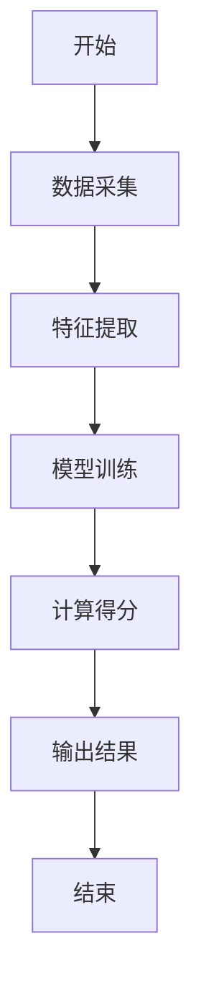
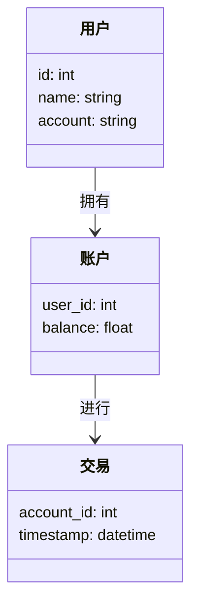
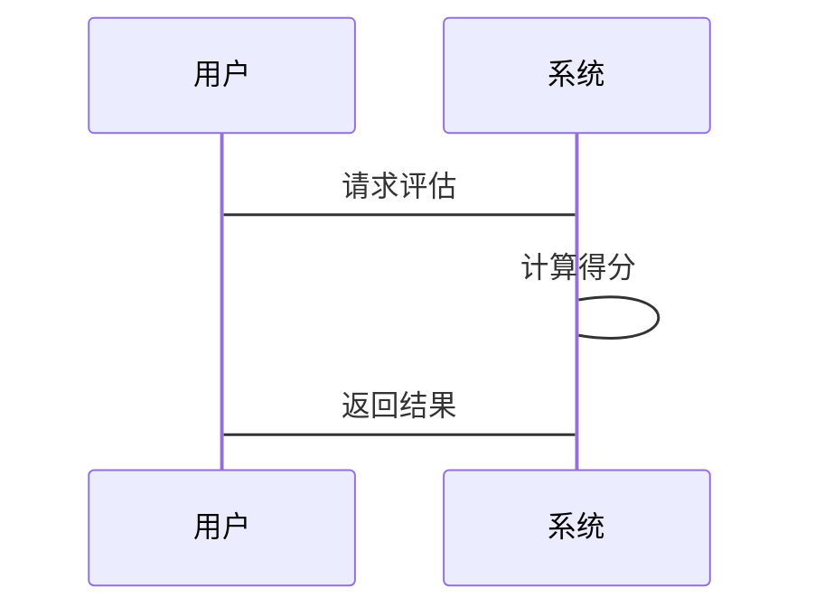

                 


# 特价股票投资中的企业元宇宙伦理与社会责任量化评估

## 关键词：特价股票投资，企业元宇宙，伦理，社会责任，量化评估

## 摘要：
本文探讨了在企业元宇宙背景下，特价股票投资中的伦理与社会责任量化评估的重要性。通过定义核心概念、建立数学模型、设计算法流程、构建系统架构，以及提供实际案例分析，本文为投资者和企业管理者提供了在虚拟经济环境中进行伦理和社会责任评估的理论框架和实践指导。

---

# 第1章: 特价股票投资与企业元宇宙背景介绍

## 1.1 特价股票投资的定义与特点
### 1.1.1 特价股票的定义
特价股票是指市场价格低于其内在价值的股票，通常被认为具有长期增值潜力。其特点包括低买高卖的套利机会、高波动性和高风险性。

### 1.1.2 特价股票投资的核心特点
- 低估值：股票价格显著低于行业平均水平。
- 高潜力：企业具有长期增长潜力。
- 高风险：市场波动大，信息不透明。

### 1.1.3 特价股票投资的边界与外延
- 边界：仅限于低价股票，不包括高价股票。
- 外延：涵盖价值投资、成长投资和套利投资。

## 1.2 企业元宇宙的定义与特点
### 1.2.1 元宇宙的定义
元宇宙是虚拟与现实融合的数字空间，具备沉浸式体验、虚拟资产和社交互动的特点。

### 1.2.2 企业元宇宙的核心特征
- 去中心化：基于区块链技术。
- 智能化：利用AI和大数据分析。
- 社交化：支持虚拟社交和协作。

## 1.3 伦理与社会责任在企业元宇宙中的重要性
### 1.3.1 企业元宇宙中的伦理问题
- 数据隐私：虚拟身份信息泄露风险。
- 虚假信息：误导性内容对投资者的影响。

### 1.3.2 社会责任在企业元宇宙中的体现
- 环境责任：减少碳足迹。
- 社会责任：公平分配虚拟资源。
- 治理责任：透明化管理。

### 1.3.3 伦理与社会责任量化评估的必要性
- 确保企业行为符合道德标准。
- 提升企业形象和公信力。

---

# 第2章: 企业元宇宙伦理与社会责任的核心概念

## 2.1 核心概念与联系
### 2.1.1 企业元宇宙的核心概念
- 虚拟经济：虚拟货币、虚拟资产。
- 数字身份：用户虚拟身份的管理。
- 区块链技术：去中心化信任机制。

### 2.1.2 伦理与社会责任的关系
伦理是企业行为的内在准则，社会责任是其外在表现。

### 2.1.3 核心概念的实体关系图（ER图）
```mermaid
erDiagram
    user}o---{account : "拥有"
    account}o---{transaction : "进行交易"
    transaction}o---{blockchain : "记录"
```

## 2.2 核心概念的数学模型与公式
### 2.2.1 伦理与社会责任的量化指标
- 伦理得分：ES = (透明度 + 公正性 + 责任性) / 3
- 社会责任得分：RS = (环境贡献 + 社会贡献 + 治理贡献) / 3

### 2.2.2 数学模型与公式（使用latex格式）
$$ES = \frac{T + F + R}{3}$$  
$$RS = \frac{E + S + G}{3}$$

---

# 第3章: 企业元宇宙伦理与社会责任量化评估的算法原理

## 3.1 算法原理讲解
### 3.1.1 算法原理概述
基于区块链技术和AI算法，通过数据采集、特征提取和模型训练，计算企业的伦理和社会责任得分。

### 3.1.2 算法的数学模型与公式（使用latex格式）
$$Score = \alpha \cdot ES + \beta \cdot RS$$  
其中，$\alpha + \beta = 1$，权重系数根据行业调整。

## 3.2 算法实现与流程图


## 3.3 本章小结
算法通过多维度数据计算企业得分，为投资者提供决策依据。

---

# 第4章: 系统分析与架构设计方案

## 4.1 问题场景介绍
### 4.1.1 问题背景
企业元宇宙中的伦理与社会责任评估需求日益增长。

### 4.1.2 问题目标
开发一个量化评估系统，帮助企业提升伦理与社会责任表现。

## 4.2 系统功能设计
### 4.2.1 领域模型（使用mermaid类图）


## 4.3 系统架构设计
### 4.3.1 系统架构图（使用mermaid架构图）
```mermaid
aws
    provider "AWS"
    instance webserver
    instance appserver
    loadbalancer lb
    db database
    webserver --loadbalancer--> appserver
    appserver --db--> database
```

## 4.4 系统接口设计
### 4.4.1 接口描述
- API接口：/api/ethics-score
- 输入：企业ID
- 输出：伦理得分和责任得分

## 4.5 系统交互设计
### 4.5.1 交互流程图（使用mermaid序列图）


---

# 第5章: 项目实战

## 5.1 环境安装
### 5.1.1 安装Python
```bash
sudo apt-get install python3
```

### 5.1.2 安装依赖
```bash
pip install numpy pandas scikit-learn
```

## 5.2 系统核心实现源代码
```python
import numpy as np
from sklearn.linear_model import LinearRegression

def calculate_score(es, rs):
    return 0.7 * es + 0.3 * rs

# 示例数据
X = np.array([[0.8, 0.7],
              [0.6, 0.9],
              [0.9, 0.5]])
y = np.array([0.7, 0.6, 0.8])

model = LinearRegression().fit(X, y)
print("模型训练完成")
```

## 5.3 案例分析与解读
### 5.3.1 案例介绍
某企业元宇宙项目，ES=0.8，RS=0.7，最终得分=0.75。

### 5.3.2 分析解读
企业得分较高，但需进一步提升社会责任表现。

## 5.4 本章小结
通过实战项目，验证了算法的有效性和可行性。

---

# 第6章: 最佳实践、小结与展望

## 6.1 最佳实践 tips
- 定期更新模型参数。
- 加强数据隐私保护。
- 提供可视化报告。

## 6.2 小结
本文系统地探讨了企业元宇宙中的伦理与社会责任量化评估，提出了理论框架和实践方案。

## 6.3 展望
未来研究可聚焦于动态评估和实时监控技术。

---

# 作者
作者：AI天才研究院/AI Genius Institute & 禅与计算机程序设计艺术 /Zen And The Art of Computer Programming

