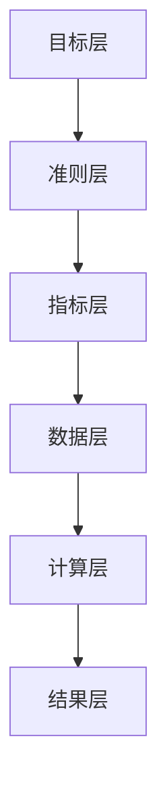
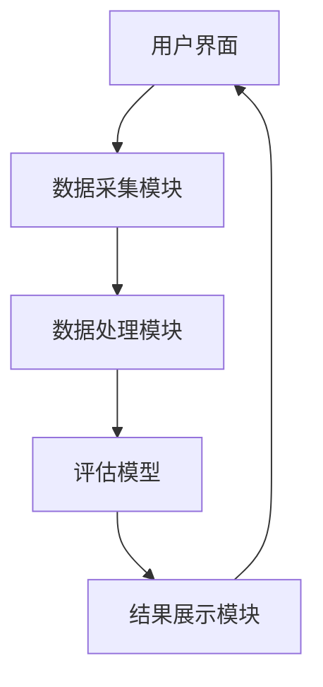
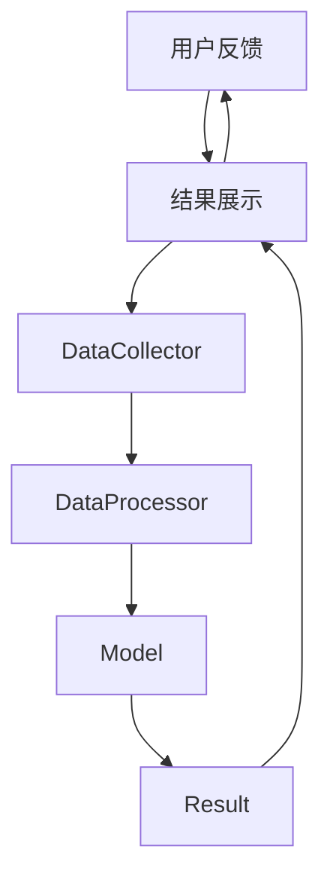

                 


# 特价股票投资中的企业数字责任评估因素考量

> 关键词：特价股票投资，企业数字责任，评估因素，算法原理，系统架构，项目实战

> 摘要：本文深入探讨了在特价股票投资中，企业数字责任评估的重要性及其影响因素。通过系统化的分析，结合实际案例，详细阐述了企业数字责任的定义、核心评估指标、算法原理及系统架构设计，为投资者提供了科学的决策参考。

---

## 第一部分: 特价股票投资的背景与意义

### 第1章: 特价股票投资概述

#### 1.1 特价股票投资的定义与特点
- **1.1.1 特价股票的定义**
  特价股票指的是在特定市场环境下，因市场波动、企业短期问题或行业调整等原因，导致股票价格被低估的投资标的。这类股票通常具有较高的安全边际和潜在的上涨空间。

- **1.1.2 特价股票投资的核心特点**
  - 价格低于内在价值
  - 市场关注度较低
  - 具有较高的潜在回报

- **1.1.3 特价股票投资的市场环境**
  - 市场周期性波动
  - 经济下行周期
  - 行业结构调整

#### 1.2 企业数字责任评估的背景
- **1.2.1 数字化转型对企业的影响**
  - 数据驱动的决策
  - 数字化运营的效率提升
  - 数据隐私与安全的重要性

- **1.2.2 企业数字责任的概念**
  - 数字责任定义：企业在数字化转型过程中，对数据隐私、技术合规性、用户权益等方面应尽的责任。
  - 核心要素：数据治理、技术合规、用户隐私保护。

- **1.2.3 特价股票投资中的企业数字责任**
  - 投资者关注企业的长期可持续发展能力。
  - 企业数字责任影响企业风险和价值评估。

---

### 第2章: 特价股票投资的市场环境

#### 2.1 特价股票投资的市场周期
- **2.1.1 特价股票的周期性**
  - 市场周期波动对特价股票的影响
  - 投资者在周期不同阶段的策略调整

- **2.1.2 市场波动对企业数字责任的影响**
  - 市场波动加剧企业数字责任的重要性
  - 数字责任在企业估值中的权重变化

#### 2.2 企业数字责任的外部因素
- **2.2.1 政策法规对企业数字责任的要求**
  - 数据隐私保护法规
  - 技术合规性要求
  - 行业监管政策

- **2.2.2 市场竞争中的数字责任考量**
  - 数字化能力成为竞争优势
  - 用户对数字责任的关注度提升

#### 2.3 特价股票投资中的企业数字责任评估
- **2.3.1 企业数字责任评估的必要性**
  - 投资决策中的风险控制
  - 企业长期价值的保障

- **2.3.2 企业数字责任评估的边界与外延**
  - 评估范围的界定
  - 数字责任与企业其他责任的协同

---

## 第二部分: 企业数字责任评估的核心概念

### 第3章: 企业数字责任的定义与属性

#### 3.1 企业数字责任的定义
- **3.1.1 数字责任的核心要素**
  - 数据隐私保护
  - 技术合规性
  - 数字化转型中的伦理责任

- **3.1.2 数字责任与企业绩效的关系**
  - 数字责任对企业价值的影响
  - 数字责任与企业风险控制的关联

#### 3.2 企业数字责任的属性特征对比
- **3.2.1 数据隐私与数据安全**
  - 数据隐私的核心概念
  - 数据安全的技术保障

- **3.2.2 技术合规性与技术债务**
  - 技术合规性的标准
  - 技术债务对企业数字责任的影响

- **3.2.3 数字化转型中的伦理责任**
  - 伦理责任的定义与范围
  - 伦理责任与企业声誉的关系

---

### 第4章: 企业数字责任评估的核心要素

#### 4.1 企业数字责任评估的维度
- **4.1.1 数据治理能力**
  - 数据治理的框架与流程
  - 数据治理的成效评估

- **4.1.2 技术创新能力**
  - 技术创新能力的评估标准
  - 技术创新对企业数字责任的促进作用

- **4.1.3 数字化运营效率**
  - 数字化运营的效率指标
  - 数字化运营对企业竞争力的影响

#### 4.2 企业数字责任评估的指标体系
- **4.2.1 指标体系的构建方法**
  - 指标的筛选与权重分配
  - 指标体系的验证与优化

- **4.2.2 指标权重的确定**
  - 权重确定的理论依据
  - 权重调整的实践方法

#### 4.3 企业数字责任评估的模型
- **4.3.1 模型的构建与优化**
  - 模型构建的逻辑框架
  - 模型优化的策略与方法

- **4.3.2 模型的适用性分析**
  - 不同行业模型的适用性
  - 模型在实际应用中的表现

---

## 第三部分: 企业数字责任评估的算法原理与系统架构

### 第5章: 企业数字责任评估的算法原理

#### 5.1 算法原理概述
- **5.1.1 算法选择与原理**
  - 层次分析法（AHP）的应用
  - 算法的优缺点分析

#### 5.2 算法流程图


#### 5.3 数学模型与公式
- **5.3.1 指标权重计算**
  $$ AHP权重计算公式：w_i = \frac{\sum_{j=1}^n a_{ij}}{\sum_{j=1}^n \sum_{i=1}^n a_{ij}}} $$
- **5.3.2 综合得分计算**
  $$ 综合得分 = \sum_{i=1}^n w_i \cdot s_i $$
  其中，$w_i$为指标权重，$s_i$为指标得分。

### 第6章: 系统架构设计

#### 6.1 系统功能设计
- **6.1.1 数据采集模块**
  - 数据来源：企业公开数据、行业报告
  - 数据处理：数据清洗、特征提取

#### 6.2 系统架构图


#### 6.3 系统交互流程图


---

## 第四部分: 项目实战与案例分析

### 第7章: 项目实战

#### 7.1 环境安装与数据准备
- **7.1.1 环境搭建**
  - Python 3.8+
  - Numpy、Pandas、Scikit-learn等库的安装

#### 7.2 核心代码实现
```python
import numpy as np
import pandas as pd
from sklearn.metrics import pairwise_distances

# 示例数据：企业数字责任评估指标
data = pd.DataFrame({
    '指标1': [0.8, 0.6, 0.7],
    '指标2': [0.6, 0.5, 0.6],
    '指标3': [0.4, 0.3, 0.5]
})

# 计算指标权重（简化示例）
weights = np.array([0.5, 0.3, 0.2])
data['综合得分'] = np.dot(data.values, weights)

print(data)
```

#### 7.3 案例分析
- **7.3.1 案例背景**
  某行业中的三家企业，分别计算其数字责任评估得分。

- **7.3.2 结果分析**
  - 企业A得分最高，说明其数字责任表现最佳。
  - 企业C得分最低，需重点关注。

---

## 第五部分: 总结与展望

### 第8章: 总结与展望

#### 8.1 小结
- 本文系统性地探讨了特价股票投资中的企业数字责任评估因素，提出了基于层次分析法的评估模型，并通过实际案例验证了模型的有效性。

#### 8.2 注意事项
- 模型的应用需结合具体行业特点。
- 数据质量和完整性对评估结果有重要影响。

#### 8.3 拓展阅读
- 深入学习企业数字责任相关的政策法规。
- 探索更多评估模型的优化方法。

---

## 作者信息

作者：AI天才研究院/AI Genius Institute & 禅与计算机程序设计艺术 /Zen And The Art of Computer Programming

