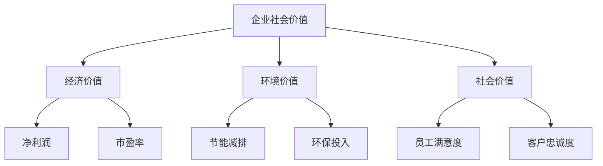
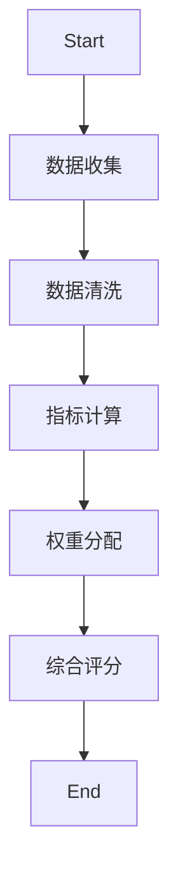
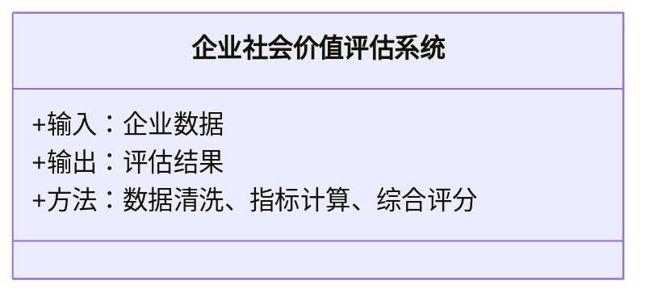
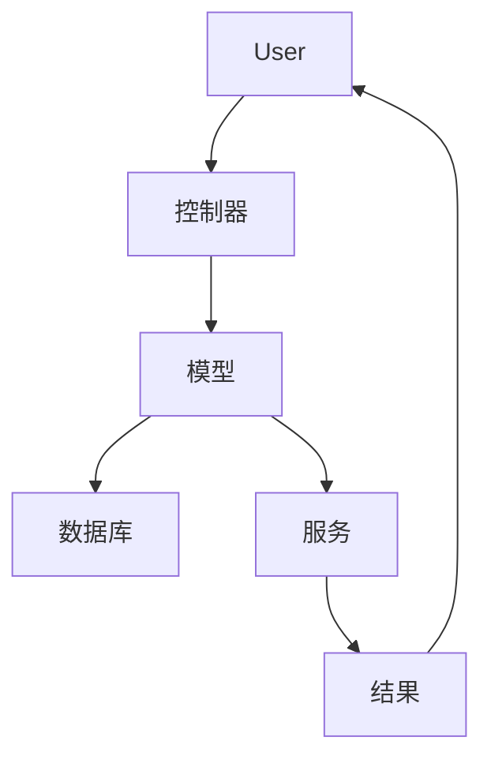

                 


# 特价股票投资中的企业社会价值评估因素考量

## 关键词：特价股票，企业社会价值，投资评估，可持续发展，社会责任，财务绩效，风险管理

## 摘要：  
在股票投资中，特价股票因其低价特性常被视为高潜力投资对象。然而，仅仅关注价格因素是不够的，企业社会价值的评估同样至关重要。本文深入探讨了企业在经济、环境、社会等多个维度的价值表现，分析了这些因素如何影响投资决策。通过构建多维度评估模型和提供实际案例分析，本文为投资者提供了科学的决策依据。

---

# 第一部分: 特价股票投资中的企业社会价值评估背景介绍

## 第1章: 特价股票投资与企业社会价值概述

### 1.1 特价股票投资的基本概念

#### 1.1.1 什么是特价股票
特价股票通常指市盈率、市净率等估值指标显著低于行业平均水平的股票。这类股票可能因市场暂时低估或企业经营问题导致价格波动，但具备长期投资价值。

#### 1.1.2 特价股票投资的特点
- 价格低廉，潜在回报高
- 市场波动性大，风险较高
- 需要深入分析企业基本面

#### 1.1.3 特价股票投资的市场现状
当前市场中，投资者对特价股票的关注度逐渐上升，尤其是在经济下行周期，投资者更倾向于寻找估值合理的标的。然而，市场中存在大量低价但基本面不佳的企业，这增加了投资的难度。

### 1.2 企业社会价值的定义与内涵

#### 1.2.1 企业社会价值的核心概念
企业社会价值是指企业在经营活动中对社会、环境和利益相关者所产生的正面影响，包括经济效益、社会责任、环境保护等方面。

#### 1.2.2 企业社会价值的构成要素
- **经济价值**：企业对经济的贡献，包括就业、税收等。
- **环境价值**：企业在环境保护方面的表现，如减少污染、节约资源等。
- **社会价值**：企业在社会责任方面的履行，如公益捐赠、员工福利等。

#### 1.2.3 企业社会价值与企业绩效的关系
企业社会价值与企业绩效呈正相关，良好的社会价值表现能够提升企业的声誉、客户忠诚度和员工凝聚力，从而促进企业长期发展。

### 1.3 特价股票投资中企业社会价值评估的意义

#### 1.3.1 企业社会价值对投资者的影响
- 帮助投资者识别具备长期价值的企业
- 降低投资风险，避免投资于短期亏损但社会责任感低的企业

#### 1.3.2 企业社会价值对投资决策的作用
- 提供全面的评估依据，避免仅关注价格因素
- 帮助投资者选择具备可持续发展潜力的企业

#### 1.3.3 企业社会价值与企业长期发展的关系
企业社会价值高的企业更可能获得社会支持和政策优惠，从而在长期发展中占据优势。

### 1.4 本章小结
本章介绍了特价股票投资的基本概念和企业社会价值的核心内涵，强调了在投资决策中纳入社会价值评估的重要性。

---

# 第二部分: 企业社会价值评估的核心概念与联系

## 第2章: 企业社会价值评估的核心要素

### 2.1 企业社会价值的构成维度

#### 2.1.1 经济价值维度
- 企业盈利能力
- 贡献的就业机会
- 税收缴纳情况

#### 2.1.2 环境价值维度
- 环境保护投入
- 资源利用效率
- 碳排放量

#### 2.1.3 社会价值维度
- 社会责任履行情况
- 公益事业投入
- 员工福利

### 2.2 核心概念的属性特征对比

#### 2.2.1 经济价值与环境价值的对比分析
| 维度 | 经济价值 | 环境价值 |
|------|----------|----------|
| 核心指标 | 净利润、ROE | 节能减排、环保投入 |
| 影响因素 | 市场需求、成本控制 | 政策法规、技术能力 |

#### 2.2.2 社会价值与企业绩效的关联性
社会价值高的企业通常具有更高的员工满意度和客户忠诚度，从而在绩效上表现更优。

#### 2.2.3 核心概念的对比表格
以下表格对比了经济价值、环境价值和社会价值的核心特征：

| 维度     | 核心指标       | 影响因素       |
|----------|----------------|----------------|
| 经济价值 | 净利润、市盈率   | 市场需求、成本控制 |
| 环境价值 | 节能减排、环保投入 | 政策法规、技术能力 |
| 社会价值 | 员工满意度、客户忠诚度 | 社会责任感、企业声誉 |

### 2.3 企业社会价值的概念图


### 2.4 本章小结
本章详细分析了企业社会价值的构成维度及其相互关系，为后续的评估工作奠定了基础。

---

# 第三部分: 企业社会价值评估的算法原理

## 第3章: 企业社会价值评估的指标与方法

### 3.1 评估指标的选择

#### 3.1.1 经济指标
- 净利润增长率
- 营业收入增长率
- 净资产收益率(ROE)

#### 3.1.2 环境指标
- 单位产品能源消耗
- 碳排放强度
- 环保投入占总收入比例

#### 3.1.3 社会指标
- 员工培训投入
- 社会责任支出
- 客户满意度

### 3.2 评估方法的探讨

#### 3.2.1 定量分析法
- 使用财务数据和环境数据进行量化评估
- 示例：计算企业碳排放强度和环保投入占比

#### 3.2.2 定性分析法
- 通过企业年报和社会责任报告获取信息
- 示例：评估企业在社会责任方面的表现

#### 3.2.3 综合评估法
- 结合定量和定性分析，构建综合评估模型
- 示例：使用加权评分法对企业社会价值进行综合评分

### 3.3 评估流程图


### 3.4 本章小结
本章介绍了企业社会价值评估的主要指标和方法，强调了定量与定性分析相结合的重要性。

---

## 第4章: 企业社会价值评估的数学模型与算法

### 4.1 多因素评估模型

#### 4.1.1 模型构建
企业社会价值指数（CSV Index）计算公式：
$$
CSV = \sum_{i=1}^{n} (w_i \times v_i)
$$
其中，$w_i$ 为第 $i$ 个指标的权重，$v_i$ 为第 $i$ 个指标的评分。

#### 4.1.2 权重分配
根据各指标的重要性进行权重分配，例如：
- 经济价值：权重40%
- 环境价值：权重30%
- 社会价值：权重30%

### 4.2 算法实现

#### 4.2.1 数据预处理
- 数据清洗：剔除异常值和缺失值
- 标准化处理：对不同量纲的指标进行标准化

#### 4.2.2 计算示例
假设某企业评估数据如下：
- 经济价值评分：80
- 环境价值评分：70
- 社会价值评分：85

权重分配：
- 经济价值：40%
- 环境价值：30%
- 社会价值：30%

计算企业社会价值指数：
$$
CSV = (0.4 \times 80) + (0.3 \times 70) + (0.3 \times 85) = 32 + 21 + 25.5 = 78.5
$$

### 4.3 本章小结
本章通过数学模型和算法，展示了如何量化企业社会价值，并为投资者提供科学的评估依据。

---

## 第5章: 企业社会价值评估的系统架构设计

### 5.1 系统分析

#### 5.1.1 问题场景介绍
投资者需要一个系统来自动评估企业的社会价值，以便快速做出投资决策。

#### 5.1.2 项目介绍
开发一个基于企业社会价值评估的系统，帮助投资者快速获取企业信息并进行评估。

### 5.2 系统功能设计

#### 5.2.1 领域模型


#### 5.2.2 系统架构


### 5.3 本章小结
本章通过系统架构设计，展示了如何将企业社会价值评估应用于实际投资决策中。

---

## 第6章: 企业社会价值评估的项目实战

### 6.1 环境安装

#### 6.1.1 安装Python
```bash
pip install Python
```

#### 6.1.2 安装Pandas
```bash
pip install pandas
```

#### 6.1.3 安装Matplotlib
```bash
pip install matplotlib
```

### 6.2 核心代码实现

#### 6.2.1 数据清洗
```python
import pandas as pd

# 读取数据
data = pd.read_csv('企业数据.csv')

# 删除缺失值
data.dropna(inplace=True)

# 填充异常值
data['收入'].fillna(data['收入'].mean(), inplace=True)
```

#### 6.2.2 指标计算
```python
# 计算企业社会价值指数
def calculate_csv(data):
    weights = {'经济价值': 0.4, '环境价值': 0.3, '社会价值': 0.3}
    csv_scores = []
    for index in data.index:
        score = 0
        for category in weights:
            score += weights[category] * data[category][index]
        csv_scores.append(score)
    return csv_scores

# 应用计算
csv_scores = calculate_csv(data)
```

#### 6.2.3 结果可视化
```python
import matplotlib.pyplot as plt

plt.bar(data['企业名称'], csv_scores)
plt.title('企业社会价值指数')
plt.xlabel('企业名称')
plt.ylabel('指数值')
plt.show()
```

### 6.3 案例分析

#### 6.3.1 案例背景
某制造企业，数据如下：
| 企业名称 | 经济价值 | 环境价值 | 社会价值 |
|----------|----------|----------|----------|
| 企业A    | 80       | 70       | 85       |

#### 6.3.2 计算结果
$$
CSV = 0.4 \times 80 + 0.3 \times 70 + 0.3 \times 85 = 78.5
$$

#### 6.3.3 分析结论
企业A的社会价值指数为78.5，属于较高水平，具备较高的投资价值。

### 6.4 本章小结
本章通过实际案例展示了企业社会价值评估的实现过程，为投资者提供了可操作的指导。

---

## 第7章: 企业社会价值评估的最佳实践

### 7.1 核心要素总结
- **数据来源**：确保数据的准确性和完整性
- **模型选择**：根据实际情况选择合适的评估模型
- **结果解读**：结合企业具体情况分析评估结果

### 7.2 小结
企业社会价值评估是特价股票投资的重要组成部分，通过科学的评估方法和系统支持，投资者能够更好地识别具备长期价值的企业。

### 7.3 注意事项
- **数据风险**：确保数据的可靠性和合规性
- **模型局限**：评估模型可能存在局限性，需结合实际情况进行调整
- **动态调整**：定期更新数据和模型，以适应市场变化

### 7.4 拓展阅读
- 推荐书籍：《企业社会价值评估》、《社会责任投资指南》
- 推荐网站：企业社会责任报告、行业分析报告

---

## 作者：AI天才研究院/AI Genius Institute & 禅与计算机程序设计艺术 /Zen And The Art of Computer Programming

---

以上是《特价股票投资中的企业社会价值评估因素考量》的完整目录和内容概要。希望本文能为投资者在特价股票投资中提供有价值的参考和指导。

