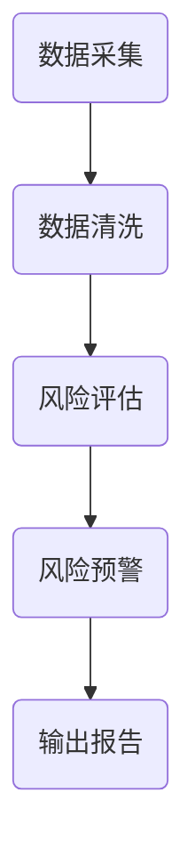
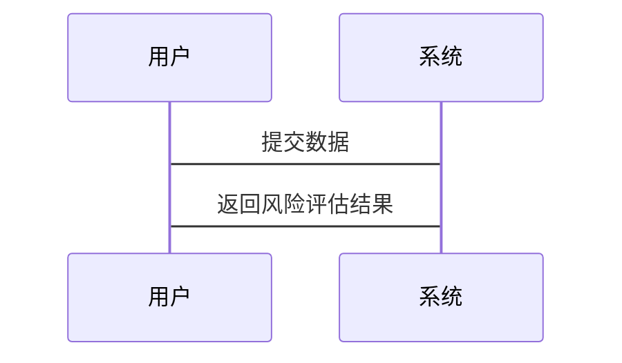

                 


# 特价股票投资中的供应链风险评估

> 关键词：供应链风险、特价股票、投资评估、数学模型、系统架构

> 摘要：本文探讨了在特价股票投资中，供应链风险的重要性及其对投资决策的影响。通过分析供应链风险的核心概念、数学模型和系统架构，本文提出了一种基于层次分析法（AHP）和线性回归模型的评估方法，并结合实际案例展示了如何在具体行业中应用这些方法进行风险评估。最后，本文总结了供应链风险评估的最佳实践，并展望了未来的研究方向。

---

# 第一部分: 供应链风险与特价股票投资的关联

## 第1章: 供应链风险的基本概念

### 1.1 供应链的定义与构成

供应链是指从原材料采购、生产加工、仓储物流到最终产品的交付，所有环节组成的链条。供应链的核心要素包括供应商、制造商、物流商和零售商。

### 1.2 供应链风险的定义

供应链风险是指在供应链的任何一个环节中，由于不确定性因素导致供应链中断或效率下降，从而对企业经营和股价产生负面影响的可能性。

### 1.3 供应链风险的分类

供应链风险可以分为以下几类：

1. **原材料供应风险**：原材料价格波动、供应商稳定性等。
2. **生产过程风险**：生产中断、质量问题等。
3. **物流交付风险**：运输延误、物流成本上升等。
4. **需求端风险**：市场需求波动导致的库存积压或短缺。

---

## 第2章: 特价股票投资的特点与供应链风险的影响

### 2.1 特价股票的定义

特价股票是指市场价格显著低于其内在价值的股票。这类股票通常被认为具有较高的投资回报潜力，但同时也伴随着较高的风险。

### 2.2 供应链风险对特价股票投资的影响

供应链风险对特价股票投资的影响主要体现在以下几个方面：

1. **股价波动**：供应链中断可能导致公司业绩下滑，从而引发股价下跌。
2. **投资决策**：供应链风险是投资者在选择特价股票时需要考虑的重要因素。
3. **投资收益**：供应链风险较高的公司可能面临更高的经营风险，从而影响投资收益。

---

# 第二部分: 供应链风险评估的核心概念与方法

## 第3章: 供应链风险评估的关键指标

### 3.1 供应链稳定性指标

供应链稳定性指标用于衡量供应链在面对突发事件时的应对能力。常见的指标包括供应商的多元化程度、库存周转率等。

### 3.2 供应链弹性指标

供应链弹性指标用于衡量供应链在需求波动时的调整能力。常见的指标包括生产 Flexibility、物流网络的覆盖范围等。

### 3.3 供应链透明度指标

供应链透明度指标用于衡量供应链各环节的信息共享能力。透明度越高，供应链风险越容易被发现和管理。

---

## 第4章: 供应链风险评估的数学模型

### 4.1 层次分析法（AHP）的应用

层次分析法是一种常用的决策分析方法，适用于多指标的综合评价。以下是AHP的应用步骤：

1. **构建层次分析结构**：将供应链风险的影响因素分为目标层、准则层和方案层。
2. **计算各层次的权重**：通过比较判断矩阵计算各指标的权重。
3. **综合评价**：根据各指标的权重，计算综合风险指数。

### 4.2 线性回归模型的应用

线性回归模型适用于预测供应链风险对股价的影响。以下是线性回归模型的建立步骤：

1. **数据收集**：收集供应链风险相关数据和股价数据。
2. **模型建立**：选择自变量和因变量，建立线性回归模型。
3. **模型验证**：通过统计检验验证模型的显著性和准确性。

---

# 第三部分: 供应链风险评估的系统分析与架构设计

## 第5章: 供应链风险评估系统的功能设计

### 5.1 系统功能模块划分

1. **数据采集模块**：负责采集供应链相关数据。
2. **风险评估模块**：负责计算供应链风险指数。
3. **风险预警模块**：负责根据风险指数发出预警信号。

### 5.2 系统功能流程图



---

## 第6章: 供应链风险评估系统的架构设计

### 6.1 系统架构设计

以下是系统架构的分层设计：

1. **数据层**：负责数据的存储和管理。
2. **业务逻辑层**：负责数据处理和计算。
3. **用户界面层**：负责与用户的交互。

### 6.2 系统交互流程图



---

# 第四部分: 供应链风险评估的项目实战

## 第7章: 项目实战：电子制造业供应链风险评估

### 7.1 项目背景

以电子制造业为例，分析供应链风险对特价股票投资的影响。

### 7.2 数据收集与处理

收集电子制造业的供应链数据，包括原材料价格、生产周期、物流成本等。

### 7.3 模型实现

使用层次分析法和线性回归模型对供应链风险进行评估，并生成风险报告。

### 7.4 案例分析

通过具体案例分析，展示如何利用模型预测供应链风险对股价的影响。

---

## 第8章: 项目总结与代码实现

### 8.1 项目总结

总结项目实施过程中的关键点和成果。

### 8.2 代码实现

以下是部分代码示例：

```python
import pandas as pd
from sklearn.linear_model import LinearRegression

# 数据加载
data = pd.read_csv('supply_chain.csv')

# 模型训练
model = LinearRegression()
model.fit(data[['factor1', 'factor2']], data['risk_index'])

# 预测结果
predicted_risk = model.predict([[factor1, factor2]])
```

---

# 第五部分: 总结与展望

## 第9章: 总结与最佳实践

### 9.1 总结

本文通过分析供应链风险对特价股票投资的影响，提出了一种基于数学模型的供应链风险评估方法。

### 9.2 最佳实践

1. **数据收集**：确保数据的完整性和准确性。
2. **模型选择**：根据实际情况选择合适的模型。
3. **持续监控**：定期更新模型和数据，确保评估结果的有效性。

## 第10章: 未来研究方向

### 10.1 智能化供应链管理

利用人工智能技术进一步优化供应链管理。

### 10.2 多模型融合

研究如何将多种模型融合，提高供应链风险评估的准确性。

---

# 作者：AI天才研究院 & 禅与计算机程序设计艺术

