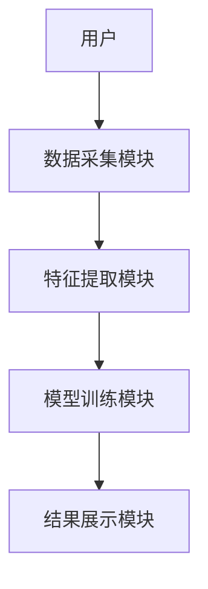

                 


# 特价股票投资中的信息不对称利用

## 关键词：信息不对称，特价股票，投资策略，数学模型，系统设计

## 摘要：  
本文探讨了信息不对称在特价股票投资中的利用策略，分析了信息不对称的形成机制及其对投资者决策的影响，提出了基于信息不对称的量化指标和数学模型，结合系统设计与实战案例，为投资者提供了有效的投资策略和风险管理方法。

---

## 第一部分: 特价股票投资中的信息不对称概述

### 第1章: 特价股票投资与信息不对称概述

#### 1.1 特价股票投资的定义与特点  
**1.1.1 特价股票的定义**  
特价股票通常指价格低于其内在价值的股票，这类股票可能因市场忽视、公司短期问题或市场波动而被低估。投资者通过挖掘这些股票的潜在价值，能够在市场回升时获得超额收益。

**1.1.2 特价股票的核心特点**  
- **低估值**：市盈率、市净率等估值指标显著低于行业平均水平。  
- **流动性较低**：部分特价股票交易不活跃，可能导致买卖价差较大。  
- **风险较高**：低估可能源于公司基本面问题，需警惕“价值陷阱”。  

**1.1.3 特价股票投资的潜在机会与风险**  
- **机会**：发现市场未被充分挖掘的价值，获得超额收益。  
- **风险**：信息不对称可能导致误判，买入具有严重问题的股票。

#### 1.2 信息不对称的定义与类型  
**1.2.1 信息不对称的定义**  
信息不对称指市场参与者之间因信息获取能力的差异，导致某些人掌握更多信息，而另一些人仅掌握有限信息的现象。

**1.2.2 信息不对称的主要类型**  
- **卖方优势**：卖方掌握更多信息，买方处于劣势。  
- **买方优势**：买方通过研究发现市场机会，卖方反应较慢。  
- **信息滞后**：信息传播不及时，导致价格反映不完全。  

**1.2.3 信息不对称在股票市场中的表现形式**  
- **市场异象**：如小公司效应、动量效应等。  
- **信息优势**：机构投资者利用内部信息获取超额收益。  
- **投资者情绪**：市场恐慌或乐观导致价格偏离价值。  

#### 1.3 特价股票投资中的信息不对称问题  
**1.3.1 特价股票市场中的信息不对称现象**  
- 投资者可能因信息不全错判股票价值。  
- 内部人士可能利用信息优势获利。  

**1.3.2 信息不对称对投资者决策的影响**  
- 信息不对称可能导致投资者误判股票价值，买入具有较高风险的股票。  
- 信息优势者可能利用市场机会获利，而普通投资者难以突破信息壁垒。  

**1.3.3 信息不对称的利用与防范**  
- 利用信息不对称发现市场机会。  
- 提升自身研究能力，降低信息不对称带来的风险。  

#### 1.4 本章小结  
本章介绍了特价股票的定义、特点及投资机会，并分析了信息不对称的定义、类型及其在股票市场中的表现。信息不对称是特价股票投资中的核心问题，投资者需通过研究和分析，降低信息不对称带来的风险，抓住市场机会。

---

## 第二部分: 信息不对称的形成机制与影响

### 第2章: 信息不对称的形成机制

#### 2.1 市场参与者的异质性  
**2.1.1 投资者的类型与信息获取能力**  
- 机构投资者：拥有专业的研究团队和信息渠道。  
- 个人投资者：依赖公开信息和市场情绪。  

**2.1.2 市场参与者的利益冲突**  
- 机构投资者与个人投资者之间的利益冲突。  
- 公司管理层与股东之间的利益冲突。  

#### 2.2 信息分布的不均衡性  
**2.2.1 信息的生成与传播机制**  
- 公司公告、财报发布等信息的生成与传播。  
- 市场传言、投资者情绪对信息传播的影响。  

**2.2.2 市场信息的不对称性**  
- 高质量信息的获取成本较高。  
- 信息传播的延迟性和不完全性。  

#### 2.3 信息不对称的经济后果  
**2.3.1 信息不对称对市场效率的影响**  
- 市场价格无法完全反映所有信息。  
- 资源配置效率低下。  

**2.3.2 信息不对称对资产定价的影响**  
- 股价可能因信息不对称偏离其内在价值。  
- 信息优势者可能通过套利获利。  

**2.3.3 信息不对称对投资决策的影响**  
- 投资者可能因信息不足做出错误决策。  
- 信息优势者可能利用市场机会获利。  

#### 2.4 本章小结  
本章分析了信息不对称的形成机制，包括市场参与者的异质性、信息分布的不均衡性及其对市场效率、资产定价和投资决策的影响。信息不对称是市场中普遍存在的现象，投资者需认识到其对投资决策的影响。

---

## 第三部分: 信息不对称的利用策略

### 第3章: 信息不对称的识别与评估

#### 3.1 特价股票市场中的信息不对称识别  
**3.1.1 信息不对称的识别方法**  
- 通过分析公司基本面发现市场忽视的价值。  
- 利用技术分析发现市场异象。  

**3.1.2 信息不对称的量化指标**  
- 市盈率（P/E）：衡量股价是否低估。  
- 市净率（P/B）：衡量股价是否低于账面价值。  

#### 3.2 信息不对称的评估模型  
**3.2.1 信息不对称的评估框架**  
- 信息不对称程度：$I = \frac{p_1 - p_2}{p_2}$，其中$p_1$是高价，$p_2$是低价。  
- 信息不对称带来的投资机会：$I > 0$时存在潜在收益。  

**3.2.2 信息不对称的评估指标**  
- 市场异象：如小公司效应、动量效应等。  
- 信息传播速度：信息传播越慢，信息不对称越严重。  

#### 3.3 信息不对称的风险与机会评估  
**3.3.1 信息不对称带来的投资机会**  
- 发现市场忽视的低估股票。  
- 利用市场异象获利。  

**3.3.2 信息不对称带来的投资风险**  
- 信息不对称可能导致误判，买入具有严重问题的股票。  
- 信息不对称可能引发市场波动，导致股价剧烈波动。  

#### 3.4 本章小结  
本章介绍了信息不对称的识别方法和量化指标，并分析了信息不对称带来的投资机会与风险。投资者需通过深入研究和分析，识别市场中的信息不对称现象，抓住投资机会，降低投资风险。

---

## 第四部分: 信息不对称的数学模型与算法

### 第4章: 信息不对称的数学模型

#### 4.1 信息不对称的量化模型  
**4.1.1 信息不对称的定义与量化**  
- 信息不对称程度：$I = \frac{p_1 - p_2}{p_2}$，其中$p_1$是高价，$p_2$是低价。  
- 信息不对称带来的收益：$R = \sum (p_i - p_j) \times \text{交易量}$。  

**4.1.2 信息不对称的数学表达式**  
- 资产定价模型：$$P = \frac{D}{1 + r}$$，其中$D$是未来现金流，$r$是折现率。  
- 信息不对称对资产定价的影响：$$P_{\text{实际}} = P_{\text{理论}} \times (1 - I)$$。  

#### 4.2 基于信息不对称的资产定价模型  
**4.2.1 资产定价的基本原理**  
- 资产的理论价值由其未来现金流决定。  
- 实际价格受到信息不对称的影响。  

**4.2.2 信息不对称对资产定价的影响**  
- 信息不对称导致价格偏离理论价值。  
- 信息优势者可能通过套利获利。  

**4.2.3 资产定价的数学公式**  
- 理论定价公式：$$P_{\text{理论}} = \sum_{t=1}^{n} \frac{CF_t}{(1 + r)^t}$$。  
- 实际定价公式：$$P_{\text{实际}} = P_{\text{理论}} \times (1 - I)$$。  

#### 4.3 本章小结  
本章通过数学模型量化了信息不对称程度，并分析了其对资产定价的影响。投资者可通过量化模型识别信息不对称带来的投资机会，优化投资决策。

---

## 第五部分: 信息不对称的系统设计与实现

### 第5章: 信息不对称的系统设计与实现

#### 5.1 系统功能设计  
**5.1.1 系统需求分析**  
- 数据采集：获取股票市场数据。  
- 特征提取：提取股票的估值指标。  
- 模型训练：基于信息不对称的数学模型进行预测。  
- 结果展示：可视化分析结果。  

**5.1.2 系统功能模块**  
- 数据采集模块：采集股票市场数据。  
- 特征提取模块：计算股票的估值指标。  
- 模型训练模块：基于信息不对称模型进行预测。  
- 结果展示模块：可视化分析结果。  

#### 5.2 系统架构设计  
**5.2.1 系统架构图**  


**5.2.2 数据流图**  


#### 5.3 系统接口设计  
- 数据接口：API接口用于数据采集和特征提取。  
- 模型接口：API接口用于模型训练和预测。  

#### 5.4 本章小结  
本章设计了一个基于信息不对称的股票分析系统，包括数据采集、特征提取、模型训练和结果展示模块。系统架构清晰，功能模块明确，为投资者提供了有效的工具。

---

## 第六部分: 信息不对称的实战案例

### 第6章: 信息不对称的实战案例

#### 6.1 实战案例分析  
**6.1.1 案例背景**  
以某家被市场忽视的公司为例，分析其股价低估的原因。  

**6.1.2 数据处理**  
- 收集公司过去5年的财务数据。  
- 计算市盈率、市净率等估值指标。  

**6.1.3 特征分析**  
- 通过熵值法计算信息不对称程度。  
- 识别市场异象。  

**6.1.4 模型训练**  
- 基于信息不对称模型进行预测。  
- 通过回测验证模型的有效性。  

#### 6.2 代码实现  
```python
import pandas as pd
import numpy as np

# 数据采集
data = pd.read_csv('stock_data.csv')

# 特征提取
def calculate_I(p1, p2):
    return (p1 - p2) / p2

data['I'] = calculate_I(data['high'], data['low'])

# 模型训练
from sklearn.linear_model import LinearRegression

model = LinearRegression()
model.fit(data[['I']], data['return'])

# 结果展示
print('回归系数:', model.coef_)
```

#### 6.3 投资策略  
**6.3.1 投资策略的制定**  
- 识别信息不对称程度较高的股票。  
- 建立多头头寸，等待股价回升。  

**6.3.2 投资策略的执行**  
- 分批建仓，分散风险。  
- 定期监控，及时调整。  

#### 6.4 本章小结  
本章通过具体案例分析了信息不对称的利用策略，并展示了如何通过系统设计和数学模型进行实战操作。投资者需结合实际市场情况，灵活调整投资策略。

---

## 第七部分: 总结与展望

### 第7章: 总结与展望

#### 7.1 本章总结  
本文系统地探讨了信息不对称在特价股票投资中的利用策略，分析了信息不对称的形成机制及其对投资者决策的影响，提出了基于信息不对称的量化指标和数学模型，并通过系统设计与实战案例展示了信息不对称的实际应用。

#### 7.2 未来研究方向  
- 探讨信息不对称的更复杂形式。  
- 研究信息不对称与市场波动的关系。  
- 开发更高效的数学模型，提升信息不对称的量化能力。  

#### 7.3 投资者注意事项  
- 信息不对称是投资中的常见现象，需保持警惕。  
- 提升自身研究能力，降低信息不对称带来的风险。  
- 灵活调整投资策略，结合市场实际情况。  

#### 7.4 本章小结  
本章总结了全文内容，并展望了未来的研究方向。投资者需认识到信息不对称的复杂性，结合实际市场情况，灵活调整投资策略。

---

## 作者：AI天才研究院/AI Genius Institute & 禅与计算机程序设计艺术 /Zen And The Art of Computer Programming

