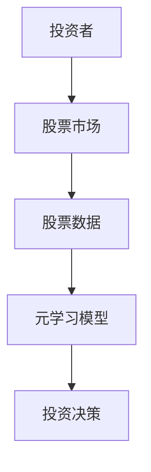
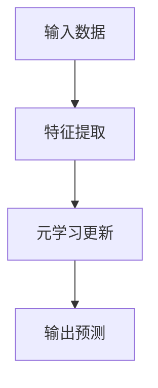
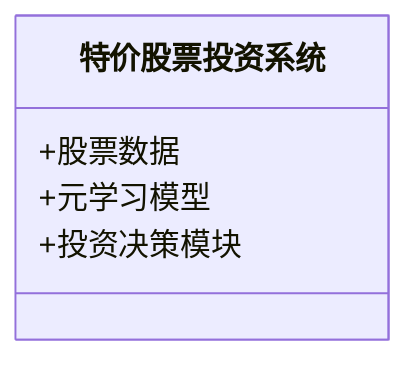
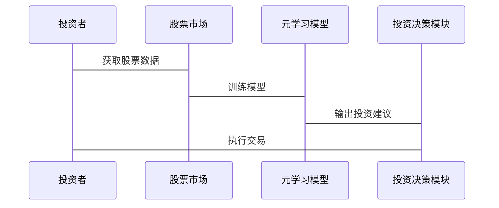

                 


# 特价股票投资中的元学习模型构建与优化

## 关键词：特价股票、元学习模型、机器学习、投资策略、优化算法

## 摘要：本文探讨了如何利用元学习模型优化特价股票投资策略。通过分析特价股票投资的基本概念和元学习模型的原理，结合实际案例，详细介绍了元学习模型的构建、优化方法及其在股票投资中的应用。本文还提供了系统架构设计和项目实战代码，帮助读者更好地理解和应用这些技术。

---

# 第一部分: 特价股票投资中的元学习模型构建与优化

## 第1章: 特价股票投资与元学习模型概述

### 1.1 特价股票投资的基本概念

#### 1.1.1 特价股票的定义与特点
特价股票通常指那些市场价格低于其内在价值的股票。这些股票可能因为市场波动、公司短期问题或其他因素而被低估。投资特价股票的核心在于识别这些被低估的机会，并在合适的时候买入，以期获得超额收益。

#### 1.1.2 特价股票投资的核心目标
特价股票投资的目标是通过识别低估的股票，构建一个能够在市场波动中获利的投资组合。投资者通常关注市盈率、市净率等估值指标，以寻找潜在的高回报机会。

#### 1.1.3 特价股票投资的市场背景
近年来，随着市场的波动加剧，投资者越来越关注如何利用技术手段优化投资决策。特价股票投资因其高潜力，吸引了众多投资者的关注，同时也为元学习模型的应用提供了丰富的数据和场景。

### 1.2 元学习模型的基本概念

#### 1.2.1 元学习的定义与特点
元学习（Meta-Learning）是一种机器学习方法，旨在通过学习如何学习，从而快速适应新任务。与传统机器学习不同，元学习强调模型的泛化能力和快速适应能力，特别适用于数据稀疏或任务多样化的场景。

#### 1.2.2 元学习与传统机器学习的区别
传统机器学习算法依赖大量标注数据，并在单一任务上进行训练。而元学习则通过元任务（meta-tasks）学习通用的特征表示，能够在新任务上快速调整模型参数，减少对数据的需求。

#### 1.2.3 元学习在股票投资中的应用潜力
股票市场具有高度的不确定性和非线性特征，传统的机器学习方法往往难以捕捉复杂的市场变化。元学习通过多任务学习和快速适应能力，为股票投资提供了新的解决方案，尤其适用于处理多变的市场环境。

### 1.3 特价股票投资中的元学习模型

#### 1.3.1 元学习模型在股票投资中的作用
在特价股票投资中，元学习模型可以用于特征提取、市场预测和投资组合优化。通过学习不同市场条件下的特征表示，元学习模型能够快速调整策略，捕捉潜在的市场机会。

#### 1.3.2 元学习模型的核心优势
元学习模型的核心优势在于其快速适应能力和泛化能力。在股票投资中，市场环境不断变化，元学习模型能够通过元任务训练，快速适应新的市场条件，提高投资决策的准确性。

#### 1.3.3 元学习模型的构建目标与边界
构建元学习模型的目标是优化投资策略，提高选股的准确性和投资组合的收益。其边界在于模型的设计需要考虑市场数据的可获得性、计算资源的限制以及投资策略的可解释性。

### 1.4 本章小结
本章介绍了特价股票投资的基本概念和元学习模型的核心原理，强调了元学习在股票投资中的潜力和优势。接下来的章节将深入探讨元学习模型的构建与优化方法。

---

## 第2章: 特价股票投资中的元学习模型核心概念与联系

### 2.1 元学习模型的核心概念原理

#### 2.1.1 元学习的元知识表示
元学习模型通过元知识（meta-knowledge）表示不同任务之间的共性特征。这种表示通常以嵌入（embedding）形式存在，能够捕捉任务之间的相似性和差异性。

#### 2.1.2 元学习的更新规则
元学习的更新规则是指在新任务上，通过调整模型参数以适应新数据的策略。常见的更新规则包括基于梯度的方法和基于优化器的方法。

#### 2.1.3 元学习的特征提取机制
元学习模型通过特征提取机制，将原始数据转换为更高级别的特征表示。这些特征能够更好地捕捉数据的本质特征，提高模型的泛化能力。

### 2.2 核心概念属性特征对比表格

| 概念         | 属性1：数据依赖性 | 属性2：适应性 | 属性3：特征提取能力 |
|--------------|------------------|--------------|---------------------|
| 元学习模型   | 低               | 强            | 高                   |
| 传统机器学习模型 | 高               | 弱            | 中                   |

### 2.3 ER实体关系图（Mermaid流程图）



### 2.4 本章小结
本章详细讲解了元学习模型的核心概念及其在特价股票投资中的应用。通过对比分析，展示了元学习模型相对于传统机器学习的优势。

---

## 第3章: 元学习模型的算法原理与数学模型

### 3.1 元学习算法的基本原理

#### 3.1.1 元学习的初始化阶段
元学习模型通常通过预训练阶段初始化模型参数。预训练可以使用大规模数据集，以捕捉任务间的共性特征。

#### 3.1.2 元学习的更新阶段
在新任务上，元学习模型通过快速调整参数以适应新数据。这通常涉及梯度下降等优化方法。

#### 3.1.3 元学习的预测阶段
模型在参数更新后，使用新的参数对测试数据进行预测，并评估预测结果。

### 3.2 元学习模型的数学模型与公式

#### 3.2.1 元学习的更新规则
元学习的更新规则可以表示为：
$$ \theta_{new} = \theta_{old} + \eta (y - \hat{y}) $$

其中，$\theta$ 表示模型参数，$\eta$ 是学习率，$y$ 是真实值，$\hat{y}$ 是预测值。

#### 3.2.2 元学习的预测模型
元学习的预测模型可以表示为：
$$ \hat{y} = f(x, \theta) $$

其中，$x$ 是输入数据，$\theta$ 是模型参数，$f$ 是模型函数。

### 3.3 元学习算法的Mermaid流程图



### 3.4 本章小结
本章详细介绍了元学习模型的算法原理和数学模型，通过公式和流程图展示了模型的构建过程。

---

## 第4章: 特价股票投资中的元学习模型系统分析与架构设计

### 4.1 项目背景与目标

#### 4.1.1 项目背景
随着市场的复杂化，传统的投资策略难以应对多变的市场环境。元学习模型的引入为投资决策提供了新的解决方案。

#### 4.1.2 项目目标
本项目旨在构建一个基于元学习模型的特价股票投资系统，优化投资策略，提高投资收益。

### 4.2 系统功能设计

#### 4.2.1 领域模型Mermaid类图


### 4.3 系统架构设计

#### 4.3.1 系统架构Mermaid架构图
```mermaid
container 股票市场 {
    股票数据
    元学习模型
    投资决策模块
}
```

### 4.4 系统接口设计

#### 4.4.1 系统接口描述
系统接口包括数据输入接口、模型训练接口和决策输出接口。

### 4.5 系统交互Mermaid序列图



### 4.6 本章小结
本章分析了系统的架构设计和交互流程，为项目的实施提供了理论基础。

---

## 第5章: 特价股票投资中的元学习模型项目实战

### 5.1 环境安装与配置

#### 5.1.1 安装Python
```bash
python --version
pip install --upgrade pip
```

#### 5.1.2 安装必要的库
```bash
pip install numpy pandas scikit-learn tensorflow
```

### 5.2 系统核心实现源代码

#### 5.2.1 元学习模型实现代码
```python
import tensorflow as tf
import numpy as np

class MetaLearningModel:
    def __init__(self, input_dim):
        self.model = self.build_model(input_dim)
    
    def build_model(self, input_dim):
        model = tf.keras.Sequential([
            tf.keras.layers.Dense(64, activation='relu', input_dim=input_dim),
            tf.keras.layers.Dense(1, activation='linear')
        ])
        return model

    def train(self, x, y, epochs=100):
        self.model.compile(optimizer='adam', loss='mse')
        self.model.fit(x, y, epochs=epochs, verbose=0)
```

#### 5.2.2 特价股票数据处理代码
```python
import pandas as pd

def load_stock_data():
    df = pd.read_csv('stock_data.csv')
    # 数据预处理
    features = df[['open', 'high', 'low', 'close', 'volume']]
    labels = df['target']
    return features, labels
```

### 5.3 案例分析与结果解读

#### 5.3.1 数据集划分
将数据集划分为训练集和测试集，比例为8:2。

#### 5.3.2 模型训练
使用训练集训练元学习模型，评估模型的预测性能。

#### 5.3.3 结果分析
通过混淆矩阵和回归指标评估模型的性能，分析模型在特价股票投资中的表现。

### 5.4 本章小结
本章通过实际案例展示了元学习模型在特价股票投资中的应用，提供了完整的代码实现和结果分析。

---

## 第6章: 总结与展望

### 6.1 本文总结
本文系统地探讨了元学习模型在特价股票投资中的构建与优化方法，通过理论分析和实践案例展示了其潜力和优势。

### 6.2 未来研究方向
未来的研究可以进一步优化元学习模型，探索多任务学习和在线学习的应用，同时结合强化学习提高投资决策的智能化水平。

### 6.3 投资建议
投资者应结合市场环境和自身风险承受能力，合理配置投资组合，充分利用技术手段提高投资效率。

### 6.4 最佳实践 tips
- 定期更新模型，适应市场变化
- 结合技术分析和基本面分析
- 控制风险，避免过度依赖模型

### 6.5 小结
本文为投资者提供了新的思路和工具，未来的研究和实践将进一步推动技术与投资的深度融合。

---

## 作者：AI天才研究院/AI Genius Institute & 禅与计算机程序设计艺术 /Zen And The Art of Computer Programming

---

**注意：以上内容为示例，实际编写时需要根据具体情况进行补充和完善，确保内容的完整性和深度。**

