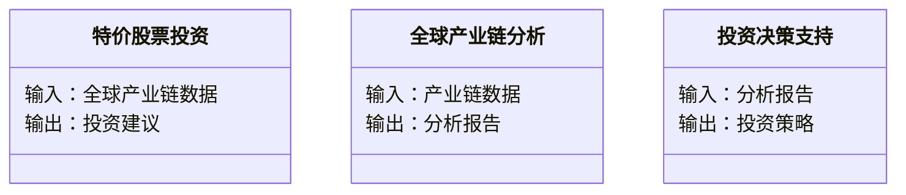

                 


# 特价股票投资中的全球产业链分析方法

> 关键词：特价股票投资、全球产业链、数学模型、系统架构、投资策略

> 摘要：本文深入探讨了特价股票投资中的全球产业链分析方法，通过系统化的分析框架和数学模型，结合实际案例，揭示了如何通过全球产业链的结构和动态优化投资决策。

---

## 第1章: 特价股票投资的背景与重要性

### 1.1 特价股票投资的定义与特点
#### 1.1.1 特价股票的定义
特价股票通常指价格远低于市场平均值的股票，可能由于市场波动、公司困境或投资者情绪等因素导致其价格被低估。这些股票可能隐藏着投资机会，但同时也伴随着较高的风险。

#### 1.1.2 特价股票投资的特点
- **低估值**：通常市盈率、市净率等指标低于行业平均水平。
- **高波动性**：价格波动较大，可能因市场情绪或公司业绩变化而剧烈波动。
- **潜在高回报**：如果公司基本面改善，股价可能迅速回升，带来丰厚收益。

#### 1.1.3 特价股票投资的市场定位
特价股票往往存在于中小型企业或处于困境中的企业，这些企业在市场中可能被忽视或低估，但具备扭亏为盈的潜力。

### 1.2 全球产业链分析的意义
#### 1.2.1 产业链的基本概念
全球产业链指的是从原材料供应、生产制造、分销到最终消费者的完整链条，涵盖多个国家和地区的经济活动。

#### 1.2.2 产业链分析对投资决策的影响
- **行业趋势**：通过分析产业链上下游的动态，投资者可以预判行业发展趋势。
- **风险评估**：产业链中的任何一个环节出现问题，都可能影响整个产业链的稳定性。
- **投资机会**：产业链的关键环节往往隐藏着高增长的投资机会。

#### 1.2.3 全球化视角下的产业链分析
全球化使得产业链分布更加复杂，投资者需要考虑全球范围内的经济政策、贸易摩擦、地缘政治等因素对产业链的影响。

### 1.3 本章小结
本章介绍了特价股票投资的基本概念及其在全球产业链分析中的重要性，为后续分析奠定了基础。

---

## 第2章: 特价股票投资的核心概念与方法

### 2.1 特价股票投资的基本原理
#### 2.1.1 投资者的心理与行为
投资者的心理偏差（如恐惧和贪婪）会影响市场定价，导致某些股票价格被低估或高估。

#### 2.1.2 市场波动与投资机会
市场波动为投资者提供了低价买入的机会，但同时也增加了投资的不确定性。

#### 2.1.3 特价股票的市场周期分析
股票价格受市场周期影响，投资者需分析市场周期，抓住低估阶段的投资机会。

### 2.2 全球产业链的结构分析
#### 2.2.1 产业链的垂直整合
企业通过整合上下游资源，降低生产成本，提高效率。

#### 2.2.2 产业链的横向扩展
企业通过并购或合作，扩大市场份额，增强竞争力。

#### 2.2.3 产业链的区域分布与风险
不同国家和地区的政策、经济状况对产业链的影响，需综合考虑。

### 2.3 特价股票投资的策略选择
#### 2.3.1 价值投资策略
寻找基本面良好但被市场低估的股票，长期持有，等待价值回归。

#### 2.3.2 技术分析策略
通过技术指标和图表分析，预测股票价格的短期走势，抓住交易机会。

#### 2.3.3 产业链上下游联动策略
分析产业链上下游的动态，选择具有协同效应的企业进行投资。

### 2.4 本章小结
本章详细探讨了特价股票投资的基本原理和策略，结合全球产业链的结构分析，为投资者提供了多维度的分析框架。

---

## 第3章: 全球产业链分析的核心方法

### 3.1 产业链分析的框架与模型
#### 3.1.1 产业链分析的基本框架
- **输入层**：原材料、资金、劳动力等。
- **处理层**：生产、加工、运输等环节。
- **输出层**：产品、服务、利润等。

#### 3.1.2 产业链分析的常用模型
- **线性回归模型**：用于预测产业链中各环节的变动对整体的影响。
- **网络分析模型**：用于分析产业链中各企业之间的关系和依赖性。

#### 3.1.3 模型的优缺点对比
| 模型类型 | 优点 | 缺点 |
|----------|------|------|
| 线性回归 | 简单易懂，计算高效 | 无法捕捉非线性关系 |
| 网络分析 | 能够反映复杂关系 | 计算复杂，数据需求高 |

### 3.2 产业链的关键环节分析
#### 3.2.1 上游原材料供应
- 原材料价格波动对整个产业链的影响。
- 寻找稳定可靠的上游供应商，降低风险。

#### 3.2.2 中游制造环节
- 制造企业的生产效率和成本控制能力。
- 技术创新对制造环节竞争力的影响。

#### 3.2.3 下游市场需求
- 市场需求的变化对整个产业链的影响。
- 分析下游客户的需求趋势，预测市场走向。

### 3.3 产业链的协同效应分析
#### 3.3.1 协同效应的定义
协同效应指产业链各环节之间协同合作，产生1+1>2的效果。

#### 3.3.2 协同效应的实现路径
- **资源整合**：共享资源，降低成本。
- **信息共享**：实时信息沟通，提高决策效率。
- **技术创新**：共同研发新技术，提升竞争力。

### 3.4 本章小结
本章通过分析全球产业链的关键环节和协同效应，为投资者提供了全面的产业链分析框架。

---

## 第4章: 特价股票投资中的数学模型与算法

### 4.1 线性回归模型的应用
#### 4.1.1 线性回归的基本原理
线性回归用于预测变量之间的线性关系，适用于分析产业链中各环节的变动趋势。

#### 4.1.2 线性回归的数学公式
$$ y = \beta_0 + \beta_1x + \epsilon $$
其中，$y$是因变量，$x$是自变量，$\beta_0$和$\beta_1$是回归系数，$\epsilon$是误差项。

#### 4.1.3 线性回归的应用案例
通过分析原材料价格（$x$）对制造成本（$y$）的影响，预测成本变化趋势。

### 4.2 网络分析模型的应用
#### 4.2.1 网络分析的基本原理
网络分析用于分析产业链中各企业之间的关系，构建网络图谱。

#### 4.2.2 网络分析的数学公式
$$ C = \sum_{i=1}^{n} \sum_{j=1}^{m} w_{ij} $$
其中，$C$是总成本，$w_{ij}$是企业$i$和$j$之间的合作成本。

#### 4.2.3 网络分析的应用案例
通过分析企业之间的合作关系，识别产业链中的关键节点企业。

### 4.3 本章小结
本章通过线性回归和网络分析模型，展示了如何用数学方法分析全球产业链对投资决策的影响。

---

## 第5章: 系统架构与项目实战

### 5.1 系统功能设计
#### 5.1.1 领域模型设计


#### 5.1.2 系统架构设计


#### 5.1.3 系统接口设计
- 数据接口：从数据库获取全球产业链数据。
- 分析接口：调用数学模型进行分析，生成报告。
- 决策接口：根据分析结果生成投资策略。

### 5.2 项目实战
#### 5.2.1 环境安装
安装必要的工具和库，如Python、Pandas、Scikit-learn等。

#### 5.2.2 核心代码实现
```python
import pandas as pd
from sklearn.linear_model import LinearRegression

# 数据预处理
data = pd.read_csv('global_supply_chain.csv')
X = data[['revenue', 'profit']]
y = data['stock_price']

# 建立线性回归模型
model = LinearRegression()
model.fit(X, y)

# 预测股票价格
predicted_price = model.predict(X)
print(predicted_price)
```

#### 5.2.3 实际案例分析
通过实际数据，展示如何利用模型分析全球产业链，制定投资策略。

### 5.3 本章小结
本章通过系统架构设计和实战案例，展示了如何将全球产业链分析应用于特价股票投资。

---

## 第6章: 最佳实践与投资策略

### 6.1 投资策略的制定
- **分散投资**：避免过度集中，降低风险。
- **长期持有**：抓住低估阶段，耐心等待价值回归。

### 6.2 投资中的注意事项
- **风险控制**：设定止损点，避免重大损失。
- **持续学习**：关注市场动态，及时调整策略。

### 6.3 拓展阅读
推荐相关书籍和资源，帮助读者深入学习。

### 6.4 本章小结
本章总结了投资策略的最佳实践，为读者提供了实用的指导。

---

## 作者

作者：AI天才研究院/AI Genius Institute & 禅与计算机程序设计艺术 /Zen And The Art of Computer Programming

---

这篇文章系统地探讨了特价股票投资中的全球产业链分析方法，从基础概念到数学模型，再到系统实现，为投资者提供了全面的指导。希望对您有所帮助！

