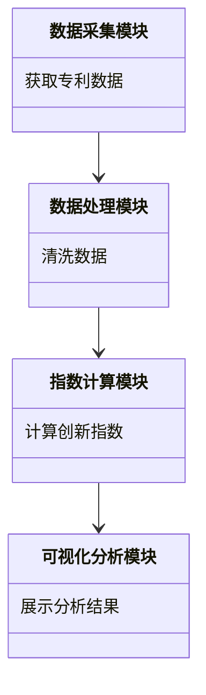
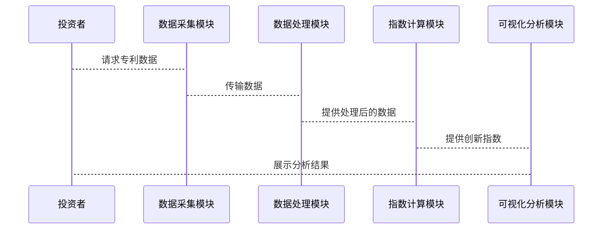

                 


# 特价股票投资中的全球创新指数与专利分析方法

> 关键词：特价股票投资，全球创新指数，专利分析方法，股票评估，投资决策

> 摘要：本文深入探讨了在特价股票投资中，如何利用全球创新指数与专利分析方法来评估公司的创新能力，从而优化投资决策。文章详细介绍了全球创新指数的核心概念、专利分析方法的算法原理，以及如何通过系统架构设计和实际项目案例来实现这些方法。通过本文，读者将能够掌握如何在股票投资中应用创新指数和专利分析，以识别高潜力的投资机会。

---

## 第1章: 特价股票投资的背景与概述

### 1.1 特价股票投资的背景

#### 1.1.1 特价股票的定义与特点
特价股票是指价格低于其面值的股票，通常意味着公司可能处于困境或有潜在的转机。这种股票的投资机会在于其价格被低估，潜在的回升空间较大。

#### 1.1.2 特价股票投资的市场环境
在全球化和科技快速发展的背景下，技术创新和知识产权保护变得尤为重要。公司创新能力直接关系到其市场竞争力和长期发展潜力，因此成为投资者评估的重要指标。

#### 1.1.3 特价股票投资的核心目标
投资者希望通过分析公司的创新能力，识别具有潜在增长潜力的公司，从而在特价股票市场中获得超额收益。

### 1.2 全球创新指数与专利分析方法的定义

#### 1.2.1 全球创新指数的定义
全球创新指数是衡量一个国家或公司在技术创新、研发投入、专利数量等方面的综合指标，反映了其创新能力的强弱。

#### 1.2.2 专利分析方法的定义
专利分析方法是对公司持有的专利数量、技术领域分布、专利质量等进行分析，以评估其技术创新能力。

#### 1.2.3 特价股票投资中创新指数与专利分析的关联
通过全球创新指数和专利分析，投资者可以评估公司的技术储备和市场竞争力，从而更准确地判断其股票的投资价值。

### 1.3 本章小结
本章介绍了特价股票投资的背景，定义了全球创新指数和专利分析方法，并说明了两者在投资中的重要性。

---

## 第2章: 全球创新指数的核心概念与分析框架

### 2.1 全球创新指数的构成要素

#### 2.1.1 创新能力的维度
全球创新指数通常包括技术创新、研发投入、专利数量、技术领先性等多个维度。

#### 2.1.2 创新资源的分配
公司如何分配资源用于研发和创新，直接影响其创新能力和市场竞争力。

#### 2.1.3 创新成果的评估
通过评估公司的专利数量、技术领域分布和专利质量，可以判断其创新成果的优劣。

### 2.2 专利分析方法的核心要素

#### 2.2.1 专利数量与质量的对比
专利数量多不一定代表质量高，需要结合技术领域的分布和专利的影响力进行综合评估。

#### 2.2.2 专利分布的地理与技术领域分析
分析专利分布的地理区域和技术领域，可以了解公司的技术创新方向和市场拓展策略。

#### 2.2.3 专利生命周期的阶段划分
专利的生命周期包括申请、授权、维持和终止等阶段，不同阶段的专利对公司的价值不同。

### 2.3 全球创新指数与专利分析的联系

#### 2.3.1 创新指数与专利数据的关联
全球创新指数的计算 heavily依赖于专利数据，专利数量、质量和分布是创新指数的重要组成部分。

#### 2.3.2 专利分析对创新指数的影响
专利分析方法为创新指数的计算提供了数据支持和方法论，两者相互促进，共同提升创新能力的评估准确性。

#### 2.3.3 两者结合在投资中的应用
通过结合全球创新指数和专利分析，投资者可以全面评估公司的创新能力，识别具有高增长潜力的特价股票。

### 2.4 本章小结
本章详细介绍了全球创新指数和专利分析的核心要素，并说明了两者在投资中的重要性。

---

## 第3章: 全球创新指数与专利分析的数学模型与公式

### 3.1 全球创新指数的计算公式

#### 3.1.1 创新指数的加权计算
创新指数 = Σ (权重_i × 指标_i)

其中，权重_i是各个创新指标的权重，指标_i是各个创新指标的数值。

#### 3.1.2 创新指数的标准化处理
为了消除不同指标量纲的影响，需要对各个指标进行标准化处理，通常使用Z-score标准化。

#### 3.1.3 创新指数的动态调整公式
创新指数 = 基础指数 + 调整项 × 时间因素

其中，调整项反映了公司创新能力的动态变化。

### 3.2 专利分析的核心算法

#### 3.2.1 专利数量与质量的加权公式
专利质量评分 = Σ (权重_j × 专利_j的特征值)

特征值包括专利的引用次数、技术领域影响力等。

#### 3.2.2 专利技术领域的分布模型
技术领域分布 = Σ (权重_k × 领域_k的专利数量)

权重_k反映了各个技术领域在公司整体创新中的重要性。

#### 3.2.3 专利生命周期的预测公式
专利寿命 = α × 研发投入 + β × 技术领域影响力 + γ × 专利质量

其中，α、β、γ是各个因素的系数，通常通过回归分析确定。

### 3.3 数学模型的举例说明

#### 3.3.1 创新指数计算的案例
假设某公司有三个创新指标，分别为研发投入（权重0.4）、专利数量（权重0.3）和技术领先性（权重0.3），计算其创新指数。

创新指数 = 0.4 × 100 + 0.3 × 50 + 0.3 × 80 = 40 + 15 + 24 = 79

#### 3.3.2 专利分析的数学模型应用
通过回归分析，确定专利寿命的预测模型：

专利寿命 = 0.5 × 研发投入 + 0.3 × 技术领域影响力 + 0.2 × 专利质量

#### 3.3.3 模型的优缺点分析
优点：模型能够量化各因素对创新指数的影响，便于比较不同公司的创新能力。

缺点：模型假设各因素的权重是固定的，可能无法反映实际中的复杂情况。

### 3.4 本章小结
本章通过数学公式详细介绍了全球创新指数和专利分析的计算方法，为投资者提供了量化评估的工具。

---

## 第4章: 基于全球创新指数与专利分析的系统架构设计

### 4.1 系统功能设计

#### 4.1.1 数据采集模块
从专利数据库中获取公司专利数据，包括专利数量、技术领域、申请时间等。

#### 4.1.2 数据处理模块
对专利数据进行清洗、标准化和特征提取，确保数据的准确性和一致性。

#### 4.1.3 指数计算模块
根据数学模型计算全球创新指数，评估公司的创新能力。

#### 4.1.4 可视化分析模块
将创新指数和专利分析结果可视化，便于投资者理解和决策。

### 4.2 系统架构设计

#### 4.2.1 系统功能设计
使用Mermaid类图展示系统的功能模块及其交互。



#### 4.2.2 系统架构设计
使用Mermaid架构图展示系统的整体架构。


#### 4.2.3 系统接口设计
定义系统与其他模块的接口，例如数据输入接口和结果输出接口。

#### 4.2.4 系统交互流程图
使用Mermaid序列图展示系统的交互流程。



### 4.3 本章小结
本章详细介绍了系统的功能设计和架构设计，为投资者提供了一个完整的解决方案。

---

## 第5章: 项目实战与案例分析

### 5.1 环境安装与数据准备

#### 5.1.1 环境安装
安装必要的Python库，如pandas、numpy、scikit-learn等。

```bash
pip install pandas numpy scikit-learn
```

#### 5.1.2 数据准备
从专利数据库中获取目标公司的专利数据，清洗并存储在CSV文件中。

### 5.2 系统核心实现源代码

#### 5.2.1 数据处理代码
```python
import pandas as pd
from sklearn.preprocessing import StandardScaler

# 读取数据
data = pd.read_csv('patent_data.csv')

# 数据清洗
data.dropna(inplace=True)
data = data[['研发投入', '专利数量', '技术领先性']]

# 标准化处理
scaler = StandardScaler()
data_scaled = scaler.fit_transform(data)
```

#### 5.2.2 创新指数计算代码
```python
def calculate_innovation_index(data_scaled, weights):
    return sum(weights[i] * data_scaled[:, i] for i in range(len(weights)))

weights = [0.4, 0.3, 0.3]
innovation_index = calculate_innovation_index(data_scaled, weights)
```

### 5.3 案例分析与结果解读

#### 5.3.1 案例分析
以某科技公司为例，计算其全球创新指数，并与竞争对手进行对比。

#### 5.3.2 结果解读
创新指数较高的公司具有更强的创新能力，适合作为特价股票投资的目标。

### 5.4 本章小结
本章通过实际案例展示了如何应用系统进行专利分析和创新指数计算，帮助投资者做出明智的投资决策。

---

## 第6章: 最佳实践、小结与注意事项

### 6.1 最佳实践

#### 6.1.1 数据来源的可靠性
确保专利数据的来源可靠，数据质量高。

#### 6.1.2 指数计算的动态调整
根据市场变化和公司情况，动态调整创新指数的计算模型。

### 6.2 小结
本文详细介绍了全球创新指数和专利分析方法在特价股票投资中的应用，通过系统设计和项目实战，为投资者提供了有力的工具。

### 6.3 注意事项

#### 6.3.1 数据隐私与合规性
在处理专利数据时，需遵守相关法律法规，确保数据的安全和合规性。

#### 6.3.2 投资风险
创新指数和专利分析只能作为参考，投资者需综合考虑其他因素，避免过度依赖单一指标。

#### 6.3.3 模型的局限性
数学模型的假设可能与实际情况存在差异，投资者需结合实际进行判断。

### 6.4 拓展阅读
建议投资者阅读相关领域的学术论文和行业报告，深入了解全球创新指数和专利分析的最新研究和应用。

---

## 作者信息

作者：AI天才研究院（AI Genius Institute） & 禅与计算机程序设计艺术（Zen And The Art of Computer Programming）

---

通过本文，读者可以深入了解如何在特价股票投资中应用全球创新指数和专利分析方法，掌握从理论到实践的完整流程，为投资决策提供有力支持。

