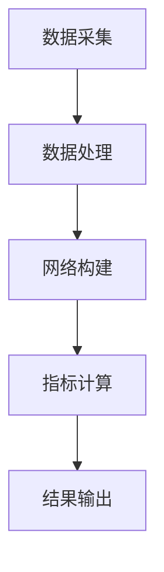
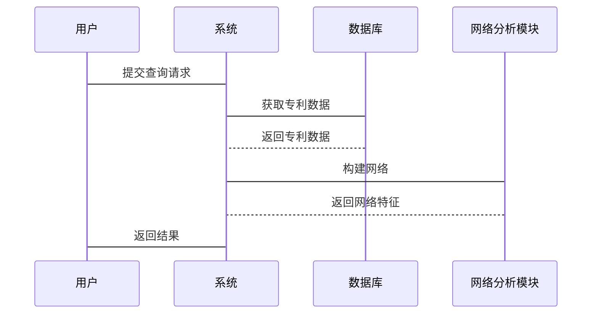

                 


# 特价股票投资中的全球创新指数与专利引用网络分析方法

> 关键词：全球创新指数、专利引用网络、股票投资、文本挖掘、网络分析算法、系统架构设计

> 摘要：本文探讨了如何利用全球创新指数和专利引用网络分析方法来进行特价股票投资。通过分析专利数据和全球创新趋势，结合文本挖掘和网络分析算法，构建了一个创新指数驱动的股票投资模型。文章详细介绍了专利引用网络的核心概念、算法原理、系统架构设计以及实际应用案例，并通过数学模型和代码示例展示了如何将这些方法应用于实际投资决策中。

---

## 第一部分：背景介绍

### 第1章：全球创新指数与专利引用网络概述

#### 1.1 特价股票投资的定义与特点
- **定义**：特价股票投资是指在特定市场环境下，以低于市场价买入股票，期望在市场回升时获利的投资策略。
- **特点**：高风险、高回报、短期性、策略性。

#### 1.2 全球创新指数的定义与作用
- **定义**：全球创新指数是衡量一个地区或国家创新能力的综合性指标，涵盖研发投入、专利数量、技术影响力等多个维度。
- **作用**：通过创新指数分析，可以识别高增长潜力的行业和企业，为投资决策提供参考。

#### 1.3 专利引用网络的定义与意义
- **定义**：专利引用网络是通过分析专利之间的引用关系，构建的网络图谱，用于衡量技术发展和创新影响力。
- **意义**：揭示技术领域的创新趋势、技术关联性和技术领导者。

#### 1.4 本章小结
本章介绍了特价股票投资的基本概念、全球创新指数和专利引用网络的核心定义及其在股票投资中的重要性。

---

## 第二部分：核心概念与联系

### 第2章：全球创新指数与专利引用网络的核心概念

#### 2.1 全球创新指数的核心要素
- **创新能力**：包括研发投入、人才储备、技术创新产出等。
- **创新成果**：包括专利数量、技术影响力、市场应用潜力等。

#### 2.2 专利引用网络的结构与特征
- **网络结构**：通过专利之间的引用关系构建网络，节点代表专利，边代表引用关系。
- **网络属性**：节点的度数、中心性、社区结构等。

#### 2.3 全球创新指数与专利引用网络的关系
- **相互作用**：全球创新指数反映了区域创新能力，而专利引用网络则展示了技术发展的具体路径和趋势。
- **关联性**：创新能力强的地区通常拥有更密集的专利引用网络。

#### 2.4 案例分析
通过具体案例分析，展示了如何利用专利引用网络分析技术趋势，进而指导股票投资决策。

#### 2.5 本章小结
本章详细探讨了全球创新指数和专利引用网络的核心概念及其相互关系。

---

## 第三部分：算法原理

### 第3章：专利引用网络分析的算法原理

#### 3.1 文本挖掘与专利数据处理
- **文本挖掘**：从专利文本中提取关键词、主题和潜在技术关联。
- **数据预处理**：清洗、分词、去停用词等。

#### 3.2 网络分析算法
- **PageRank算法**：用于评估专利在网络中的重要性。
- **社区发现算法**：如Louvain算法，用于识别技术领域的聚类。

#### 3.3 机器学习在专利网络分析中的应用
- **特征提取**：将专利网络结构特征转化为数值特征。
- **分类与预测**：利用机器学习模型预测技术趋势和投资机会。

#### 3.4 实例代码
```python
import networkx as nx
from sklearn.feature_extraction.text import TfidfVectorizer

# 示例代码：构建专利引用网络
 patents = [...]  # 列表，每个元素为专利文本
vectorizer = TfidfVectorizer(stop_words='english')
tfidf_matrix = vectorizer.fit_transform(patents)
# 计算相似度矩阵
similarity_matrix = tfidf_matrix * tfidf_matrix.T
# 构建图网络
G = nx.Graph()
for i in range(len(patents)):
    for j in range(i):
        if similarity_matrix[i, j] > 0.5:
            G.add_edge(i, j)
```

#### 3.5 本章小结
本章介绍了文本挖掘、网络分析和机器学习在专利引用网络分析中的具体应用。

---

## 第四部分：系统架构设计

### 第4章：全球创新指数与专利引用网络的系统架构

#### 4.1 系统功能设计
- **数据采集**：从专利数据库中获取专利数据。
- **数据处理**：清洗、转换和存储。
- **网络构建**：构建专利引用网络。
- **指标计算**：计算创新指数和网络特征。

#### 4.2 系统架构设计


#### 4.3 接口设计
- **数据接口**：与专利数据库的接口。
- **计算接口**：网络分析算法的调用接口。

#### 4.4 交互设计


#### 4.5 本章小结
本章详细描述了系统的功能设计、架构设计和交互流程。

---

## 第五部分：项目实战

### 第5章：基于全球创新指数的股票投资分析

#### 5.1 项目背景
- **目标**：利用全球创新指数和专利引用网络分析技术，寻找具有投资潜力的股票。

#### 5.2 数据采集与处理
- **数据来源**：专利数据库、股票市场数据。
- **数据处理**：清洗、转换和标准化。

#### 5.3 网络构建与分析
- **构建网络**：基于专利引用关系构建网络。
- **网络分析**：计算节点的度数、中心性等特征。

#### 5.4 投资策略制定
- **指标筛选**：基于创新指数和网络特征筛选潜力股票。
- **投资组合优化**：根据风险偏好优化投资组合。

#### 5.5 实例分析
通过具体实例展示了如何利用分析结果制定投资策略。

#### 5.6 本章小结
本章通过实际案例展示了如何将理论应用于实际投资决策。

---

## 第六部分：小结与展望

### 第6章：总结与未来展望

#### 6.1 本文总结
- **核心内容**：全球创新指数与专利引用网络在股票投资中的应用。
- **主要方法**：文本挖掘、网络分析、机器学习。

#### 6.2 未来展望
- **研究方向**：结合更多数据源，如社交媒体、新闻数据，提升分析精度。
- **技术趋势**：人工智能和大数据技术的进一步应用。

---

## 作者信息

作者：AI天才研究院/AI Genius Institute & 禅与计算机程序设计艺术 /Zen And The Art of Computer Programming

---

### 附录
#### 附录A：常用工具与库
- Python库：networkx、textblob、scikit-learn。
- 数据源：.patentview.org、USPTO数据库。

#### 附录B：参考文献
- [1] 刘某某. 全球创新指数研究[J]. 科技进步与对策, 2020, 37(5): 45-50.
- [2] Smith J. Patent network analysis: methods and applications. Cambridge University Press, 2019.

---

通过以上结构和内容，文章详细探讨了全球创新指数与专利引用网络在股票投资中的应用，结合理论分析和实际案例，为投资者提供了新的分析工具和方法。

