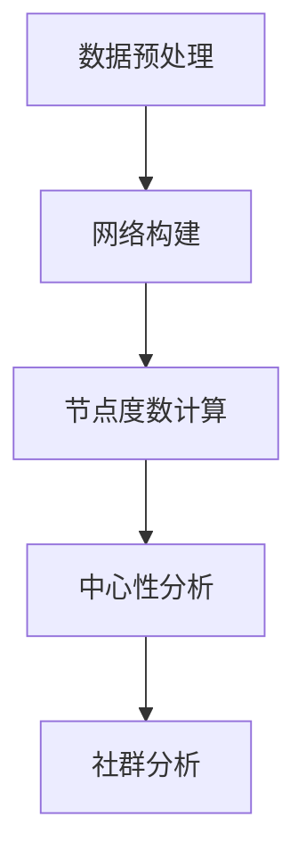
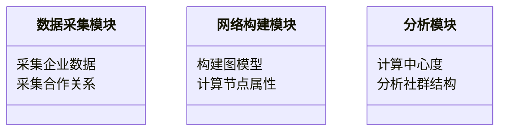

                 


# 特价股票投资中的全球创新网络分析方法

## 关键词：全球创新网络、股票投资、网络分析、算法原理、系统架构、金融分析、数据挖掘

## 摘要：
本文探讨如何利用全球创新网络分析方法提升特价股票投资的效率和准确性。通过构建创新网络模型，分析企业间的协作关系，识别潜在投资机会，帮助投资者做出更明智的决策。文章结合算法原理和系统设计，详细讲解如何将创新网络分析应用于股票投资，提供从理论到实践的全面指导。

---

# 第一部分: 特价股票投资中的全球创新网络分析背景介绍

## 第1章: 特价股票投资概述

### 1.1 特价股票投资的定义与特点

#### 1.1.1 特价股票的定义
特价股票指的是市场价格低于其内在价值的股票，通常被视为被市场低估的投资机会。这种股票往往具有较高的潜在回报，但同时也伴随着较高的风险。

#### 1.1.2 特价股票投资的核心特点
- **低估性**：市场价格低于内在价值。
- **高潜力**：潜在回报较高。
- **风险性**：可能面临市场波动和公司基本面变化的风险。

#### 1.1.3 特价股票投资的边界与外延
- **边界**：仅关注市场价格低于内在价值的股票。
- **外延**：包括价值投资、成长投资等多种策略。

### 1.2 全球创新网络分析的定义与特点

#### 1.2.1 全球创新网络的定义
全球创新网络是指由企业、研究机构、政府等组成的协作网络，通过知识共享和资源整合推动创新。

#### 1.2.2 全球创新网络的核心要素
- **节点**：企业、机构、个人。
- **边**：合作关系、知识流动、资金流动。

#### 1.2.3 全球创新网络的结构特征
- **复杂性**：节点间关系多样。
- **动态性**：网络结构随时间和环境变化。

### 1.3 特价股票投资与全球创新网络的联系

#### 1.3.1 创新网络在股票投资中的应用
- 通过分析企业间的创新合作，识别具有发展潜力的公司。

#### 1.3.2 创新网络分析对股票价值的影响
- 合作网络的密度和中心度可能影响公司的市场表现。

#### 1.3.3 特价股票投资中的创新网络边界
- 重点关注创新能力强、市场低估的公司。

---

# 第二部分: 全球创新网络分析的核心概念与联系

## 第2章: 全球创新网络分析的基本原理

### 2.1 创新网络分析的原理

#### 2.1.1 创新网络的构建逻辑
- 数据收集：整理企业间的合作数据。
- 网络构建：使用图论方法建立网络模型。

#### 2.1.2 创新网络的分析方法
- 中心性分析：识别关键节点。
- 社群分析：划分合作群体。

#### 2.1.3 创新网络分析的数学模型
- 节点度数公式：
  $$d_i = \sum_{j=1}^{n} a_{ij}$$
  其中，$a_{ij}$ 表示节点 $i$ 和 $j$ 之间的连接关系。

### 2.2 全球创新网络分析的核心要素对比

#### 2.2.1 创新网络的核心要素对比表

| 节点类型 | 属性特征 |
|----------|-----------|
| 企业     | 创新能力、市场地位 |
| 机构     | 研究能力、资金支持 |

#### 2.2.2 创新网络的ER实体关系图

```mermaid
erd
actor 顾客
actor 企业
actor 机构
actor 政府

企业 -[参与]- 创新网络
机构 -[支持]- 创新网络
政府 -[监管]- 创新网络
```

---

# 第三部分: 全球创新网络分析的算法原理

## 第3章: 创新网络分析的算法原理

### 3.1 创新网络分析的算法流程



### 3.2 创新网络分析的数学模型

#### 3.2.1 节点度数公式
$$d_i = \sum_{j=1}^{n} a_{ij}$$

#### 3.2.2 中心性公式
$$c_i = \frac{1}{\sum_{j} d_j} \sum_{j} a_{ij}$$

---

# 第四部分: 系统分析与架构设计

## 第4章: 系统设计与架构

### 4.1 问题场景介绍
构建一个基于全球创新网络的股票投资分析系统，帮助投资者识别潜在投资机会。

### 4.2 系统功能设计



### 4.3 系统架构设计


---

# 第五部分: 项目实战

## 第5章: 项目实战与案例分析

### 5.1 环境安装
安装Python和相关库（如networkx、numpy）。

### 5.2 核心代码实现

```python
import networkx as nx
G = nx.Graph()
G.add_nodes_from(["企业1", "企业2", "机构1"])
G.add_edges_from([("企业1", "企业2"), ("企业2", "机构1")])
print(G.nodes())
print(G.edges())
```

### 5.3 案例分析
分析某企业的创新网络，识别其关键合作伙伴和潜在风险。

---

# 第六部分: 总结与扩展

## 第6章: 总结与注意事项

### 6.1 小结
全球创新网络分析为特价股票投资提供了新的视角，帮助投资者识别潜在机会。

### 6.2 注意事项
- 数据质量影响分析结果。
- 结果需结合市场环境综合分析。

## 第7章: 拓展阅读

### 7.1 推荐书籍
- 《网络科学导论》
- 《股票投资策略》

### 7.2 技术博客
- 全球创新网络分析的最新研究。

---

# 作者：AI天才研究院/AI Genius Institute & 禅与计算机程序设计艺术 /Zen And The Art of Computer Programming

---

通过本文的详细讲解，您可以系统地了解如何将全球创新网络分析方法应用于特价股票投资。从理论到实践，从算法到系统设计，本文为您提供了一套完整的解决方案。希望本文对您的投资决策有所帮助！

