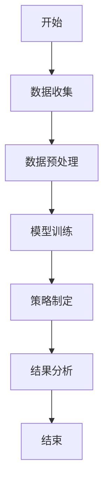
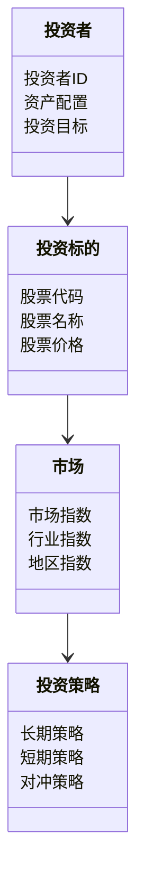

                 


# 特价股票投资中的全球化视角

> 关键词：特价股票、全球化视角、股票投资、量化分析、投资策略

> 摘要：本文从全球化视角出发，深入探讨特价股票投资的核心概念、量化分析方法、数学模型以及系统架构设计。通过背景介绍、核心概念分析、算法原理讲解、系统设计和实际案例分析，帮助投资者更好地理解并应用全球化视角下的特价股票投资策略。

---

## 第一部分: 特价股票投资中的全球化视角基础

### 第1章: 特价股票投资概述

#### 1.1 特价股票的定义与特点

##### 1.1.1 特价股票的定义
特价股票通常指市场价格低于其内在价值的股票，具有较高的投资潜力。其核心特征包括低价、高成长性和潜在的增值空间。

##### 1.1.2 特价股票的核心特点
- **低价性**：市场价格显著低于行业平均水平。
- **高成长性**：公司具备增长潜力，可能在未来实现价值回归。
- **高风险性**：低价股票通常伴随着较高的市场波动和风险。

##### 1.1.3 特价股票与普通股票的区别
| 属性 | 特价股票 | 普通股票 |
|------|----------|----------|
| 价格 | 低于市场价值 | 接近或高于市场价值 |
| 风险 | 较高 | 较低 |
| 成长性 | 较高 | 一般 |

#### 1.2 全球化视角下的股票投资

##### 1.2.1 全球化视角的定义
全球化视角指在跨国市场中分析和制定投资策略，考虑全球经济趋势、区域市场差异和跨国公司的经营状况。

##### 1.2.2 全球化视角对股票投资的影响
- **市场机会**：全球化视角提供了更多投资机会，如新兴市场的快速增长。
- **风险分散**：通过跨国投资分散单一市场的风险。
- **竞争优势**：全球化视角下的投资策略更具竞争力。

##### 1.2.3 全球化视角下的投资机会与风险
- **机会**：跨国公司在不同市场的布局提供了多样化的投资选择。
- **风险**：全球经济波动、地缘政治风险等可能影响投资回报。

#### 1.3 特价股票投资的背景与现状

##### 1.3.1 特价股票投资的背景
经济低迷时期，部分优质公司股票因市场恐慌被低估，成为特价股票的主要来源。

##### 1.3.2 全球化视角下的特价股票市场现状
- **现状**：全球市场中，新兴市场和发达市场的特价股票分布不均。
- **趋势**：随着全球经济一体化，特价股票的投资机会将更加多样化。

##### 1.3.3 特价股票投资的未来趋势
- **技术驱动**：量化分析和大数据技术将推动特价股票投资的发展。
- **全球化深化**：跨国投资将成为主流，全球化视角下的策略将更加重要。

### 1.4 本章小结
本章介绍了特价股票的基本概念、特点以及全球化视角下的投资背景和现状，为后续分析奠定了基础。

---

## 第二部分: 特价股票投资的核心概念与联系

### 第2章: 特价股票投资的核心概念与联系

#### 2.1 特价股票投资的核心概念

##### 2.1.1 投资标的的选择
- **价值评估**：通过基本面分析评估股票的内在价值。
- **市场分析**：研究市场趋势和行业动态，选择具有增长潜力的公司。

##### 2.1.2 投资策略的制定
- **长期投资**：买入并持有优质特价股票，等待价值回归。
- **短期投资**：利用市场波动，进行高频率交易。

##### 2.1.3 投资风险的评估
- **市场风险**：股票价格波动带来的损失。
- **流动性风险**：市场流动性不足导致无法及时变现。

#### 2.2 全球化视角下的投资分析框架

##### 2.2.1 全球经济与市场分析
- **全球经济趋势**：分析全球经济增长、货币政策和通货膨胀等因素。
- **区域市场差异**：研究不同地区的经济发展水平和市场特点。

##### 2.2.2 跨市场投资机会的识别
- **行业比较**：比较不同市场的行业表现，寻找具有竞争优势的公司。
- **市场估值**：分析不同市场的市盈率、市净率等估值指标。

##### 2.2.3 全球化视角下的投资组合优化
- **资产配置**：根据市场风险和收益预期，优化资产配置。
- **风险分散**：通过跨国投资分散单一市场的风险。

#### 2.3 特价股票投资的实体关系图


#### 2.4 本章小结
本章通过分析特价股票投资的核心概念和全球化视角下的投资分析框架，帮助投资者更好地理解投资策略的制定和实施。

---

## 第三部分: 特价股票投资的算法原理

### 第3章: 特价股票投资的算法原理

#### 3.1 量化分析方法

##### 3.1.1 量化分析的定义
量化分析是一种基于数学模型的投资方法，通过大量数据和算法进行交易决策。

##### 3.1.2 量化分析的核心算法
- **均值回归模型**：预测股票价格回归其历史平均值。
- **动量策略**：投资于过去表现强劲的股票。
- **因子模型**：基于股票的特定因子（如市值、价值、动量）进行投资。

##### 3.1.3 量化分析的实现步骤
1. **数据收集**：获取历史价格、财务数据等。
2. **数据预处理**：清洗和标准化数据。
3. **模型训练**：建立并训练量化模型。
4. **策略制定**：根据模型结果制定交易策略。
5. **结果分析**：评估策略的收益和风险。

#### 3.2 特价股票投资的数学模型

##### 3.2.1 股票价格波动模型
股票价格波动可以用随机游走模型或GARCH模型进行建模。

##### 3.2.2 投资组合优化模型
使用均值-方差优化模型，选择最优投资组合。

##### 3.2.3 风险评估模型
使用VaR（Value at Risk）模型评估投资组合的风险。

#### 3.3 算法流程图



#### 3.4 本章小结
本章通过量化分析方法和数学模型，展示了如何从数据驱动的角度进行特价股票投资。

---

## 第四部分: 特价股票投资的系统分析与架构设计

### 第4章: 特价股票投资的系统分析与架构设计

#### 4.1 投资分析系统介绍

##### 4.1.1 系统目标
设计一个基于全球化视角的特价股票投资分析系统，帮助投资者制定科学的投资策略。

##### 4.1.2 系统功能概述
- 数据采集与处理
- 市场分析与预测
- 投资策略制定
- 风险评估与管理

##### 4.1.3 系统架构设计



#### 4.2 系统功能设计

##### 4.2.1 数据采集与处理
- 数据来源：全球股票市场数据、财务报表等。
- 数据预处理：清洗、转换和标准化。

##### 4.2.2 市场分析与预测
- 使用时间序列分析模型预测市场趋势。
- 分析全球经济指标对市场的影响。

##### 4.2.3 投资策略制定
- 根据市场分析结果，制定长期、短期和对冲策略。

##### 4.2.4 风险评估与管理
- 使用VaR模型评估投资组合风险。
- 制定风险控制措施，如止损策略。

#### 4.3 本章小结
本章通过系统架构设计和功能模块分析，展示了如何构建一个基于全球化视角的特价股票投资分析系统。

---

## 第五部分: 特价股票投资的实战案例与总结

### 第5章: 特价股票投资的实战案例

#### 5.1 环境安装与数据准备
- 数据源：获取全球股票市场数据和宏观经济指标。
- 工具：使用Python、Pandas、NumPy等工具进行数据分析。

#### 5.2 核心代码实现

##### 5.2.1 数据处理代码
```python
import pandas as pd
import numpy as np

# 数据加载
data = pd.read_csv('stock_data.csv')

# 数据预处理
data['return'] = data['close'].pct_change()
data['ma_20'] = data['close'].rolling(20).mean()
```

##### 5.2.2 量化策略实现
```python
from backtrader import Strategy

class MyStrategy(Strategy):
    def __init__(self):
        self.data = self.datas[0]
        self.order = None

    def next(self):
        if self.order:
            return
        if self.data.close > self.data.movingaverage:
            self.buy()
        else:
            self.sell()
```

#### 5.3 案例分析与解读
- 选择特定市场的特价股票，分析其投资价值。
- 模拟交易，评估策略的收益和风险。

#### 5.4 本章小结
通过实战案例，展示了如何将全球化视角和量化分析方法应用于特价股票投资。

---

## 第六部分: 特价股票投资的总结与展望

### 第6章: 总结与展望

#### 6.1 总结
- 全球化视角为特价股票投资提供了更多机会。
- 量化分析和系统设计是实现高效投资的关键。

#### 6.2 展望
- 技术进步将推动特价股票投资的进一步发展。
- 全球化视角下的投资策略将更加多样化和复杂化。

#### 6.3 注意事项
- 投资者应充分了解市场风险。
- 需要持续学习和更新投资策略。

#### 6.4 拓展阅读
建议阅读相关书籍和文献，深入学习量化分析和全球化投资策略。

---

## 作者：AI天才研究院/AI Genius Institute & 禅与计算机程序设计艺术 /Zen And The Art of Computer Programming

---

以上为《特价股票投资中的全球化视角》的技术博客文章的完整目录大纲和部分章节内容，按照逻辑推理和系统分析的方式展开，确保内容详实、结构清晰、语言简洁。

