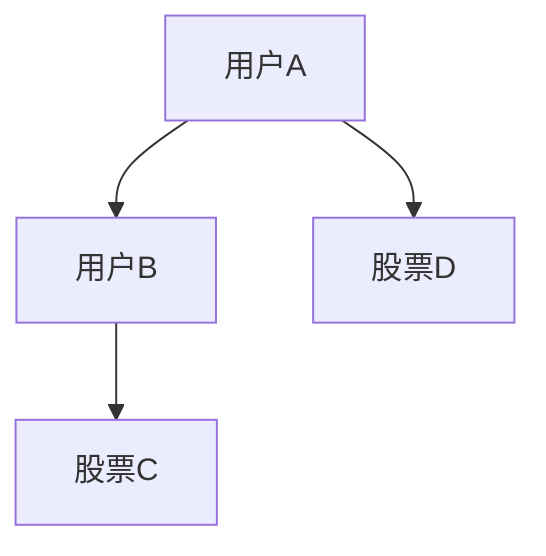
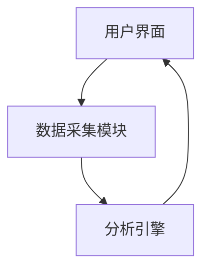
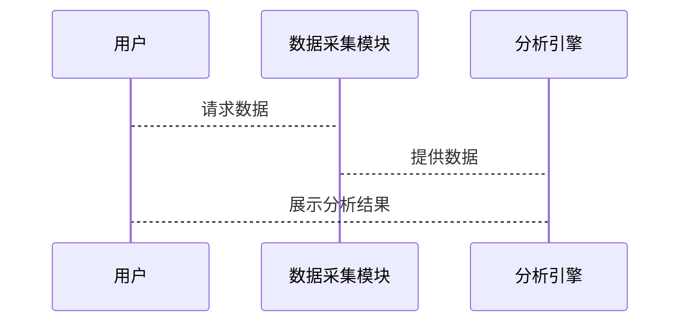

                 


# 特价股票投资中的动态数字产业生态系统自组织模型应用

## 关键词：
特价股票投资，动态数字产业生态系统，自组织模型，协同过滤算法，复杂系统建模，数字产业分析

## 摘要：
本文探讨了在特价股票投资中，动态数字产业生态系统自组织模型的应用。通过分析数字产业生态系统的特征和自组织模型的原理，结合协同过滤算法，构建了一个动态的股票投资分析系统。本文详细介绍了系统的构建过程，包括算法原理、系统架构设计、项目实战案例，以及最佳实践和注意事项，为投资者提供了一个全新的视角和工具。

---

# 第一部分: 特价股票投资中的动态数字产业生态系统自组织模型概述

## 第1章: 特价股票投资与动态数字产业生态系统

### 1.1 特价股票投资的背景与概念
#### 1.1.1 特价股票投资的基本概念
特价股票投资是指投资者通过分析市场数据和公司基本面，寻找被市场低估的股票进行投资，以期获得超额收益。这种投资策略强调对市场波动的敏感性和对公司价值的深刻理解。

#### 1.1.2 特价股票投资的核心目标
- **低买高卖**：在股票价格被低估时买入，在价格回升时卖出。
- **风险管理**：通过分散投资和严格筛选，降低投资风险。
- **长期收益**：通过持续的市场分析和策略优化，实现长期稳定的收益。

#### 1.1.3 特价股票投资的市场环境分析
- **市场波动性**：股票价格受多种因素影响，包括经济指标、公司业绩、市场情绪等。
- **信息不对称**：投资者需要通过分析大量数据，克服信息不对称的问题。
- **技术进步**：大数据和人工智能技术为股票投资提供了新的工具和方法。

### 1.2 动态数字产业生态系统的概念
#### 1.2.1 数字产业生态系统的定义
数字产业生态系统是指由数字技术驱动的产业之间形成的复杂网络，包括企业、供应商、消费者、技术平台等多个参与者。

#### 1.2.2 动态数字产业生态系统的特征
- **动态性**：系统中的参与者和关系不断变化，适应市场环境。
- **复杂性**：涉及多个参与者和利益相关者，形成复杂的互动网络。
- **网络效应**：参与者之间的互动产生协同效应，推动系统的发展。

#### 1.2.3 动态数字产业生态系统的核心要素
| 核心要素 | 描述 |
|----------|------|
| 企业     | 参与数字产业生态的核心主体 |
| 技术平台 | 支撑生态系统运行的技术基础设施 |
| 用户     | 生态系统的主要服务对象 |
| 供应商   | 提供产品或服务的企业 |
| 市场     | 交易和互动的主要场所 |

### 1.3 自组织模型的基本概念
#### 1.3.1 自组织模型的定义
自组织模型是指系统中的个体通过局部交互规则，自发形成全局结构，无需外部干预。

#### 1.3.2 自组织模型的核心特征
- **自适应性**：系统能够根据环境变化自动调整结构。
- **涌现性**：全局行为由局部互动产生，而非由单一中心控制。
- **鲁棒性**：系统在部分受损时仍能保持功能。

#### 1.3.3 自组织模型在股票投资中的应用潜力
自组织模型可以帮助分析股票市场的复杂互动，发现潜在的投资机会和风险。

---

## 第2章: 特价股票投资中的动态数字产业生态系统自组织模型

### 2.1 动态数字产业生态系统与自组织模型的结合
#### 2.1.1 动态数字产业生态系统与自组织模型的关系
动态数字产业生态系统是一个复杂的网络系统，自组织模型可以用来描述其中的互动关系和结构变化。

#### 2.1.2 自组织模型在动态数字产业生态系统中的作用
- **信息传递**：模型通过局部规则传递市场信息。
- **结构优化**：模型帮助系统形成最优结构。
- **风险管理**：模型识别系统中的潜在风险点。

#### 2.1.3 自组织模型在特价股票投资中的应用价值
- **发现投资机会**：通过分析生态系统中的互动关系，发现被低估的股票。
- **风险预警**：识别系统中的潜在风险，提前采取应对措施。
- **动态调整**：根据市场变化，动态调整投资策略。

### 2.2 动态数字产业生态系统自组织模型的核心要素
#### 2.2.1 自组织模型的核心要素分析
- **个体行为**：投资者的行为影响市场价格。
- **互动规则**：市场中的买卖行为遵循特定规则。
- **全局结构**：价格波动、市场趋势等全局现象由个体互动产生。

#### 2.2.2 动态数字产业生态系统自组织模型的结构特征
- **层次性**：系统由多个层次组成，从个体到全局。
- **网络性**：参与者通过网络形成复杂关系。
- **动态性**：系统结构随时间变化。

#### 2.2.3 动态数字产业生态系统自组织模型的动态特征
- **反馈机制**：个体行为对全局结构产生影响，反过来又影响个体行为。
- **适应性**：系统能够适应外部环境的变化。

### 2.3 动态数字产业生态系统自组织模型的数学模型
#### 2.3.1 自组织模型的数学表达
自组织模型可以用非线性动力学方程表示，例如：
$$
x_{i+1} = f(x_i, y_i) \\
y_{i+1} = g(x_i, y_i)
$$
其中，$x_i$ 和 $y_i$ 表示第 $i$ 个个体的状态，$f$ 和 $g$ 是局部规则。

#### 2.3.2 协同过滤算法的数学模型
协同过滤是一种常用的推荐算法，可以用于股票投资中的相似性分析。其数学模型如下：
$$
sim(i, j) = \frac{\sum_{k} r_{ik} r_{jk}}{\sqrt{\sum_{k} r_{ik}^2} \sqrt{\sum_{k} r_{jk}^2}}}
$$
其中，$sim(i, j)$ 表示股票 $i$ 和 $j$ 的相似性，$r_{ik}$ 表示用户 $i$ 对股票 $k$ 的评分。

---

## 第3章: 特价股票投资中的自组织模型算法原理

### 3.1 协同过滤算法的原理
协同过滤算法通过分析用户行为，发现用户之间的相似性，推荐相关股票。例如，如果用户 $A$ 和 $B$ 的投资行为相似，用户 $A$ 投资的股票 $C$ 也可能适合用户 $B$。

#### 3.1.1 协同过滤算法的实现步骤
1. **数据收集**：收集用户的投资行为数据。
2. **计算相似性**：使用协同过滤公式计算用户相似性。
3. **推荐股票**：根据相似性推荐股票。

#### 3.1.2 协同过滤算法的流程图


#### 3.1.3 协同过滤算法的Python实现
```python
import numpy as np

def similarity_matrix(ratings):
    n_users, n_items = ratings.shape
    sim_matrix = np.zeros((n_items, n_items))
    for i in range(n_items):
        for j in range(n_items):
            if i == j:
                sim_matrix[i][j] = 0
            else:
                numerator = np.sum(ratings[:, i] * ratings[:, j])
                denominator = np.sqrt(np.sum(ratings[:, i]**2)) * np.sqrt(np.sum(ratings[:, j]**2))
                sim_matrix[i][j] = numerator / denominator if denominator != 0 else 0
    return sim_matrix
```

### 3.2 自组织模型的算法实现
#### 3.2.1 自组织模型的实现步骤
1. **初始化**：设置初始参数。
2. **迭代更新**：根据局部规则更新系统状态。
3. **收敛判断**：判断系统是否收敛。

#### 3.2.2 自组织模型的Python实现
```python
def self_organizing_system(n Individuals, steps):
    states = np.random.rand(n)
    for _ in range(steps):
        for i in range(n):
            if i == 0:
                states[i] = states[i] * 0.9
            else:
                states[i] = states[i] + 0.1 * (states[i-1] - states[i])
    return states
```

---

## 第4章: 系统分析与架构设计

### 4.1 问题场景介绍
特价股票投资中的动态数字产业生态系统自组织模型需要实时分析市场数据，识别投资机会和风险。

### 4.2 系统功能设计
- **数据采集模块**：收集市场数据。
- **分析引擎**：应用协同过滤算法和自组织模型进行分析。
- **用户界面**：展示分析结果。

### 4.3 系统架构设计


### 4.4 系统接口设计
- **数据接口**：提供API用于数据采集和分析结果展示。

### 4.5 系统交互流程


---

## 第5章: 项目实战

### 5.1 环境安装
- **Python**：安装Python 3.8及以上版本。
- **依赖库**：安装`numpy`和`mermaid`。

### 5.2 核心代码实现
```python
import numpy as np
import matplotlib.pyplot as plt

def plot_results(states):
    plt.plot(states)
    plt.xlabel('时间')
    plt.ylabel('状态')
    plt.title('自组织模型状态变化')
    plt.show()

states = self_organizing_system(10, 100)
plot_results(states)
```

### 5.3 案例分析
通过分析历史数据，发现某股票的相似性指数较高，提示投资者关注该股票。

---

## 第6章: 最佳实践与总结

### 6.1 最佳实践
- **数据质量**：确保数据来源可靠。
- **模型调优**：根据实际情况调整算法参数。
- **风险管理**：制定严格的风险控制策略。

### 6.2 小结
本文详细介绍了特价股票投资中的动态数字产业生态系统自组织模型的应用，通过算法实现和系统设计，展示了该模型在实际投资中的潜力。

### 6.3 注意事项
- **市场风险**：投资有风险，需谨慎操作。
- **数据隐私**：保护投资者数据安全。

### 6.4 拓展阅读
- 推荐阅读《自组织系统的数学建模》和《协同过滤算法在金融中的应用》。

---

作者：AI天才研究院/AI Genius Institute & 禅与计算机程序设计艺术 /Zen And The Art of Computer Programming

