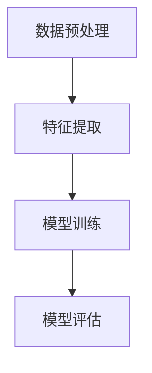
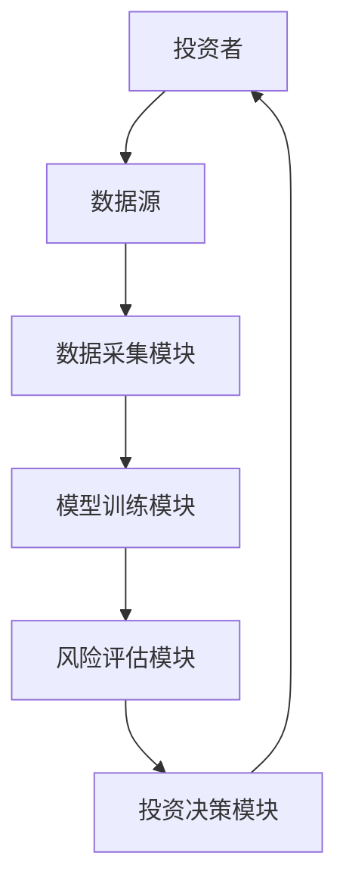

                 


# 特价股票投资中的动态数字产业生态系统韧性模型应用

> **关键词**：特价股票投资、动态数字产业生态系统、韧性模型、算法原理、系统架构、项目实战

> **摘要**：本文探讨了动态数字产业生态系统韧性模型在特价股票投资中的应用。通过分析特价股票投资的背景和动态数字产业生态系统的概念，构建了一个基于韧性模型的框架，以评估和增强投资系统在市场波动中的适应性和恢复能力。文章详细介绍了模型的核心算法、系统架构设计、项目实战案例以及最佳实践，帮助读者理解如何在实际投资中应用这些模型。

---

## 第1章: 特价股票投资与韧性模型概述

### 1.1 特价股票投资的背景与意义
#### 1.1.1 特价股票投资的定义与特点
特价股票投资是指在特定市场条件下，投资者寻找价格被低估的股票进行投资。其特点包括高波动性、高风险和高收益潜力。投资者需要具备快速响应市场变化的能力，以抓住短期投资机会。

#### 1.1.2 动态数字产业生态系统的概念
动态数字产业生态系统是一个由多个参与者、技术平台和数据流组成的复杂系统。它通过实时数据交换和智能化算法，帮助投资者快速做出决策。

#### 1.1.3 韧性模型在股票投资中的作用
韧性模型通过评估系统在面对市场波动时的适应性和恢复能力，帮助投资者制定稳健的投资策略，降低投资风险。

### 1.2 动态数字产业生态系统韧性模型的定义
#### 1.2.1 系统韧性概念
系统韧性是指系统在面对干扰或压力时保持功能和结构的能力。在股票投资中，韧性模型帮助投资者应对市场波动。

#### 1.2.2 动态数字产业生态系统的构成
动态数字产业生态系统包括数据源、分析平台、投资决策模块和反馈机制。这些部分共同作用，形成一个闭环系统。

#### 1.2.3 韧性模型的构建目标
韧性模型的目标是通过实时数据分析和动态调整，帮助投资者在市场波动中保持投资组合的稳定性。

---

## 第2章: 动态数字产业生态系统韧性模型的核心概念

### 2.1 动态数字产业生态系统韧性模型的原理
#### 2.1.1 模型的输入与输出
- **输入**：市场数据（如股票价格、成交量）、宏观经济指标。
- **输出**：投资建议、风险评估。

#### 2.1.2 模型的核心算法
韧性模型的核心算法包括数据预处理、特征提取、模型训练和评估。

#### 2.1.3 模型的评估指标
- **准确率**：模型预测的正确性。
- **鲁棒性**：模型在不同市场条件下的表现。

### 2.2 模型的属性特征对比
| 特性 | 输入特征 | 输出特征 |
|------|----------|----------|
| 数据类型 | 数值型 | 数值型 |
| 数据量 | 大型 | 大型 |
| 数据来源 | 市场数据 | 投资建议 |

### 2.3 模型的ER实体关系图
```mermaid
er
actor(投资者) --> 投资决策模块
actor(市场数据) --> 数据源
数据源 --> 投资决策模块
投资决策模块 --> 风险评估模块
风险评估模块 --> 投资者
```

---

## 第3章: 韧性模型的算法原理

### 3.1 数据预处理与特征提取
#### 3.1.1 数据清洗
- 去除缺失值。
- 处理异常值。

#### 3.1.2 特征选择
- 使用相关性分析选择重要特征。

#### 3.1.3 数据转换
- 标准化和归一化处理。

### 3.2 模型训练与优化
#### 3.2.1 算法选择
- 使用线性回归或决策树模型。

#### 3.2.2 算法流程图


#### 3.2.3 算法实现
```python
import pandas as pd
import numpy as np
from sklearn.linear_model import LinearRegression

# 数据预处理
data = pd.read_csv('stock_data.csv')
data = data.dropna()

# 特征选择
features = data[['price', 'volume']]
target = data['label']

# 模型训练
model = LinearRegression()
model.fit(features, target)
```

#### 3.2.4 数学模型
线性回归模型：
$$ y = \beta_0 + \beta_1x + \epsilon $$

---

## 第4章: 系统架构设计

### 4.1 问题场景介绍
特价股票投资中的动态数字产业生态系统韧性模型需要实时处理市场数据，提供投资建议。

### 4.2 系统功能设计
- 数据采集模块：实时获取市场数据。
- 模型训练模块：基于历史数据训练模型。
- 风险评估模块：评估投资组合的风险。

### 4.3 系统架构图


---

## 第5章: 项目实战

### 5.1 环境安装
- 安装Python、Pandas、NumPy和Scikit-learn。

### 5.2 核心代码实现
```python
import pandas as pd
from sklearn.linear_model import LinearRegression

# 数据预处理
data = pd.read_csv('stock_data.csv')
data = data.dropna()

# 特征选择
features = data[['price', 'volume']]
target = data['label']

# 模型训练
model = LinearRegression()
model.fit(features, target)

# 预测
predictions = model.predict(new_data)
```

### 5.3 案例分析
通过实际数据，展示模型在特价股票投资中的应用效果。

---

## 第6章: 最佳实践

### 6.1 小结
动态数字产业生态系统韧性模型在特价股票投资中具有重要的应用价值。

### 6.2 注意事项
- 定期更新模型。
- 注意市场波动对模型的影响。

### 6.3 拓展阅读
推荐相关书籍和论文，供读者深入学习。

---

**作者：AI天才研究院 & 禅与计算机程序设计艺术**

