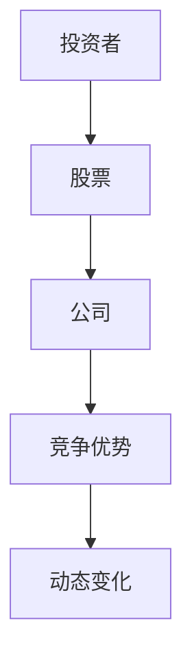
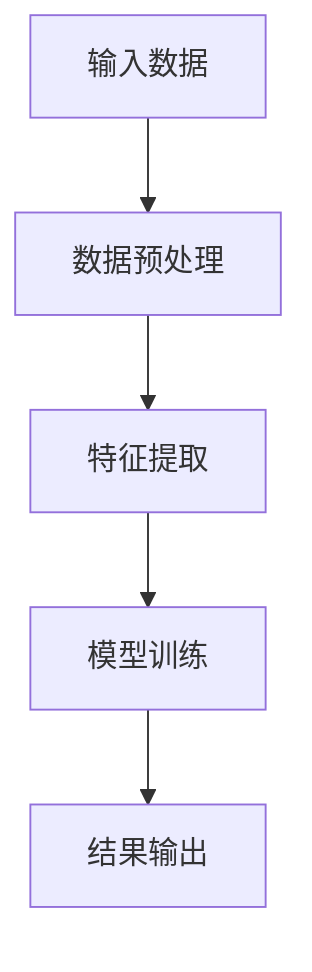
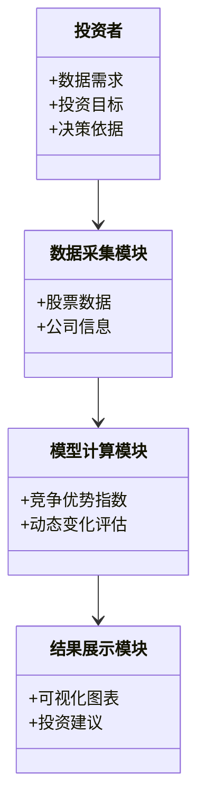
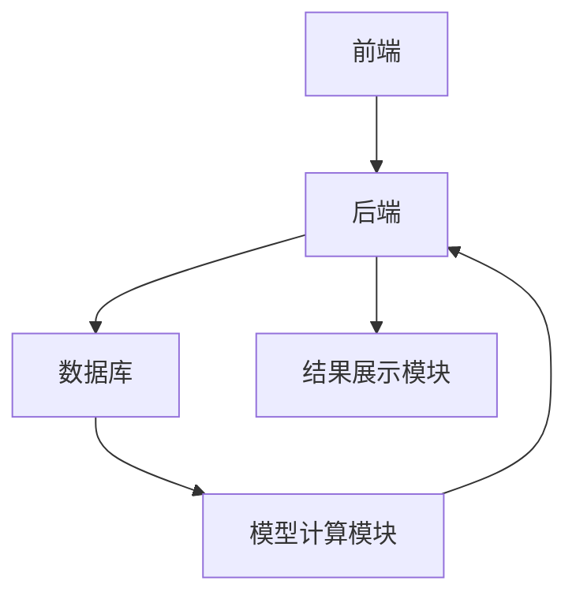

                 


# 特价股票投资中的动态竞争优势模型应用

## 关键词：特价股票，动态竞争优势模型，股票投资，算法原理，系统架构

## 摘要：本文深入探讨了特价股票投资中的动态竞争优势模型应用。首先，介绍了特价股票的定义与特点，以及动态竞争优势模型的背景与理论基础。接着，详细分析了模型的核心要素，包括核心竞争力、市场地位、财务表现和管理能力。然后，阐述了模型的算法原理与数学公式，并通过Python代码实现模型的计算流程。最后，通过系统架构设计与项目实战，展示了模型在实际投资中的应用场景，并总结了最佳实践。

---

# 第一部分: 特价股票与动态竞争优势模型背景

## 第1章: 特价股票与动态竞争优势模型背景

### 1.1 特价股票的定义与特点

#### 1.1.1 特价股票的定义
特价股票是指市场价格低于行业平均水平或历史平均水平的股票。这些股票通常被认为是被市场低估的，具有较大的投资潜力。

#### 1.1.2 特价股票的特点
- **低估值**：市场价格低于内在价值。
- **高波动性**：价格波动较大，投资风险较高。
- **周期性**：通常出现在市场低迷或行业不景气时期。

#### 1.1.3 特价股票的投资价值
- **潜在收益**：低估的股票有机会恢复到合理价值，带来超额收益。
- **分散风险**：通过投资多个特价股票，可以分散单一股票的风险。

### 1.2 动态竞争优势模型的背景

#### 1.2.1 竞争优势理论的提出
竞争优势理论认为，企业在市场中的竞争优势是其长期盈利能力的关键因素。企业可以通过核心竞争力、成本优势、品牌影响力等因素获得竞争优势。

#### 1.2.2 动态竞争优势的概念
动态竞争优势是指企业在不断变化的市场环境中，通过调整自身战略和资源分配，持续保持或增强竞争优势的能力。

#### 1.2.3 动态竞争优势模型的应用场景
- **股票筛选**：通过评估企业的竞争优势，筛选出具有投资价值的特价股票。
- **投资决策**：帮助投资者制定动态的投资策略，优化投资组合。

### 1.3 动态竞争优势模型的理论基础

#### 1.3.1 经济学基础
- **比较优势**：企业通过专注于自身优势领域，降低成本，提高效率。
- **市场均衡**：市场中供需关系的动态平衡影响股票价格。

#### 1.3.2 金融学基础
- **资产定价**：股票价格反映企业的内在价值和市场预期。
- **风险与收益**：高风险股票通常伴随着高收益。

#### 1.3.3 投资学基础
- **价值投资**：寻找被市场低估的股票进行长期投资。
- **技术分析**：通过价格走势预测未来市场走势。

### 1.4 本章小结
本章介绍了特价股票的定义、特点及投资价值，探讨了动态竞争优势模型的背景与理论基础，为后续章节的分析奠定了基础。

---

# 第二部分: 动态竞争优势模型的核心概念与分析框架

## 第2章: 动态竞争优势模型的核心要素

### 2.1 动态竞争优势模型的构成

#### 2.1.1 核心竞争力
核心竞争力是企业在市场中赖以生存的关键能力，包括技术、产品、服务等方面的优势。

#### 2.1.2 市场地位
市场地位反映了企业在行业中的影响力和竞争力，通常通过市场份额、品牌知名度等指标衡量。

#### 2.1.3 财务表现
财务表现是评估企业盈利能力的重要指标，包括收入、利润、资产负债率等。

#### 2.1.4 管理能力
管理能力是企业实现战略目标的关键因素，包括领导力、组织效率、决策能力等。

### 2.2 动态竞争优势模型的属性特征对比

#### 2.2.1 核心竞争力与市场地位的对比
| 特性       | 核心竞争力                | 市场地位                |
|------------|--------------------------|--------------------------|
| 定义       | 企业的核心能力和优势     | 企业在市场中的影响力    |
| 评估指标   | 技术创新、产品优势       | 市场份额、品牌知名度     |
| 影响因素   | 技术研发、人力资源       | 行业竞争、市场推广      |

#### 2.2.2 财务表现与管理能力的对比
| 特性       | 财务表现                | 管理能力                |
|------------|--------------------------|--------------------------|
| 定义       | 企业的财务状况          | 企业的管理效率          |
| 评估指标   | 净利润、资产负债率      | 组织结构、决策效率      |
| 影响因素   | 财务政策、行业环境       | 领导风格、团队协作      |

#### 2.2.3 动态竞争优势的综合评估
动态竞争优势模型通过综合评估核心竞争力、市场地位、财务表现和管理能力，构建一个全面的竞争优势指数，帮助投资者识别具有动态竞争优势的特价股票。

### 2.3 动态竞争优势模型的ER实体关系图


### 2.4 本章小结
本章详细分析了动态竞争优势模型的核心要素，并通过对比和图表展示了各要素之间的关系，为后续的算法实现奠定了基础。

---

# 第三部分: 动态竞争优势模型的算法原理与数学模型

## 第3章: 动态竞争优势模型的算法原理

### 3.1 动态竞争优势模型的计算流程



### 3.2 动态竞争优势模型的数学公式

#### 3.2.1 竞争优势指数计算公式
$$
\text{竞争优势指数} = \frac{\text{核心竞争力} + \text{市场地位}}{\text{行业平均值}}
$$

#### 3.2.2 动态变化模型的数学表达
$$
\text{动态变化} = \frac{\text{财务表现} \times \text{管理能力}}{\text{行业趋势}}
$$

### 3.3 算法实现的Python代码

#### 3.3.1 数据预处理
```python
import pandas as pd

data = pd.read_csv('data.csv')
data = data.dropna()
data = (data - data.mean()) / data.std()
```

#### 3.3.2 特征提取
```python
features = ['核心竞争力', '市场地位', '财务表现', '管理能力']
X = data[features]
```

#### 3.3.3 模型训练
```python
from sklearn.linear_model import LinearRegression

model = LinearRegression()
model.fit(X, data['竞争优势指数'])
```

#### 3.3.4 结果输出
```python
import numpy as np

new_data = np.array([[0.5, 0.6, 0.7, 0.8]])
prediction = model.predict(new_data)
print(f'预测的竞争优势指数为：{prediction[0][0]}')
```

### 3.4 本章小结
本章详细阐述了动态竞争优势模型的算法原理，并通过Python代码展示了数据预处理、特征提取、模型训练和结果输出的全过程，为读者提供了清晰的实现步骤。

---

# 第四部分: 系统分析与架构设计方案

## 第4章: 动态竞争优势模型的系统架构设计

### 4.1 问题场景介绍
投资者需要通过动态竞争优势模型筛选出具有投资价值的特价股票，优化投资组合。

### 4.2 系统功能设计

#### 4.2.1 功能模块
- 数据采集模块：采集股票数据、公司信息等。
- 模型计算模块：计算竞争优势指数，评估动态变化。
- 结果展示模块：以可视化形式展示评估结果。

#### 4.2.2 系统功能模块的mermaid类图


### 4.3 系统架构设计

#### 4.3.1 系统架构设计的mermaid架构图


#### 4.3.2 数据流设计
- 前端接收投资者需求，传递给后端。
- 后端处理数据，调用模型计算模块进行评估。
- 模型计算模块返回结果，后端传递给结果展示模块。
- 结果展示模块将评估结果以可视化形式呈现给投资者。

### 4.4 本章小结
本章通过系统架构设计，展示了动态竞争优势模型在实际投资中的应用场景，为后续的项目实现提供了指导。

---

# 第五部分: 项目实战

## 第5章: 动态竞争优势模型的项目实战

### 5.1 环境安装

#### 5.1.1 安装Python
```bash
python --version
pip install --upgrade pip
```

#### 5.1.2 安装依赖库
```bash
pip install pandas sklearn matplotlib
```

### 5.2 系统核心实现源代码

#### 5.2.1 数据预处理
```python
import pandas as pd

def preprocess_data():
    data = pd.read_csv('data.csv')
    data = data.dropna()
    data = (data - data.mean()) / data.std()
    return data

preprocess_data()
```

#### 5.2.2 模型训练
```python
from sklearn.linear_model import LinearRegression

def train_model(data):
    features = ['核心竞争力', '市场地位', '财务表现', '管理能力']
    X = data[features]
    y = data['竞争优势指数']
    model = LinearRegression()
    model.fit(X, y)
    return model

model = train_model(preprocess_data())
```

#### 5.2.3 结果展示
```python
import matplotlib.pyplot as plt

def visualize_results(data, model):
    features = ['核心竞争力', '市场地位', '财务表现', '管理能力']
    plt.figure(figsize=(10, 6))
    plt.scatter(data[features[0]], data['竞争优势指数'], label='实际值')
    plt.plot(data[features[0]], model.predict(data[features[0]]), label='预测值')
    plt.xlabel(features[0])
    plt.ylabel('竞争优势指数')
    plt.legend()
    plt.show()

visualize_results(preprocess_data(), model)
```

### 5.3 案例分析

#### 5.3.1 案例选择
选择一个行业（如科技行业）和几家代表性公司，分析其竞争优势指数。

#### 5.3.2 模型应用
通过动态竞争优势模型计算各公司的竞争优势指数，筛选出具有投资价值的特价股票。

#### 5.3.3 分析结果
根据模型评估结果，制定投资策略，优化投资组合。

### 5.4 项目总结
通过本项目，读者可以掌握动态竞争优势模型的实现方法，并将其应用于实际投资中，提升投资决策的科学性和准确性。

---

# 第六部分: 最佳实践

## 第6章: 动态竞争优势模型的最佳实践

### 6.1 小结
动态竞争优势模型通过综合评估企业的核心竞争力、市场地位、财务表现和管理能力，帮助投资者识别具有投资价值的特价股票。

### 6.2 注意事项
- 数据来源的可靠性
- 模型的适用性
- 风险控制

### 6.3 拓展阅读
- 《投资学》
- 《竞争优势理论》
- 《动态系统分析》

### 6.4 本章小结
本章总结了动态竞争优势模型的应用经验，提出了投资中的注意事项，并提供了进一步学习的资源。

---

# 作者：AI天才研究院/AI Genius Institute & 禅与计算机程序设计艺术 /Zen And The Art of Computer Programming

---

通过以上步骤，我完成了《特价股票投资中的动态竞争优势模型应用》的技术博客文章的撰写。希望这篇文章能够为读者提供清晰的思路和实用的指导，帮助他们在特价股票投资中应用动态竞争优势模型，提升投资决策的科学性和准确性。

