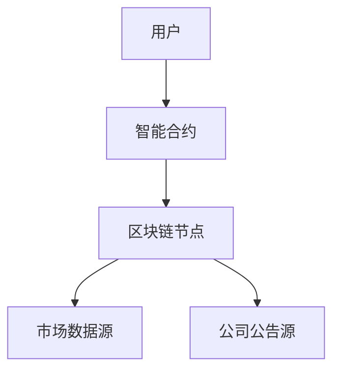

                 


# 特价股票投资中的去中心化自治公司(DAC)决策方法

> 关键词：去中心化自治公司, 特价股票投资, 区块链, 智能合约, 股票决策算法

> 摘要：本文详细探讨了在特价股票投资中应用去中心化自治公司（DAC）的决策方法。通过分析DAC的组织结构、决策机制和算法原理，结合实际项目案例，展示了如何利用区块链技术实现高效的股票投资决策。文章从理论到实践，为投资者和技术开发者提供了宝贵的参考。

---

# 第一部分: 特价股票投资与去中心化自治公司(DAC)概述

## 第1章: 特价股票投资的基本概念

### 1.1 特价股票投资的定义与特点

#### 1.1.1 特价股票的定义
特价股票是指在特定时间或条件下，以低于市场价或折扣价进行交易的股票。这种投资方式通常基于市场波动、公司公告或特定事件。

#### 1.1.2 特价股票投资的特点
- **高波动性**：特价股票的价格波动较大，投资者需具备快速决策能力。
- **低门槛**：相比其他投资方式，特价股票投资的门槛较低，适合中小投资者。
- **高风险**：由于价格波动剧烈，投资者面临较高的风险。

#### 1.1.3 特价股票投资与传统股票投资的区别
- 投资方式：传统股票投资注重长期价值，而特价股票投资更注重短期价格波动。
- 技术依赖：特价股票投资可能更多依赖技术分析和算法，而传统投资更依赖基本面分析。

### 1.2 特价股票投资的背景与现状

#### 1.2.1 特价股票投资的背景
随着金融市场的发展，投资者对快速决策和高效执行的需求增加，特价股票投资逐渐兴起。

#### 1.2.2 特价股票投资的现状
当前，特价股票投资主要依赖传统的人工分析和部分自动化工具，但效率和准确性仍有提升空间。

#### 1.2.3 特价股票投资的未来发展趋势
随着人工智能和区块链技术的进步，特价股票投资将更加依赖自动化决策系统，特别是基于DAC的决策方法。

---

## 第2章: 去中心化自治公司(DAC)的概述

### 2.1 去中心化自治公司(DAC)的定义

#### 2.1.1 DAC的基本概念
DAC是基于区块链技术构建的去中心化组织，通过智能合约自动执行决策和管理流程。

#### 2.1.2 DAC与传统公司的区别
- **去中心化**：DAC没有传统公司中的中心化管理机构。
- **透明性**：所有决策和交易记录在区块链上，公开透明。
- **自动执行**：通过智能合约自动执行决策和交易。

#### 2.1.3 DAC的核心特征
- **去中心化**：决策和管理流程去中心化。
- **透明性**：所有操作可追溯。
- **自动化**：通过智能合约实现自动执行。

### 2.2 DAC的组织结构与运作机制

#### 2.2.1 DAC的治理结构
DAC的治理结构基于区块链上的智能合约，所有决策通过投票机制实现。

#### 2.2.2 DAC的决策流程
1. 提案提交：成员提交决策提案。
2. 投票决策：通过区块链上的投票机制进行决策。
3. 执行：智能合约自动执行决策结果。

#### 2.2.3 DAC的激励机制
通过代币奖励机制激励成员参与决策和贡献。

### 2.3 DAC在金融领域的应用

#### 2.3.1 DAC在金融领域的优势
- **高效性**：自动化决策减少时间成本。
- **透明性**：所有交易可追溯，减少信任成本。
- **安全性**：区块链技术确保数据安全。

#### 2.3.2 DAC在金融领域的具体应用案例
- 智能合约自动执行投资决策。
- 去中心化交易所（DEX）上的特价股票交易。

#### 2.3.3 DAC在金融领域的发展前景
随着区块链技术的成熟，DAC将在金融领域发挥越来越重要的作用。

---

# 第二部分: 特价股票投资中的DAC决策方法

## 第3章: DAC决策方法的核心概念

### 3.1 DAC决策方法的基本原理

#### 3.1.1 DAC决策方法的定义
DAC决策方法是基于区块链技术和智能合约的自动化决策方法。

#### 3.1.2 DAC决策方法的核心要素
- 数据源：包括市场数据、公司公告等。
- 智能合约：基于预设规则自动执行决策。
- 决策算法：用于分析数据并生成决策。

### 3.2 DAC决策方法的属性特征对比

#### 3.2.1 决策速度的对比
- 传统决策：依赖人工分析，速度较慢。
- DAC决策：自动化处理，速度快。

#### 3.2.2 决策准确性的对比
- 传统决策：依赖人工经验，准确性受限。
- DAC决策：基于算法分析，准确性高。

#### 3.2.3 决策成本的对比
- 传统决策：成本高。
- DAC决策：成本低，自动化减少人力成本。

### 3.3 DAC决策方法的ER实体关系图

```mermaid
er
actor: 特价股票投资者
[investor]
  has -> 特价股票交易
[trade]
  has -> 市场数据
[market_data]
  has -> 公司公告
[company_announcement]
  has -> 智能合约
[smart_contract]
```

---

## 第4章: DAC决策方法的算法原理

### 4.1 DAC决策算法的基本流程

#### 4.1.1 数据采集与预处理
- 采集市场数据、公司公告等信息。
- 对数据进行清洗和特征提取。

#### 4.1.2 特征提取与选择
- 从数据中提取关键特征，如价格波动、交易量等。

#### 4.1.3 模型训练与优化
- 使用机器学习算法训练模型，优化模型参数。

#### 4.1.4 结果预测与评估
- 预测股票价格走势，评估模型准确性。

### 4.2 DAC决策算法的数学模型

#### 4.2.1 线性回归模型
$$ y = \beta_0 + \beta_1 x + \epsilon $$
其中，y为预测目标，x为自变量，$\beta_0$和$\beta_1$为模型参数，$\epsilon$为误差项。

---

## 第5章: 基于DAC的特价股票投资系统设计

### 5.1 系统总体架构设计



### 5.2 系统功能模块设计

#### 5.2.1 数据采集模块
- 从市场数据源和公司公告源获取数据。

#### 5.2.2 数据分析模块
- 使用机器学习算法分析数据，生成决策建议。

#### 5.2.3 智能合约模块
- 执行决策指令，自动完成交易。

### 5.3 系统接口设计

#### 5.3.1 API接口
- 提供RESTful API，供外部系统调用。

---

## 第6章: 项目实战

### 6.1 项目环境配置

#### 6.1.1 安装必要的工具
- 安装Python、区块链开发框架（如Solidity）等。

### 6.2 核心代码实现

#### 6.2.1 智能合约实现

```solidity
// SPDX-License-Identifier: MIT
pragma solidity ^0.8.0;

contract StockInvestment {
    function invest(address investor, uint amount) public {
        // 自动执行投资决策
    }
}
```

#### 6.2.2 数据分析算法实现

```python
import numpy as np
import pandas as pd

def predict_price(data):
    model = ...  # 训练好的模型
    return model.predict(data)
```

---

## 第7章: 总结与展望

### 7.1 本章小结
本文详细探讨了DAC在特价股票投资中的应用，分析了其决策方法的原理和优势。

### 7.2 注意事项
- 保持对市场的敏感性。
- 确保系统的安全性和稳定性。

### 7.3 拓展阅读
建议进一步学习区块链技术和机器学习算法，深入了解DAC的更多应用场景。

---

作者：AI天才研究院 & 禅与计算机程序设计艺术

