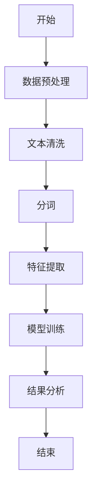

                 


# 特价股票投资中的另类数据应用与分析

## 关键词：特价股票，另类数据，文本挖掘，情感分析，回归分析，时间序列分析，机器学习

## 摘要：
在当前金融市场的竞争中，利用另类数据进行股票分析和投资决策已成为一个重要趋势。本文深入探讨了特价股票投资中另类数据的应用，从数据特征分析、算法原理到系统架构设计，全面展示了如何利用这些数据提升投资效果。通过实际案例和项目实战，读者将了解如何构建高效的投资分析系统，并掌握相关技术和方法。

---

## 第一部分：特价股票投资与另类数据的背景介绍

### 第1章：特价股票投资概述

#### 1.1 特价股票的定义与特点
- **1.1.1 特价股票的定义**  
  特价股票是指价格显著低于市场平均水平的股票，通常被视为被低估的投资机会。这些股票可能因市场波动、公司基本面变化或投资者情绪影响而出现价格折扣。

- **1.1.2 特价股票的投资策略**  
  投资者通常采用价值投资策略，寻找基本面良好但市场价格被低估的股票。这种策略强调长期投资，注重公司的财务健康和成长潜力。

- **1.1.3 特价股票与普通股票的对比**  
  特价股票可能面临更高的风险，但潜在回报也更大。与普通股票相比，特价股票的波动性较大，但长期表现可能更优。

#### 1.2 另类数据的定义与应用
- **1.2.1 另类数据的定义**  
  另类数据指的是传统金融数据之外的非结构化数据，如社交媒体帖子、新闻报道、卫星图像等。

- **1.2.2 另类数据在金融领域的应用**  
  另类数据被广泛用于市场情绪分析、风险评估和投资决策支持。例如，社交媒体上的用户情绪可以影响股票价格走势。

- **1.2.3 另类数据的优势与局限性**  
  优势包括数据多样性、实时性和潜在的市场洞察。局限性在于数据质量和处理难度较高，且难以完全量化。

---

## 第二部分：另类数据的核心概念与联系

### 第2章：另类数据的应用原理

#### 2.1 数据特征对比
下表展示了结构化数据与非结构化数据的对比：

| 特征               | 结构化数据       | 非结构化数据     |
|--------------------|------------------|------------------|
| 数据类型           | 数值型、分类型   | 文本、图像、音频  |
| 处理难度           | 较低             | 较高             |
| 分析方法           | 统计分析         | 文本挖掘、NLP     |
| 应用场景           | 预测、分类       | 情感分析、主题挖掘|

#### 2.2 ER实体关系图
```mermaid
er
  entity 特价股票 {
    key: 股票代码
    attribute: 股票名称
    attribute: 最新价格
    attribute: 市盈率
  }
  entity 另类数据 {
    key: 数据ID
    attribute: 数据类型
    attribute: 数据来源
    attribute: 数据时间
  }
  relationship 特价股票 -- 另类数据: 关联关系
```

---

## 第三部分：算法原理与数学模型

### 第3章：文本挖掘与情感分析算法

#### 3.1 文本挖掘算法流程


#### 3.2 情感分析算法实现
```python
from textblob import TextBlob

def sentiment_analysis(text):
    blob = TextBlob(text)
    polarity = blob.polarity
    if polarity > 0:
        return "正面"
    elif polarity < 0:
        return "负面"
    else:
        return "中性"

text = "这家公司的财务状况良好，前景光明。"
print(sentiment_analysis(text))  # 输出：正面
```

#### 3.3 数学模型与公式
- **回归分析**：用于预测股票价格。
  $$ y = \beta_0 + \beta_1 x + \epsilon $$
  其中，$y$ 是目标变量，$x$ 是自变量，$\epsilon$ 是误差项。

- **时间序列分析**：用于分析股票价格的变动趋势。
  $$ ARIMA(p, d, q) $$
  其中，$p$ 是自回归阶数，$d$ 是差分阶数，$q$ 是移动平均阶数。

---

## 第四部分：数学模型

### 第4章：数学模型与公式

#### 4.1 回归分析模型
- **线性回归模型**：
  $$ y = \beta_0 + \beta_1 x + \epsilon $$
  该模型用于预测股票价格与市场情绪的关系。

#### 4.2 时间序列分析模型
- **ARIMA模型**：
  $$ ARIMA(p, d, q) $$
  该模型用于分析股票价格的时间序列数据，预测未来价格走势。

#### 4.3 机器学习模型
- **随机森林**：
  $$ y = \text{ RandomForestRegressor}() $$
  用于处理非线性关系，预测股票价格。

---

## 第五部分：系统分析与架构设计方案

### 第5章：系统架构设计

#### 5.1 系统功能设计
- **数据采集模块**：从社交媒体和新闻网站获取另类数据。
- **数据处理模块**：清洗和预处理数据。
- **分析模块**：应用文本挖掘和情感分析算法。
- **预测模块**：使用回归和时间序列模型进行预测。

#### 5.2 系统架构图


---

## 第六部分：项目实战

### 第6章：项目实战与案例分析

#### 6.1 环境安装
```bash
pip install numpy pandas scikit-learn textblob
```

#### 6.2 核心代码实现
```python
from sklearn.linear_model import LinearRegression
import pandas as pd

# 加载数据
data = pd.read_csv('stock_data.csv')

# 训练模型
model = LinearRegression()
model.fit(data[['price', 'sentiment']], data['target'])

# 预测结果
predictions = model.predict(data[['price', 'sentiment']])
```

#### 6.3 案例分析
通过分析社交媒体上的负面情绪，发现某公司的股价在特定时期内被低估，从而识别出一个潜在的特价股票投资机会。

---

## 第七部分：最佳实践

### 第7章：最佳实践与小结

#### 7.1 小结
本文详细探讨了特价股票投资中另类数据的应用，从数据特征分析到算法实现，再到系统设计，为投资者提供了全面的指导。

#### 7.2 注意事项
- 数据来源的可靠性
- 模型的可解释性
- 风险管理的重要性

#### 7.3 拓展阅读
建议进一步研究深度学习在股票预测中的应用，以及多模态数据的融合分析。

---

## 作者信息：
作者：AI天才研究院 & 禅与计算机程序设计艺术

