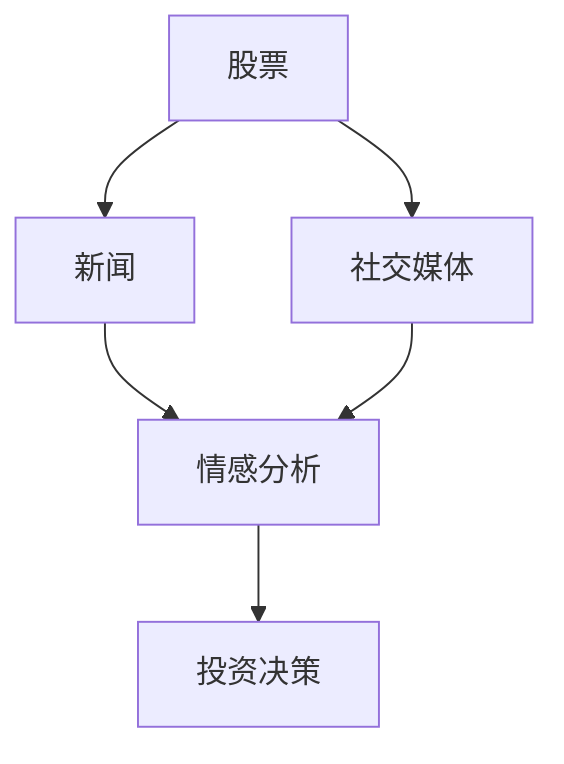
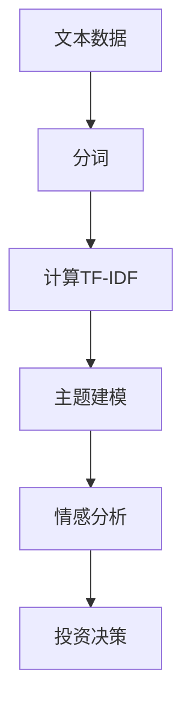
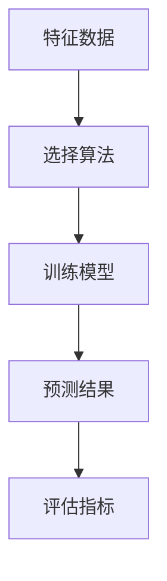
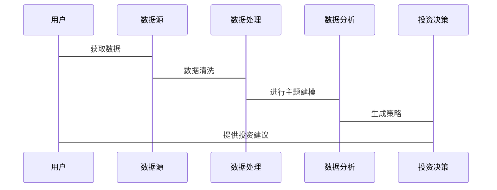

                 


# 特价股票投资中的另类数据挖掘与分析

> 关键词：特价股票投资、另类数据挖掘、文本挖掘、机器学习、数学模型、系统架构、项目实战

> 摘要：本文系统地探讨了特价股票投资中的另类数据挖掘与分析方法，从基础概念到算法原理，再到系统架构与项目实战，深入剖析了如何利用另类数据提升股票投资的决策能力。通过具体案例分析和代码实现，本文为读者提供了从理论到实践的完整指导。

---

# 第1章: 特价股票投资与另类数据挖掘概述

## 1.1 特价股票投资的背景与意义
### 1.1.1 特价股票的定义与特点
- 特价股票的定义
- 特价股票的特点（低估值、高潜力等）
- 特价股票的投资价值

### 1.1.2 另类数据在股票投资中的重要性
- 传统数据的局限性
- 另类数据的优势（非线性关系、实时性等）
- 另类数据在挖掘股票投资机会中的作用

### 1.1.3 本文的研究目标与意义
- 研究目标
- 研究意义
- 创新点

## 1.2 另类数据挖掘的基本概念
### 1.2.1 另类数据的定义
- 数据的定义
- 数据的分类

### 1.2.2 另类数据的类型
- 文本数据（新闻、社交媒体）
- 图像数据（K线图、图表）
- 音频数据（市场情绪分析）

### 1.2.3 另类数据的特点
- 非结构化
- 高维性
- 实时性

## 1.3 本章小结
- 特价股票投资的背景与意义
- 另类数据的基本概念与特点

---

# 第2章: 另类数据挖掘的核心概念与联系

## 2.1 另类数据挖掘的基本原理
### 2.1.1 数据采集与预处理
- 数据来源（API接口、网络爬虫）
- 数据清洗（去重、去噪）

### 2.1.2 数据分析与挖掘
- 文本挖掘（关键词提取、主题建模）
- 图像识别（K线图分析）
- 机器学习（分类、回归）

### 2.1.3 数据可视化
- 可视化工具（Matplotlib、Tableau）
- 数据可视化策略

## 2.2 核心概念对比分析
### 2.2.1 数据特征对比表格
| 数据类型 | 结构化数据 | 非结构化数据 |
|----------|------------|---------------|
| 示例     | 股价数据   | 新闻文本       |

### 2.2.2 数据类型对比分析
- 文本数据与数值数据的对比
- 图像数据与文本数据的对比

### 2.2.3 数据关系ER实体关系图（Mermaid流程图）


## 2.3 本章小结
- 另类数据挖掘的基本原理
- 核心概念的对比与联系

---

# 第3章: 另类数据挖掘算法原理

## 3.1 文本挖掘算法
### 3.1.1 TF-IDF算法
- TF-IDF的定义
- TF-IDF的计算公式
  $$ TF-IDF = \frac{TF \times \log(N+1 - DF + 1)}{N} $$
- 实例分析

### 3.1.2 主题模型（LDA）
- LDA的基本原理
- LDA的步骤（预处理、主题生成）
- 示例分析

### 3.1.3 情感分析算法
- 情感分析的定义
- 基于词袋模型的情感分析
- 基于深度学习的情感分析（如LSTM）

## 3.2 机器学习模型
### 3.2.1 分类算法
- 支持向量机（SVM）
- 随机森林（Random Forest）
- 实例分析

### 3.2.2 聚类算法
- K-means算法
- DBSCAN算法
- 实例分析

### 3.2.3 回归算法
- 线性回归
- Lasso回归
- 实例分析

## 3.3 算法流程图（Mermaid流程图）
### 3.3.1 文本挖掘流程图


### 3.3.2 机器学习模型流程图


## 3.4 算法实现代码
### 3.4.1 TF-IDF代码示例
```python
from sklearn.feature_extraction.text import TfidfVectorizer

vectorizer = TfidfVectorizer()
tfidf = vectorizer.fit_transform(corpus)
```

### 3.4.2 LDA主题模型代码示例
```python
from sklearn.decomposition import LatentDirichletAllocation

lda = LatentDirichletAllocation(n_components=5, random_state=0)
lda.fit(X)
```

### 3.4.3 情感分析代码示例
```python
from sklearn.linear_model import LogisticRegression

model = LogisticRegression()
model.fit(X_train, y_train)
```

## 3.5 本章小结
- 文本挖掘算法的原理与实现
- 机器学习模型的原理与应用

---

# 第4章: 数学模型与公式解析

## 4.1 文本相似度计算
### 4.1.1 余弦相似度
- 公式：$$ \cos(\theta) = \frac{\sum x_i y_i}{\sqrt{\sum x_i^2} \sqrt{\sum y_i^2}} $$
- 示例分析

### 4.1.2 编辑距离
- 公式：$$ edit\_distance(s1, s2) = \min_{(i,j)} \{ ... \} $$
- 示例分析

## 4.2 机器学习模型数学公式
### 4.2.1 线性回归
- 公式：$$ y = \beta_0 + \beta_1 x + \epsilon $$
- 示例分析

### 4.2.2 支持向量机
- 最大-margin 分离
- 拉格朗日对偶
  $$ \max_{\beta, \beta_0} \min_{i} \{ ... \} $$

## 4.3 本章小结
- 文本相似度计算的数学公式
- 机器学习模型的数学推导

---

# 第5章: 系统分析与架构设计方案

## 5.1 问题场景介绍
- 特价股票投资中的数据来源
- 数据处理与分析的挑战

## 5.2 系统功能设计
### 5.2.1 领域模型（Mermaid类图）


### 5.2.2 系统架构设计（Mermaid架构图）
```mermaid
container 数据源 {
  API接口
  网络爬虫
}
container 数据处理 {
  数据清洗
  文本挖掘
}
container 数据分析 {
  情感分析
  主题建模
}
container 投资决策 {
  生成策略
}
```

### 5.2.3 系统接口设计
- API接口定义
- 接口调用流程

### 5.2.4 系统交互（Mermaid序列图）


## 5.3 本章小结
- 系统分析与架构设计的整体思路
- 关键模块的设计与实现

---

# 第6章: 项目实战

## 6.1 环境安装与配置
- Python环境搭建
- 相关库的安装（如scikit-learn、spaCy）

## 6.2 系统核心实现
### 6.2.1 数据采集与处理
- 网络爬虫实现
  ```python
  import requests
  url = "https://example.com"
  response = requests.get(url)
  ```

### 6.2.2 数据分析与挖掘
- 文本挖掘实现
  ```python
  from sklearn.feature_extraction.text import TfidfVectorizer
  vectorizer = TfidfVectorizer()
  tfidf = vectorizer.fit_transform(corpus)
  ```

### 6.2.3 投资决策模型
- 基于机器学习的模型实现
  ```python
  from sklearn.ensemble import RandomForestClassifier
  model = RandomForestClassifier()
  model.fit(X_train, y_train)
  ```

## 6.3 实际案例分析
### 6.3.1 数据来源
- 新闻数据
- 社交媒体数据

### 6.3.2 数据分析结果
- 主题建模结果
- 情感分析结果

## 6.4 项目总结
- 项目实现的关键点
- 经验与教训

## 6.5 本章小结
- 项目实战的完整流程
- 系统实现的细节与优化

---

# 第7章: 最佳实践、总结与展望

## 7.1 最佳实践 tips
- 数据采集的注意事项
- 模型选择的建议
- 系统优化的技巧

## 7.2 本章小结
- 本文的主要内容与结论
- 关键点总结

## 7.3 展望
- 另类数据挖掘的未来发展方向
- 特价股票投资的潜在研究领域

---

# 作者：AI天才研究院/AI Genius Institute & 禅与计算机程序设计艺术 /Zen And The Art of Computer Programming

