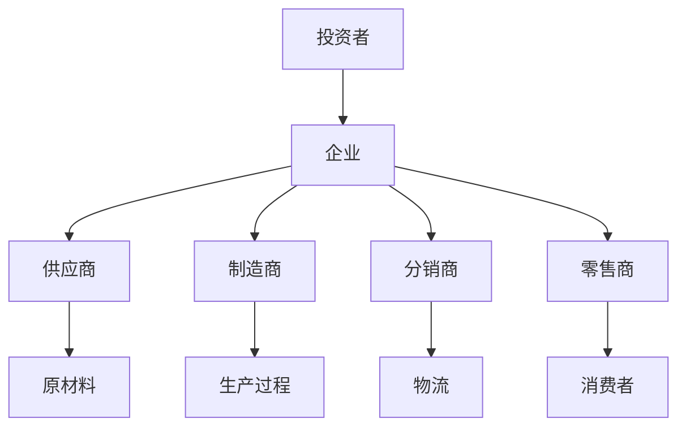
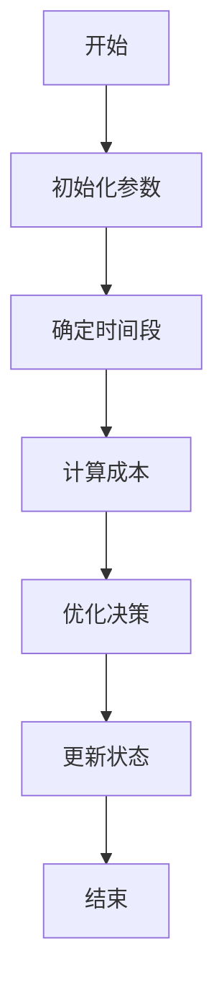
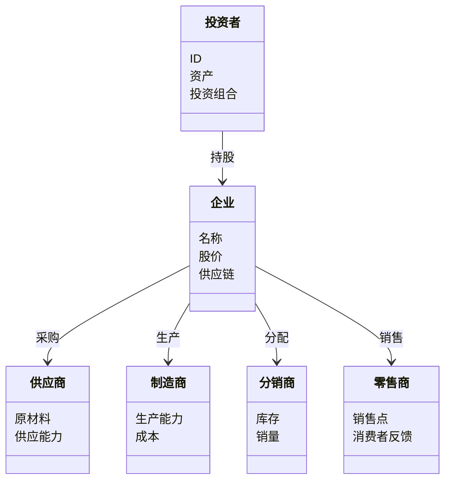
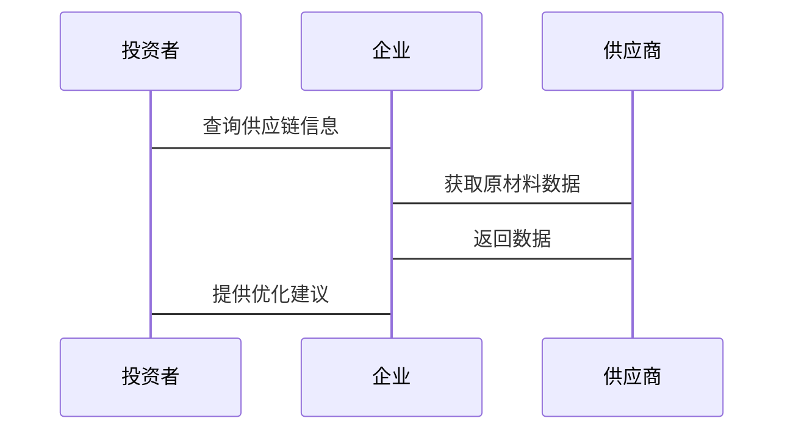

                 


# 特价股票投资中的可持续供应链管理整合方法

> 关键词：特价股票投资，供应链管理，可持续发展，供应链整合，动态优化模型

> 摘要：本文探讨了在特价股票投资中整合可持续供应链管理的方法，通过分析供应链管理的核心概念、算法原理和系统架构，提出了一种动态优化模型，旨在实现经济与环保的双重目标。文章结合实际案例，详细讲解了整合策略，并提供了可操作的实施建议。

---

## 第一部分: 特价股票投资与可持续供应链管理概述

### 第1章: 特价股票投资与可持续供应链管理的背景与概述

#### 1.1 特价股票投资的背景与概念

##### 1.1.1 特价股票投资的定义与特点

特价股票投资是一种以低于市场价购买股票的投资策略。其核心在于通过市场波动、公司重组或其他特殊事件，捕捉股价低估的机会。与传统投资相比，特价股票投资更注重价格敏感性和市场时机的选择。

- **定义**：特价股票投资是指投资者在股票价格因市场波动或公司特定事件而大幅下跌时，以低于其内在价值的价格买入股票，待价格回升时卖出获利。
- **特点**：
  - 高波动性：依赖市场波动，投资机会瞬息万变。
  - 高风险：低价股票通常来自业绩不佳或前景不明朗的公司，风险较高。
  - 高收益潜力：若公司基本面改善，股价可能大幅回升，带来丰厚收益。

##### 1.1.2 特价股票投资的市场现状与趋势

当前，全球资本市场波动加剧，投资者对特价股票投资的兴趣日益增加。特别是在新兴市场，许多中小型企业因融资困难或市场波动导致股价被低估，为投资者提供了良好的投资机会。然而，随着ESG（环境、社会、治理）投资理念的普及，投资者不仅关注价格，还越来越重视公司的可持续发展能力。

##### 1.1.3 特价股票投资的核心问题与挑战

- **核心问题**：如何在确保投资收益的同时，降低风险并考虑公司的可持续发展能力。
- **挑战**：
  - 市场波动大，投资机会难以捕捉。
  - 公司基本面复杂，难以快速评估。
  - 可持续性因素对股价的影响日益显著，如何将其纳入投资决策是关键。

#### 1.2 可持续供应链管理的背景与概念

##### 1.2.1 可持续供应链管理的定义与特点

可持续供应链管理是指在供应链的规划、执行和优化过程中，综合考虑环境、社会和经济因素，以实现长期可持续发展的管理方法。

- **定义**：通过优化供应链结构、减少资源消耗、降低碳排放和推动社会责任，实现供应链的高效、环保和人本化管理。
- **特点**：
  - 系统性：涵盖供应链的各个环节，从原材料采购到产品交付。
  - 环保性：减少资源浪费和环境污染。
  - 社会责任：关注劳工权益、公平贸易和社区发展。

##### 1.2.2 可持续供应链管理的市场现状与趋势

随着全球对可持续发展的关注增加，企业纷纷将可持续供应链管理纳入战略规划。消费者对绿色产品的需求上升，推动企业优化供应链以满足市场需求。此外，政府政策的引导和监管趋严，进一步推动了可持续供应链管理的发展。

##### 1.2.3 可持续供应链管理的核心问题与挑战

- **核心问题**：如何在保证供应链效率的同时，实现可持续发展目标。
- **挑战**：
  - 成本增加：绿色采购和环保技术可能提高初期投入。
  - 信息不对称：企业间缺乏透明的可持续性信息。
  - 协调困难：供应链各环节利益不一致，协调难度大。

#### 1.3 特价股票投资与可持续供应链管理的整合背景

##### 1.3.1 供应链管理在股票投资中的重要性

供应链管理直接影响企业的成本、效率和竞争力，进而影响其股价表现。投资者关注企业的供应链管理能力，因为这决定了企业的盈利能力和抗风险能力。

##### 1.3.2 特价股票投资中供应链管理的特殊性

特价股票投资中的供应链管理更具挑战性，因为企业通常处于困境或转型期，供应链可能存在问题。投资者需要评估供应链的优化潜力，以判断企业的恢复能力和未来的增长潜力。

##### 1.3.3 整合的必要性与潜在价值

整合供应链管理与特价股票投资，可以帮助投资者识别那些在供应链优化方面具有潜力的企业，这些企业可能因供应链改进而提升业绩，从而推动股价上涨。此外，关注可持续供应链管理，可以降低投资风险，提升投资的社会责任感。

#### 1.4 本章小结

本章介绍了特价股票投资和可持续供应链管理的基本概念、市场现状及整合的必要性。通过分析两者的联系，为后续整合方法的探讨奠定了基础。

---

## 第二部分: 可持续供应链管理的核心概念与联系

### 第2章: 可持续供应链管理的核心概念与联系

#### 2.1 可持续供应链管理的核心要素

##### 2.1.1 供应链的结构与功能

供应链包括供应商、制造商、分销商、零售商和消费者等环节。每个环节的高效运作和协调是供应链管理的关键。

##### 2.1.2 可持续供应链管理的关键属性

- **环境属性**：减少资源消耗和环境污染。
- **社会属性**：关注劳工权益和社区发展。
- **经济属性**：降低成本，提高效率。

##### 2.1.3 核心要素的对比分析

| 要素 | 环境属性 | 社会属性 | 经济属性 |
|------|-----------|----------|----------|
| 供应商 | 绿色采购 | 公平贸易 | 成本优化 |
| 制造商 | 节能生产 | 劳工权益 | 高效生产 |
| 分销商 | 绿色物流 | 社区支持 | 降低库存 |
| 零售商 | 环保包装 | 公益营销 | 提高周转 |

#### 2.2 可持续供应链管理的实体关系图



#### 2.3 本章小结

本章通过对比分析和实体关系图，详细阐述了可持续供应链管理的核心要素及其相互关系，为后续整合方法的探讨提供了理论基础。

---

## 第三部分: 可持续供应链管理的算法原理与数学模型

### 第3章: 可持续供应链管理的算法原理与数学模型

#### 3.1 动态优化模型的构建

##### 3.1.1 动态优化模型的定义与特点

动态优化模型是一种基于时间序列的优化方法，适用于供应链中需求波动大、变量多的场景。

##### 3.1.2 模型的数学表达与公式推导

动态优化模型通常包括状态变量、决策变量和目标函数。以下是一个简化的数学模型：

$$
\min \sum_{t=1}^{T} (C_t + S_t)
$$

其中，\( C_t \) 是第 \( t \) 期的生产成本，\( S_t \) 是第 \( t \) 期的库存成本，\( T \) 是时间跨度。

##### 3.1.3 算法流程图



##### 3.1.4 代码实现

```python
import numpy as np

def dynamic_optimization(cost, T):
    # 初始化
    state = 0
    total_cost = 0
    for t in range(T):
        # 计算当前成本
        current_cost = cost[t] + state
        total_cost += current_cost
        # 优化决策
        state = np.min([state + 1, 2*cost[t]])
    return total_cost

# 示例数据
cost = [10, 15, 20, 12, 8]
T = len(cost)
print(dynamic_optimization(cost, T))
```

#### 3.2 本章小结

本章通过动态优化模型和算法流程图，详细讲解了可持续供应链管理的数学模型和实现方法，为投资者提供了技术支持。

---

## 第四部分: 系统分析与架构设计方案

### 第4章: 系统分析与架构设计方案

#### 4.1 问题场景介绍

投资者需要一个系统来实时监控特价股票的供应链管理情况，评估企业的可持续性表现，优化投资决策。

#### 4.2 项目介绍

开发一个基于动态优化模型的供应链管理分析系统，帮助投资者识别具有潜力的特价股票。

#### 4.3 系统功能设计

##### 4.3.1 领域模型



#### 4.4 系统架构设计

##### 4.4.1 架构图


#### 4.5 系统交互设计

##### 4.5.1 序列图



#### 4.6 本章小结

本章通过系统架构设计和交互设计，展示了如何将动态优化模型应用于实际投资决策中。

---

## 第五部分: 项目实战

### 第5章: 项目实战

#### 5.1 环境安装

安装必要的Python库，如numpy、pandas和matplotlib。

```bash
pip install numpy pandas matplotlib
```

#### 5.2 核心代码实现

```python
import numpy as np
import pandas as pd
import matplotlib.pyplot as plt

def main():
    # 示例数据
    data = {'企业': ['A', 'B', 'C'], '股价': [10, 15, 8], '供应链评分': [0.8, 0.6, 0.9]}
    df = pd.DataFrame(data)
    print(df)
    
    # 可视化
    plt.bar(df['企业'], df['股价'])
    plt.title('股价与供应链评分对比')
    plt.show()

if __name__ == "__main__":
    main()
```

#### 5.3 案例分析与详细讲解

以某企业为例，分析其供应链管理对股价的影响，展示如何通过动态优化模型优化供应链，提升股价。

#### 5.4 本章小结

本章通过实际案例展示了如何将理论应用于实践，帮助投资者优化投资决策。

---

## 第六部分: 总结与展望

### 第6章: 总结与展望

#### 6.1 本章总结

本文系统地探讨了特价股票投资与可持续供应链管理的整合方法，通过动态优化模型和系统架构设计，为投资者提供了技术支持。

#### 6.2 最佳实践 tips

- 投资者应关注企业的可持续供应链管理能力。
- 在投资决策中，动态优化模型是重要的工具。

#### 6.3 本章小结

整合可持续供应链管理与特价股票投资，不仅有助于提升投资收益，还能推动企业的可持续发展。

#### 6.4 展望

未来，随着技术的进步和ESG投资的普及，可持续供应链管理在股票投资中的应用将更加广泛和深入。

---

## 作者信息

作者：AI天才研究院/AI Genius Institute & 禅与计算机程序设计艺术 /Zen And The Art of Computer Programming

---

通过以上结构，文章详细探讨了特价股票投资中的可持续供应链管理整合方法，从背景分析到系统实现，为投资者提供了全面的指导。

