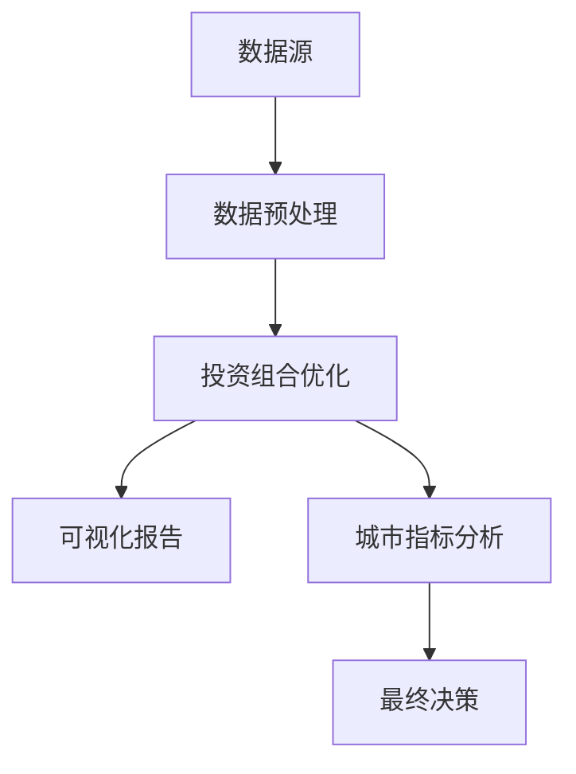

                 


# 特价股票投资中的可持续城市发展整合方法

## 关键词：特价股票投资，可持续城市发展，投资组合优化，数学模型，城市规划

## 摘要：  
本文探讨了将特价股票投资与可持续城市发展相结合的方法，旨在通过分析特价股票投资的核心原理、可持续城市发展的核心要素，以及两者整合的数学模型和系统架构，为投资者和城市规划者提供一种既能实现经济回报又促进可持续发展的投资策略。文章从背景介绍、核心概念、整合方法、数学模型、系统架构、项目实战等多个方面展开，结合实际案例和具体技术细节，详细阐述了如何在投资中融入可持续发展理念，最终实现经济效益与社会责任的双赢。

---

## 第一部分: 特价股票投资与可持续城市发展背景

### 第1章: 特价股票投资与可持续城市发展概述

#### 1.1 特价股票投资的定义与特点  
- 1.1.1 特价股票的定义  
- 1.1.2 特价股票投资的核心特点（低估、高分红、低风险）  
- 1.1.3 特价股票投资的市场定位与作用  

#### 1.2 可持续城市发展的定义与目标  
- 1.2.1 可持续城市发展的定义  
- 1.2.2 可持续城市发展的核心目标（环境、经济、社会）  
- 1.2.3 可持续城市发展与经济、社会、环境的关系  

#### 1.3 特价股票投资与可持续城市发展的整合背景  
- 1.3.1 当前城市化与投资趋势分析  
- 1.3.2 可持续发展与金融投资的结合需求  
- 1.3.3 特价股票投资在可持续城市发展中的潜在作用  

---

## 第二部分: 特价股票投资与可持续城市发展的核心概念

### 第2章: 特价股票投资的核心原理  

#### 2.1 特价股票的筛选标准  
- 2.1.1 市盈率（P/E）分析  
- 2.1.2 市净率（P/B）分析  
- 2.1.3 股息率与股息支付率分析  

#### 2.2 投资组合优化的数学模型  
- 2.2.1 Markowitz投资组合理论  
- 2.2.2 风险与收益的平衡公式  
- 2.2.3 特价股票投资的优化算法  

### 第3章: 可持续城市发展的核心要素  

#### 3.1 可持续城市发展的三大支柱  
- 3.1.1 环境可持续性  
- 3.1.2 社会公平性  
- 3.1.3 经济可行性  

#### 3.2 可持续城市发展的指标体系  
- 3.2.1 环境指标：碳排放、能源消耗  
- 3.2.2 社会指标：教育、医疗、就业  
- 3.2.3 经济指标：GDP增长、投资回报率  

---

## 第三部分: 特价股票投资与可持续城市发展整合方法

### 第4章: 特价股票投资与可持续城市发展的整合方法  

#### 4.1 特价股票投资与可持续发展的关联性分析  
- 4.1.1 特价股票的低估特性与可持续发展的潜力  
- 4.1.2 可持续发展指标对投资决策的影响  

#### 4.2 可持续城市发展指标对投资组合的影响  
- 4.2.1 环境友好型企业的识别与投资  
- 4.2.2 社会责任型企业对投资组合的优化作用  

### 第5章: 数学模型与算法设计  

#### 5.1 特价股票投资的数学模型  
- 5.1.1 投资组合优化的数学公式  
  $$ \text{目标函数：} \quad \max \sum_{i=1}^{n} w_i r_i - \lambda \sum_{i=1}^{n} \sum_{j=1}^{n} w_i w_j \sigma_{ij} $$
  其中，\( w_i \) 是第 \( i \) 只股票的权重，\( r_i \) 是预期收益率，\( \sigma_{ij} \) 是协方差矩阵。  
- 5.1.2 基于可持续发展指标的权重分配  

#### 5.2 可持续发展指标的权重分配算法  
- 5.2.1 熵值法（Entropy Method）  
- 5.2.2 层次分析法（AHP）  

#### 5.3 算法实现的Python代码  
```python
import numpy as np

def calculate_weights(matrix):
    # 计算权重
    n = len(matrix)
    # 标准化矩阵
    normalized_matrix = (matrix - np.mean(matrix)) / np.std(matrix)
    # 计算熵值
    entropy = np.mean(-np.log(normalized_matrix + 1e-8), axis=1)
    # 计算权重
    weights = np.exp(-entropy)
    return weights / np.sum(weights)

# 示例数据
data = np.array([[10, 20, 30], [40, 50, 60], [70, 80, 90]])
weights = calculate_weights(data)
print(weights)
```

---

## 第四部分: 系统分析与架构设计

### 第6章: 系统分析与架构设计  

#### 6.1 问题场景介绍  
- 6.1.1 投资者需求分析  
- 6.1.2 可持续城市发展的项目需求  

#### 6.2 系统功能设计  
- 6.2.1 数据采集模块（股票数据、城市指标）  
- 6.2.2 模型构建模块（投资组合优化）  
- 6.2.3 结果分析模块（可视化报告）  

#### 6.3 系统架构设计（Mermaid图）  



---

## 第五部分: 项目实战与案例分析

### 第7章: 项目实战  

#### 7.1 环境安装与数据准备  
- 7.1.1 Python与相关库的安装（Pandas、NumPy、Matplotlib）  
- 7.1.2 数据来源与清洗  

#### 7.2 系统核心实现  
- 7.2.1 投资组合优化的代码实现  
- 7.2.2 可视化报告的生成  

#### 7.3 案例分析  
- 7.3.1 某城市可持续发展项目的投资组合优化  
- 7.3.2 投资回报与可持续发展目标的对比分析  

---

## 第六部分: 总结与展望

### 第8章: 总结与展望  

#### 8.1 核心内容回顾  
- 8.1.1 特价股票投资的核心原理  
- 8.1.2 可持续城市发展的重要指标  
- 8.1.3 两者的整合方法与数学模型  

#### 8.2 未来研究方向  
- 8.2.1 更复杂的数学模型开发  
- 8.2.2 多目标优化在投资组合中的应用  
- 8.2.3 可持续城市发展中的技术创新  

#### 8.3 最佳实践 Tips  
- 8.3.1 投资者应关注企业的社会责任表现  
- 8.3.2 城市规划者应与投资者加强合作  
- 8.3.3 投资组合应动态调整以适应可持续发展目标  

---

## 作者：AI天才研究院/AI Genius Institute & 禅与计算机程序设计艺术 /Zen And The Art of Computer Programming  

---

**注意：** 以上目录结构和内容设计是为了帮助您快速理解如何组织和撰写一篇高质量的技术博客文章。如果您需要更详细的内容或具体的代码实现，请告诉我，我可以进一步扩展。

