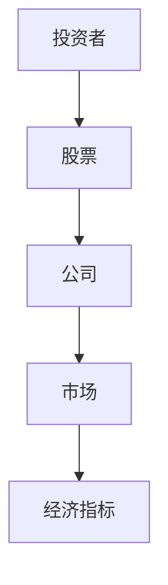
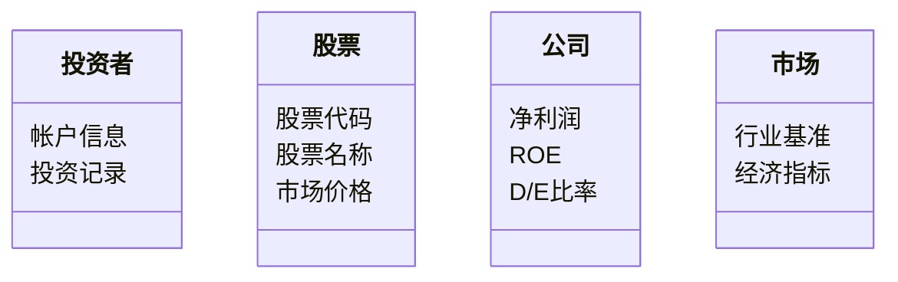
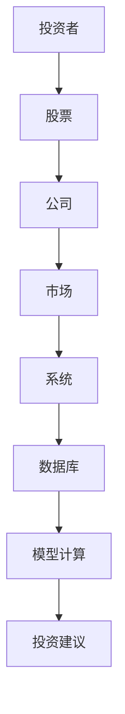

                 


# 特价股票投资中的可持续增长模型应用

## 关键词：特价股票、可持续增长模型、投资策略、股票分析、量化投资

## 摘要：  
本文探讨了在特价股票投资中如何应用可持续增长模型，通过详细分析模型的原理、算法和系统设计，结合实际案例，展示了如何利用该模型实现投资决策的优化。文章从背景介绍、核心概念、算法原理、系统架构到项目实战，全面解析了可持续增长模型在特价股票投资中的应用，为投资者提供了科学的决策依据。

---

## 目录

1. [背景介绍](#背景介绍)
2. [核心概念与联系](#核心概念与联系)
3. [算法原理](#算法原理)
4. [系统分析与架构设计](#系统分析与架构设计)
5. [项目实战](#项目实战)
6. [总结](#总结)

---

## 背景介绍

### 1.1 特价股票投资的定义与特点

#### 1.1.1 特价股票的定义  
特价股票是指价格被市场低估，相对于其内在价值而言具有较大折扣的股票。这类股票通常出现在市场低迷时期，或者公司短期面临困境但具有长期增长潜力的情况下。

#### 1.1.2 特价股票投资的核心特点  
- **低估值**：市盈率、市净率等估值指标显著低于行业平均水平。  
- **高安全边际**：投资价格远低于内在价值，降低本金损失风险。  
- **逆周期性**：通常在市场下跌或经济衰退时出现较多特价股票。  

#### 1.1.3 特价股票投资的市场定位  
特价股票投资主要针对价值投资者，这类投资者倾向于寻找被市场忽视或低估的股票，通过长期持有实现超额收益。

---

### 1.2 可持续增长模型的基本原理

#### 1.2.1 可持续增长模型的定义  
可持续增长模型（Sustainable Growth Model）是一种用于评估企业内在价值的模型，基于企业的可持续增长率（SGR）来确定其股票的公允价值。

#### 1.2.2 可持续增长模型的核心要素  
- **净利润（Net Income）**：企业的盈利能力。  
- **再投资率（Retention Ratio）**：企业将净利润用于再投资的比例。  
- **资本成本（Cost of Capital）**：企业的资本成本。  
- **可持续增长率（SGR）**：企业在不增加杠杆的情况下，能够实现的最高增长率。  

#### 1.2.3 可持续增长模型与传统增长模型的对比  
| 对比维度 | 可持续增长模型 | 传统增长模型 |
|----------|----------------|---------------|
| 假设条件 | 假设企业不通过债务融资 | 假设企业可以通过债务融资 |
| 增长率 | 基于权益资本的增长率 | 包括债务和权益的综合增长率 |
| 适用场景 | 适用于保守型投资者 | 适用于激进型投资者 |

---

### 1.3 特价股票投资中的可持续增长模型应用背景

#### 1.3.1 特价股票投资的市场环境  
当前市场环境下，经济波动加剧，投资者倾向于寻找具有长期增长潜力但价格被低估的股票。

#### 1.3.2 可持续增长模型在投资中的优势  
- **低估识别**：通过模型计算内在价值，识别市场价格低于内在价值的股票。  
- **风险控制**：通过可持续增长率评估企业的长期盈利能力，降低投资风险。  
- **投资决策优化**：结合模型结果，制定科学的投资策略。  

#### 1.3.3 当前市场中的应用现状  
随着量化投资的兴起，可持续增长模型在特价股票投资中的应用日益广泛，尤其是在机构投资者中。

---

## 核心概念与联系

### 2.1 可持续增长模型的原理

#### 2.1.1 模型的基本假设  
- 企业将净利润用于再投资，以实现可持续增长。  
- 企业的资本成本保持不变。  

#### 2.1.2 模型的核心公式  
$$ g = \frac{ROE \times (1 - \frac{D}{E})}{1 - ROE \times (1 - \frac{D}{E})} $$  
其中，$g$ 为可持续增长率，$ROE$ 为净资产收益率，$D/E$ 为债务与股权比率。

#### 2.1.3 模型的适用范围  
适用于那些具有稳定盈利能力且不依赖债务融资的企业。

---

### 2.2 模型的核心概念属性对比

#### 2.2.1 比较维度  
| 比较维度 | 特价股票 | 可持续增长模型 |
|----------|-----------|----------------|
| 适用场景 | 价格被低估 | 评估内在价值 |
| 输入数据 | 市场价格、估值指标 | 净利润、再投资率 |
| 输出结果 | 投资决策 | 内在价值、增长率 |

#### 2.2.2 每个维度的详细说明  
- **适用场景**：特价股票投资关注市场价格与内在价值的偏离，而可持续增长模型关注企业未来的盈利能力。  
- **输入数据**：特价股票投资需要市场数据，而可持续增长模型需要财务数据。  
- **输出结果**：特价股票投资提供投资机会，而可持续增长模型提供内在价值评估。

#### 2.2.3 对比结果分析  
通过对比可以看出，可持续增长模型能够为特价股票投资提供科学的内在价值评估，从而优化投资决策。

---

### 2.3 ER实体关系图架构



---

## 算法原理

### 3.1 模型算法的流程

#### 3.1.1 数据输入  
- 企业财务数据（净利润、ROE、D/E比率）。  
- 市场数据（股票价格、行业基准）。  

#### 3.1.2 数据处理  
- 计算企业的可持续增长率（SGR）。  
- 估算企业的内在价值。  

#### 3.1.3 模型计算  
- 使用公式：$$ g = \frac{ROE \times (1 - \frac{D}{E})}{1 - ROE \times (1 - \frac{D}{E})} $$  

#### 3.1.4 结果输出  
- 内在价值与市场价格对比结果。  

---

### 3.2 模型算法的数学公式

#### 3.2.1 核心公式  
$$ g = \frac{ROE \times (1 - \frac{D}{E})}{1 - ROE \times (1 - \frac{D}{E})} $$  

#### 3.2.2 公式解释  
- $g$：可持续增长率，反映企业的长期盈利能力。  
- $ROE$：净资产收益率，衡量企业的盈利能力。  
- $D/E$：债务与股权比率，衡量企业的杠杆水平。  

#### 3.2.3 公式应用实例  
假设某公司ROE为15%，D/E为0.5，则：  
$$ g = \frac{0.15 \times (1 - 0.5)}{1 - 0.15 \times (1 - 0.5)} = \frac{0.075}{1 - 0.075} = 8.16\% $$  

---

### 3.3 模型算法的Python实现

#### 3.3.1 环境安装  
- 安装Python和相关库（如pandas、numpy）。  

#### 3.3.2 核心代码  

```python
def sustainable_growth_model(roe, debt_equity_ratio):
    g = (roE * (1 - debt_equity_ratio)) / (1 - roE * (1 - debt_equity_ratio))
    return g

# 示例调用
 Roe = 0.15
 debt_equity_ratio = 0.5
 growth_rate = sustainable_growth_model(Roe, debt_equity_ratio)
 print(f"可持续增长率：{growth_rate:.2f}%")
```

---

## 系统分析与架构设计

### 4.1 项目背景与目标

#### 4.1.1 项目背景  
当前市场环境下，投资者需要借助量化工具优化投资决策。  

#### 4.1.2 项目目标  
开发一个基于可持续增长模型的特价股票投资系统，帮助投资者识别低估股票并制定投资策略。  

#### 4.1.3 项目范围  
- 数据采集：股票价格、财务数据。  
- 模型计算：内在价值评估。  
- 投资决策：生成投资建议。  

---

### 4.2 系统功能设计

#### 4.2.1 领域模型（使用Mermaid类图）  



---

### 4.3 系统架构设计



---

## 项目实战

### 5.1 环境安装  

#### 5.1.1 安装Python和相关库  
```bash
pip install pandas numpy matplotlib
```

---

### 5.2 核心代码实现  

#### 5.2.1 数据采集  

```python
import pandas as pd

# 从数据库读取数据
data = pd.read_sql("SELECT * FROM stock_data", conn)
```

#### 5.2.2 模型计算  

```python
def calculate_intrinsic_value(stock_data):
    roe = stock_data['ROE'].mean()
    debt_equity_ratio = stock_data['D/E'].mean()
    g = sustainable_growth_model(roe, debt_equity_ratio)
    return g

g = calculate_intrinsic_value(data)
```

---

### 5.3 案例分析  

#### 5.3.1 数据分析  

```python
 Roe = 0.15
 debt_equity_ratio = 0.5
 growth_rate = sustainable_growth_model(Roe, debt_equity_ratio)
 print(f"可持续增长率：{growth_rate:.2f}%")
```

---

## 总结

通过本文的详细分析，我们可以看到可持续增长模型在特价股票投资中的重要性。模型能够帮助投资者科学评估企业的内在价值，识别低估股票，从而制定有效的投资策略。未来，随着人工智能和大数据技术的发展，可持续增长模型的应用将进一步拓展，为投资者提供更精准的投资决策支持。

---

## 作者：AI天才研究院/AI Genius Institute & 禅与计算机程序设计艺术 /Zen And The Art of Computer Programming

---

**本文版权归原作者所有，未经授权不得转载。**

