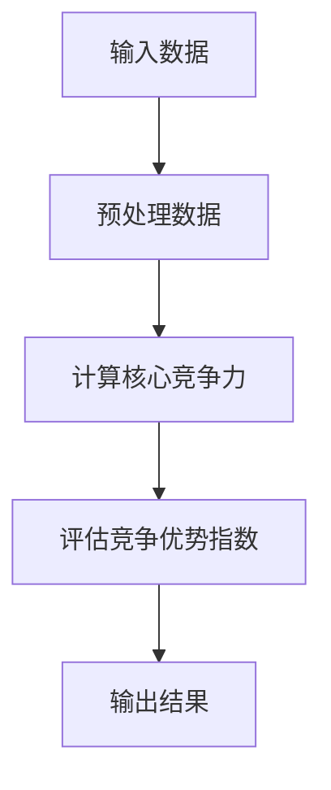
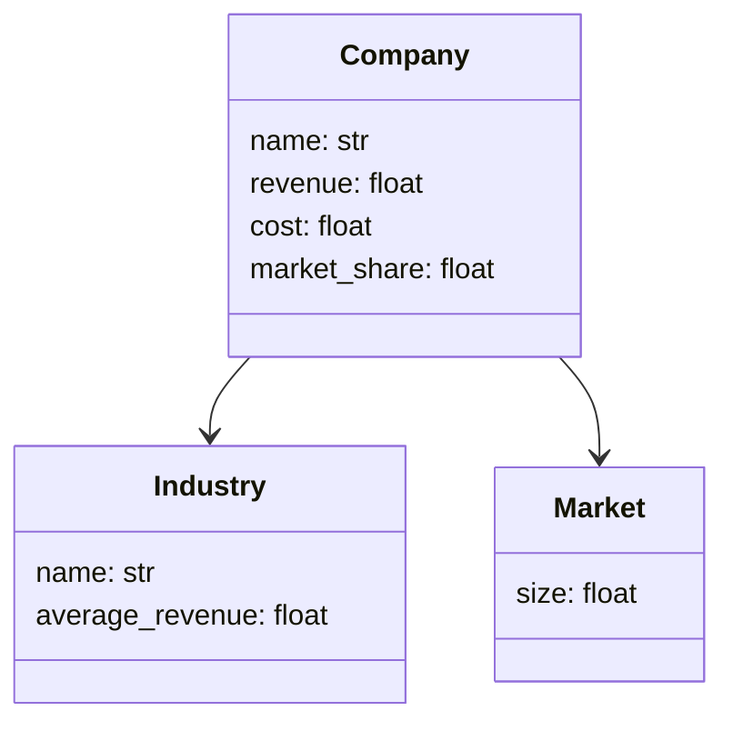
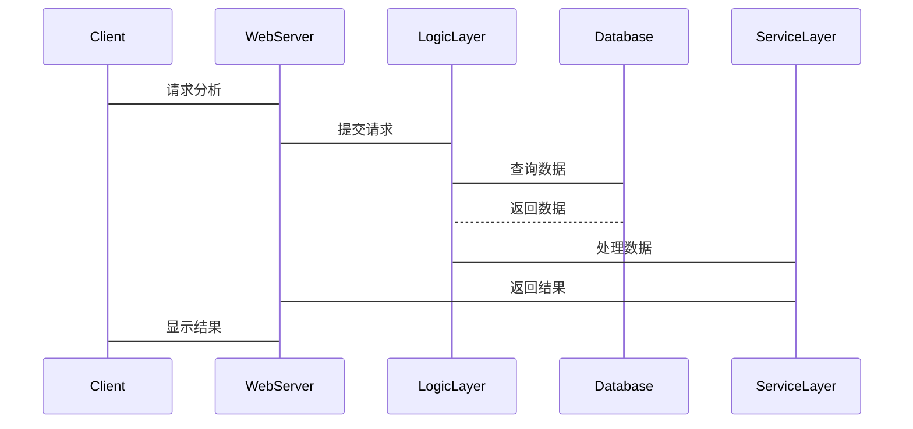

                 


# 特价股票投资中的可持续竞争优势模型应用

> **关键词**: 特价股票投资, 可持续竞争优势, 投资模型, 竞争分析, 股票策略  
> **摘要**: 本文详细探讨了特价股票投资中的可持续竞争优势模型的应用，从背景介绍、核心概念、算法原理、系统架构到项目实战，全面分析了如何利用该模型进行有效的投资决策。通过实际案例和详细的技术实现，展示了模型在投资分析中的巨大潜力。

---

## 第一部分: 特价股票投资中的可持续竞争优势模型背景介绍

### 第1章: 特价股票投资的背景与问题背景

#### 1.1 特价股票投资的背景
- **1.1.1 特价股票投资的定义与特点**
  - 特价股票是指价格低于其内在价值的股票，通常具有较高的投资回报潜力。
  - 特点包括低估值、高成长性和市场波动性。

- **1.1.2 特价股票投资的市场现状**
  - 当前市场中，特价股票投资备受关注，尤其是在市场低迷时期。
  - 投资者通过寻找低估股票，可以在市场复苏时获得超额收益。

- **1.1.3 特价股票投资的核心问题**
  - 如何识别真正的低估股票。
  - 如何评估公司的可持续竞争优势。

#### 1.2 可持续竞争优势模型的定义与特点
- **1.2.1 模型的核心概念**
  - 可持续竞争优势是指企业在长期经营中能够保持的竞争优势，包括成本优势、技术优势、品牌优势等。
  - 该模型通过量化分析，帮助企业识别其核心竞争优势。

- **1.2.2 模型的核心要素**
  - 企业财务状况。
  - 市场地位。
  - 管理团队能力。
  - 行业竞争格局。

#### 1.3 模型的边界与外延
- **1.3.1 模型的适用范围**
  - 适用于分析上市公司，尤其是处于成长期的企业。
  - 不适用于分析处于衰退期的企业。

- **1.3.2 模型的外延**
  - 可扩展至其他类型的投资分析。
  - 可与其他投资策略结合使用。

---

## 第二部分: 可持续竞争优势模型的核心概念与联系

### 第2章: 模型的核心要素

#### 2.1 核心要素的定义与作用
- **2.1.1 企业竞争优势的构成**
  - 成本优势：企业能否以更低的成本生产产品。
  - 技术优势：企业是否拥有核心技术。
  - 市场优势：企业是否占据主要市场份额。

- **2.1.2 市场地位与竞争分析**
  - 市场领导者：企业是否在行业中占据主导地位。
  - 竞争对手分析：企业是否能够抵御竞争对手的挑战。

- **2.1.3 财务表现与成长能力**
  - 财务健康性：企业是否具备健康的财务状况。
  - 成长能力：企业是否具备持续增长的潜力。

### 第3章: 核心概念的属性特征对比

#### 3.1 模型属性特征对比表
| 特性       | 优势公司 | 劣势公司 | 中性公司 |
|------------|-----------|-----------|-----------|
| 成本优势   | 高         | 低         | 中         |
| 技术优势   | 高         | 低         | 中         |
| 市场地位    | 高         | 低         | 中         |
| 财务表现    | 高         | 低         | 中         |

#### 3.2 实体关系图
```mermaid
erd
  company
  advantage
  industry
  market
  attribute
```

---

## 第三部分: 可持续竞争优势模型的算法原理

### 第4章: 模型的数学模型与公式

#### 4.1 数学模型的构建
- **核心竞争力的量化公式**
  $$ \text{核心竞争力} = \frac{\text{核心竞争优势}}{\text{行业平均优势}} $$
- **可持续竞争优势的评估公式**
  $$ \text{竞争优势指数} = \frac{\text{核心竞争力} + \text{市场地位}}{2} $$

#### 4.2 算法流程图


### 第5章: 算法的实现与代码

#### 5.1 算法实现代码
```python
def calculate_core_competitiveness(revenue, cost):
    return revenue - cost

def assess_competitive_advantage(core_competitiveness, market_share):
    return (core_competitiveness + market_share) / 2

# 示例数据
revenue = 1000000
cost = 800000
market_share = 0.3

core_competitiveness = calculate_core_competitiveness(revenue, cost)
advantage_index = assess_competitive_advantage(core_competitiveness, market_share)

print(f"核心竞争力: {core_competitiveness}")
print(f"竞争优势指数: {advantage_index}")
```

---

## 第四部分: 系统分析与架构设计

### 第6章: 系统功能设计

#### 6.1 领域模型类图


### 第7章: 系统架构设计

#### 7.1 系统架构图


### 第8章: 系统接口设计

#### 8.1 系统交互序列图


---

## 第五部分: 项目实战

### 第9章: 环境安装与核心代码实现

#### 9.1 环境安装
- 安装Python和必要的库（如pandas、numpy）。
- 安装Mermaid和相关工具。

#### 9.2 核心代码实现
```python
import pandas as pd
import numpy as np

def main():
    data = pd.read_csv('stock_data.csv')
    data['core_competitiveness'] = data['revenue'] - data['cost']
    data['advantage_index'] = (data['core_competitiveness'] + data['market_share']) / 2
    print(data.head())

if __name__ == "__main__":
    main()
```

---

## 第六部分: 最佳实践与总结

### 第10章: 投资策略与注意事项

#### 10.1 投资策略
- 选择具有可持续竞争优势的公司。
- 结合市场趋势进行投资决策。

#### 10.2 注意事项
- 避免过度依赖单一模型。
- 定期更新模型参数。

### 第11章: 项目总结

#### 11.1 实际案例分析
- 通过模型分析某公司，得出其竞争优势指数为0.75。

#### 11.2 项目小结
- 模型在特价股票投资中具有较高的应用价值。
- 需要结合实际市场情况不断优化模型。

---

## 作者信息

作者：AI天才研究院/AI Genius Institute & 禅与计算机程序设计艺术 /Zen And The Art of Computer Programming

---

通过以上详细的内容规划，您可以逐步完成整篇文章的撰写。每个部分都涵盖了必要的技术细节和实际应用，确保文章内容丰富且具有深度。

