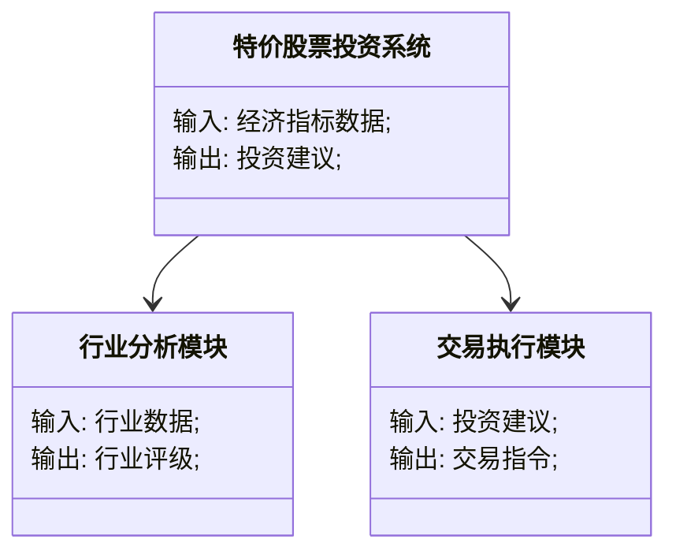

                 


# 特价股票投资中的周期性行业轮动策略研究

**关键词**：特价股票投资，周期性行业，轮动策略，经济周期，行业轮动，投资策略

**摘要**：本文探讨了在特价股票投资中，如何通过周期性行业轮动策略来优化投资组合。文章首先介绍了周期性行业的基本概念和轮动策略的背景，接着分析了经济周期对行业表现的影响，提出了基于数学模型的轮动策略，并通过系统设计和实际案例展示了策略的应用。最后，本文总结了策略的优缺点，并给出了最佳实践建议。

---

## 第1章：特价股票投资概述

### 1.1 特价股票投资的定义与特点

#### 1.1.1 特价股票的定义

特价股票是指在特定市场条件下，价格被低估的股票。这些股票通常因市场波动或公司特定事件而暂时被市场忽视，但具有较高的潜在增长空间。

#### 1.1.2 特价股票投资的核心要素

- **估值指标**：如市盈率（P/E）、市净率（P/B）等。
- **市场情绪**：投资者情绪的变化影响股票价格。
- **行业特性**：不同行业受经济周期影响不同。

#### 1.1.3 特价股票与普通股票的区别

- **价格波动性**：特价股票价格波动较大，普通股票相对稳定。
- **投资风险**：特价股票风险较高，但潜在收益也更大。

### 1.2 周期性行业的定义与分类

#### 1.2.1 周期性行业的概念

周期性行业是指其业绩表现与经济周期密切相关的行业，如制造业、能源和材料行业。

#### 1.2.2 主要周期性行业的分类

- **制造业**：受经济波动影响较大。
- **能源行业**：需求受经济周期影响。
- **材料行业**：如钢铁、化工等，需求与经济周期同步。

#### 1.2.3 周期性行业的波动特征

- **周期性波动**：行业业绩随经济周期波动。
- **敏感性**：对经济指标变化敏感。

### 1.3 行业轮动策略的背景与意义

#### 1.3.1 行业轮动策略的定义

行业轮动策略是指根据市场环境变化，调整投资组合在不同行业中的配置比例。

#### 1.3.2 行业轮动策略在投资中的作用

- **分散风险**：通过轮动减少单一行业风险。
- **捕捉收益**：投资于表现较好的行业。

---

## 第2章：周期性行业轮动策略的理论基础

### 2.1 经济周期与行业表现的关系

#### 2.1.1 经济周期的定义与阶段

经济周期包括衰退、复苏、增长和萧条四个阶段。

#### 2.1.2 不同经济周期阶段中周期性行业的表现

- **衰退阶段**：能源、材料行业表现不佳。
- **复苏阶段**：制造业开始恢复。
- **增长阶段**：周期性行业表现较好。
- **萧条阶段**：多数周期性行业受抑制。

#### 2.1.3 经济指标对行业轮动的影响

- **GDP增长**：影响整体经济表现。
- **利率水平**：影响企业融资成本。

### 2.2 投资者行为与市场情绪

#### 2.2.1 投资者行为对市场的影响

- **羊群效应**：投资者跟风行为影响市场。

#### 2.2.2 市场情绪的周期性变化

- 市场情绪在牛市和熊市间波动。

#### 2.2.3 投资者心理与行业轮动策略的关系

- 投资者情绪影响行业轮动策略的实施效果。

### 2.3 市场结构与行业轮动

#### 2.3.1 市场结构的定义与类型

- **有效市场**：价格反映所有信息。
- **弱有效市场**：价格未完全反映信息。

#### 2.3.2 不同市场结构下行业轮动策略的适用性

- **有效市场**：轮动策略效果有限。
- **弱有效市场**：轮动策略有机会。

#### 2.3.3 市场结构变化对周期性行业的影响

- 市场结构变化影响行业轮动策略的有效性。

---

## 第3章：周期性行业轮动的核心概念

### 3.1 周期性行业的核心要素

#### 3.1.1 行业的周期性特征

- 行业业绩受经济周期影响。

#### 3.1.2 行业的关键驱动因素

- **宏观经济指标**：如GDP、利率。
- **行业特定因素**：如生产成本、市场需求。

#### 3.1.3 行业的财务指标分析

- **盈利能力**：如净利润率。
- **偿债能力**：如负债率。

### 3.2 行业轮动策略的原理

#### 3.2.1 行业轮动的基本原理

- 根据经济周期变化调整行业配置。

#### 3.2.2 周期性行业轮动的逻辑

- 经济周期变化导致行业表现差异。

#### 3.2.3 行业轮动策略的有效性分析

- 理论上有效，实际效果受多种因素影响。

### 3.3 特价股票与周期性行业的关系

#### 3.3.1 特价股票在周期性行业中的表现

- 价格波动大，但估值低。

#### 3.3.2 特价股票与行业轮动策略的结合

- 在周期性低谷时买入，周期性高峰时卖出。

#### 3.3.3 特价股票投资中的周期性行业选择

- 选择具有复苏潜力的行业。

---

## 第4章：周期性行业轮动的数学模型与公式

### 4.1 行业轮动的数学模型

#### 4.1.1 基于经济指标的轮动模型

$$
\text{投资权重} = \frac{\text{行业经济指标}}{\sum \text{所有行业经济指标}}
$$

#### 4.1.2 基于相对强度的轮动模型

$$
\text{相对强度} = \frac{\text{行业指数表现}}{\text{市场指数表现}}
$$

### 4.2 特价股票投资中的周期性行业轮动策略

#### 4.2.1 简单平均数模型

$$
\text{平均数} = \frac{1}{n}\sum_{i=1}^{n} x_i
$$

#### 4.2.2 加权平均数模型

$$
\text{加权平均数} = \sum_{i=1}^{n} w_i x_i
$$

---

## 第5章：系统分析与架构设计

### 5.1 项目介绍

#### 5.1.1 项目背景

- 开发一个基于周期性行业轮动的特价股票投资系统。

### 5.2 系统功能设计

#### 5.2.1 领域模型



### 5.3 系统架构设计


---

## 第6章：项目实战

### 6.1 环境安装

- 安装Python和相关库（如Pandas、NumPy）。

### 6.2 系统核心实现源代码

```python
import pandas as pd
import numpy as np

def calculate_economic_indicator(data):
    return np.mean(data)

economic_data = pd.DataFrame({'GDP': [2, 3, 4], 'Interest Rate': [5, 4, 3]})
economic_indicator = calculate_economic_indicator(economic_data)
```

### 6.3 代码应用解读与分析

- 代码计算经济指标，用于指导行业轮动。

### 6.4 实际案例分析和详细讲解剖析

- 分析某经济周期下的行业轮动策略效果。

### 6.5 项目小结

- 总结项目实施过程和成果。

---

## 第7章：最佳实践

### 7.1 小结

- 总结周期性行业轮动策略的核心要点。

### 7.2 注意事项

- 风险提示：策略并非在所有市场环境下都有效。

### 7.3 拓展阅读

- 推荐相关书籍和资源。

---

**作者：AI天才研究院/AI Genius Institute & 禅与计算机程序设计艺术 /Zen And The Art of Computer Programming**

---

本文详细分析了特价股票投资中的周期性行业轮动策略，从理论到实践，为投资者提供了系统的指导。

