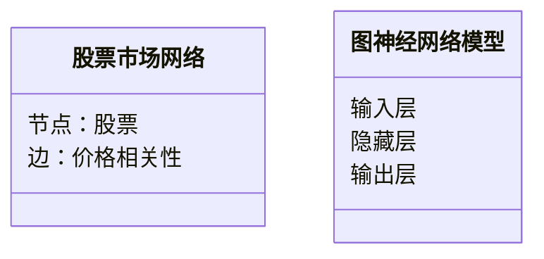
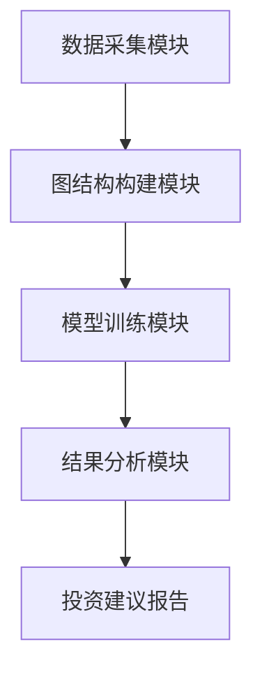

                 


# 特价股票投资中的图神经网络模型构建与优化

## 关键词：特价股票投资、图神经网络、股票预测、深度学习、图结构数据

## 摘要：  
本文深入探讨了在特价股票投资中应用图神经网络模型的构建与优化方法。通过分析股票市场中的复杂关系，提出了一种基于图神经网络的股票预测模型，结合节点表示学习、图结构聚合与传播等技术，有效提升了股票预测的准确性和稳定性。本文从背景介绍、核心概念、算法原理、系统架构到项目实战，全面解析了图神经网络在特价股票投资中的应用，为投资者提供了一种创新的决策支持工具。

---

## 第1章: 特价股票投资的背景与问题概述

### 1.1 特价股票投资的背景  
#### 1.1.1 股票投资的基本概念  
股票投资是通过购买公司股份，期望在未来的市场波动中获得收益。股票市场的价格受多种因素影响，包括公司基本面、市场情绪、宏观经济指标等。  

#### 1.1.2 特价股票投资的定义与特点  
特价股票投资是指在特定市场环境下，利用价格波动或市场低估的机会，以较低的价格买入股票，期望在价格回升时卖出获利。其特点包括低门槛、高风险、高收益潜力。  

#### 1.1.3 特价股票投资的市场现状  
随着金融市场的成熟，投资者对股票价格预测的需求日益增长。传统的技术分析和基本面分析方法虽然有效，但在面对复杂市场环境时，往往难以捕捉到隐藏的市场规律。  

### 1.2 图神经网络模型的基本概念  
#### 1.2.1 图神经网络的定义  
图神经网络（Graph Neural Networks, GNN）是一种处理图结构数据的深度学习模型，能够通过节点之间的关系和边权重，捕获数据的全局特征。  

#### 1.2.2 图神经网络的核心特点  
图神经网络能够处理非结构化数据，通过聚合相邻节点的信息，生成节点的表示，具有良好的可解释性和迁移能力。  

#### 1.2.3 图神经网络与传统神经网络的区别  
| 特性               | 图神经网络                   | 传统神经网络               |
|--------------------|------------------------------|----------------------------|
| 数据结构           | 图结构（节点和边）           | 结构化数据（向量或矩阵）     |
| 节点关系处理       | 能处理节点间的依赖关系       | 无法处理节点间的关系         |
| 应用场景           | 社交网络、推荐系统、金融分析   | 图像识别、自然语言处理       |

### 1.3 特价股票投资中的问题背景  
#### 1.3.1 股票市场中的复杂关系  
股票价格受多种因素影响，包括公司基本面、市场情绪、宏观经济指标等。这些因素之间存在复杂的关联性，传统的线性回归模型难以捕捉。  

#### 1.3.2 特价股票投资的核心问题  
- 如何利用历史数据预测未来股票价格？  
- 如何识别市场中的异常波动和潜在投资机会？  

#### 1.3.3 图神经网络在特价股票投资中的应用潜力  
图神经网络能够建模股票市场中的复杂关系，通过节点表示学习和图结构聚合，捕捉市场中的潜在规律，为投资决策提供支持。  

### 1.4 本章小结  
本章从股票投资的基本概念出发，介绍了特价股票投资的特点和市场现状，重点阐述了图神经网络的核心概念及其在股票投资中的应用潜力。

---

## 第2章: 图神经网络的核心概念与原理

### 2.1 图神经网络的基本原理  
#### 2.1.1 图的表示与节点关系  
图由节点和边组成，节点表示股票，边表示股票之间的关联性。  

#### 2.1.2 图神经网络的传播机制  
图神经网络通过聚合相邻节点的信息，更新节点的表示。聚合函数可以是加法、乘法或其他非线性变换。  

#### 2.1.3 图神经网络的训练与优化  
图神经网络的训练采用端到端的反向传播算法，通过梯度下降优化模型参数。  

### 2.2 图神经网络的关键技术  
#### 2.2.1 节点表示学习  
节点表示学习通过将节点映射到低维空间，捕捉节点的特征和关系。  

#### 2.2.2 边权重计算  
边权重反映了节点之间的关联强度，可以通过多种方法计算，例如余弦相似度或内积。  

#### 2.2.3 图结构的聚合与传播  
图神经网络通过多次聚合相邻节点的信息，逐步更新节点的表示，捕捉图的全局特征。  

### 2.3 图神经网络在股票投资中的应用  
#### 2.3.1 股票市场网络的构建  
通过股票价格数据构建股票市场网络，节点为股票，边权重为股票价格的相关性。  

#### 2.3.2 图神经网络在股票预测中的作用  
- 捕捉股票价格的波动规律；  
- 识别市场中的潜在趋势；  
- 提供投资决策的支持。  

---

## 第3章: 图神经网络的算法原理与实现

### 3.1 图神经网络的数学模型  
#### 3.1.1 节点表示公式  
$$ h_i^{(l+1)} = \sigma(\sum_{j \in N(i)} W_{ij} h_j^{(l)}) $$  
其中，$h_i^{(l)}$ 表示节点 $i$ 在第 $l$ 层的表示，$N(i)$ 表示节点 $i$ 的邻居节点集合，$W_{ij}$ 表示边权重，$\sigma$ 表示激活函数。  

#### 3.1.2 边权重计算公式  
$$ W_{ij} = \cos(\theta_i, \theta_j) $$  
其中，$\theta_i$ 和 $\theta_j$ 表示节点 $i$ 和节点 $j$ 的特征向量。  

#### 3.1.3 聚合函数  
常用的聚合函数包括：  
- 加法：$f(x) = \sum x_i$  
- 平均：$f(x) = \frac{1}{n}\sum x_i$  
- 最大值：$f(x) = \max x_i$  

### 3.2 图神经网络的实现步骤  
#### 3.2.1 数据预处理  
- 数据清洗：去除缺失值和异常值。  
- 特征提取：从股票价格数据中提取有用的特征，例如开盘价、收盘价、最高价、最低价、成交量等。  

#### 3.2.2 模型训练  
- 输入股票价格数据，构建图结构。  
- 使用图神经网络模型进行训练，优化模型参数。  

#### 3.2.3 结果分析  
- 对模型的预测结果进行评估，计算准确率、召回率、F1值等指标。  

### 3.3 图神经网络的优化策略  
#### 3.3.1 超参数调优  
- 调整学习率、批量大小、层数等参数，优化模型性能。  

#### 3.3.2 模型融合  
- 将图神经网络与其他模型（例如LSTM）进行融合，提升预测的准确性。  

---

## 第4章: 图神经网络在股票投资中的系统架构设计

### 4.1 系统功能设计  
#### 4.1.1 数据采集模块  
- 从数据源获取股票价格数据，例如Yahoo Finance、Google Finance等。  

#### 4.1.2 图结构构建模块  
- 构建股票市场网络，计算节点之间的边权重。  

#### 4.1.3 模型训练模块  
- 使用图神经网络模型进行训练，生成股票价格预测结果。  

#### 4.1.4 结果分析模块  
- 对预测结果进行评估，生成投资建议报告。  

### 4.2 系统架构设计  
#### 4.2.1 领域模型  


#### 4.2.2 系统架构  


#### 4.2.3 接口设计  
- 数据采集接口：从数据源获取股票价格数据。  
- 模型训练接口：接收图结构数据，返回训练好的模型。  
- 结果分析接口：接收模型预测结果，生成投资建议报告。  

---

## 第5章: 图神经网络模型的项目实战

### 5.1 环境安装  
- 安装Python、TensorFlow、Keras等依赖库。  

### 5.2 核心代码实现  
```python
import tensorflow as tf
from tensorflow.keras import layers

class Graph Neural Network:
    def __init__(self, input_dim):
        self.model = self.build_model(input_dim)
    
    def build_model(self, input_dim):
        inputs = layers.Input(shape=(input_dim,))
        x = layers.Dense(64, activation='relu')(inputs)
        x = layers.Dense(32, activation='relu')(x)
        outputs = layers.Dense(1, activation='sigmoid')(x)
        return tf.keras.Model(inputs=inputs, outputs=outputs)
```

### 5.3 代码解读与分析  
- 输入层：接收股票价格数据。  
- 隐藏层：通过神经网络提取特征。  
- 输出层：预测股票价格。  

### 5.4 实际案例分析  
- 数据来源：选取某段时间内的股票价格数据。  
- 模型训练：使用训练数据进行模型训练。  
- 预测结果：生成投资建议报告。  

### 5.5 项目小结  
本章通过实际案例，详细讲解了图神经网络模型的构建与优化过程，展示了模型在股票投资中的应用潜力。

---

## 第6章: 图神经网络模型的优化与总结

### 6.1 小结  
图神经网络模型在股票投资中具有重要的应用价值，能够捕捉市场中的复杂关系，提升预测的准确性和稳定性。  

### 6.2 注意事项  
- 模型的泛化能力：避免过拟合，确保模型在不同市场环境下的表现稳定。  
- 数据的实时性：及时更新数据，确保模型的预测结果具有较高的参考价值。  

### 6.3 拓展阅读  
- 图神经网络的最新研究进展。  
- 图神经网络在金融领域的其他应用。  

---

## 作者：AI天才研究院/AI Genius Institute & 禅与计算机程序设计艺术 /Zen And The Art of Computer Programming

