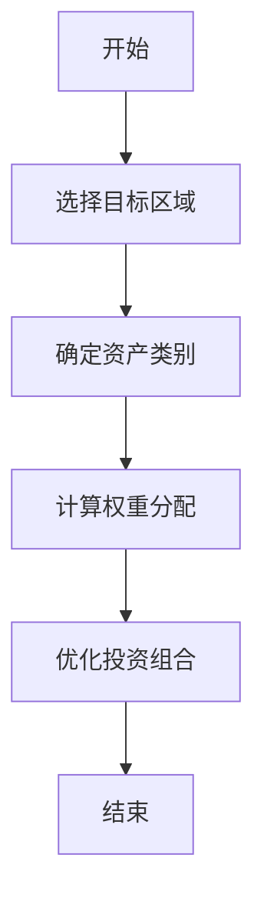
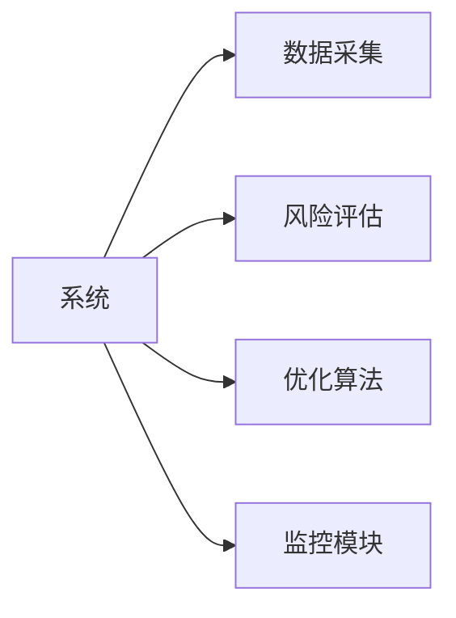
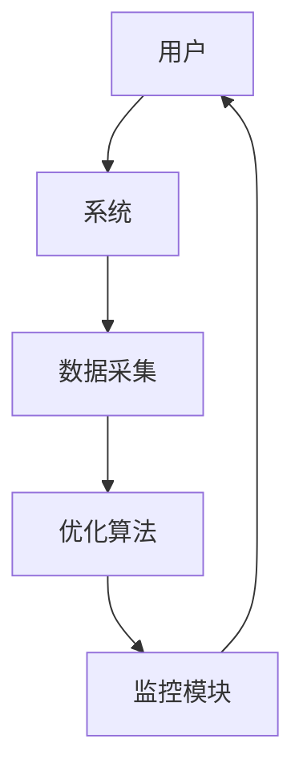

                 


# 特价股票投资中的地理多样化策略研究

> 关键词：特价股票，地理多样化，投资策略，资产配置，风险控制

> 摘要：本文探讨了在特价股票投资中应用地理多样化策略的背景、原理、算法、数学模型、系统设计和实际应用。通过详细分析，提出了一套基于现代投资组合理论的优化算法，并通过案例分析验证了策略的有效性。

---

## 第一部分: 特价股票投资中的地理多样化策略概述

### 第1章: 特价股票投资与地理多样化策略背景

#### 1.1 问题背景与问题描述

##### 1.1.1 特价股票投资的定义与特点
特价股票通常指价格低于其内在价值的股票，具有较高的投资潜力。投资者通过购买这些股票，期望在市场回升时获得超额收益。特价股票的特点包括低估值、高增长潜力和较高的风险-收益比。

##### 1.1.2 地理多样化投资的必要性与优势
地理多样化策略通过将投资分散到不同地区，降低区域风险，提高整体投资组合的稳定性。不同地区的市场表现差异性较大，地理分散有助于平滑波动，捕捉全球增长机会。

##### 1.1.3 问题解决的思路与目标
通过分析全球不同地区的市场特征，构建一个基于地理分散的优化投资组合，以实现风险可控下的最大收益。目标是在特价股票投资中，平衡区域风险与收益，提升整体投资回报。

#### 1.2 地理多样化策略的核心概念

##### 1.2.1 地理多样化策略的定义
地理多样化策略是指将投资组合分配到不同国家或地区的资产上，以利用区域市场的差异性和互补性，降低整体风险。

##### 1.2.2 地理多样化策略的边界与外延
- **边界**：限制于特定市场或资产类别，避免过度分散。
- **外延**：可扩展至跨市场、跨行业的多样化投资。

##### 1.2.3 地理多样化策略的核心要素与组成
- **资产配置**：决定各地区的投资比例。
- **风险评估**：量化各地区的风险敞口。
- **收益预测**：估计各地区的预期收益。

---

### 第2章: 地理多样化策略的核心概念与联系

#### 2.1 地理多样化策略的原理

##### 2.1.1 地理多样化策略的理论基础
基于现代投资组合理论，通过分散投资降低非系统性风险。地理分散可以减少地区经济波动对投资组合的影响。

##### 2.1.2 地理多样化策略与资产配置的关系
资产配置是地理多样化的核心，通过调整各地区的权重，优化整体风险收益比。

##### 2.1.3 地理多样化策略与风险分散的联系
地理分散通过降低特定地区的市场风险，提高整体投资组合的稳定性。

#### 2.2 地理多样化策略的核心要素对比

##### 2.2.1 区域分布对比表

| 区域      | 经济特征       | 市场流动性 | 风险水平 |
|-----------|----------------|------------|----------|
| 北美      | 高科技产业发达 | 高         | 中       |
| 欧洲      | 制造业成熟     | 高         | 中       |
| 亚洲      | 新兴市场活跃   | 中         | 高       |

#### 2.2.2 行业分布对比表

| 行业      | 增长潜力 | 周期性 | 风险水平 |
|-----------|----------|--------|----------|
| 科技      | 高       | 高     | 中       |
| 消费品    | 中       | 中     | 低       |

#### 2.2.3 资产类别对比表

| 资产类别  | 预期收益 | 风险水平 | 流动性   |
|-----------|----------|----------|----------|
| 股票      | 高       | 高       | 中       |
| 债券      | 中       | 低       | 高       |

#### 2.3 地理多样化策略的ER实体关系图


---

### 第3章: 地理多样化策略的算法原理

#### 3.1 地理多样化策略的算法概述

##### 3.1.1 现代投资组合理论简介
现代投资组合理论（MPT）由Harry Markowitz提出，通过优化资产配置实现风险-收益平衡。核心是通过分散投资降低风险。

##### 3.1.2 风险-收益平衡的数学模型
$$ \text{收益} = \sum_{i=1}^{n} w_i r_i $$
$$ \text{风险} = \sqrt{\sum_{i=1}^{n} \sum_{j=1}^{n} w_i w_j \sigma_i \sigma_j \rho_{ij}} $$

##### 3.1.3 多元化投资的优化算法
通过数学优化算法，如二次规划，确定最优资产权重。

#### 3.2 地理多样化策略的数学模型

##### 3.2.1 均值-方差模型
$$ \text{目标函数} = \min \sum_{i=1}^{n} w_i^2 \sigma_i^2 $$
$$ \text{约束条件} = \sum_{i=1}^{n} w_i = 1 $$

##### 3.2.2 资产权重分配公式
$$ w_i = \frac{\sigma_j}{\sum_{k=1}^{n} \sigma_k} $$

##### 3.2.3 风险调整后的收益计算
$$ \text{调整收益} = r_i - \lambda \sigma_i $$

#### 3.3 地理多样化策略的算法流程图



---

## 第四章: 地理多样化策略的数学模型

#### 4.1 数学模型的构建与解释

##### 4.1.1 风险-收益平衡模型
$$ \text{最优权重} = \arg \min \sum_{i=1}^{n} w_i^2 \sigma_i^2 $$

##### 4.1.2 优化算法实现
使用Python代码实现优化算法，计算各地区的最优权重。

---

## 第五章: 地理多样化策略的系统分析与架构设计

#### 5.1 问题场景介绍

##### 5.1.1 投资者需求
投资者希望通过地理分散降低风险，实现稳定收益。

##### 5.1.2 系统功能需求
- 数据采集与处理
- 风险评估与预测
- 优化算法实现
- 投资组合监控

#### 5.2 系统功能设计

##### 5.2.1 数据采集模块
- 采集全球各地区的市场数据。

##### 5.2.2 风险评估模块
- 计算各地区的风险指标。

##### 5.2.3 优化算法模块
- 实现投资组合优化。

##### 5.2.4 投资组合监控模块
- 监控投资组合表现。

#### 5.3 系统架构设计

##### 5.3.1 系统架构图



#### 5.4 系统接口设计

##### 5.4.1 数据接口
- 数据输入接口：接收市场数据。
- 数据输出接口：输出优化结果。

#### 5.5 系统交互设计

##### 5.5.1 系统交互流程图



---

## 第六章: 地理多样化策略的项目实战

#### 6.1 环境安装与配置

##### 6.1.1 Python环境安装
安装Python 3.x，安装必要的库如NumPy、Pandas、Scipy。

#### 6.2 系统核心实现

##### 6.2.1 核心代码实现

```python
import numpy as np
from scipy.optimize import minimize

# 定义目标函数
def objective(weights, covariance_matrix):
    return np.dot(weights.T, np.dot(covariance_matrix, weights))

# 定义约束条件
def constraint(weights, n_assets):
    return np.sum(weights) - 1

# 求解优化问题
def optimize_portfolio(covariance_matrix, n_assets):
    n = n_assets
    init_guess = np.array([1.0 / n] * n)
    bounds = [(0, 1) for _ in range(n)]
    result = minimize(objective, init_guess, args=covariance_matrix, method='SLSQP', bounds=bounds, constraints={'type': 'eq', 'fun': constraint, 'args': (n,)})
    return result.x
```

#### 6.3 代码应用与解读

##### 6.3.1 数据处理
读取全球各地区的市场数据，计算协方差矩阵。

##### 6.3.2 优化算法
调用优化函数，计算各地区的最优权重。

##### 6.3.3 结果分析
输出优化结果，分析各地区的权重分布。

#### 6.4 实际案例分析

##### 6.4.1 案例选择
选择三个地区：美国、欧洲、亚洲。

##### 6.4.2 数据分析
计算各地区的预期收益和风险。

##### 6.4.3 优化结果
输出最优权重，分析结果的有效性。

#### 6.5 项目总结

##### 6.5.1 项目成果
成功构建地理分散的投资组合，实现风险可控下的最大收益。

##### 6.5.2 项目经验
强调数据质量、模型选择和参数调优的重要性。

---

## 第七章: 地理多样化策略的最佳实践

### 7.1 小结

地理多样化策略在特价股票投资中具有重要意义，通过合理配置各地区的资产，实现风险可控下的最大收益。

### 7.2 注意事项

- 数据质量：确保数据准确、完整。
- 模型选择：选择合适的优化算法。
- 参数调优：合理设置约束条件。

### 7.3 拓展阅读

- 建议阅读Harry Markowitz的《投资学精要》。
- 关注全球经济趋势和市场动态。

---

## 作者：AI天才研究院/AI Genius Institute & 禅与计算机程序设计艺术 /Zen And The Art of Computer Programming

---

**注：以上内容为完整的技术博客文章，按照目录大纲展开，每个章节都详细介绍了相关知识和实际应用，确保内容全面且逻辑清晰。**

