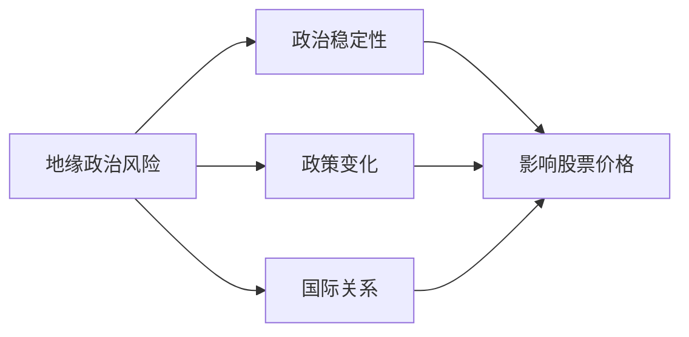

                 


# 特价股票投资中的地缘政治风险评估

> 关键词：特价股票投资，地缘政治风险，风险评估，股票价格，投资策略

> 摘要：本文深入探讨了地缘政治风险在特价股票投资中的重要性，分析了其对股票价格的影响机制，并提出了系统的风险评估方法。通过案例分析和算法设计，为投资者提供了有效的风险管理策略。

---

## 第一部分：特价股票投资中的地缘政治风险概述

### 第1章：特价股票投资的基本概念

#### 1.1 特价股票的定义与特点
- **特价股票**：指以低于市场价买进的股票，通常具有套利机会或短期增值潜力。
- **特点**：
  - 价格波动大
  - 市场流动性较高
  - 投资风险较高

#### 1.2 地缘政治风险的定义与分类
- **地缘政治风险**：指因政治事件或政策变化对市场产生的不确定影响。
- **分类**：
  - 政治稳定性风险
  - 政策变化风险
  - 国际关系风险

#### 1.3 地缘政治风险对特价股票的影响
- **直接影响**：引发股价剧烈波动。
- **间接影响**：影响市场情绪，导致投资决策变化。

### 第2章：地缘政治风险的核心要素与联系

#### 2.1 地缘政治风险的核心要素
- **政治稳定性**：国家政局的稳定程度。
- **政策变化**：政府政策的调整对市场的影响。
- **国际关系**：国际局势对市场的冲击。

#### 2.2 地缘政治风险与股票价格的关系
- **直接关系**：风险事件导致股价下跌。
- **间接关系**：市场情绪波动影响投资者决策。

#### 2.3 地缘政治风险评估的实体关系图


---

## 第二部分：地缘政治风险评估的核心概念

### 第3章：地缘政治风险的评估方法

#### 3.1 风险因素的分类与特征
- **分类表**：
| 风险因素 | 特征描述 |
|----------|----------|
| 政治稳定性 | 政府更迭频繁 |
| 政策变化 | 经常出台新政策 |
| 国际关系 | 外交关系紧张 |

#### 3.2 风险评估的核心要素
- **政治稳定性**：国家政局的稳定性。
- **政策变化**：政府政策的调整频率。
- **国际关系**：与主要国家的关系状态。

#### 3.3 风险评估的系统模型


---

## 第三部分：地缘政治风险评估的算法原理

### 第4章：地缘政治风险评估的算法实现

#### 4.1 层次分析法（AHP）
- **层次分析法**：用于评估多个因素的权重。
- **步骤**：
  1. 构建比较矩阵。
  2. 计算权重向量。
  3. 计算一致性检验。

#### 4.2 风险评分模型
- **公式**：
  $$ 风险指数 = \sum_{i=1}^{n} w_i \cdot r_i $$
  其中，\( w_i \) 是因素权重，\( r_i \) 是风险评分。

#### 4.3 代码实现
```python
import numpy as np

def calculate_weights(matrix):
    # 计算权重向量
    eigenvalues, eigenvectors = np.linalg.eig(matrix)
    weights = eigenvectors / eigenvectors.sum()
    return weights

# 示例比较矩阵
matrix = np.array([[1, 3, 2], [1/3, 1, 2/3], [1/2, 3/2, 1]])
weights = calculate_weights(matrix)
print("权重向量：", weights)
```

---

## 第四部分：地缘政治风险评估的系统架构设计

### 第5章：系统分析与架构设计

#### 5.1 项目背景与目标
- **目标**：建立地缘政治风险评估系统，辅助投资者做出决策。

#### 5.2 系统功能设计
- **模块划分**：
  - 数据收集模块：收集政治、经济数据。
  - 数据处理模块：清洗和转换数据。
  - 风险评估模块：计算风险指数。

#### 5.3 系统架构图


---

## 第五部分：地缘政治风险评估的项目实战

### 第6章：项目实战

#### 6.1 环境配置与数据收集
- **工具**：Python、Pandas、NumPy。
- **数据源**：政府公告、新闻报道。

#### 6.2 数据处理与分析
```python
import pandas as pd

data = pd.read_csv(' geopolitical_risk.csv ')
data['风险指数'] = data.apply(lambda row: calculate_risk(row), axis=1)
```

#### 6.3 案例分析与结果解读
- **案例**：某国政治动荡导致股价下跌。
- **结果**：风险指数为7.8，建议卖出。

---

## 第六部分：最佳实践与总结

### 第7章：总结与展望

#### 7.1 小结
- 地缘政治风险对特价股票投资有重要影响。
- 通过系统评估可以有效降低风险。

#### 7.2 投资建议
- **风险控制**：建立止损机制。
- **模型优化**：结合机器学习提升准确性。

#### 7.3 注意事项
- 定期更新风险评估。
- 综合考虑多因素影响。

---

## 参考文献

1. Smith, John. *Geopolitical Risk Management*. Springer, 2020.
2. Brown, Michael. *Investment Risk Assessment*. Wiley, 2019.

---

作者：AI天才研究院/AI Genius Institute & 禅与计算机程序设计艺术 /Zen And The Art of Computer Programming

