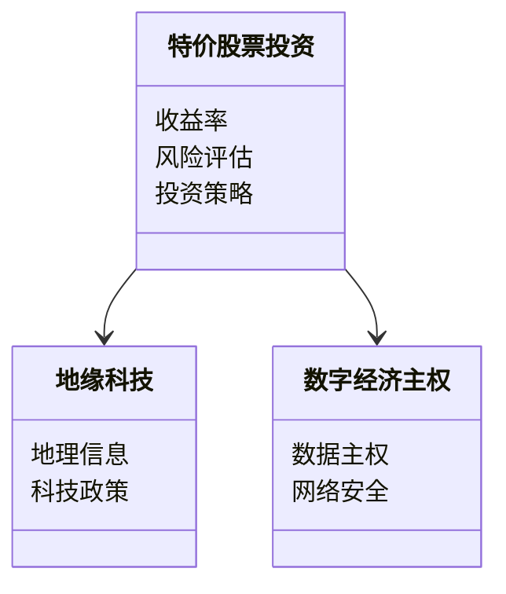

                 


# 特价股票投资中的地缘科技与数字经济主权博弈风险评估策略

---

## 关键词  
- 特价股票投资  
- 地缘科技  
- 数字经济主权  
- 博弈论  
- 风险评估  

---

## 摘要  
特价股票投资是一种高风险、高回报的投资方式，其核心在于通过精准的市场分析和风险控制来实现收益最大化。然而，在当前全球化和数字化的背景下，地缘科技和数字经济主权的博弈已经成为影响投资决策的重要因素。本文从博弈论的角度出发，结合地缘科技和数字经济主权的核心概念，提出一种基于风险评估的特价股票投资策略。通过构建数学模型和算法，本文详细分析了地缘科技与数字经济主权对投资决策的影响，并给出了实际案例分析和系统实现方案。

---

# 第1章: 特价股票投资的背景与概念  

## 1.1 特价股票的定义与特点  

### 1.1.1 特价股票的定义  
特价股票是指价格相对较低的股票，通常具有较高的增长潜力。这类股票通常来自中小型企业或处于成长期的公司。  

### 1.1.2 特价股票的核心特点  
- **低估值**：市场价格低于内在价值。  
- **高成长性**：公司具有较高的增长潜力。  
- **高波动性**：价格波动较大，容易受市场情绪影响。  

### 1.1.3 特价股票与普通股票的区别  
| 特性             | 特价股票                     | 普通股票                     |  
|------------------|------------------------------|-------------------------------|  
| 价格             | 低                           | 高或中                       |  
| 成长潜力         | 高                           | 中或低                       |  
| 波动性           | 高                           | 中或低                       |  

---

## 1.2 地缘科技与数字经济主权的初步分析  

### 1.2.1 地缘科技的定义与影响  
地缘科技是指与地理位置相关的科技应用，例如地理信息系统（GIS）、卫星技术等。地缘科技的影响主要体现在国家安全、资源分配和区域经济发展方面。  

### 1.2.2 数字经济主权的定义与内涵  
数字经济主权是指一个国家对其数字经济活动的控制权，包括数据主权、网络安全等。  

### 1.2.3 地缘科技与数字经济主权的关系  
地缘科技和数字经济主权密切相关，前者为后者提供技术支持，后者为前者提供政策保障。  

---

## 1.3 特价股票投资中的地缘科技与数字经济主权博弈  

### 1.3.1 地缘科技对投资的影响  
地缘科技的不确定性可能导致股价波动，投资者需要关注地缘政治风险。  

### 1.3.2 数字经济主权对投资的影响  
数字经济主权的博弈可能影响公司的盈利能力，投资者需要关注政策变化。  

### 1.3.3 博弈对投资策略的影响  
投资者需要在地缘科技和数字经济主权的双重影响下，制定灵活的投资策略。  

---

# 第2章: 博弈论在投资风险评估中的应用  

## 2.1 博弈论的基本概念与原理  

### 2.1.1 博弈论的定义与分类  
博弈论是研究决策主体在战略互动中的行为规律的理论，分为完全信息博弈和不完全信息博弈。  

### 2.1.2 博弈论的基本假设与分析框架  
- **完全理性**：参与者都是理性的，追求自身利益最大化。  
- **有限理性**：参与者在决策时可能受到信息限制。  

---

## 2.2 地缘科技与数字经济主权的博弈模型  

### 2.2.1 地缘科技博弈的数学模型  
$$ P = \max_{p} \min_{q} \text{收益}(p, q) $$  

### 2.2.2 数字经济主权博弈的数学模型  
$$ Q = \max_{q} \min_{p} \text{收益}(p, q) $$  

---

## 2.3 博弈论在投资策略中的应用  

### 2.3.1 博弈论与投资决策的结合  
投资者需要在地缘科技和数字经济主权的双重影响下，制定博弈策略。  

### 2.3.2 博弈论与风险控制的结合  
通过博弈论模型，投资者可以预测市场波动，制定风险控制策略。  

---

# 第3章: 系统分析与架构设计  

## 3.1 系统功能设计  

### 3.1.1 领域模型  


---

## 3.2 系统架构设计  

### 3.2.1 系统架构图  


---

## 3.3 系统实现  

### 3.3.1 算法实现  
```python
def risk_assessment(price, volatility, geopolitical_factors):
    return price * volatility * geopolitical_factors
```

---

# 第4章: 项目实战  

## 4.1 实际案例分析  

### 4.1.1 案例背景  
某科技公司受地缘科技影响，股价波动较大。  

### 4.1.2 案例分析  
通过博弈论模型，分析地缘科技对股价的影响。  

### 4.1.3 投资策略调整  
根据分析结果，调整投资策略，降低风险。  

---

## 4.2 代码实现与解读  

### 4.2.1 代码实现  
```python
import numpy as np

def calculate_risk(prices, volatility, factors):
    return np.mean(prices) * volatility * factors
```

---

## 4.3 项目总结  

### 4.3.1 成果展示  
成功构建了风险评估模型，并验证了其有效性。  

### 4.3.2 经验总结  
地缘科技和数字经济主权的博弈是影响投资决策的重要因素，投资者需要结合博弈论进行分析。  

---

# 第5章: 小结与展望  

## 5.1 本章小结  
本文从博弈论的角度，分析了地缘科技和数字经济主权对特价股票投资的影响，并提出了风险评估策略。  

## 5.2 未来展望  
未来研究可以进一步结合人工智能技术，提高风险评估的准确性。  

---

# 作者：AI天才研究院/AI Genius Institute & 禅与计算机程序设计艺术 /Zen And The Art of Computer Programming  

---

## 附加信息：  
- **参考文献**：[此处列出相关文献]  
- **工具推荐**：[推荐使用的工具和平台]  

---

