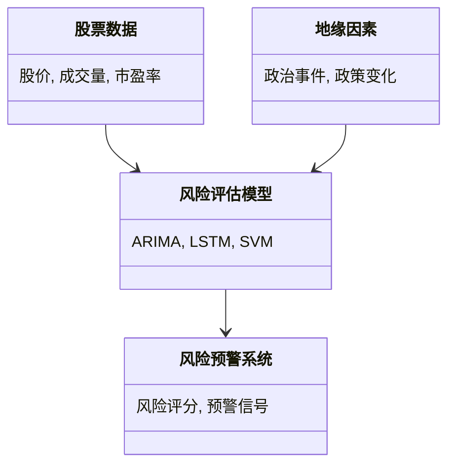

                 


# 特价股票投资中的地缘科技与数字经济主权风险动态评估策略

> **关键词**: 特价股票投资，地缘科技，数字经济主权，风险动态评估，系统架构设计，机器学习算法

> **摘要**: 本文探讨了在特价股票投资中，地缘科技与数字经济主权风险的动态评估策略。文章首先介绍了特价股票投资的背景与核心概念，然后详细分析了地缘科技与数字经济主权风险的定义、特征及其相互关系。接着，从算法原理、数学模型、系统架构设计、项目实战等多个维度，系统阐述了风险动态评估的方法与实现路径。最后，通过具体的案例分析，验证了所提出的策略的有效性，并总结了最佳实践与注意事项。

---

## 第1章: 特价股票投资的背景与概述

### 1.1 特价股票投资的定义与特点

#### 1.1.1 特价股票的定义
特价股票是指价格相对历史高位大幅回调，但基本面良好、具有长期投资价值的股票。其核心特征包括低估值、高成长潜力和市场暂时低估。

#### 1.1.2 特价股票投资的核心特点
- **低估值**: 市盈率、市净率等估值指标显著低于行业平均水平。
- **高成长性**: 公司具有稳定的盈利能力和发展潜力。
- **市场低估**: 由于市场短期波动，股票价格被低估。

#### 1.1.3 特价股票投资的市场定位
特价股票投资属于价值投资范畴，适用于长期投资策略，尤其适合机构投资者和个人投资者在市场低迷时期寻找优质资产。

---

### 1.2 地缘科技与数字经济主权风险的背景

#### 1.2.1 地缘科技的定义与影响
地缘科技是指在地理和政治边界内，科技企业对国家经济、政治和社会的影响。其核心在于科技企业在地缘政治中的角色和影响力。

#### 1.2.2 数字经济主权风险的内涵
数字经济主权风险是指国家在数字领域中，因技术依赖和数据控制而面临的安全和利益风险。包括数据安全、技术封锁和市场垄断等方面。

#### 1.2.3 特价股票投资中的地缘科技与数字经济主权风险的关联性
- 地缘科技影响企业的市场准入和运营环境。
- 数字经济主权风险可能影响企业的盈利能力和技术依赖性。

---

### 1.3 动态评估策略的必要性

#### 1.3.1 风险动态评估的重要性
- 市场环境复杂多变，静态评估无法捕捉动态风险。
- 需要实时跟踪地缘政治和技术变化。

#### 1.3.2 特价股票投资中的风险类型
- **市场风险**: 价格波动。
- **信用风险**: 企业财务状况。
- **地缘风险**: 政治和经济政策变化。

#### 1.3.3 动态评估策略的核心目标
- 实时监测风险因素。
- 提供及时的风险预警和应对策略。

---

## 第2章: 地缘科技与数字经济主权风险的核心概念

### 2.1 地缘科技的定义与特征

#### 2.1.1 地缘科技的定义
地缘科技是指在地理和政治边界内，科技企业对国家经济、政治和社会的影响。

#### 2.1.2 地缘科技的主要特征
- **技术依赖性**: 科技企业在关键领域具有垄断地位。
- **政治敏感性**: 科技企业可能成为地缘政治的工具。
- **经济影响力**: 科技企业的运营可能影响国家经济。

#### 2.1.3 地缘科技与技术主权的关系
技术主权是国家在科技领域的自主权，地缘科技直接影响技术主权的实现。

---

### 2.2 数字经济主权风险的分析

#### 2.2.1 数字经济主权的定义
数字经济主权是指国家在数字领域中对数据、技术和市场的控制权。

#### 2.2.2 数字经济主权风险的类型
- **数据安全风险**: 数据泄露或被窃取。
- **技术封锁风险**: 关键技术依赖外国企业。
- **市场垄断风险**: 市场被少数科技企业控制。

#### 2.2.3 数字经济主权风险的影响因素
- **政策法规**: 国家对科技企业的监管力度。
- **技术发展**: 新技术的出现和应用。
- **国际关系**: 地缘政治冲突的影响。

---

### 2.3 地缘科技与数字经济主权风险的联系

#### 2.3.1 地缘科技对数字经济主权的影响
- 地缘科技可能导致技术依赖，影响数字经济主权。
- 地缘科技可能引发技术封锁，威胁数字主权。

#### 2.3.2 数字经济主权风险对地缘科技的反作用
- 数字主权风险可能限制地缘科技的发展。
- 数字主权风险可能引发技术对抗，加剧地缘科技的影响。

#### 2.3.3 两者的相互关系与协同效应
地缘科技和数字经济主权风险相互影响，共同作用于股票投资的决策过程。

---

## 第3章: 风险动态评估的算法原理

### 3.1 动态评估模型的构建

#### 3.1.1 模型的输入变量
- 市场数据: 股价、成交量、市盈率等。
- 地缘因素: 政治事件、政策变化等。
- 数字经济指标: 数据安全、技术依赖等。

#### 3.1.2 模型的输出结果
- 风险评分: 量化风险程度。
- 风险预警: 提供及时的预警信号。

#### 3.1.3 模型的评估标准
- 准确率: 预测与实际结果的吻合程度。
- 召回率: 正确识别的风险数量。

---

### 3.2 时间序列分析方法

#### 3.2.1 时间序列的基本概念
时间序列是指按照时间顺序排列的数据，用于分析趋势和周期性。

#### 3.2.2 ARIMA模型的原理与应用
- **ARIMA模型**: 自回归积分滑动平均模型。
- **应用**: 预测股票价格的短期波动。

#### 3.2.3 LSTM模型的原理与应用
- **LSTM模型**: 长短期记忆网络。
- **应用**: 预测长期趋势和复杂模式。

---

### 3.3 机器学习算法的应用

#### 3.3.1 支持向量机（SVM）的原理
- **SVM**: 将数据映射到高维空间，找到最优分类平面。

#### 3.3.2 随机森林（Random Forest）的原理
- **随机森林**: 通过集成多个决策树提高准确率。

#### 3.3.3 神经网络模型的原理
- **神经网络**: 模拟人脑神经网络，用于复杂模式识别。

---

## 第4章: 数学模型与公式解析

### 4.1 时间序列分析的数学模型

#### 4.1.1 ARIMA模型的数学表达式
$$ ARIMA(p, d, q) $$
其中，p为自回归阶数，d为差分阶数，q为滑动平均阶数。

#### 4.1.2 LSTM模型的数学表达式
$$ LSTM(t) = \sigma(g_{t} \cdot W_{g}) + \sigma(u_{t} \cdot W_{u}) \cdot tanh(s_{t} \cdot W_{s}) $$
其中，$g_t$为输入门，$u_t$为遗忘门，$s_t$为隐藏状态。

---

### 4.2 机器学习算法的数学基础

#### 4.2.1 SVM的数学模型
$$ \text{目标函数}: \min_{w,b,\xi} \frac{1}{2}||w||^2 + C\sum_{i=1}^n \xi_i $$
约束条件: $$ y_i(w \cdot x_i + b) \geq 1 - \xi_i $$

#### 4.2.2 随机森林的数学模型
- 基于决策树的集成模型，通过投票或平均方式预测结果。

#### 4.2.3 神经网络的数学模型
$$ \text{损失函数}: L = -\sum_{i=1}^n y_i \log(\hat{y}_i) + (1-y_i)\log(1-\hat{y}_i) $$

---

## 第5章: 系统架构设计

### 5.1 系统需求分析

#### 5.1.1 功能需求
- 数据采集: 收集股票数据和地缘因素。
- 风险评估: 应用算法模型进行风险评估。
- 预警系统: 提供风险预警和应对策略。

#### 5.1.2 性能需求
- 高效计算: 确保模型运行快速。
- 实时监控: 提供实时风险评估。

---

### 5.2 系统功能设计

#### 5.2.1 领域模型


---

### 5.3 系统架构设计


---

## 第6章: 项目实战

### 6.1 环境配置

#### 6.1.1 数据库安装
- 使用MySQL或MongoDB存储股票数据和地缘因素。

#### 6.1.2 算法实现
- 使用Python的scikit-learn和Keras库。

#### 6.1.3 系统部署
- 部署在云服务器上，确保高可用性。

---

### 6.2 核心代码实现

#### 6.2.1 ARIMA模型代码
```python
from statsmodels.tsa.arima_model import ARIMA
model = ARIMA(train_data, order=(5,1,0))
model_fit = model.fit()
```

#### 6.2.2 LSTM模型代码
```python
from keras.models import Sequential
from keras.layers import LSTM, Dense
model = Sequential()
model.add(LSTM(128, input_shape=(timesteps, features)))
model.add(Dense(1))
model.compile(optimizer='adam', loss='mean_squared_error')
```

---

### 6.3 案例分析

#### 6.3.1 地缘事件的影响
- 例如，某国出台政策影响科技企业的运营，导致股票价格波动。

#### 6.3.2 数据安全事件的影响
- 数据泄露事件可能导致企业的股价下跌，影响投资决策。

---

## 第7章: 总结与展望

### 7.1 最佳实践

#### 7.1.1 数据质量管理
- 确保数据的准确性和完整性。

#### 7.1.2 模型优化
- 定期更新模型，适应市场变化。

#### 7.1.3 风险管理
- 制定风险应对策略，降低投资损失。

---

### 7.2 小结

本文系统地探讨了特价股票投资中的地缘科技与数字经济主权风险动态评估策略。通过算法原理、系统架构设计和项目实战，验证了动态评估策略的有效性。

---

### 7.3 注意事项

- 风险评估模型需要定期更新，以适应市场变化。
- 数据安全和模型鲁棒性是实现动态评估的关键。

---

### 7.4 拓展阅读

- 《股票技术分析实战》
- 《机器学习在金融中的应用》
- 《地缘政治与科技企业》

---

**作者：AI天才研究院/AI Genius Institute & 禅与计算机程序设计艺术 /Zen And The Art of Computer Programming**

