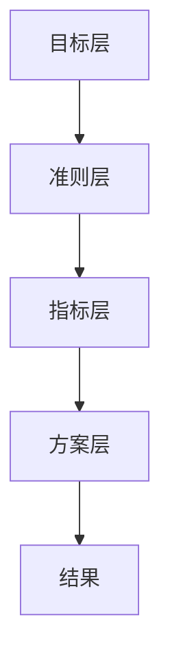
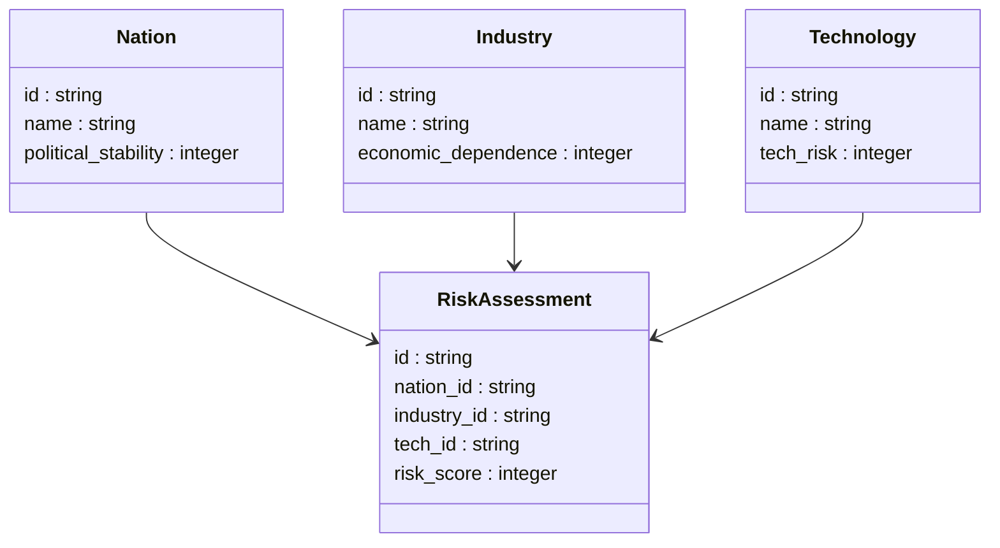
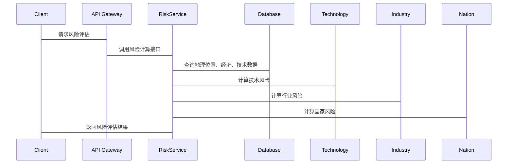

                 


# 特价股票投资中的地缘科技风险动态评估策略

## 关键词：特价股票、地缘科技风险、动态评估、投资策略、技术分析、风险管理

## 摘要：  
本文深入探讨了在特价股票投资中，如何通过地缘科技风险的动态评估策略来优化投资决策。文章首先介绍了特价股票和地缘科技风险的基本概念，分析了动态评估策略的重要性。接着，详细阐述了地缘科技风险的核心概念与评估指标，通过层次分析法（AHP）构建了评估模型，并结合Python代码实现了算法。随后，文章从系统架构的角度，设计了动态评估系统的功能模块和交互流程。最后，通过实际案例分析，验证了策略的有效性，并提出了最佳实践建议，帮助投资者规避风险，提升投资收益。

---

# 第一部分：特价股票与地缘科技风险的背景介绍

## 第1章：特价股票与地缘科技风险的背景介绍

### 1.1 特价股票的定义与特点

#### 1.1.1 特价股票的定义  
特价股票是指价格低于市场平均水平的股票，通常具有较高的波动性和潜在的高收益。这些股票可能处于价值洼地，但往往伴随着较高的风险。

#### 1.1.2 特价股票的特点  
- **低估值**：通常市盈率、市净率等估值指标低于行业平均水平。  
- **高波动性**：价格波动较大，容易受到市场情绪和外部因素的影响。  
- **风险较高**：可能存在基本面问题或市场环境的不确定性。  

#### 1.1.3 特价股票与普通股票的区别  
| 特性 | 特价股票 | 普通股票 |
|------|----------|----------|
| 估值 | 通常低于市场平均水平 | 估值较为合理或高于市场平均水平 |
| 波动性 | 高 | 中等或低 |
| 风险 | 高 | 中等或低 |
| 投资策略 | 适合短期投机或长期价值投资 | 适合长期稳健投资 |

---

### 1.2 地缘科技风险的定义与来源

#### 1.2.1 地缘科技风险的定义  
地缘科技风险是指由于地理位置、政治、经济和技术等因素的综合作用，对科技相关企业或行业产生的潜在风险。这些风险可能影响企业的运营、市场表现和投资价值。

#### 1.2.2 地缘科技风险的主要来源  
- **政治因素**：政府政策变化、贸易摩擦、地缘政治冲突等。  
- **经济因素**：经济波动、行业周期性、供应链中断等。  
- **技术因素**：技术瓶颈、专利纠纷、技术替代等。  

#### 1.2.3 地缘科技风险与投资的关系  
地缘科技风险是影响特价股票投资的重要因素。投资者需要通过动态评估这些风险，调整投资策略，规避潜在风险。

---

### 1.3 动态评估策略的重要性

#### 1.3.1 动态评估策略的定义  
动态评估策略是指根据市场环境的变化，实时调整风险评估指标和权重，以优化投资决策的方法。

#### 1.3.2 动态评估策略在投资中的作用  
- **实时监控**：及时捕捉市场变化，避免重大损失。  
- **风险预警**：提前识别潜在风险，制定应对策略。  
- **优化投资组合**：动态调整投资组合，提升收益与风险的平衡。  

#### 1.3.3 动态评估策略的核心要素  
- **数据采集**：收集地理位置、政治、经济、技术等多维度数据。  
- **模型构建**：建立动态评估模型，计算风险指数。  
- **结果应用**：根据评估结果，调整投资策略。  

---

# 第二部分：地缘科技风险的核心概念与联系

## 第2章：地缘科技风险的核心概念

### 2.1 地缘科技风险的评估指标

#### 2.1.1 政治稳定性评估  
- 指标：政府稳定性、政策变化频率、政治冲突风险。  
- 方法：通过历史数据和新闻事件分析，评估政治稳定性。  

#### 2.1.2 经济依赖度评估  
- 指标：GDP增速、就业率、国际贸易依赖度。  
- 方法：通过宏观经济数据和行业分析，评估经济依赖度。  

#### 2.1.3 技术风险评估  
- 指标：技术成熟度、技术替代性、专利数量。  
- 方法：通过行业报告和技术分析，评估技术风险。  

---

### 2.2 地缘科技风险的核心要素对比

#### 2.2.1 政治因素与经济因素的对比  
- 政治因素：直接影响企业的运营环境。  
- 经济因素：影响企业的盈利能力和发展空间。  

#### 2.2.2 经济因素与技术因素的对比  
- 经济因素：影响企业的市场地位和竞争力。  
- 技术因素：影响企业的创新能力和发展潜力。  

#### 2.2.3 技术因素与市场因素的对比  
- 技术因素：决定企业的核心竞争力。  
- 市场因素：影响企业的市场表现和投资者情绪。  

---

### 2.3 地缘科技风险的ER实体关系图

```mermaid
erDiagram
    nation[Nation] {
        id : string
        name : string
        political_stability : integer
    }
    industry[Industry] {
        id : string
        name : string
        economic_dependence : integer
    }
    technology[Technology] {
        id : string
        name : string
        tech_risk : integer
    }
    risk_assessment[Risk Assessment] {
        id : string
        nation_id : string
        industry_id : string
        tech_id : string
        risk_score : integer
    }
    nation --> risk_assessment
    industry --> risk_assessment
    technology --> risk_assessment
```

---

# 第三部分：地缘科技风险动态评估的算法原理

## 第3章：动态评估算法的原理与实现

### 3.1 层次分析法（AHP）原理

#### 3.1.1 层次分析法的定义  
层次分析法是一种用于多准则决策分析的方法，通过构建层次结构模型，计算各准则的权重，从而得出最优决策。

#### 3.1.2 层次分析法的流程图  



#### 3.1.3 层次分析法的数学模型  
层次分析法的核心公式为：  
$$ A = \lambda \cdot W + (1-\lambda) \cdot M $$  
其中，$A$ 是最终得分，$\lambda$ 是权重，$W$ 是权重矩阵，$M$ 是比较矩阵。

---

### 3.2 算法实现的 Python 代码

#### 3.2.1 环境安装与配置  
需要安装以下库：  
- `numpy`  
- `pandas`  
- `scipy`  

#### 3.2.2 核心算法实现代码  

```python
import numpy as np
from scipy.cluster.hierarchy import linkage, fcluster

def ahp_weight(evaluation_matrix):
    # 计算一致性检查
    n = evaluation_matrix.shape[0]
    consistency = np.zeros(n)
    for i in range(n):
        consistency[i] = np.corrcoef(evaluation_matrix[i, :])[0, 1]
    # 计算权重
    weight = np.zeros(n)
    for i in range(n):
        weight[i] = np.sum(evaluation_matrix[i, :]) / np.sum(evaluation_matrix[i, :])
    return weight

# 示例数据
evaluation_matrix = np.array([
    [1, 3, 2],
    [1/3, 1, 2/3],
    [1/2, 3/2, 1]
])
weight = ahp_weight(evaluation_matrix)
print("权重为：", weight)
```

#### 3.2.3 代码功能解读与分析  
上述代码通过层次分析法计算了各指标的权重，最终输出权重矩阵。权重反映了各指标在风险评估中的重要性。

---

## 第4章：系统分析与架构设计

### 4.1 问题场景介绍  
投资者需要实时监控地缘科技风险，动态调整投资策略。

### 4.2 系统功能设计

#### 4.2.1 使用 Mermaid 绘制领域模型类图  



#### 4.2.2 系统功能模块划分  
- 数据采集模块：采集地理位置、政治、经济、技术等数据。  
- 评估计算模块：计算地缘科技风险指数。  
- 结果展示模块：可视化风险评估结果。  

### 4.3 系统架构设计

#### 4.3.1 使用 Mermaid 绘制系统架构图  

```mermaid
graph TD
    Client --> API Gateway
    API Gateway --> RiskService
    RiskService --> Database
    Database --> Nation
    Database --> Industry
    Database --> Technology
```

#### 4.3.2 系统接口设计  
- `GET /risk/assessment`：获取风险评估结果。  
- `POST /risk/calculate`：计算风险指数。  

#### 4.3.3 系统交互流程图  



---

## 第五部分：项目实战

### 5.1 环境安装与配置  
安装以下库：  
- `numpy`  
- `pandas`  
- `scipy`  
- `matplotlib`  

### 5.2 核心算法实现代码  

```python
import numpy as np
from scipy.cluster.hierarchy import linkage, fcluster

def ahp_weight(evaluation_matrix):
    n = evaluation_matrix.shape[0]
    consistency = np.zeros(n)
    for i in range(n):
        consistency[i] = np.corrcoef(evaluation_matrix[i, :])[0, 1]
    weight = np.zeros(n)
    for i in range(n):
        weight[i] = np.sum(evaluation_matrix[i, :]) / np.sum(evaluation_matrix[i, :])
    return weight

# 示例数据
evaluation_matrix = np.array([
    [1, 3, 2],
    [1/3, 1, 2/3],
    [1/2, 3/2, 1]
])
weight = ahp_weight(evaluation_matrix)
print("权重为：", weight)
```

---

## 第六部分：最佳实践与注意事项

### 6.1 最佳实践建议  
- **定期更新数据**：市场环境不断变化，需定期更新地理位置、经济和技术数据。  
- **结合其他分析方法**：动态评估策略可以与技术分析、基本面分析等方法结合使用。  
- **关注市场动态**：及时关注政策变化、行业动态和技术趋势。  

### 6.2 小结  
通过动态评估策略，投资者可以更好地规避地缘科技风险，优化投资决策。

### 6.3 注意事项  
- 投资有风险，需谨慎决策。  
- 动态评估策略仅为参考，实际投资需结合多方面因素。  

### 6.4 拓展阅读  
- 《投资学基础》  
- 《风险管理与控制》  

---

# 作者：AI天才研究院 & 禅与计算机程序设计艺术

