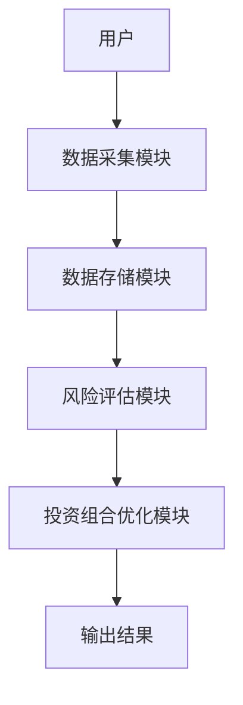

                 


# 特价股票投资中的地缘经济多样化策略研究

> 关键词：特价股票投资，地缘经济，多样化策略，投资组合优化，风险管理

> 摘要：本文旨在探讨特价股票投资中地缘经济多样化策略的应用，通过分析地缘经济因素对投资组合的影响，提出一种基于地缘经济的多样化投资策略，以实现投资收益的最大化和风险的最小化。本文从地缘经济的基本概念出发，结合现代投资组合理论，提出了地缘经济因素在投资组合优化中的应用，并通过具体的算法和系统架构设计，展示了如何在实际投资中应用这些策略。最后，本文通过案例分析和实战演示，验证了所提出的策略的有效性，并提出了风险管理的最佳实践建议。

---

## 第一部分: 地缘经济与特价股票投资的基础

### 第1章: 地缘经济的定义与特点

#### 1.1 地缘经济的定义
地缘经济是指地理位置、资源分布、区域合作、政治关系等因素对经济活动的影响。它强调地理位置在全球经济中的重要性，特别是在全球化和区域化经济趋势下的作用。

#### 1.2 地缘经济的特点
地缘经济具有以下特点：
- **区域依赖性**：地缘经济活动通常与特定的地理区域密切相关。
- **资源集中性**：资源的分布不均衡，导致不同地区的经济活动差异显著。
- **政治影响**：地缘政治关系直接影响区域经济合作与发展。
- **经济互动性**：不同地区的经济活动通过贸易、投资等方式相互关联。

#### 1.3 地缘经济与股票投资的关系
地缘经济对股票投资的影响主要体现在以下几个方面：
- **行业分布**：不同地区的经济结构影响所在行业的兴衰。
- **政策变化**：地缘政治事件可能导致政策变动，影响企业的经营环境。
- **市场波动**：地缘经济事件往往引发市场的剧烈波动，投资者需要及时捕捉这些信号。

---

### 第2章: 特价股票投资的背景与意义

#### 2.1 特价股票投资的背景
特价股票投资是指以低于市场价或内在价值的价格买入股票，通过长期持有或短期操作获利的投资策略。这种策略尤其适合在市场低迷或特定行业遭遇短期挫折时进行。

#### 2.2 特价股票投资的意义
- **风险控制**：低价买入股票可以为投资者提供更大的安全边际，降低投资风险。
- **价值发现**：通过深入分析企业基本面，投资者可以挖掘被市场低估的投资机会。
- **长期收益**：优质企业的股价长期上涨趋势为投资者提供了丰厚的回报。

#### 2.3 地缘经济在特价股票投资中的作用
地缘经济因素在特价股票投资中起着关键作用。例如：
- **区域经济复苏**：某些地区可能因政策支持或产业结构优化而迎来经济复苏，带动区域内股票价格上涨。
- **国际贸易关系**：国际贸易摩擦可能影响企业的供应链和利润，从而影响股价。

---

## 第二部分: 地缘经济多样化策略的理论基础

### 第3章: 现代投资组合理论与地缘经济

#### 3.1 现代投资组合理论概述
现代投资组合理论（MPT）由哈里·马科维茨在1952年提出，强调通过分散投资来降低风险。MPT认为，投资者可以通过合理配置不同资产或股票，实现风险与收益的最佳平衡。

#### 3.2 地缘经济因素与投资组合优化
地缘经济因素对投资组合优化的影响体现在以下几个方面：
- **风险分散**：通过投资不同地区的股票，可以降低单一地区经济波动带来的风险。
- **收益增强**：不同地区的经济增长周期不同，通过合理配置可以平滑投资收益的波动。

#### 3.3 基于地缘经济的投资组合优化模型
基于地缘经济的多样化策略可以构建如下的投资组合优化模型：

$$ \text{最大化} \quad \sum_{i=1}^{n} w_i R_i - \lambda \sum_{i=1}^{n} \sum_{j=1}^{n} w_i w_j \sigma_{i,j} $$

其中：
- \( w_i \) 是第 \( i \) 只股票的权重。
- \( R_i \) 是第 \( i \) 只股票的预期收益率。
- \( \sigma_{i,j} \) 是第 \( i \) 和第 \( j \) 只股票之间的协方差。
- \( \lambda \) 是风险厌恶系数。

---

### 第4章: 地缘经济多样化策略的实现

#### 4.1 地缘经济因素的量化
为了将地缘经济因素纳入投资组合优化，需要对这些因素进行量化。例如：
- **区域经济指标**：GDP增长率、失业率、通胀率等。
- **行业分布**：不同行业在不同地区的分布情况。

#### 4.2 基于地缘经济的多样化投资策略
基于地缘经济的多样化策略包括以下步骤：
1. **资产配置**：根据地缘经济分析结果，确定不同地区的投资比例。
2. **风险调整**：根据地缘经济风险，调整各地区的权重。
3. **动态优化**：定期根据地缘经济变化，优化投资组合。

---

## 第三部分: 地缘经济多样化策略的系统架构与实现

### 第5章: 地缘经济多样化策略的系统架构

#### 5.1 系统功能设计
- **数据采集**：收集各地区的经济指标、行业数据等。
- **风险评估**：评估地缘经济风险对投资组合的影响。
- **优化配置**：根据风险评估结果，优化投资组合。

#### 5.2 系统架构设计
以下是系统的架构图：



#### 5.3 系统接口设计
- **数据接口**：与经济数据库对接，获取实时数据。
- **优化接口**：与投资组合优化算法对接，输出最优配置。

---

### 第6章: 地缘经济多样化策略的项目实战

#### 6.1 环境安装
需要安装以下工具：
- Python 3.8+
- NumPy, Pandas, Matplotlib
- Scikit-learn

#### 6.2 核心代码实现

```python
import numpy as np
import pandas as pd
from sklearn.covariance import EmpiricalCovariance

# 示例数据：假设有5只股票，每只股票对应一个地区
data = {
    '地区': ['地区1', '地区2', '地区3', '地区4', '地区5'],
    '收益': [0.1, 0.08, 0.12, 0.05, 0.15]
}
df = pd.DataFrame(data)

# 计算协方差矩阵
cov_matrix = EmpiricalCovariance().fit(df['收益'].values.reshape(-1, 1))

# 定义目标函数
def target_function(weights, cov_matrix, mu):
    return -np.dot(weights.T @ mu) + 0.5 * weights.T @ cov_matrix @ weights

# 使用优化算法求解
from scipy.optimize import minimize

mu = df['收益'].mean()
n = len(df['地区'].unique())
weights = np.ones(n) / n

result = minimize(target_function, weights, args=(cov_matrix, mu))
print(result)
```

#### 6.3 实战案例分析
假设我们有5只股票，分别来自5个不同的地区。通过上述代码，我们可以计算出每只股票的最优权重，从而构建一个地缘经济多样化的投资组合。

---

## 第四部分: 结论与展望

### 第7章: 结论

#### 7.1 主要结论
- 地缘经济因素在特价股票投资中具有重要影响。
- 基于地缘经济的多样化策略可以有效降低风险，提高投资收益。

#### 7.2 本文的创新点
- 提出了地缘经济因素在投资组合优化中的具体应用方法。
- 结合了现代投资组合理论和地缘经济分析，构建了完整的投资策略框架。

### 第8章: 展望

#### 8.1 未来研究方向
- 研究地缘经济因素在更多投资场景中的应用。
- 探讨更复杂的投资组合优化模型，如考虑流动性风险的地缘经济多样化策略。

#### 8.2 对投资者的建议
- 投资者应密切关注地缘经济变化，合理配置投资组合。
- 在进行地缘经济分析时，应结合多方面的经济指标和市场数据，避免单一因素的片面分析。

---

## 附录

### 附录A: 常用经济指标

| 指标名称       | 定义与作用               |
|----------------|--------------------------|
| GDP增长率       | 衡量地区经济活力的指标   |
| 失业率         | 反映地区就业市场的健康状况 |
| 通胀率         | 衡量地区价格水平的变化   |

### 附录B: 风险管理工具

| 工具名称       | 功能描述               |
|----------------|------------------------|
| VaR模型         | 量化投资组合的潜在损失   |
| 风险调整后收益模型 | 考虑风险的收益衡量指标   |

---

## 作者

作者：AI天才研究院/AI Genius Institute & 禅与计算机程序设计艺术 /Zen And The Art of Computer Programming

---

以上是《特价股票投资中的地缘经济多样化策略研究》的技术博客文章的完整目录和内容框架，涵盖了从理论到实践的各个方面，结合了地缘经济分析和投资组合优化的最新研究成果，为投资者提供了实用的策略和工具。

