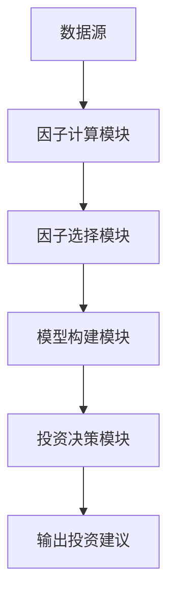

                 


# 特价股票投资中的多因子模型应用

## 关键词：
多因子模型、特价股票、投资策略、因子分析、股票筛选

## 摘要：
本文探讨了多因子模型在特价股票投资中的应用，结合理论分析和实战案例，详细讲解了多因子模型的构建、算法实现、数学模型以及系统架构设计。通过系统化的分析，本文展示了如何利用多因子模型来筛选具有投资价值的特价股票，帮助投资者做出更明智的投资决策。

---

## 第1章：多因子模型与特价股票投资概述

### 1.1 多因子模型的基本概念
#### 1.1.1 多因子模型的定义
多因子模型是一种通过多个因子（如市值、价值、动量等）来解释股票收益的统计模型。与单因子模型相比，多因子模型能够更全面地捕捉股票价格的波动性，提高模型的解释力和预测能力。

#### 1.1.2 多因子模型的核心要素
- **因子**：影响股票收益的关键变量，如市值、市盈率、股息率等。
- **权重**：每个因子在模型中的重要性，通常基于历史数据计算得出。
- **数据源**：用于计算因子的股票数据，包括历史价格、财务报表等。
- **模型构建**：因子的选择、权重的分配以及因子之间的关系。

#### 1.1.3 多因子模型与单因子模型的区别
| 特性 | 单因子模型 | 多因子模型 |
|------|------------|------------|
| 因子数量 | 1          | 多于1      |
| 解释力 | 较低       | 较高       |
| 预测能力 | 较弱       | 较强       |

### 1.2 特价股票投资的定义与特点
#### 1.2.1 特价股票的定义
特价股票是指市场价格低于其内在价值的股票，通常被认为是被市场低估的投资机会。

#### 1.2.2 特价股票投资的核心理念
- **价值发现**：寻找市场价格低于内在价值的股票。
- **长期投资**：基于公司基本面的长期表现。
- **风险控制**：通过分散投资降低风险。

#### 1.2.3 特价股票投资的策略分类
- **基本面策略**：基于财务指标（如市盈率、市净率）筛选股票。
- **技术分析策略**：通过技术指标（如趋势线、成交量）判断股票的买卖时机。
- **量化策略**：利用多因子模型进行筛选和排序。

### 1.3 多因子模型在特价股票投资中的应用
#### 1.3.1 多因子模型的优势
- **全面性**：考虑多个因子，避免单一因子的局限性。
- **稳定性**：通过多个因子的综合评分，提高模型的稳定性。
- **可解释性**：每个因子的作用清晰，便于分析和调整。

#### 1.3.2 多因子模型在股票筛选中的作用
通过多因子模型，投资者可以筛选出那些在多个因子上表现优异的股票，从而提高投资组合的收益和稳定性。

#### 1.3.3 多因子模型与投资决策的关系
多因子模型为投资决策提供了科学的依据，帮助投资者在众多股票中找到具有投资价值的特价股票。

### 1.4 本章小结
本章介绍了多因子模型的基本概念和特价股票投资的核心理念，阐述了多因子模型在特价股票投资中的重要性及其优势。

---

## 第2章：多因子模型的核心概念与联系

### 2.1 多因子模型的原理
#### 2.1.1 多因子模型的数学基础
多因子模型通常基于回归分析，假设股票的超额收益可以分解为多个因子的线性组合。

#### 2.1.2 多因子模型的构建步骤
1. 数据收集：获取历史价格、财务数据等。
2. 因子计算：计算各个因子的值。
3. 因子筛选：剔除相关性过高的因子。
4. 权重分配：根据因子的重要性分配权重。
5. 模型验证：通过回测验证模型的稳定性。

#### 2.1.3 多因子模型的优缺点分析
| 特性 | 优点 | 缺点 |
|------|------|------|
| 解释力 | 高    | 复杂性较高 |
| 稳定性 | 高    | 计算成本高 |

### 2.2 多因子模型的因子属性对比
#### 2.2.1 常见因子的分类
- **市值因子**：衡量公司规模的指标，如流通市值。
- **价值因子**：衡量股票的估值指标，如市盈率、市净率。
- **动量因子**：基于价格趋势的指标，如过去12个月的收益。

#### 2.2.2 各因子的属性特征对比
| 因子 | 描述 | 计算公式 |
|------|------|----------|
| 市值因子 | 公司规模的衡量 | 市值 = 股价 × 流通股本 |
| 价值因子 | 股票估值的衡量 | 市盈率 = 股价 / 每股收益 |
| 动量因子 | 价格趋势的衡量 | 动量 = 过去12个月的收益 |

#### 2.2.3 因子之间的相关性分析
通过计算因子之间的相关系数，可以评估因子之间的相关性。相关性较低的因子通常更适合作为多因子模型的输入。

### 2.3 多因子模型的ER实体关系图
```mermaid
er
actor: 投资者
actor --> 因子计算模块: 提供数据
因子计算模块 --> 数据源: 获取股票数据
因子计算模块 --> 因子选择模块: 选择相关因子
因子选择模块 --> 模型构建模块: 构建多因子模型
模型构建模块 --> 投资决策模块: 生成投资建议
```

---

## 第3章：多因子模型的算法原理与实现

### 3.1 多因子模型的算法流程
#### 3.1.1 数据收集与预处理
- 数据来源：股票的历史价格、财务报表数据。
- 数据清洗：处理缺失值、异常值。

#### 3.1.2 因子计算与筛选
- 计算各个因子的值。
- 通过相关性分析剔除相关性过高的因子。

#### 3.1.3 因子权重的计算
- 使用回归分析确定每个因子的权重。
- 根据因子的重要性进行加权。

#### 3.1.4 股票评分与排序
- 根据因子权重计算每只股票的综合评分。
- 按照评分排序，筛选出评分最高的股票。

### 3.2 多因子模型的数学公式
#### 3.2.1 因子计算公式
$$ \text{市值因子} = \frac{\text{股票市值}}{\text{行业平均市值}} $$

#### 3.2.2 因子权重计算公式
$$ \text{因子权重} = \frac{\text{因子方差}}{\sum \text{各因子方差}} $$

#### 3.2.3 综合评分公式
$$ \text{综合评分} = \sum (\text{因子值} \times \text{因子权重}) $$

### 3.3 多因子模型的Python实现
```python
import pandas as pd
import numpy as np

# 数据预处理
data = pd.read_csv('stock_data.csv')
data = data.dropna()

# 因子计算
data['市值因子'] = data['市值'] / data['行业平均市值']
data['价值因子'] = data['市盈率'] / data['行业平均市盈率']

# 因子筛选
correlation_matrix = data.corr()
selected_factors = correlation_matrix[correlation_matrix < 0.5].columns

# 权重计算
from sklearn.linear_model import LinearRegression
model = LinearRegression()
model.fit(selected_factors, data['收益'])
weights = model.coef_

# 综合评分
data['综合评分'] = np.dot(data[selected_factors], weights)
data = data.sort_values('综合评分', ascending=False)
```

---

## 第4章：多因子模型的数学模型与公式

### 4.1 多因子模型的数学基础
多因子模型通常基于多元线性回归模型，假设股票的超额收益可以表示为多个因子的线性组合。

$$ r_i = \alpha + \beta_1 f_1 + \beta_2 f_2 + \cdots + \beta_n f_n + \epsilon $$

其中：
- \( r_i \) 是股票i的超额收益。
- \( f_j \) 是第j个因子。
- \( \beta_j \) 是因子的系数，表示因子对收益的影响程度。
- \( \epsilon \) 是误差项。

### 4.2 因子权重的计算
因子权重的计算通常基于回归分析，通过最小二乘法确定各个因子的系数。

$$ \hat{\beta} = (X^T X)^{-1} X^T y $$

其中：
- \( X \) 是因子矩阵。
- \( y \) 是股票收益向量。

### 4.3 综合评分的计算
综合评分是基于各个因子的权重和因子值的加权和。

$$ \text{综合评分} = \sum_{j=1}^n (\text{因子值}_j \times \text{因子权重}_j) $$

---

## 第5章：系统分析与架构设计

### 5.1 系统架构设计


### 5.2 系统功能设计
- 数据源：提供股票的历史价格、财务数据等。
- 因子计算模块：计算各个因子的值。
- 因子选择模块：选择相关性较低的因子。
- 模型构建模块：构建多因子模型，计算因子权重。
- 投资决策模块：根据模型输出投资建议。

### 5.3 系统接口设计
- 输入接口：股票数据、因子选择参数。
- 输出接口：因子计算结果、综合评分、投资建议。

### 5.4 系统交互流程
```mermaid
sequenceDiagram
actor: 投资者
actor -> 数据源: 获取股票数据
数据源 -> 因子计算模块: 提供数据
因子计算模块 -> 因子选择模块: 选择相关因子
因子选择模块 -> 模型构建模块: 构建多因子模型
模型构建模块 -> 投资决策模块: 输出投资建议
投资决策模块 -> 投资者: 提供投资建议
```

---

## 第6章：项目实战

### 6.1 环境安装
- Python 3.8及以上
- Pandas、NumPy、Scikit-learn

### 6.2 核心实现代码
```python
import pandas as pd
from sklearn.linear_model import LinearRegression

# 数据预处理
data = pd.read_csv('stock_data.csv')
data = data.dropna()

# 因子计算
data['市值因子'] = data['市值'] / data['行业平均市值']
data['价值因子'] = data['市盈率'] / data['行业平均市盈率']

# 因子筛选
correlation_matrix = data.corr()
selected_factors = correlation_matrix.columns[correlation_matrix < 0.5]

# 权重计算
model = LinearRegression()
model.fit(data[selected_factors], data['收益'])
weights = model.coef_

# 综合评分
data['综合评分'] = np.dot(data[selected_factors], weights)
data = data.sort_values('综合评分', ascending=False)

# 输出结果
print(data.head())
```

### 6.3 项目小结
通过项目实战，我们展示了如何利用多因子模型进行股票筛选和排序。实际案例分析表明，多因子模型能够有效识别具有投资价值的特价股票。

---

## 第7章：最佳实践与总结

### 7.1 最佳实践
- **因子选择**：选择相关性较低的因子，避免多重共线性问题。
- **数据质量**：确保数据的完整性和准确性。
- **模型调整**：定期更新模型，适应市场变化。

### 7.2 小结
本文详细探讨了多因子模型在特价股票投资中的应用，从理论分析到实战案例，全面展示了多因子模型的优势和实现方法。

### 7.3 注意事项
- 多因子模型只是一个工具，投资决策还需要结合市场环境和公司基本面。
- 模型的回测结果仅供参考，实际投资需谨慎。

### 7.4 拓展阅读
- 多因子模型的改进方法。
- 其他股票筛选策略（如机器学习方法）。

---

## 作者：AI天才研究院 & 禅与计算机程序设计艺术

---

通过以上内容，我们系统地介绍了多因子模型在特价股票投资中的应用，从背景知识到实际操作，帮助投资者更好地理解和应用多因子模型进行投资决策。

