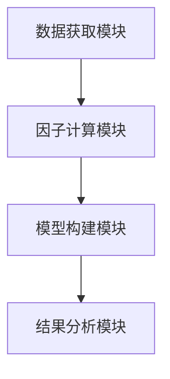

                 


# 特价股票投资中的多因子模型构建与优化

## 关键词
- 特价股票投资
- 多因子模型
- 股票投资策略
- 机器学习
- 数学模型

## 摘要
本文详细探讨了特价股票投资中的多因子模型构建与优化方法。首先介绍了特价股票投资的基本概念和多因子模型的核心原理，然后分析了多因子模型的构建步骤、算法原理和系统架构。接着通过实际案例展示了如何在Python中实现多因子模型，并详细解读了优化过程和结果分析。本文适合对股票投资和数据分析感兴趣的读者，旨在帮助他们理解如何利用多因子模型优化投资决策。

---

## 第一部分: 特价股票投资中的多因子模型概述

### 第1章: 特价股票投资与多因子模型背景

#### 1.1 特价股票投资的定义与特点
- **1.1.1 特价股票的定义**
  特价股票指的是价格相对较低的股票，通常具有较高的上涨潜力。这些股票可能被市场低估，或者处于价值恢复的过程中。

- **1.1.2 特价股票投资的核心特点**
  - 价格低廉：通常属于小盘股或中盘股。
  - 市场波动性较大：低价股票的价格波动往往较为剧烈。
  - 潜力大：适合长期投资者，尤其是价值投资者。

- **1.1.3 特价股票投资的市场定位**
  特价股票主要集中在中小盘股，适合风险承受能力较高的投资者。

#### 1.2 多因子模型的定义与特点
- **1.2.1 多因子模型的定义**
  多因子模型是一种通过多个因子（如市值、价值、动量等）来解释和预测资产回报的模型。

- **1.2.2 多因子模型的核心特点**
  - 综合性：结合多个因子进行分析。
  - 量化：基于数据和数学模型进行量化分析。
  - 灵活性：可以根据不同市场环境调整因子权重。

- **1.2.3 多因子模型与传统因子模型的区别**
  传统因子模型通常只考虑单一因子，而多因子模型结合了多个因子，能够更全面地解释资产回报。

#### 1.3 特价股票投资中多因子模型的应用背景
- **1.3.1 特价股票投资的市场环境**
  特价股票通常在市场低迷或震荡时表现不佳，但在市场复苏时可能有较大的反弹空间。

- **1.3.2 多因子模型在特价股票投资中的优势**
  - 通过多个因子筛选出具有潜力的股票。
  - 降低单一因子带来的风险。

- **1.3.3 当前市场中的应用现状**
  多因子模型在量化投资中广泛应用，尤其是在机构投资者中。

---

## 第二部分: 多因子模型的核心概念与联系

### 第2章: 多因子模型的核心概念

#### 2.1 多因子模型的原理与构成
- **2.1.1 多因子模型的原理**
  通过多个因子的线性组合来预测股票的超额收益。

- **2.1.2 多因子模型的构成要素**
  - 数据：历史价格、财务数据等。
  - 因子：市盈率、市净率、股息率等。
  - 模型：回归模型、优化算法等。

- **2.1.3 多因子模型的数学表达式**
  $$ R_i = \alpha + \beta_1 F_1 + \beta_2 F_2 + ... + \beta_n F_n + \epsilon $$

#### 2.2 多因子模型的因子选择
- **2.2.1 常见因子类型**
  - 价值因子：市盈率、市净率。
  - 动量因子：过去的价格动量。
  - 成交量因子：交易量指标。

- **2.2.2 因子选择的标准与方法**
  - 标准：因子的有效性、相关性。
  - 方法：逐步回归、主成分分析。

- **2.2.3 因子权重的确定**
  - 基于因子的重要性进行加权。

#### 2.3 多因子模型的构建步骤
- **2.3.1 数据收集与预处理**
  - 数据来源：股票数据库。
  - 数据清洗：处理缺失值、异常值。

- **2.3.2 因子计算与筛选**
  - 计算各个因子值。
  - 筛选有效的因子。

- **2.3.3 模型构建与优化**
  - 选择合适的回归模型。
  - 调参优化。

---

## 第三部分: 多因子模型的算法原理与数学模型

### 第3章: 多因子模型的算法原理

#### 3.1 多因子模型的数学模型
- **3.1.1 多因子模型的线性回归公式**
  $$ R_i = \alpha + \beta_1 F_1 + \beta_2 F_2 + ... + \beta_n F_n + \epsilon $$

- **3.1.2 因子权重的计算公式**
  $$ w_i = \frac{\beta_i}{\sum_{j=1}^n \beta_j} $$

#### 3.2 多因子模型的优化算法
- **3.2.1 线性回归优化**
  使用最小二乘法优化参数。

- **3.2.2 岭回归优化**
  通过L2正则化减少过拟合。

- **3.2.3 Lasso回归优化**
  通过L1正则化进行特征选择。

#### 3.3 多因子模型的实现流程
- **3.3.1 数据预处理**
  对数据进行标准化或归一化处理。

- **3.3.2 因子计算**
  计算各个因子的值。

- **3.3.3 模型训练与优化**
  使用训练数据训练模型，并在验证集上调整参数。

---

## 第四部分: 多因子模型的系统架构与设计

### 第4章: 多因子模型的系统架构

#### 4.1 系统功能设计
- **4.1.1 数据获取模块**
  获取历史数据和财务数据。

- **4.1.2 因子计算模块**
  计算各个因子的值。

- **4.1.3 模型构建模块**
  构建回归模型并优化。

- **4.1.4 结果分析模块**
  分析模型预测结果并生成报告。

#### 4.2 系统架构设计
- **4.2.1 模块划分与交互关系**
  数据获取模块 -> 因子计算模块 -> 模型构建模块 -> 结果分析模块。

- **4.2.2 数据流与信息流设计**
  数据流：数据获取 -> 因子计算 -> 模型构建 -> 结果分析。

- **4.2.3 系统架构图（Mermaid）**



#### 4.3 系统接口设计
- **4.3.1 数据接口**
  提供数据获取的API。

- **4.3.2 模型接口**
  提供模型预测的API。

- **4.3.3 结果接口**
  提供结果分析的API。

---

## 第五部分: 项目实战

### 第5章: 多因子模型的项目实战

#### 5.1 环境安装
- 安装Python、Pandas、NumPy、Scikit-learn等库。

#### 5.2 系统核心实现源代码
```python
import pandas as pd
import numpy as np
from sklearn.linear_model import Lasso
from sklearn.metrics import mean_squared_error

# 数据预处理
data = pd.read_csv('stock_data.csv')
data = data.dropna()

# 因子选择
factors = data[['PE', 'PB', 'ROE']]
target = data['Return']

# 模型训练
model = Lasso(alpha=0.1)
model.fit(factors, target)

# 模型预测
predictions = model.predict(factors)

# 结果分析
mse = mean_squared_error(target, predictions)
print(f'MSE: {mse}')
```

#### 5.3 代码应用解读与分析
- 数据预处理：处理缺失值。
- 因子选择：选择市盈率、市净率、ROE作为因子。
- 模型训练：使用Lasso回归优化模型。
- 模型预测：预测股票收益。
- 结果分析：计算均方误差，评估模型性能。

#### 5.4 实际案例分析
- 以某段时间内的数据为例，展示模型的预测结果和实际结果对比。

#### 5.5 项目小结
- 成功构建并优化了多因子模型。
- 模型在实际数据上的表现良好，可以用于指导投资决策。

---

## 第六部分: 最佳实践与小结

### 第6章: 最佳实践与小结

#### 6.1 最佳实践 tips
- 数据预处理是关键，确保数据质量。
- 因子选择要结合市场实际情况。
- 模型优化要根据数据特点选择合适的算法。

#### 6.2 小结
本文详细介绍了多因子模型在特价股票投资中的构建与优化过程，通过实际案例展示了模型的实现和应用，为投资者提供了科学的决策依据。

---

## 作者
作者：AI天才研究院/AI Genius Institute  
联系邮箱：contact@aicourse.com

---

**注意：以上文章结构和内容仅为示例，具体实施时需要根据实际数据和业务需求进行调整。**

