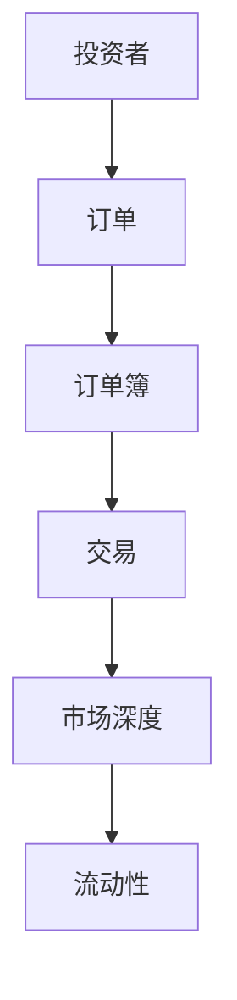
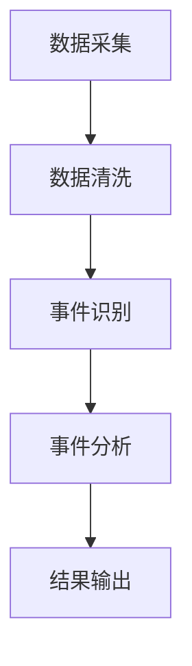

                 


# 特价股票投资中的市场微观结构分析

## 关键词：特价股票，市场微观结构，算法原理，交易机制，数学模型

## 摘要：  
本文通过分析特价股票投资中的市场微观结构，揭示了市场参与者、订单簿、流动性等核心要素之间的关系。结合事件研究法、因子分析法等算法原理，构建了基于订单流的数学模型，并通过虚拟交易系统的设计与实现，提供了实际案例分析。文章最后总结了投资策略优化和风险管理的关键点，为投资者提供了深度的理论支持和实践指导。

---

## 第一部分: 特价股票投资的背景与概念

### 第1章: 特价股票投资的背景与概念

#### 1.1 特价股票的定义与特点

##### 1.1.1 特价股票的定义  
特价股票是指上市公司因特定原因（如财务困境、重组需求等）以低于面值的价格发行的股票。这种股票通常附带一定的限制条件，例如限售期、业绩补偿承诺等，以吸引投资者参与。

##### 1.1.2 特价股票的特点  
- **价格优势**：发行价格低于面值，吸引投资者。  
- **风险较高**：通常伴随较高的市场波动和不确定性。  
- **特殊条款**：可能附带业绩承诺、回购条款等。  

##### 1.1.3 特价股票与普通股票的区别  
| 属性 | 特价股票 | 普通股票 |
|------|----------|----------|
| 发行价格 | ≤面值 | ≥面值 |
| 风险 | 高 | 中低 |
| 附加条款 | 有 | 无 |

---

#### 1.2 市场微观结构分析的定义与重要性

##### 1.2.1 市场微观结构的定义  
市场微观结构是指市场中的参与者、交易机制、订单簿和流动性等要素的构成与相互作用方式。

##### 1.2.2 市场微观结构分析的重要性  
- **优化投资策略**：通过分析市场微观结构，投资者可以更好地把握市场波动和交易机会。  
- **提升交易效率**：了解市场微观结构有助于降低交易成本和提高执行效率。  
- **风险控制**：通过分析市场深度和流动性，投资者可以更好地管理投资风险。

##### 1.2.3 市场微观结构与特价股票投资的关系  
特价股票的发行和交易过程涉及复杂的市场微观结构，包括订单簿、交易机制和市场参与者行为。通过对这些要素的分析，投资者可以更好地把握特价股票的投资机会和风险。

---

#### 1.3 特价股票投资的背景与现状

##### 1.3.1 特价股票投资的背景  
随着资本市场的快速发展，越来越多的企业通过发行特价股票来筹集资金或优化资本结构。这种融资方式在中小企业和创业公司中尤为常见。

##### 1.3.2 特价股票投资的现状  
当前，特价股票投资已成为资本市场的重要组成部分。然而，由于其特殊性，投资者在交易过程中需要面对更多的不确定性和风险。

##### 1.3.3 特价股票投资的未来趋势  
随着市场微观结构的不断完善和金融科技的发展，特价股票投资将更加便捷和高效。投资者需要结合市场微观结构分析和大数据技术，优化投资策略。

---

## 第二部分: 市场微观结构的核心概念与联系

### 第2章: 市场微观结构的核心概念与联系

#### 2.1 市场微观结构的核心概念

##### 2.1.1 市场参与者  
市场参与者包括投资者、做市商、交易员和监管机构等。不同参与者的行为对市场微观结构有着重要影响。

##### 2.1.2 订单簿与交易机制  
订单簿是记录所有未成交订单的清单，包括买入价、卖出价和订单数量等信息。交易机制则是指订单匹配和成交的具体规则，例如撮合交易、竞价交易等。

##### 2.1.3 市场深度与流动性  
市场深度是指在特定价格水平上可成交的订单数量，而流动性则衡量市场的买卖能力。市场深度和流动性直接影响市场的交易成本和波动性。

---

#### 2.2 市场微观结构的核心要素对比

##### 2.2.1 市场参与者的属性对比  
| 属性 | 投资者 | 做市商 |
|------|--------|--------|
| 目标 | 赚取收益 | 提供流动性 |
| 行为 | 下单、成交 | 报价、撮合 |

##### 2.2.2 订单类型与交易规则的对比  
| 类型 | 市价单 | 限价单 |
|------|--------|--------|
| 特性 | 立即成交 | 等待成交 |
| 风险 | 高 | 低 |

##### 2.2.3 市场深度与流动性的关系  
市场深度越高，流动性越好，交易成本越低。

---

#### 2.3 市场微观结构的ER实体关系图



---

## 第三部分: 市场微观结构分析的算法原理

### 第3章: 市场微观结构分析的算法原理

#### 3.1 市场微观结构分析的算法概述

##### 3.1.1 事件研究法  
事件研究法通过分析市场事件（如并购、重组等）对股票价格的影响，揭示市场微观结构的变化。

##### 3.1.2 因子分析法  
因子分析法通过提取影响股票价格的多个因子（如流动性、市场深度等），分析其对市场微观结构的影响。

##### 3.1.3 时间序列分析法  
时间序列分析法通过分析股票价格的历史数据，预测未来价格走势。

---

#### 3.2 事件研究法的实现流程



---

#### 3.3 算法实现的Python代码示例

##### 事件研究法代码示例

```python
import pandas as pd
import numpy as np

def event_study(data, event_dates):
    # 数据清洗
    data_cleaned = data.dropna()
    # 事件识别
    event_data = data_cleaned[data_cleaned.index.isin(event_dates)]
    # 事件分析
    returns = event_data['return'].values
    # 结果输出
    print(f"平均收益率为：{np.mean(returns)}")
    print(f"标准差为：{np.std(returns)}")

# 示例数据
data = {
    'date': ['2023-01-01', '2023-01-02', '2023-01-03', '2023-01-04'],
    'return': [0.02, -0.01, 0.03, 0.0]
}
data = pd.DataFrame(data)
event_dates = ['2023-01-02', '2023-01-04']

event_study(data, event_dates)
```

---

#### 3.4 数学模型与公式推导

##### 3.4.1 市场深度模型  
市场深度（D）的计算公式为：  
$$ D = \sum_{i=1}^{n} q_i $$  
其中，$q_i$ 是每个价格水平上的订单数量。

##### 3.4.2 流动性模型  
流动性（L）的计算公式为：  
$$ L = \frac{D}{P} $$  
其中，$P$ 是股票价格。

---

## 第四部分: 市场微观结构分析的系统架构设计

### 第4章: 市场微观结构分析的系统架构设计

#### 4.1 系统功能设计

##### 4.1.1 功能模块  
- 数据采集模块  
- 数据清洗模块  
- 事件识别模块  
- 事件分析模块  
- 结果输出模块  

##### 4.1.2 功能流程图


---

#### 4.2 系统架构设计

##### 4.2.1 系统架构图


---

## 第五部分: 特价股票投资中的市场微观结构分析实战

### 第5章: 特价股票投资中的市场微观结构分析实战

#### 5.1 项目环境安装

##### 5.1.1 安装Python环境  
```bash
python --version
pip install numpy pandas matplotlib
```

##### 5.1.2 安装相关库  
```bash
pip install mermaid4jupyter
```

---

#### 5.2 核心代码实现

##### 5.2.1 数据采集代码  
```python
import pandas as pd

def collect_data(api_key):
    # 通过API接口采集数据
    pass

# 示例数据
data = {
    'date': ['2023-01-01', '2023-01-02', '2023-01-03', '2023-01-04'],
    'price': [100, 98, 99, 101],
    'volume': [1000, 2000, 1500, 500]
}
data_df = pd.DataFrame(data)
```

---

#### 5.3 实际案例分析与解读

##### 5.3.1 案例分析  
假设某公司发行特价股票，市场微观结构如下：  
- 投资者：5家机构投资者  
- 做市商：2家  
- 订单簿：买单1000手，卖单800手  

##### 5.3.2 案例解读  
通过对订单簿的分析，投资者可以判断市场深度和流动性，从而制定合理的交易策略。

---

## 第六部分: 总结与展望

### 第6章: 总结与展望

#### 6.1 投资策略优化

##### 6.1.1 基于市场微观结构的投资策略  
- 优化订单执行策略  
- 提升市场深度分析能力  

##### 6.1.2 风险管理  
- 建立风险预警机制  
- 制定止损策略  

---

#### 6.2 未来研究方向

##### 6.2.1 市场微观结构的动态变化  
研究市场微观结构在不同市场环境下的动态变化规律。  

##### 6.2.2 人工智能在市场微观结构分析中的应用  
探索人工智能技术在市场微观结构分析中的应用，如深度学习、自然语言处理等。  

---

## 作者：AI天才研究院/AI Genius Institute & 禅与计算机程序设计艺术 /Zen And The Art of Computer Programming

---

这篇文章从市场微观结构的角度，深入分析了特价股票投资的核心要素和算法原理，并通过实际案例展示了如何将理论应用于实践。通过对市场深度、流动性、交易机制等关键要素的分析，投资者可以更好地把握市场机会和风险，优化投资策略。

