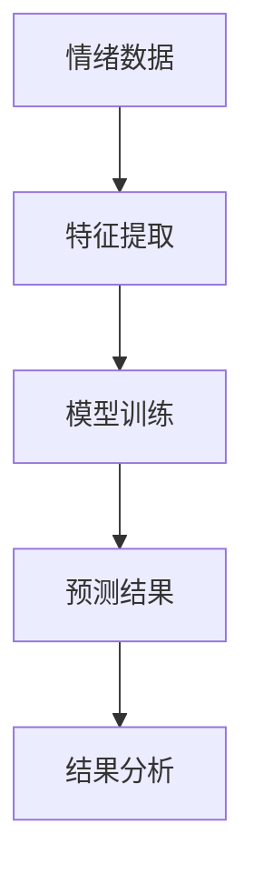
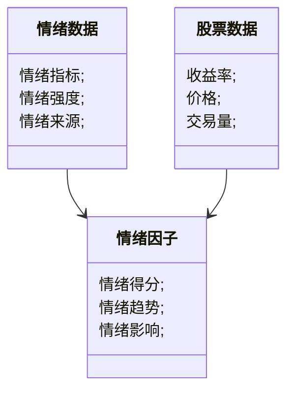

                 


# 特价股票投资中的情绪因子分析

> **关键词**：特价股票，情绪因子，投资者行为，机器学习，量化分析  
> **摘要**：本文深入探讨了情绪因子在特价股票投资中的重要性及其分析方法。通过背景介绍、情绪因子的核心概念、算法原理、系统设计、项目实战和最佳实践等多个方面，详细分析了情绪因子对投资者决策和市场走势的影响，提供了从理论到实践的全面指导。

---

## 第1章: 特价股票与情绪因子的背景介绍

### 1.1 特价股票的基本概念

#### 1.1.1 特价股票的定义与特点  
特价股票通常指价格低于市场平均水平的股票，具有低估值、高成长潜力的特点。投资者通常认为这些股票存在被市场低估的机会，适合长期投资或价值投资。

#### 1.1.2 特价股票的投资价值分析  
特价股票的价值体现在其低于市场价的特性，但同时也伴随着较高的风险。投资者需要通过分析公司基本面、行业前景等因素来评估其投资价值。

#### 1.1.3 特价股票市场的参与者与交易机制  
参与者包括机构投资者、个人投资者和散户。交易机制涉及市场流动性、订单簿、市场深度等，影响股票的买卖价差和交易成本。

### 1.2 情绪因子的定义与作用

#### 1.2.1 情绪因子的基本概念  
情绪因子是指投资者情绪波动对市场行为的影响，包括贪婪、恐惧等情绪，通过市场参与者的交易行为反映出来。

#### 1.2.2 情绪因子在股票投资中的作用机制  
情绪因子通过影响投资者决策，进而影响股票价格波动。例如，市场恐慌情绪可能导致抛售行为，从而压低股价。

#### 1.2.3 情绪因子与其他市场因子的关系  
情绪因子与市场波动性、流动性等因子密切相关，共同构成市场行为的复杂性。

---

## 第2章: 情绪因子在特价股票投资中的核心作用

### 2.1 投资者情绪对股票价格的影响

#### 2.1.1 投资者情绪的分类与特征  
投资者情绪分为乐观和悲观两类，通常通过市场参与度、交易量和价格波动来衡量。

#### 2.1.2 情绪波动对股票价格的短期影响  
情绪波动会导致短期价格波动，例如市场恐慌时的抛售潮，可能引发股价快速下跌。

#### 2.1.3 情绪因子与市场波动性的关系  
情绪因子是市场波动性的重要驱动因素，高波动性通常伴随着强烈的情绪波动。

### 2.2 情绪因子的量化分析方法

#### 2.2.1 情绪指标的构建与计算  
常用的情绪指标包括恐慌指数（VIX）、投资者信心指数等，通过统计方法构建量化指标。

#### 2.2.2 情绪数据的来源与获取方式  
情绪数据可以通过社交媒体分析、新闻媒体情绪分析和交易数据中的异常行为来获取。

#### 2.2.3 情绪因子的标准化与对比分析  
将不同来源的情绪数据标准化，便于对比分析和模型构建。

---

## 第3章: 情绪因子分析的理论基础

### 3.1 投资者行为理论

#### 3.1.1 投资者决策模型概述  
投资者决策模型包括理性决策模型和情感驱动决策模型，情绪因子在情感驱动模型中起重要作用。

#### 3.1.2 情感驱动的投资者行为分析  
投资者在情绪驱动下可能做出非理性决策，例如过度交易、恐慌性抛售等。

#### 3.1.3 行为金融学中的情绪因子研究  
行为金融学研究表明，情绪因子在解释市场异象（如市场泡沫、恐慌性抛售）中起关键作用。

### 3.2 情绪因子的统计学分析

#### 3.2.1 情绪因子的分布特征  
情绪因子在时间和空间上呈现周期性波动，需通过统计方法分析其分布特征。

#### 3.2.2 情绪因子与股票收益的相关性分析  
通过回归分析等方法，研究情绪因子与股票收益之间的相关性。

#### 3.2.3 情绪因子的时序分析方法  
使用ARIMA等时间序列模型，分析情绪因子的动态变化及其对股票价格的影响。

---

## 第4章: 情绪因子分析的算法原理

### 4.1 情绪因子分析的数学模型

#### 4.1.1 情绪因子的线性回归模型  
建立情绪因子与股票收益的线性回归模型，分析情绪因子对收益的影响程度。

#### 4.1.2 基于机器学习的情绪预测模型  
使用随机森林、支持向量机等机器学习算法，构建情绪因子预测模型。

#### 4.1.3 情绪因子与市场风险的关系模型  
通过Copula模型等分析情绪因子与其他市场风险因子之间的相关性。

### 4.2 情绪因子分析的算法实现

#### 4.2.1 基于Python的情绪因子分析代码  
```python
import pandas as pd
import numpy as np
from sklearn.ensemble import RandomForestRegressor
from sklearn.metrics import mean_squared_error

# 假设我们已经获取了情绪因子数据和股票收益数据
# 情绪因子数据：df_emotion
# 股票收益数据：df_return

# 构建模型
model = RandomForestRegressor(n_estimators=100)
model.fit(df_emotion, df_return)

# 预测收益
predicted_return = model.predict(df_emotion)
mse = mean_squared_error(df_return, predicted_return)
print(f"均方误差：{mse}")
```

#### 4.2.2 情绪因子分析的流程图  


---

## 第5章: 情绪因子分析的系统设计

### 5.1 问题场景介绍

#### 5.1.1 系统目标  
构建一个基于情绪因子的特价股票投资分析系统，帮助投资者做出更明智的决策。

#### 5.1.2 系统功能需求  
包括情绪数据采集、情绪因子计算、情绪预测模型构建和投资决策支持等功能。

### 5.2 系统功能设计

#### 5.2.1 领域模型设计  


#### 5.2.2 系统架构设计  


---

## 第6章: 情绪因子分析的项目实战

### 6.1 环境安装

#### 6.1.1 安装Python环境  
安装Anaconda或Miniconda，确保Python版本为3.8以上。

#### 6.1.2 安装依赖库  
安装pandas、numpy、scikit-learn、beautifulsoup4等库。

### 6.2 数据收集与处理

#### 6.2.1 情绪数据采集  
从新闻网站、社交媒体等来源采集情绪数据，并进行清洗和预处理。

#### 6.2.2 股票数据获取  
从金融数据源（如Yahoo Finance）获取特价股票的历史数据。

### 6.3 模型训练与优化

#### 6.3.1 情绪预测模型训练  
使用随机森林模型训练情绪预测模型，并进行超参数优化。

#### 6.3.2 模型评估与优化  
通过交叉验证评估模型性能，调整参数以提高预测准确性。

### 6.4 结果分析与投资策略制定

#### 6.4.1 情绪因子与股票收益的关系分析  
通过回归分析等方法，验证情绪因子对股票收益的影响。

#### 6.4.2 投资策略制定  
基于情绪因子分析结果，制定买入、卖出或持仓的投资策略。

---

## 第7章: 最佳实践与小结

### 7.1 小结

#### 7.1.1 情绪因子分析的核心要点  
情绪因子是影响特价股票投资的重要因素，需结合市场环境和公司基本面进行综合分析。

#### 7.1.2 系统设计与实现的关键点  
系统设计需注重数据采集、模型训练和结果分析的模块化设计，确保系统的可扩展性和可维护性。

### 7.2 注意事项

#### 7.2.1 情绪因子分析的局限性  
情绪因子分析存在一定的滞后性和不确定性，需结合其他市场因子进行综合判断。

#### 7.2.2 投资者情绪的波动性  
投资者情绪具有高度波动性，需及时跟踪市场动态，调整投资策略。

### 7.3 拓展阅读

#### 7.3.1 推荐书籍  
《行为金融学》、《机器学习在金融中的应用》等。

#### 7.3.2 推荐博客与资源  
建议关注知名金融博客和开源项目，获取最新的情绪因子分析方法和工具。

---

## 作者：AI天才研究院/AI Genius Institute & 禅与计算机程序设计艺术 /Zen And The Art of Computer Programming

---

以上为《特价股票投资中的情绪因子分析》的完整目录结构和详细内容，希望对您有所帮助！

