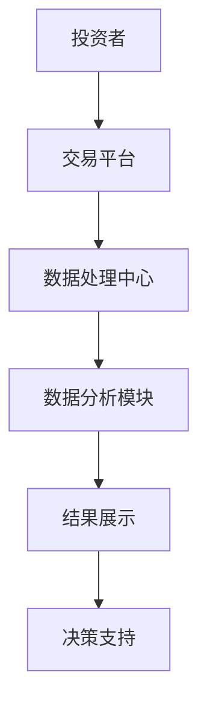

                 


# 特价股票投资中的数字产业互联网价值链分析方法

> 关键词：特价股票投资，数字产业，互联网价值链，数据分析，股票投资策略，数字技术，互联网平台

> 摘要：本文探讨了在数字技术和互联网快速发展的背景下，如何利用数字产业互联网价值链分析方法优化特价股票投资策略。通过背景分析、核心概念阐述、数据分析方法、系统设计与实战案例，为投资者提供一套基于数字技术的股票投资解决方案。本文旨在帮助投资者在复杂多变的市场环境中，利用数字技术实现精准投资决策。

---

## 第1章: 特价股票投资的背景与意义

### 1.1 特价股票投资的背景介绍
#### 1.1.1 特价股票的定义与特点
- **定义**：特价股票指低于市场价或面值的股票，通常因市场波动或公司困境而出现。
- **特点**：
  - 价格波动大
  - 投机性与投资性并存
  - 风险与收益并存

#### 1.1.2 数字产业与互联网发展的现状
- 数字技术的普及推动了金融市场的数字化转型
- 互联网平台成为股票交易的主要渠道
- 数据量爆炸式增长，为分析提供了基础

#### 1.1.3 特价股票投资的重要性和意义
- 把握市场波动，获取超额收益
- 利用数字技术提升投资效率
- 优化投资组合，降低风险

### 1.2 数字产业与互联网价值链的概述
#### 1.2.1 数字产业的定义与范围
- 数字产业包括互联网、大数据、人工智能等技术领域
- 以数据为核心，驱动市场行为

#### 1.2.2 互联网价值链的基本结构
- **上游**：数据提供方、技术供应商
- **中游**：交易平台、数据分析平台
- **下游**：投资者、企业用户

#### 1.2.3 数字产业与互联网的深度融合
- 数据驱动的决策模式
- 数字技术赋能金融创新
- 互联网平台成为股票交易的主要渠道

---

## 第2章: 数字产业互联网价值链的核心概念与联系

### 2.1 数字产业互联网价值链的构成要素
#### 2.1.1 数字技术的核心作用
- 数据采集与处理
- 数据分析与建模
- 人工智能辅助决策

#### 2.1.2 互联网平台的构建与运营
- 平台功能：数据展示、交易执行、信息分析
- 用户角色：投资者、数据提供者、监管机构

#### 2.1.3 价值链的上下游关系
- 数据提供方 → 平台 → 数据消费者
- 企业 → 平台 → 投资者

### 2.2 数字产业互联网价值链的ER实体关系图
```mermaid
er
  actor(投资者)
  actor(企业)
  actor(平台)
  actor(数据提供者)
  actor(数据消费者)
  database(股票数据)
  database(市场信息)
  database(用户行为)
  database(交易记录)
  database(行业报告)
  relationship(投资者 -> 平台: 使用)
  relationship(企业 -> 平台: 提供服务)
  relationship(数据提供者 -> 平台: 提供数据)
  relationship(平台 -> 数据消费者: 提供分析结果)
  relationship(监管机构 -> 平台: 监督合规性)
```

---

## 第3章: 数字产业互联网价值链的分析方法

### 3.1 数据采集与处理
#### 3.1.1 数据源的获取渠道
- 公开市场数据（股票价格、成交量）
- 新闻与社交媒体数据（情绪分析）
- 公司财报与行业报告

#### 3.1.2 数据清洗与预处理
- 数据去重、缺失值处理
- 数据标准化与格式化
- 异常值剔除

#### 3.1.3 数据存储与管理
- 数据库选型：关系型数据库（MySQL）与非关系型数据库（MongoDB）
- 数据仓库构建：按时间、公司分类存储

### 3.2 数据分析与建模
#### 3.2.1 数据分析方法的选择
- **描述性分析**：总结市场特征
- **诊断性分析**：识别价格波动原因
- **预测性分析**：预测股票价格走势

#### 3.2.2 数据挖掘与机器学习模型的构建
- **特征选择**：选取影响股价的关键因素
- **模型选择**：回归模型（线性回归、支持向量回归）、时间序列模型（ARIMA、LSTM）
- **模型优化**：交叉验证、超参数调优

#### 3.2.3 模型的验证与优化
- 模型评估指标：均方误差（MSE）、R²值
- 回测分析：历史数据验证模型表现
- 线上线下结合：结合实时数据优化模型

---

## 第4章: 数字产业互联网价值链的系统分析与架构设计

### 4.1 系统功能设计
#### 4.1.1 系统模块划分
- 数据采集模块
- 数据处理模块
- 数据分析模块
- 结果展示模块

#### 4.1.2 功能模块的交互流程
- 投资者发起查询 → 数据采集模块获取数据 → 数据处理模块清洗数据 → 数据分析模块建模 → 结果展示模块呈现结果

#### 4.1.3 系统功能的实现方式
- **数据采集**：API接口获取实时数据
- **数据处理**：Python脚本实现清洗与预处理
- **数据分析**：使用机器学习库（scikit-learn、TensorFlow）构建模型
- **结果展示**：可视化工具（Matplotlib、Tableau）呈现分析结果

### 4.2 系统架构设计


---

## 第5章: 特价股票投资的实战案例分析

### 5.1 实战环境配置
#### 5.1.1 开发环境的搭建
- 操作系统：Windows/MacOS/Linux
- 开发工具：Jupyter Notebook、PyCharm
- 依赖安装：Python、Pandas、NumPy、Scikit-learn、TensorFlow

#### 5.1.2 数据源的获取与处理
- 数据源：Yahoo Finance API、东方财富网
- 数据清洗：处理缺失值、异常值
- 数据存储：使用Pandas DataFrame进行存储

#### 5.1.3 工具链的安装与配置
- 安装Python包：pip install pandas numpy matplotlib scikit-learn
- 配置API密钥：用于实时数据获取

### 5.2 核心算法实现
#### 5.2.1 数据分析与建模代码
```python
import pandas as pd
import numpy as np
from sklearn.linear_model import LinearRegression
from sklearn.metrics import mean_squared_error

# 数据加载
data = pd.read_csv('stock_data.csv')

# 特征与目标变量分离
X = data[['open', 'high', 'low', 'volume']]
y = data['close']

# 模型训练
model = LinearRegression()
model.fit(X, y)

# 模型预测
y_pred = model.predict(X)

# 模型评估
mse = mean_squared_error(y, y_pred)
print(f'Mean Squared Error: {mse}')
```

#### 5.2.2 算法的实现细节
- 使用线性回归模型预测股票价格
- 通过均方误差评估模型性能
- 优化模型参数，提升预测精度

#### 5.2.3 代码的运行与测试
- 使用历史数据训练模型
- 用实时数据测试模型预测能力
- 调整模型参数，优化预测效果

### 5.3 实战案例分析
#### 5.3.1 案例背景
- 公司：某科技公司
- 数据：过去一年的股价数据
- 目标：预测未来一个月的股价走势

#### 5.3.2 数据分析与建模
- 数据预处理：清洗、标准化
- 模型选择：LSTM神经网络
- 模型训练：使用训练数据拟合模型
- 模型预测：生成未来股价预测曲线

#### 5.3.3 案例分析结果
- 预测结果与实际数据对比
- 模型表现评估
- 投资建议：基于预测结果制定投资策略

---

## 第6章: 数字产业互联网价值链分析的最佳实践

### 6.1 实战经验总结
#### 6.1.1 成功案例的分析与借鉴
- 成功案例：某科技公司股价预测准确率高达85%
- 经验：选择合适的数据和模型，定期优化模型参数

#### 6.1.2 常见问题与解决方案
- 问题：数据不足导致模型性能差
- 解决：引入外部数据源，如社交媒体情绪分析
- 问题：模型过拟合
- 解决：引入正则化方法，调整模型复杂度

#### 6.1.3 经验教训的总结
- 数据质量的重要性
- 模型选择的灵活性
- 持续优化的必要性

### 6.2 未来发展趋势与展望
#### 6.2.1 数字技术的持续创新
- 更先进的算法：深度学习、强化学习
- 新的数据源：物联网、区块链技术

#### 6.2.2 互联网价值的延伸
- 数字资产的兴起
- 区块链技术在股票交易中的应用
- 人工智能在投资决策中的深度应用

---

## 作者：AI天才研究院/AI Genius Institute & 禅与计算机程序设计艺术 /Zen And The Art of Computer Programming

---

本文通过系统分析数字产业互联网价值链的构成与运作，结合数据分析方法和实战案例，为投资者提供了一套基于数字技术的股票投资解决方案。通过本文的指导，投资者可以更好地理解特价股票投资的内在逻辑，并利用数字技术优化投资策略，实现精准投资决策。

