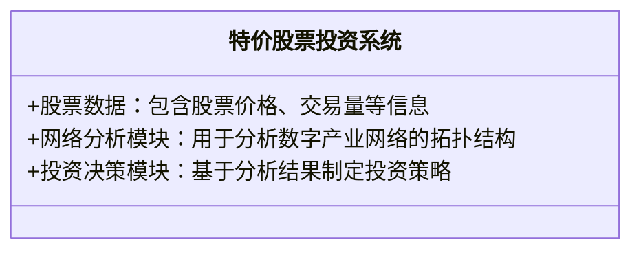

                 


# 特价股票投资中的数字产业价值网络拓扑分析方法

> 关键词：特价股票，数字产业，网络拓扑，分析方法，算法

> 摘要：本文探讨了在特价股票投资中，如何通过数字产业价值网络的拓扑分析方法，识别关键节点和关系，优化投资策略。通过网络拓扑分析，投资者可以更好地理解市场结构，发现潜在投资机会，并制定更科学的投资决策。

---

# 目录

1. [背景介绍](#背景介绍)
2. [数字产业价值网络的拓扑结构分析](#数字产业价值网络的拓扑结构分析)
3. [网络拓扑分析的核心算法](#网络拓扑分析的核心算法)
4. [数学模型与公式推导](#数学模型与公式推导)
5. [系统架构设计与实现](#系统架构设计与实现)
6. [项目实战：环境安装与核心代码实现](#项目实战环境安装与核心代码实现)
7. [总结与展望](#总结与展望)

---

## 背景介绍

### 1.1 特价股票投资的定义与特点

#### 1.1.1 特价股票的定义

特价股票是指价格相对较低的股票，通常具有较高的潜在增长率或市场恢复潜力。这类股票通常被看作是价值投资的标的，适合长期投资者。

#### 1.1.2 特价股票投资的核心特点

- 价格低估：股票价格低于其内在价值。
- 高成长潜力：公司具有较高的增长潜力。
- 市场波动性：市场波动可能导致股票价格短期下跌。

#### 1.1.3 特价股票投资的市场定位

在股票市场中，特价股票通常存在于中小盘股或周期性行业，这类股票在市场低迷时可能被低估，而在市场复苏时可能表现出色。

---

### 1.2 数字产业价值网络的构建

#### 1.2.1 数字产业的定义与范围

数字产业是指基于数字技术的产业，包括信息技术、互联网、人工智能、大数据等领域。数字产业的参与者包括企业、投资者、技术供应商等。

#### 1.2.2 价值网络的构建原理

价值网络是指产业中各参与者之间的关系网络，包括供应链、合作伙伴、竞争对手等。通过构建价值网络，可以分析产业中的关键节点和关系。

#### 1.2.3 数字产业价值网络的拓扑特征

数字产业价值网络的拓扑特征包括节点度、中心性和社区结构等。这些特征可以帮助投资者识别关键企业或潜在投资机会。

---

### 1.3 特价股票投资中的网络拓扑分析方法

#### 1.3.1 网络拓扑分析的定义

网络拓扑分析是通过对网络结构的分析，识别网络中的关键节点和关系。在特价股票投资中，可以通过分析数字产业网络的拓扑结构，发现潜在的投资机会。

#### 1.3.2 特价股票投资中网络拓扑分析的意义

网络拓扑分析可以帮助投资者识别产业中的关键企业，分析这些企业的关系，从而预测市场趋势和股票价格走势。

#### 1.3.3 网络拓扑分析的核心步骤

1. 数据收集：收集数字产业中的企业信息和市场数据。
2. 网络构建：构建数字产业价值网络，包括节点和边。
3. 拓扑分析：使用网络分析算法识别关键节点和社区结构。
4. 投资决策：根据分析结果制定投资策略。

---

## 数字产业价值网络的拓扑结构分析

### 2.1 数字产业中的节点与关系

#### 2.1.1 节点的定义与分类

节点代表数字产业中的企业或个体，可以分为核心企业、供应商、合作伙伴等。

#### 2.1.2 关系的定义与类型

关系代表企业之间的联系，可以是供应链关系、合作关系、竞争关系等。

#### 2.1.3 节点与关系的权重计算

权重表示关系的重要性，可以通过企业间的交易额、合作频率等指标计算。

---

### 2.2 网络拓扑分析的核心指标

#### 2.2.1 度数中心性

度数中心性表示节点在网络中的连接数量，度数高的节点通常具有较高的影响力。

#### 2.2.2 介数中心性

介数中心性表示节点在网络中的桥梁作用，介数高的节点通常位于重要的路径上。

#### 2.2.3 聚类系数

聚类系数表示节点邻居之间的连接密度，聚类系数高的节点通常位于紧密的社区中。

---

### 2.3 数字产业价值网络的拓扑特征

#### 2.3.1 网络的密度与稀疏性

密度表示网络中边的数量与可能边数的比值，稀疏网络通常表示企业之间的关系较少。

#### 2.3.2 网络的模块化

模块化表示网络中社区结构的清晰程度，高模块化的网络通常表示企业可以分为多个紧密的社区。

#### 2.3.3 网络的鲁棒性与脆弱性

鲁棒性表示网络在节点被移除后的保持连通的能力，脆弱的网络在节点被移除后容易断裂。

---

## 网络拓扑分析的核心算法

### 3.1 PageRank算法

#### 3.1.1 PageRank算法的原理

PageRank算法用于评估网页的重要性，通过分析网页间的超链接关系，计算每个网页的权重。

#### 3.1.2 PageRank算法的实现步骤

1. 初始化每个网页的权重为1。
2. 迭代计算每个网页的权重，权重更新公式为：
   $$ PR(i) = \sum_{j \in In(i)} \frac{PR(j)}{Out(j)} $$

#### 3.1.3 PageRank算法的优缺点

优点：能够发现重要的节点；缺点：计算复杂度高，需要大量的存储空间。

---

### 3.2 Louvain算法

#### 3.2.1 Louvain算法的原理

Louvain算法用于社区检测，通过优化模块化函数，将网络划分为多个社区。

#### 3.2.2 Louvain算法的实现步骤

1. 初始化每个节点为一个社区。
2. 迭代优化模块化函数，将节点分配到最优社区。
3. 重复步骤2，直到模块化无法优化。

#### 3.2.3 Louvain算法的优缺点

优点：计算速度快，适用于大规模网络；缺点：可能无法找到全局最优解。

---

## 数学模型与公式推导

### 4.1 PageRank算法的数学模型

PageRank算法的数学模型可以表示为：

$$ PR(i) = \sum_{j \in In(i)} \frac{PR(j)}{Out(j)} $$

其中，$PR(i)$ 表示节点 $i$ 的 PageRank 值，$In(i)$ 表示指向节点 $i$ 的节点集合，$Out(j)$ 表示节点 $j$ 的出度。

---

## 系统架构设计与实现

### 5.1 问题场景介绍

在特价股票投资中，投资者需要分析数字产业网络的拓扑结构，识别关键企业，制定投资策略。

---

### 5.2 系统功能设计

#### 5.2.1 领域模型（Mermaid 类图）



---

### 5.3 系统架构设计（Mermaid 架构图）


---

## 项目实战：环境安装与核心代码实现

### 6.1 环境安装

需要安装 Python、网络分析库（如 NetworkX、Gephi）和数据处理库（如 Pandas、NumPy）。

---

### 6.2 核心代码实现

#### 6.2.1 PageRank 算法的实现

```python
import networkx as nx

def pagerank(G):
    pr = nx.pagerank(G)
    return pr
```

#### 6.2.2 Louvain 算法的实现

```python
import community as community_module

def louvain_communities(G):
    partition = community_module.community_louvain(G)
    return partition
```

---

## 总结与展望

### 7.1 总结

通过数字产业价值网络的拓扑分析，投资者可以识别关键企业，制定科学的投资策略。本文介绍了网络拓扑分析的核心算法和实现方法，并通过案例分析展示了其应用价值。

### 7.2 展望

未来，可以进一步优化网络分析算法，结合人工智能技术，提升分析效率和准确性。同时，可以扩展应用场景，探索更多投资机会。

---

# 作者：AI天才研究院 & 禅与计算机程序设计艺术

---

以上是《特价股票投资中的数字产业价值网络拓扑分析方法》的技术博客文章大纲和内容。

