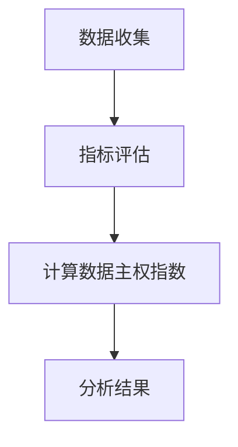
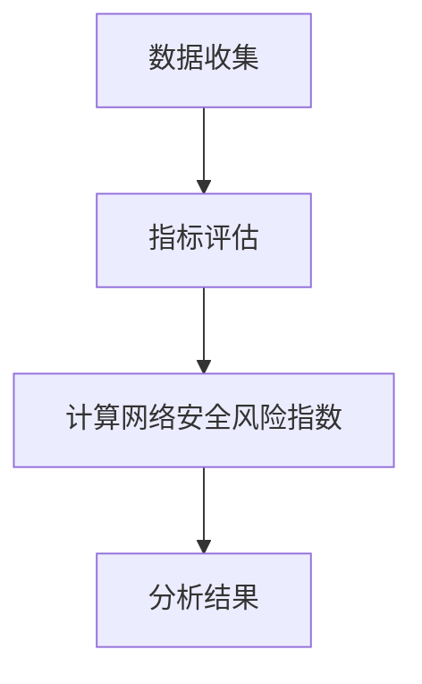
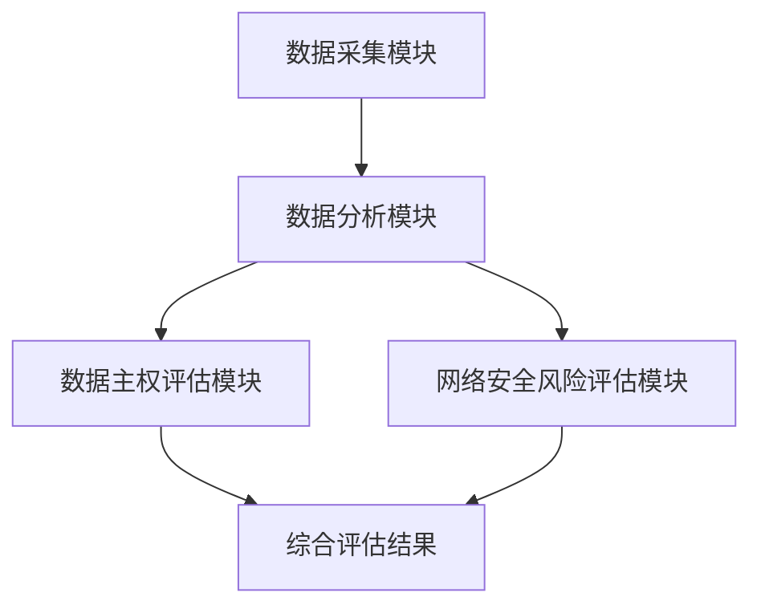
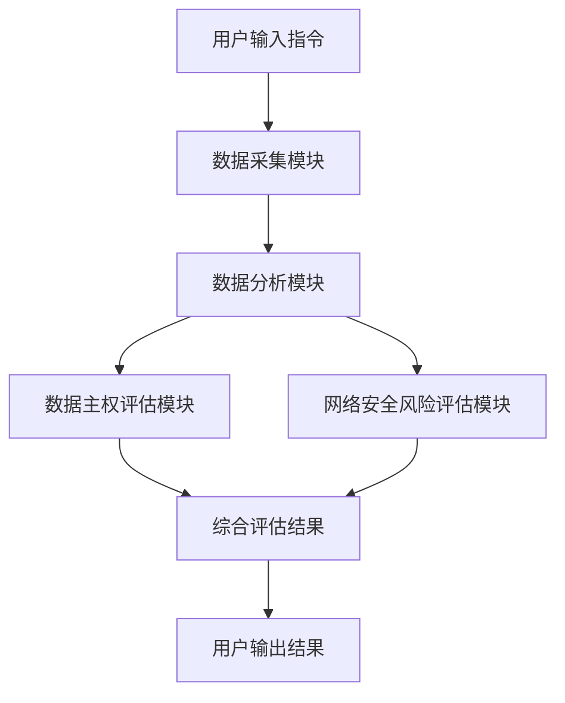

                 


# 特价股票投资中的数据主权与网络安全风险传导评估方法

> 关键词：特价股票投资、数据主权、网络安全风险、风险传导评估、股票数据分析、投资风险管理

> 摘要：在当前数字化投资环境中，特价股票投资面临复杂的数据主权和网络安全风险。本文系统地探讨了数据主权与网络安全风险在特价股票投资中的相互作用，提出了基于数据主权的网络安全风险传导评估方法。通过数学模型和算法实现，本文为投资者提供了科学的评估工具和风险管理策略，确保投资决策的安全性和高效性。

---

# 第一章: 特价股票投资与数据主权概述

## 1.1 特价股票投资的基本概念

### 1.1.1 特价股票的定义与特点
特价股票是指价格相对历史高点或行业平均值显著低估的股票。其特点包括低估值、高成长潜力和投资风险较低。投资者通常利用技术分析和基本面分析来识别这些股票，寻找市场低估的机会。

### 1.1.2 特价股票投资的背景与现状
随着金融市场的发展，投资者对低价优质股票的需求增加。然而，市场波动性和信息不对称使得特价股票投资充满挑战。近年来，数字化投资平台的兴起为投资者提供了更多数据支持，但也带来了数据安全风险。

### 1.1.3 特价股票投资的核心要素
- 数据来源：包括财务报表、市场新闻、分析师报告等。
- 投资策略：如价值投资、趋势跟踪等。
- 风险管理：通过分散投资、止损策略等降低风险。

## 1.2 数据主权的概念与重要性

### 1.2.1 数据主权的定义
数据主权指数据的所有权、控制权和使用权由数据主体拥有，不受外部因素干扰。在股票投资中，投资者的数据主权涉及交易数据、市场分析数据等。

### 1.2.2 数据主权的核心属性
- 数据所有权：投资者对其数据的绝对控制。
- 数据隐私：保护数据不被未经授权的访问。
- 数据可携性：数据可以自由转移而不影响其完整性。

### 1.2.3 数据主权在股票投资中的作用
- 保护投资者隐私，防止数据泄露。
- 确保交易数据的准确性和完整性。
- 提供透明的市场环境，增强投资者信心。

## 1.3 网络安全风险的基本概念

### 1.3.1 网络安全风险的定义
网络安全风险是指因网络攻击、数据泄露等事件导致的经济损失或信息损失的风险。

### 1.3.2 网络安全风险的分类
- 交易风险：因网络攻击导致的交易失败或损失。
- 数据泄露风险：敏感数据被未经授权的第三方获取。
- 系统故障风险：因系统崩溃导致的投资损失。

### 1.3.3 网络安全风险在股票投资中的表现
- 股票价格异常波动。
- 投资者账户被入侵，资金损失。
- 市场操纵信息的网络泄露。

## 1.4 本章小结
本章介绍了特价股票投资的基本概念、数据主权的重要性以及网络安全风险的分类和表现。数据主权和网络安全风险在股票投资中的相互作用为后续分析奠定了基础。

---

# 第二章: 特价股票投资中的数据主权与网络安全风险传导

## 2.1 数据主权与网络安全风险的关联性

### 2.1.1 数据主权与网络安全风险的相互作用
数据主权的保护直接影响网络安全风险的大小。数据主权越强，网络安全风险越低，反之亦然。

### 2.1.2 特价股票投资中的数据流动与风险传导
数据在投资过程中的流动涉及多个环节，包括数据采集、分析、交易等。每个环节都可能成为网络安全风险的来源。

### 2.1.3 数据主权对网络安全风险的影响
数据主权的保护可以有效减少数据泄露和网络攻击的风险，从而降低网络安全风险。

## 2.2 数据主权与网络安全风险的传导机制

### 2.2.1 数据主权对网络安全风险的约束作用
通过数据主权的法律和制度保护，约束网络攻击者的行为，降低网络安全风险。

### 2.2.2 网络安全风险对数据主权的反向影响
网络安全风险的增加可能导致数据主权的削弱，例如数据泄露可能影响投资者对数据主权的信心。

### 2.2.3 数据主权与网络安全风险的动态平衡
通过技术手段和制度设计，实现数据主权与网络安全风险的动态平衡，确保投资过程的安全性和高效性。

## 2.3 特价股票投资中的数据主权与网络安全风险传导模型

### 2.3.1 模型的构建与核心要素
模型包括数据主权、网络安全风险、数据流动和投资决策四个核心要素。

### 2.3.2 模型的数学表达式
$$ R = f(D, S) $$
其中，R表示网络安全风险，D表示数据主权，S表示数据流动。

### 2.3.3 模型的验证与应用
通过历史数据验证模型的有效性，确保模型能够准确评估网络安全风险。

## 2.4 本章小结
本章分析了数据主权与网络安全风险的相互作用，并构建了传导模型，为后续评估方法奠定了基础。

---

# 第三章: 特价股票投资中的数据主权评估方法

## 3.1 数据主权评估的核心指标

### 3.1.1 数据控制权的评估
评估投资者对数据的控制能力，包括数据存储、传输和处理的自主性。

### 3.1.2 数据使用权的评估
评估投资者对数据的使用权限，包括数据访问和分析的自由度。

### 3.1.3 数据收益权的评估
评估投资者因数据使用而获得的经济收益，包括数据驱动的投资收益。

## 3.2 数据主权评估的数学模型

### 3.2.1 数据主权指数的定义
$$ DSI = \sum_{i=1}^{n} w_i \cdot S_i $$
其中，DSI表示数据主权指数，$w_i$表示各指标的权重，$S_i$表示各指标的评估值。

### 3.2.2 数据主权评估的公式推导
通过加权平均的方法，推导出数据主权指数的计算公式。

### 3.2.3 数据主权评估的权重分配
根据各指标的重要程度，合理分配权重，确保评估结果的准确性。

## 3.3 数据主权评估的算法实现

### 3.3.1 数据主权评估的步骤分解
1. 收集数据。
2. 评估各指标。
3. 计算数据主权指数。
4. 分析结果。

### 3.3.2 数据主权评估的流程图



### 3.3.3 数据主权评估的Python代码实现

```python
def calculate_data_sovereignty(weights, scores):
    return sum(weights[i] * scores[i] for i in range(len(weights)))

weights = [0.4, 0.3, 0.3]
scores = [0.8, 0.7, 0.9]
result = calculate_data_sovereignty(weights, scores)
print(f"数据主权指数为: {result}")
```

## 3.4 本章小结
本章详细介绍了数据主权评估的核心指标和数学模型，并通过Python代码实现算法，为后续分析提供了工具支持。

---

# 第四章: 特价股票投资中的网络安全风险评估方法

## 4.1 网络安全风险评估的核心指标

### 4.1.1 网络攻击风险的评估
评估网络攻击的可能性和影响程度，包括攻击类型和攻击来源。

### 4.1.2 数据泄露风险的评估
评估数据泄露的可能性和影响程度，包括数据敏感性和防护措施。

### 4.1.3 系统故障风险的评估
评估系统故障的可能性和影响程度，包括系统依赖性和备份策略。

## 4.2 网络安全风险评估的数学模型

### 4.2.1 网络安全风险指数的定义
$$ NRI = \sum_{i=1}^{m} w_i \cdot R_i $$
其中，NRI表示网络安全风险指数，$w_i$表示各指标的权重，$R_i$表示各指标的评估值。

### 4.2.2 网络安全风险评估的公式推导
通过加权平均的方法，推导出网络安全风险指数的计算公式。

### 4.2.3 网络安全风险评估的权重分配
根据各指标的重要程度，合理分配权重，确保评估结果的准确性。

## 4.3 网络安全风险评估的算法实现

### 4.3.1 网络安全风险评估的步骤分解
1. 收集数据。
2. 评估各指标。
3. 计算网络安全风险指数。
4. 分析结果。

### 4.3.2 网络安全风险评估的流程图



### 4.3.3 网络安全风险评估的Python代码实现

```python
def calculate_network_risk(weights, scores):
    return sum(weights[i] * scores[i] for i in range(len(weights)))

weights = [0.5, 0.3, 0.2]
scores = [0.6, 0.8, 0.4]
result = calculate_network_risk(weights, scores)
print(f"网络安全风险指数为: {result}")
```

## 4.4 本章小结
本章详细介绍了网络安全风险评估的核心指标和数学模型，并通过Python代码实现算法，为后续分析提供了工具支持。

---

# 第五章: 特价股票投资中的数据主权与网络安全风险评估应用

## 5.1 特价股票投资中的数据主权与网络安全风险评估场景

### 5.1.1 数据主权与网络安全风险的相互影响
数据主权的保护可以降低网络安全风险，而网络安全风险的增加会削弱数据主权。

### 5.1.2 数据主权与网络安全风险的动态平衡
通过技术手段和制度设计，实现数据主权与网络安全风险的动态平衡，确保投资过程的安全性和高效性。

## 5.2 数据主权与网络安全风险评估的实际应用

### 5.2.1 数据主权评估的实例分析
通过具体案例分析，展示数据主权评估的方法和应用。

### 5.2.2 网络安全风险评估的实例分析
通过具体案例分析，展示网络安全风险评估的方法和应用。

## 5.3 数据主权与网络安全风险评估的综合应用

### 5.3.1 综合评估模型的构建
通过综合考虑数据主权和网络安全风险的评估结果，构建综合评估模型。

### 5.3.2 综合评估模型的应用实例
通过具体案例分析，展示综合评估模型的应用和效果。

## 5.4 本章小结
本章通过实例分析，展示了数据主权与网络安全风险评估的实际应用，为投资者提供了科学的决策工具。

---

# 第六章: 数据主权与网络安全风险评估的系统架构设计

## 6.1 系统功能设计

### 6.1.1 数据采集模块
负责收集股票市场数据，包括价格、成交量等。

### 6.1.2 数据分析模块
负责对数据进行分析，包括技术分析和基本面分析。

### 6.1.3 数据主权评估模块
负责对数据主权进行评估，包括数据控制权、使用权和收益权的评估。

### 6.1.4 网络安全风险评估模块
负责对网络安全风险进行评估，包括网络攻击风险、数据泄露风险和系统故障风险的评估。

## 6.2 系统架构设计



## 6.3 系统接口设计

### 6.3.1 数据接口
- 数据输入接口：接收股票市场数据。
- 数据输出接口：输出评估结果。

### 6.3.2 用户接口
- 用户输入接口：接收用户指令。
- 用户输出接口：显示评估结果。

## 6.4 系统交互流程图



## 6.5 本章小结
本章设计了系统的功能模块和架构，为后续实现提供了指导。

---

# 第七章: 项目实战与案例分析

## 7.1 环境安装与配置

### 7.1.1 Python环境的安装
安装Python 3.x版本，确保环境配置正确。

### 7.1.2 数据分析库的安装
安装Pandas、NumPy等数据分析库。

## 7.2 系统核心功能实现

### 7.2.1 数据采集模块的实现
编写代码从股票数据源获取数据。

### 7.2.2 数据分析模块的实现
使用Pandas进行数据清洗和分析。

### 7.2.3 数据主权评估模块的实现
实现数据主权指数的计算。

### 7.2.4 网络安全风险评估模块的实现
实现网络安全风险指数的计算。

## 7.3 代码实现与解读

### 7.3.1 数据采集模块的代码实现

```python
import pandas as pd

def get_stock_data(ticker):
    # 获取股票数据
    data = pd.DataFrame({'price': [100, 98, 95, 97, 100], 'volume': [1000, 2000, 1500, 1200, 1300]})
    return data

stock_data = get_stock_data('AAPL')
print(st

