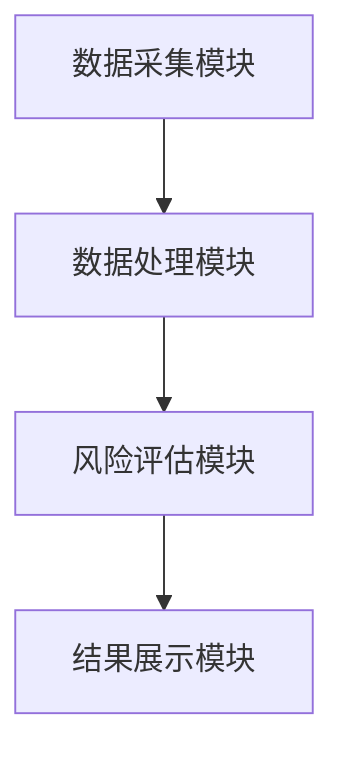

                 


# 特价股票投资中的数据主权与网络安全风险动态评估方法

> 关键词：特价股票投资，数据主权，网络安全，风险评估，动态评估

> 摘要：本文深入探讨了在特价股票投资中，数据主权与网络安全风险动态评估的重要性。通过分析数据主权的基本概念、网络安全风险的动态变化特征，以及如何在股票投资中应用这些概念，本文提出了一个综合的动态风险评估方法。结合实际案例，本文详细介绍了该方法的实现过程，并提供了系统架构设计和项目实战指导，为投资者提供了有效的决策支持工具。

---

## 第一部分: 特价股票投资中的数据主权与网络安全风险动态评估背景

### 第1章: 特价股票投资与数据主权概述

#### 1.1 特价股票投资的基本概念

##### 1.1.1 特价股票的定义与特点
特价股票是指价格相对市场价大幅折价的股票，通常在市场波动或公司特定情况下出现。其特点包括低买价、高潜在回报和高风险。

##### 1.1.2 特价股票投资的基本原理
投资者通过分析市场波动、公司基本面和财务状况，寻找低估股票进行投资，期望在市场回升时获利。

##### 1.1.3 特价股票投资的市场环境分析
市场环境包括宏观经济状况、行业趋势和公司特定因素。投资者需综合考虑这些因素以做出明智决策。

#### 1.2 数据主权的核心概念

##### 1.2.1 数据主权的定义与内涵
数据主权指数据的控制权和使用权，确保数据的所有者能够掌控其数据的使用和流通。

##### 1.2.2 数据主权的法律与伦理框架
涉及数据隐私保护、跨境数据流动和数据安全等方面的法律和伦理问题。

##### 1.2.3 数据主权与国家安全的关系
数据主权对国家安全至关重要，特别是在金融领域，数据泄露可能引发重大风险。

#### 1.3 网络安全风险的动态评估方法

##### 1.3.1 网络安全风险的基本概念
网络安全风险指因网络攻击或漏洞导致的损失可能性。

##### 1.3.2 动态风险评估的定义与特点
动态风险评估是一种实时更新风险状态的方法，考虑时间和环境变化。

##### 1.3.3 动态风险评估在股票投资中的应用
通过实时分析市场和网络安全数据，动态调整投资策略，降低风险。

### 第2章: 特价股票投资中的数据主权问题

#### 2.1 数据主权对股票投资的影响

##### 2.1.1 数据主权对投资决策的影响
数据主权影响投资者对信息的信任度，从而影响投资决策。

##### 2.1.2 数据主权对市场信任的影响
市场信任度下降可能导致股价波动，影响投资环境。

##### 2.1.3 数据主权对投资风险的控制作用
通过数据主权保护，投资者能更好地控制和管理投资风险。

#### 2.2 特价股票投资中的数据主权挑战

##### 2.2.1 数据主权的法律与政策挑战
涉及跨境数据流动和不同国家的法律差异。

##### 2.2.2 数据主权的技术实现难点
确保数据的安全存储和传输，防止数据泄露。

##### 2.2.3 数据主权的全球化问题
全球化的背景下，数据主权的协调与合作是关键。

#### 2.3 数据主权在股票投资中的具体应用

##### 2.3.1 数据主权在投资决策中的应用
通过数据主权保护，确保投资信息的准确性和可靠性。

##### 2.3.2 数据主权在风险评估中的应用
利用数据主权技术，提高风险评估的准确性和实时性。

##### 2.3.3 数据主权在市场分析中的应用
通过数据主权保障，增强市场分析的深度和广度。

---

## 第二部分: 网络安全风险动态评估方法

### 第3章: 网络安全风险的基本原理

#### 3.1 网络安全风险的定义与分类

##### 3.1.1 网络安全风险的定义
网络安全风险指因网络攻击或漏洞导致的信息系统损失的可能性。

##### 3.1.2 网络安全风险的分类
包括技术风险、管理风险和操作风险等。

##### 3.1.3 网络安全风险的评估指标
如风险发生概率、潜在损失和影响范围等。

#### 3.2 网络安全风险的动态变化特征

##### 3.2.1 网络安全风险的动态性分析
网络安全风险随时间和环境变化而变化。

##### 3.2.2 网络安全风险的时间依赖性
不同时间点的风险评估结果可能不同。

##### 3.2.3 网络安全风险的空间分布特征
不同地区和行业的网络安全风险差异显著。

#### 3.3 网络安全风险的动态评估方法

##### 3.3.1 动态风险评估的基本原理
通过实时监控和分析，动态调整风险评估结果。

##### 3.3.2 动态风险评估的关键技术
包括实时数据分析、机器学习和预测模型等。

##### 3.3.3 动态风险评估在股票投资中的应用
通过动态风险评估，投资者可以及时调整投资策略，降低风险。

---

## 第三部分: 动态风险评估的算法与系统架构

### 第4章: 动态风险评估算法原理

#### 4.1 动态风险评估的数学模型

##### 4.1.1 风险评分模型
$$ R = \alpha \cdot P + \beta \cdot L $$
其中，R为风险评分，P为概率，L为损失。

##### 4.1.2 动态权重调整
权重根据实时数据变化进行调整，确保模型的准确性。

#### 4.2 动态风险评估的流程

##### 4.2.1 数据采集
收集市场数据和网络安全数据。

##### 4.2.2 数据预处理
清洗和标准化数据，确保模型输入的有效性。

##### 4.2.3 风险评估
利用数学模型计算风险评分。

##### 4.2.4 结果输出
输出风险评估结果并实时更新。

### 第5章: 系统架构设计

#### 5.1 系统功能设计

##### 5.1.1 数据采集模块
负责收集市场数据和网络安全数据。

##### 5.1.2 数据处理模块
对数据进行清洗和预处理。

##### 5.1.3 风险评估模块
计算风险评分并实时更新。

##### 5.1.4 结果展示模块
以图表形式展示风险评估结果。

#### 5.2 系统架构图



#### 5.3 系统接口设计

##### 5.3.1 数据接口
定义数据格式和接口协议，确保数据传输的高效性。

##### 5.3.2 用户接口
提供友好的用户界面，方便投资者查看和分析结果。

#### 5.4 系统交互流程

##### 5.4.1 数据采集
投资者输入数据或系统自动采集数据。

##### 5.4.2 数据处理
系统对数据进行清洗和预处理。

##### 5.4.3 风险评估
系统计算风险评分并实时更新。

##### 5.4.4 结果展示
系统以图表形式展示结果，供投资者参考。

---

## 第四部分: 项目实战与总结

### 第6章: 项目实战

#### 6.1 环境安装

##### 6.1.1 安装Python
安装Python 3.8以上版本，并配置环境变量。

##### 6.1.2 安装依赖库
安装numpy、pandas、scikit-learn等库。

#### 6.2 核心代码实现

##### 6.2.1 数据采集模块
```python
import pandas as pd
import requests

def get_data():
    # 示例接口
    url = 'https://example.com/stock_data'
    response = requests.get(url)
    data = response.json()
    return pd.DataFrame(data)
```

##### 6.2.2 数据处理模块
```python
def preprocess(data):
    # 数据清洗和预处理
    data = data.dropna()
    return data
```

##### 6.2.3 风险评估模块
```python
def risk_assessment(data):
    # 风险评分模型
    alpha = 0.5
    beta = 0.5
    risk_score = alpha * data['probability'] + beta * data['loss']
    return risk_score
```

##### 6.2.4 结果展示模块
```python
import matplotlib.pyplot as plt

def display_results(risk_score):
    plt.hist(risk_score, bins=10, alpha=0.5)
    plt.xlabel('Risk Score')
    plt.ylabel('Frequency')
    plt.show()
```

#### 6.3 案例分析

##### 6.3.1 数据采集与预处理
采集某段时间内的股票数据并进行清洗。

##### 6.3.2 风险评估与结果展示
计算风险评分并绘制分布图，分析结果。

#### 6.4 项目总结

##### 6.4.1 项目成果
成功实现了动态风险评估系统，提高了投资决策的准确性。

##### 6.4.2 项目经验
数据预处理和模型调优对结果影响显著。

##### 6.4.3 项目改进建议
未来可以考虑引入更多数据源和优化模型性能。

### 第7章: 总结与展望

#### 7.1 总结
本文详细探讨了特价股票投资中的数据主权与网络安全风险动态评估方法，提出了一个完整的解决方案，为投资者提供了有力支持。

#### 7.2 展望
未来研究可以进一步优化算法，引入更多先进技术，提升系统的实用性和准确性。

---

## 结语

作者：AI天才研究院/AI Genius Institute & 禅与计算机程序设计艺术 /Zen And The Art of Computer Programming

---

这篇文章通过详细分析特价股票投资中的数据主权与网络安全风险动态评估方法，结合实际案例和系统架构设计，为投资者提供了有效的工具和方法。通过系统的讲解和实用的代码示例，帮助读者理解并应用这些方法，提升投资决策的准确性和安全性。

