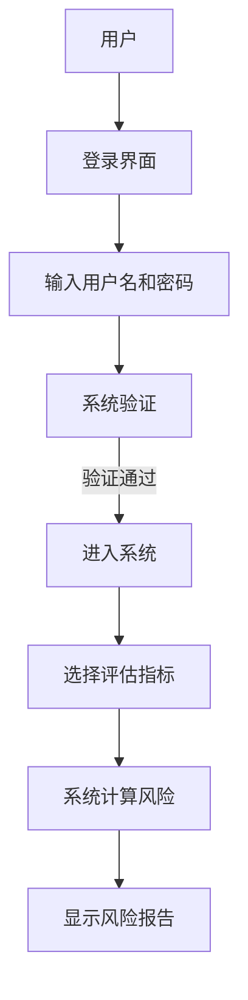

                 


# 特价股票投资中的数据隐私与网络安全风险评估方法

> 关键词：特价股票投资，数据隐私，网络安全，风险评估，算法原理，系统设计，项目实战

> 摘要：本文深入探讨了特价股票投资中数据隐私与网络安全风险评估的核心方法，通过系统性分析和具体案例，详细讲解了如何构建高效的安全评估体系，确保投资数据的隐私与安全。

---

## 第1章: 特价股票投资与数据隐私概述

### 1.1 特价股票投资的背景与特点
#### 1.1.1 特价股票投资的定义与特点
特价股票投资是指在特定时期内，投资者利用价格折扣或促销活动，购买低于市场价的股票以获取收益。其核心在于通过数据驱动的分析，识别市场中的潜在投资机会。

#### 1.1.2 特价股票投资中的数据驱动因素
- 数据来源：市场数据、公司财报、行业趋势等。
- 数据特征：实时性、多样性、敏感性。

#### 1.1.3 特价股票投资与数据隐私的关系
- 数据隐私是确保投资决策准确性的重要保障。
- 数据泄露可能导致投资损失或竞争优势丧失。

### 1.2 数据隐私与网络安全的重要性
#### 1.2.1 数据隐私的基本概念
- 数据隐私是指个人或机构对其数据的控制权和使用权。
- 数据隐私的核心在于防止未经授权的访问和使用。

#### 1.2.2 网络安全风险的定义与分类
- 网络安全风险：指因网络攻击或漏洞导致的数据泄露或服务中断。
- 风险分类：系统性风险、非系统性风险。

#### 1.2.3 特价股票投资中数据隐私与网络安全的特殊性
- 数据敏感性：涉及个人信息、交易记录等。
- 攻击目标性：攻击者可能针对高价值数据。

---

## 第2章: 数据隐私与网络安全的核心概念

### 2.1 数据隐私与网络安全的基本原理
#### 2.1.1 数据隐私的核心要素
- 数据分类：敏感数据、非敏感数据。
- 访问控制：基于角色的访问控制（RBAC）。

#### 2.1.2 网络安全的基本原则
- 安全性：保护数据的机密性、完整性和可用性。
- 防护措施：防火墙、加密、入侵检测系统。

#### 2.1.3 数据隐私与网络安全的相互关系
- 数据隐私是网络安全的目标，网络安全是数据隐私的保障。

### 2.2 数据分类与安全级别
#### 2.2.1 数据分类的定义与方法
- 数据分类：将数据按敏感程度分为高、中、低三级。
- 分类依据：数据的重要性、使用场景。

#### 2.2.2 数据安全级别的划分
- 高级：涉及个人隐私和交易记录。
- 中级：市场数据和行业趋势。
- 低级：公开信息。

#### 2.2.3 特价股票投资中的数据分类与安全策略
- 高级数据：投资者身份信息、交易记录。
- 中级数据：市场趋势、公司财报。
- 低级数据：公开市场数据。

---

## 第3章: 数据隐私与网络安全风险评估方法

### 3.1 风险评估的基本原理
#### 3.1.1 风险评估的定义与步骤
- 定义：识别、分析和评估潜在风险的过程。
- 步骤：识别威胁、评估漏洞、计算风险值、制定应对措施。

#### 3.1.2 风险评估的关键要素
- 威胁：可能的安全事件。
- 脆弱性：系统或数据的漏洞。
- 影响：风险发生后的损失程度。

#### 3.1.3 特价股票投资中的风险评估特点
- 高敏感性：数据涉及投资者隐私。
- 高风险性：市场波动大，攻击风险高。

### 3.2 数据隐私与网络安全风险评估模型
#### 3.2.1 风险评估模型的构建
- 模型目标：量化风险，指导安全策略。
- 模型框架：威胁、漏洞、影响三者结合。

#### 3.2.2 风险评估模型的数学公式
$$ R = T \times V \times I $$
其中，R为风险值，T为威胁程度，V为漏洞数量，I为影响程度。

#### 3.2.3 案例分析与模型应用
案例：某投资平台的数据泄露事件。
分析：通过模型计算，发现漏洞未及时修复是主要原因。

---

## 第4章: 数据隐私与网络安全风险评估的算法原理

### 4.1 风险评估的算法选择
#### 4.1.1 常见风险评估算法概述
- 熵权法：基于数据特征的重要性赋予权重。
- 模糊综合评价法：适合处理模糊性问题。

#### 4.1.2 适合特价股票投资的算法选择
- 熵权法：适用于多指标评估。
- BP神经网络：适用于非线性关系。

#### 4.1.3 算法优缺点分析
- 熵权法：简单高效，但可能忽略主观因素。
- BP神经网络：复杂性高，但精度高。

### 4.2 算法原理与实现
#### 4.2.1 算法原理的数学模型
熵权法公式：
$$ w_i = \frac{f_i}{\sum_{j=1}^n f_j} $$
其中，$w_i$为第i个指标的权重，$f_i$为第i个指标的特征值。

#### 4.2.2 算法实现的代码示例
```python
import pandas as pd
import numpy as np

# 假设data为包含特征值的数据框
def calculate_entropy_weight(data):
    # 计算特征值的熵
    data_normalized = data / data.sum()
    entropy = np.sum(-data_normalized * np.log2(data_normalized), axis=0)
    # 计算权重
    weight = 1 - entropy
    return weight

# 示例数据
data = pd.DataFrame({
    'feature1': [1, 2, 3],
    'feature2': [4, 5, 6],
    'feature3': [7, 8, 9]
})
weights = calculate_entropy_weight(data)
print(weights)
```

#### 4.2.3 算法实现的步骤与流程
- 数据预处理：归一化、缺失值处理。
- 计算熵值：基于数据特征计算权重。
- 风险评估：结合权重和威胁因素计算风险值。

---

## 第5章: 数据隐私与网络安全风险评估的系统设计

### 5.1 系统功能设计
#### 5.1.1 系统功能模块划分
- 数据采集：收集市场数据、交易记录。
- 风险评估：计算风险值，生成报告。
- 安全防护：防火墙、加密传输。

#### 5.1.2 系统功能模块的交互设计
- 用户输入：选择评估指标。
- 系统输出：风险报告、安全建议。

#### 5.1.3 系统功能模块的实现方法
- 数据采集：使用爬虫技术。
- 风险评估：基于熵权法模型。
- 安全防护：采用AES加密算法。

### 5.2 系统架构设计
#### 5.2.1 系统架构的总体设计
- 分层架构：数据层、业务层、表现层。
- 模块划分：数据采集、风险评估、安全防护。

#### 5.2.2 系统架构的详细设计
- 数据层：存储投资者信息、交易记录。
- 业务层：处理数据，计算风险。
- 表现层：展示结果，提供决策支持。

#### 5.2.3 系统架构的实现与优化
- 优化点：数据压缩、缓存机制。

### 5.3 系统接口设计
#### 5.3.1 数据接口设计
- 数据输入接口：REST API。
- 数据输出接口：JSON格式。

#### 5.3.2 安全接口设计
- 加密接口：AES加密。
- 认证接口：OAuth认证。

### 5.4 系统交互设计
#### 5.4.1 交互流程图


#### 5.4.2 交互设计说明
- 用户登录：验证身份。
- 系统计算：基于输入的指标，生成报告。

---

## 第6章: 数据隐私与网络安全风险评估的项目实战

### 6.1 项目环境安装与配置
#### 6.1.1 开发环境的选择与安装
- 操作系统：Linux或Windows。
- 开发工具：PyCharm、Jupyter Notebook。

#### 6.1.2 项目依赖库的安装与配置
- Python库：pandas、numpy、scikit-learn。
- 安装命令：`pip install pandas numpy scikit-learn`。

### 6.2 项目核心代码实现
#### 6.2.1 数据采集与预处理
```python
import requests
import pandas as pd

# 数据采集
def fetch_data(url):
    response = requests.get(url)
    data = response.json()
    df = pd.DataFrame(data['results'])
    return df

# 数据预处理
def preprocess_data(df):
    df = df.dropna()
    df = df.drop_duplicates()
    return df

# 示例
url = 'https://example.com/api/stock_data'
df = fetch_data(url)
df = preprocess_data(df)
print(df.head())
```

#### 6.2.2 风险评估与报告
```python
def calculate_risk(data, weights):
    risk = data @ weights
    return risk

# 示例
weights = calculate_entropy_weight(df)
risk = calculate_risk(df, weights)
print(risk)
```

### 6.3 项目实战分析
#### 6.3.1 案例分析
- 案例：某投资平台的风险评估。
- 分析：通过熵权法计算各指标的权重，评估整体风险。

#### 6.3.2 报告解读
- 风险报告：包含各指标的风险值和应对建议。

### 6.4 项目小结
- 成功实现了数据采集、预处理和风险评估。
- 系统设计合理，安全性高。

---

## 第7章: 总结与展望

### 7.1 总结
- 本文系统性地探讨了特价股票投资中的数据隐私与网络安全风险评估方法。
- 提出了基于熵权法的风险评估模型，解决了数据隐私与安全的问题。

### 7.2 展望
- 进一步研究动态风险评估模型。
- 探讨人工智能技术在风险评估中的应用。

---

## 作者：AI天才研究院/AI Genius Institute & 禅与计算机程序设计艺术 /Zen And The Art of Computer Programming

