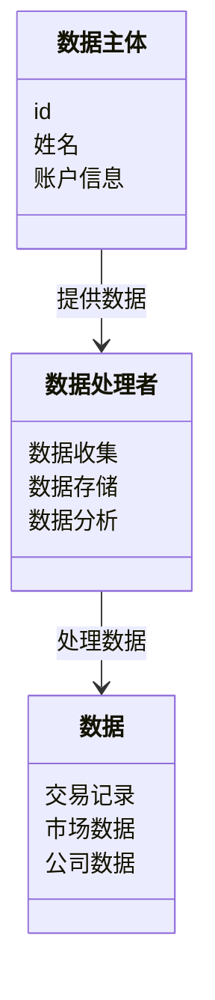
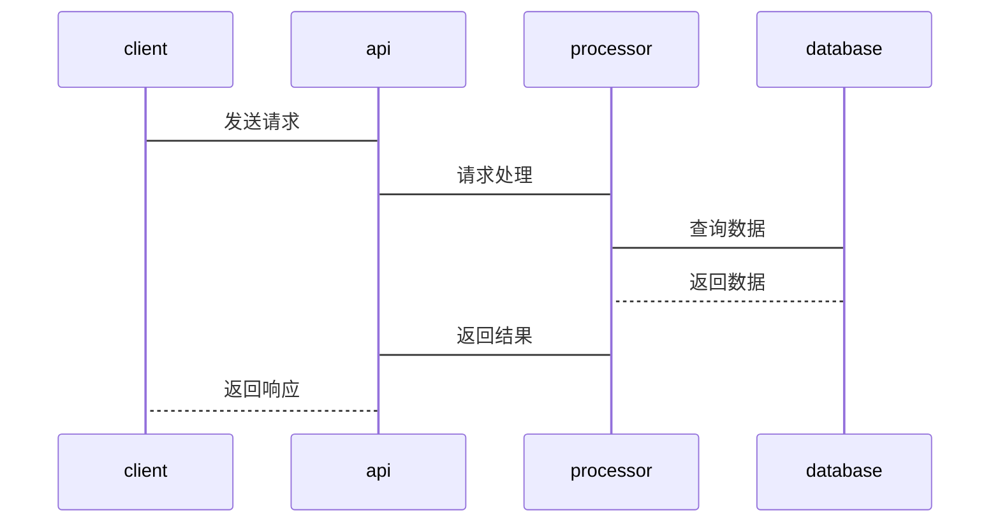

                 


# 特价股票投资中的数据隐私风险评估方法

> **关键词**: 数据隐私, 风险评估, 股票投资, 数据安全, 隐私保护

> **摘要**: 本文详细探讨了在特价股票投资过程中如何进行数据隐私风险评估。通过分析数据隐私风险的核心概念、评估框架、算法原理、系统设计以及实际案例，本文旨在为投资者和相关机构提供一种科学、系统的方法，以确保在投资过程中保护数据隐私，降低潜在风险。文章结合理论与实践，提供了一套完整的解决方案。

---

# 第1章: 特价股票投资与数据隐私风险概述

## 1.1 特价股票投资的背景与特点

### 1.1.1 特价股票投资的定义与特点
特价股票投资是指以低于市场价或折价购买股票的投资策略，通常适用于市场波动较大或公司处于困境恢复期的情况。其特点包括高波动性、高风险性和高收益潜力。

### 1.1.2 特价股票投资的市场现状
近年来，随着金融市场的波动加剧，越来越多的投资者选择特价股票投资。然而，这也带来了数据隐私风险的增加，尤其是在数据驱动的投资决策中。

### 1.1.3 特价股票投资中的数据驱动特性
特价股票投资依赖于大量数据，包括市场数据、公司财务数据、交易数据等。数据的收集、存储和分析过程中的隐私保护问题尤为重要。

## 1.2 数据隐私风险的定义与特点

### 1.2.1 数据隐私风险的定义
数据隐私风险是指在数据的收集、存储、处理和传输过程中，由于数据泄露、未经授权的访问或其他安全事件导致的隐私侵害风险。

### 1.2.2 数据隐私风险的核心要素
- **数据主体**: 数据的拥有者或相关主体。
- **数据类型**: 包括个人数据、敏感数据等。
- **数据处理者**: 数据的收集、存储和分析者。
- **风险场景**: 数据泄露、数据篡改、数据滥用等。

### 1.2.3 数据隐私风险的分类与影响
数据隐私风险可以分为内部风险和外部风险。内部风险包括员工误操作或数据滥用，外部风险包括黑客攻击或数据泄露。数据隐私风险的影响包括法律处罚、经济损失和信誉损害。

## 1.3 特价股票投资中的数据隐私风险特殊性

### 1.3.1 特价股票投资中数据隐私风险的场景
- **数据收集**: 收集投资者的个人信息、交易记录等。
- **数据存储**: 存储在云端或数据库中的数据面临被黑客攻击的风险。
- **数据分析**: 分析数据时可能泄露敏感信息。

### 1.3.2 特价股票投资中数据隐私风险的特征
- **高敏感性**: 特价股票涉及的交易数据和市场数据往往具有高度敏感性。
- **高依赖性**: 数据分析在投资决策中的依赖性高，数据泄露可能导致重大损失。
- **高风险性**: 特价股票市场的波动性大，数据隐私风险也相应增加。

### 1.3.3 特价股票投资中数据隐私风险的潜在影响
- **投资决策失误**: 数据泄露可能导致投资策略被竞争对手利用，影响投资决策。
- **法律风险**: 数据隐私违规可能导致法律诉讼和罚款。
- **信任损失**: 数据泄露可能导致投资者信任下降，影响投资机构的声誉。

## 1.4 本章小结
本章介绍了特价股票投资的基本概念、数据隐私风险的核心要素及其在投资中的特殊性。接下来的章节将深入探讨数据隐私风险评估的核心概念和方法。

---

# 第2章: 数据隐私风险评估的核心概念

## 2.1 数据隐私风险评估的基本原理

### 2.1.1 数据隐私风险评估的定义
数据隐私风险评估是对数据在生命周期中的隐私风险进行识别、分析和量化的过程。

### 2.1.2 数据隐私风险评估的步骤
1. **数据识别**: 识别需要保护的数据。
2. **风险识别**: 识别潜在的风险点。
3. **风险分析**: 分析风险的可能性和影响。
4. **风险评估**: 量化风险的严重程度。
5. **风险应对**: 制定应对措施。

### 2.1.3 数据隐私风险评估的关键要素
- **数据分类**: 将数据分为不同类别，如个人数据、敏感数据等。
- **风险因素分析**: 分析影响数据隐私风险的因素，如数据类型、处理方式等。
- **评估指标**: 包括风险概率、风险影响等。

## 2.2 特价股票投资中的数据隐私风险评估框架

### 2.2.1 数据隐私风险评估框架的构建
数据隐私风险评估框架包括数据识别、风险识别、风险分析和风险应对四个阶段。

### 2.2.2 数据隐私风险评估框架的组成部分
- **数据识别**: 确定需要保护的数据。
- **风险识别**: 识别可能的数据泄露或滥用风险。
- **风险分析**: 分析风险的可能性和影响。
- **风险应对**: 制定应对措施，如数据加密、访问控制等。

### 2.2.3 数据隐私风险评估框架的适用范围
适用于所有涉及数据处理的特价股票投资活动，包括数据收集、存储、分析和传输。

## 2.3 数据隐私风险评估的核心算法

### 2.3.1 数据隐私风险评估的主要算法
- **层次分析法 (AHP)**: 用于评估多因素的综合风险。
- **决策树模型**: 用于分类和预测风险。
- **贝叶斯网络**: 用于概率推理和风险评估。

### 2.3.2 数据隐私风险评估算法的优缺点
- **层次分析法**: 优点是考虑多因素，缺点是计算复杂。
- **决策树模型**: 优点是直观，缺点是可能过拟合。
- **贝叶斯网络**: 优点是概率推理能力强，缺点是计算复杂。

### 2.3.3 数据隐私风险评估算法的选择依据
根据具体场景和数据特点选择合适的算法，如数据量大时选择贝叶斯网络，分类明确时选择决策树。

## 2.4 本章小结
本章介绍了数据隐私风险评估的基本原理和核心算法，为后续的算法实现和系统设计奠定了基础。

---

# 第3章: 数据隐私风险评估的算法原理

## 3.1 数据隐私风险评估的数学模型

### 3.1.1 数据隐私风险评估的数学模型
数据隐私风险评估模型通常包括风险概率和风险影响两个维度，公式为：
$$ \text{总风险} = \text{风险概率} \times \text{风险影响} $$

### 3.1.2 数据隐私风险评估的数学公式
- 风险概率计算公式：
$$ P = \frac{\text{历史发生次数}}{\text{总样本数}} $$
- 风险影响计算公式：
$$ I = \text{数据敏感性} \times \text{数据影响范围} $$

### 3.1.3 数据隐私风险评估的数学模型示例
假设某公司的数据敏感性为0.8，影响范围为100人，风险概率为0.2，计算总风险：
$$ \text{总风险} = 0.2 \times (0.8 \times 100) = 16 $$

## 3.2 数据隐私风险评估的算法实现

### 3.2.1 层次分析法 (AHP) 的实现
层次分析法是一种常用的多因素决策方法，适用于复杂场景下的风险评估。

### 3.2.2 决策树模型的实现
决策树模型通过数据分类和回归树来预测风险，适用于数据量较大的场景。

### 3.2.3 贝叶斯网络的实现
贝叶斯网络通过概率推理来评估风险，适用于数据关系复杂的场景。

## 3.3 本章小结
本章详细介绍了数据隐私风险评估的数学模型和核心算法，为后续的系统设计和项目实战奠定了基础。

---

# 第4章: 数据隐私风险评估的系统设计

## 4.1 问题场景介绍
本章以特价股票投资中的数据隐私风险评估为背景，设计一个数据隐私风险评估系统。

## 4.2 系统功能设计

### 4.2.1 领域模型 (Mermaid 类图)


### 4.2.2 系统架构设计 (Mermaid 架构图)


### 4.2.3 系统交互设计 (Mermaid 序列图)


## 4.3 本章小结
本章通过系统设计展示了如何将数据隐私风险评估应用于实际场景，为后续的项目实战奠定了基础。

---

# 第5章: 数据隐私风险评估的项目实战

## 5.1 环境安装

### 5.1.1 安装 Python
```bash
pip install python
```

### 5.1.2 安装依赖库
```bash
pip install numpy pandas scikit-learn
```

## 5.2 核心代码实现

### 5.2.1 数据预处理
```python
import pandas as pd
data = pd.read_csv('data.csv')
```

### 5.2.2 风险评估模型实现
```python
from sklearn.tree import DecisionTreeClassifier
model = DecisionTreeClassifier()
model.fit(X_train, y_train)
```

### 5.2.3 结果解读
```python
predictions = model.predict(X_test)
print(classification_report(y_test, predictions))
```

## 5.3 案例分析

### 5.3.1 数据收集与分析
通过对某公司股票数据的分析，识别潜在的隐私风险。

### 5.3.2 风险评估与应对
根据评估结果，制定相应的风险应对措施，如数据加密、访问控制等。

## 5.4 本章小结
本章通过实际案例展示了数据隐私风险评估的实现过程，帮助读者理解理论与实践的结合。

---

# 第6章: 数据隐私风险评估的最佳实践

## 6.1 最佳实践 tips

### 6.1.1 数据分类与分级
将数据分为不同级别，制定相应的保护措施。

### 6.1.2 数据最小化原则
仅收集必要的数据，减少隐私暴露风险。

### 6.1.3 定期风险评估
定期评估数据隐私风险，及时发现和应对新风险。

## 6.2 小结

### 6.2.1 本章总结
本章总结了数据隐私风险评估的关键点和注意事项。

### 6.2.2 注意事项
在实际应用中，需注意数据隐私法规的遵守，如GDPR等。

## 6.3 拓展阅读

### 6.3.1 数据隐私保护技术
如加密技术、匿名化处理等。

### 6.3.2 数据安全框架
如ISO/IEC 27001信息安全管理体系。

---

# 作者：AI天才研究院/AI Genius Institute & 禅与计算机程序设计艺术 /Zen And The Art of Computer Programming

---

这篇文章详细探讨了特价股票投资中的数据隐私风险评估方法，结合背景、核心概念、算法原理、系统设计和项目实战，为投资者和相关机构提供了科学的解决方案。

