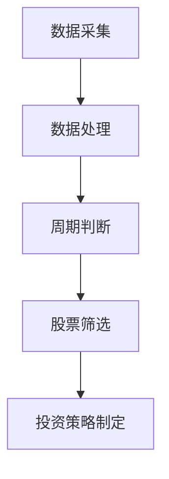

                 


# 特价股票投资中的新兴产业周期性研究

> 关键词：特价股票、新兴产业、周期性、投资策略、数据分析

> 摘要：本文探讨了在新兴产业周期性背景下，特价股票的投资策略与方法。通过分析新兴产业的周期性特点，结合特价股票的特性，提出了一套基于周期性分析的投资模型，包括数据收集、周期判断、股票筛选及策略制定，并通过实际案例展示了如何在新兴产业周期性中捕捉投资机会。

---

## 第一章: 特价股票与新兴产业周期性概述

### 1.1 特价股票的基本概念

#### 1.1.1 特价股票的定义
特价股票是指价格相对较低的股票，通常被认为具有较高的投资价值。这类股票可能属于业绩稳定但被市场低估的公司，或是处于困境中的公司，但具备翻身的潜力。

#### 1.1.2 特价股票的特点
- 价格低廉：相对于市场平均价格水平，特价股票的价格较低。
- 投资门槛低：适合中小投资者参与。
- 风险较高：通常属于周期性较强或业绩不佳的公司。

#### 1.1.3 特价股票的投资价值
- 低估的潜力：许多特价股票可能因市场忽视或短期负面因素而被低估。
- 增值空间：通过长期持有或公司基本面改善，股价可能回升。

### 1.2 新兴产业周期性的基本概念

#### 1.2.1 新兴产业的定义
新兴产业是指新兴的、具有较高增长潜力的产业，通常涉及新技术、新产品或新市场。

#### 1.2.2 新兴产业周期性的特点
- 生命周期：新兴产业通常经历导入期、成长期、成熟期和衰退期。
- 增长潜力：在成长期，新兴产业的公司可能有较高的收益增长。
- 风险与机会并存：新兴产业波动较大，但潜在回报高。

#### 1.2.3 新兴产业周期性对投资的影响
- 投资者需关注周期不同阶段的表现。
- 在导入期，公司可能亏损，但在成长期，股价可能上涨。

### 1.3 特价股票与新兴产业周期性的关系

#### 1.3.1 特价股票在新兴产业周期中的地位
- 在导入期，新兴产业公司可能股价低廉，属于特价股票。
- 成长期，股价可能上升，特价股票逐渐被市场发现。

#### 1.3.2 周期性对特价股票投资的影响
- 导入期：高风险，但潜在回报大。
- 成长期：股价上升，投资回报增加。
- 成熟期：竞争加剧，股价可能波动。

---

## 第二章: 特价股票与新兴产业周期性的核心概念

### 2.1 特价股票的核心要素

#### 2.1.1 特价股票的市场定位
- 市场定位影响股价：定位准确的公司可能股价上涨。
- 市场忽视的公司可能成为特价股票。

#### 2.1.2 特价股票的财务指标
- 市盈率（P/E）：衡量股价与盈利的关系。
- 市净率（P/B）：衡量股价与资产的关系。
- 股息率：衡量分红能力。

#### 2.1.3 特价股票的风险与收益
- 高收益可能伴随着高风险。
- 周期性波动影响收益。

### 2.2 新兴产业周期性的核心要素

#### 2.2.1 新兴产业的生命周期模型
- 导入期：技术创新，市场需求不确定。
- 成长期：市场需求快速增长，公司盈利提升。
- 成熟期：市场饱和，竞争加剧。
- 衰退期：需求下降，公司利润减少。

#### 2.2.2 周期性对新兴产业的影响
- 导入期：技术创新推动增长，但市场风险高。
- 成长期：市场需求旺盛，公司业绩提升。
- 成熟期：竞争加剧，利润增速放缓。
- 衰退期：市场需求下降，公司可能亏损。

#### 2.2.3 周期性对投资决策的影响
- 投资者需根据周期阶段调整投资策略。
- 在导入期和成长期，新兴产业股票可能有较大的增值空间。

### 2.3 特价股票与新兴产业周期性的关系模型

#### 2.3.1 关系模型的构建
- 将新兴产业周期性与特价股票价格波动联系起来。
- 分析周期性对特价股票投资回报的影响。

#### 2.3.2 关系模型的验证
- 使用历史数据验证模型的有效性。
- 通过实证分析检验模型的准确性。

#### 2.3.3 关系模型的应用
- 根据周期阶段制定投资策略。
- 在不同周期阶段选择合适的特价股票。

---

## 第三章: 特价股票投资中的周期性分析方法

### 3.1 周期性分析的基本原理

#### 3.1.1 周期性分析的定义
- 通过分析新兴产业的生命周期，预测股票价格波动。

#### 3.1.2 周期性分析的步骤
1. 确定新兴产业的生命周期阶段。
2. 分析每个阶段对股价的影响。
3. 制定相应的投资策略。

#### 3.1.3 周期性分析的工具与方法
- 金融分析工具：如彭博终端、FactSet等。
- 数据分析方法：时间序列分析、回归分析。

### 3.2 特价股票的周期性分析模型

#### 3.2.1 模型的构建
- 确定新兴产业的生命周期阶段。
- 分析每个阶段中特价股票的特性。

#### 3.2.2 模型的参数设置
- 时间跨度：选择合适的分析时间段。
- 数据来源：使用可靠的市场数据。

#### 3.2.3 模型的验证与优化
- 通过历史数据验证模型。
- 根据验证结果调整模型参数。

### 3.3 周期性分析的数学模型

#### 3.3.1 时间序列分析模型
$$ ARIMA(p, d, q) $$
其中，p为自回归阶数，d为差分阶数，q为移动平均阶数。

#### 3.3.2 回归分析模型
$$ Y = \beta_0 + \beta_1X + \epsilon $$
其中，Y为因变量，X为自变量，ε为误差项。

---

## 第四章: 特价股票投资中的系统分析与架构设计

### 4.1 系统分析框架

#### 4.1.1 数据收集
- 数据来源：股票价格、财务数据、行业报告。
- 数据预处理：清洗、转换、标准化。

#### 4.1.2 周期判断
- 使用K线图分析股价趋势。
- 应用技术指标：如MACD、RSI。

#### 4.1.3 股票筛选
- 筛选条件：市盈率低、市净率低、股息率高等。
- 筛选工具：Python的pandas库。

#### 4.1.4 投资策略制定
- 根据周期阶段制定买入、持有或卖出策略。

### 4.2 系统架构设计

#### 4.2.1 模块划分
- 数据采集模块：收集市场数据。
- 数据处理模块：清洗和转换数据。
- 分析模块：判断周期阶段，筛选股票。
- 策略制定模块：生成投资策略。

#### 4.2.2 模块间关系
- 数据采集模块向数据处理模块提供原始数据。
- 数据处理模块向分析模块提供处理后的数据。
- 分析模块向策略制定模块提供周期判断结果。

#### 4.2.3 系统流程图


### 4.3 系统实现

#### 4.3.1 数据采集
```python
import pandas as pd
import requests

url = "https://api.example.com/stock_data"
data = requests.get(url).json()
df = pd.DataFrame(data)
```

#### 4.3.2 数据处理
```python
df['date'] = pd.to_datetime(df['date'])
df.set_index('date', inplace=True)
```

#### 4.3.3 周期判断
```python
from statsmodels.tsa.arima.model import ARIMA

model = ARIMA(df['price'], order=(1, 1, 1))
model_fit = model.fit()
```

#### 4.3.4 股票筛选
```python
selected_stocks = df[df['PE'] < 15]
```

---

## 第五章: 项目实战——新兴产业周期性下的特价股票投资

### 5.1 项目背景
选择人工智能产业作为案例，分析其周期性。

### 5.2 数据收集与处理
- 收集人工智能相关公司的股价数据。
- 处理数据，提取市盈率、市净率等指标。

### 5.3 周期判断
- 分析人工智能产业的生命周期阶段。
- 使用时间序列模型预测股价走势。

### 5.4 股票筛选
- 筛选市盈率低于行业平均水平的股票。
- 筛选市净率低的股票。

### 5.5 投资策略制定
- 在导入期和成长期，投资特价股票。
- 在成熟期，逐步减仓。

### 5.6 实证分析
- 回测策略，分析收益与风险。

---

## 第六章: 最佳实践与总结

### 6.1 投资策略建议
- 关注新兴产业的周期阶段。
- 在导入期和成长期投资特价股票。

### 6.2 风险控制
- 设定止损点，控制风险。
- 分散投资，降低风险。

### 6.3 长期视角
- 长期持有，避免短期波动影响判断。

### 6.4 小结
总结全文，强调周期性分析的重要性，以及如何在新兴产业周期中捕捉特价股票的投资机会。

### 6.5 注意事项
- 数据质量影响分析结果。
- 周期判断需结合行业动态。
- 投资决策需综合考虑多种因素。

### 6.6 拓展阅读
建议读者阅读相关书籍和文献，深入理解新兴产业周期性与投资策略。

---

## 附录

### A. 术语表
- 特价股票：价格较低的股票。
- 新兴产业：新兴的、增长潜力大的产业。

### B. 数据来源
- 金融数据：来自彭博、FactSet等平台。
- 市场报告：来自行业分析机构。

### C. 工具推荐
- 数据分析工具：Python、R。
- 数据可视化工具：Matplotlib、Tableau。

---

## 作者信息

作者：AI天才研究院/AI Genius Institute & 禅与计算机程序设计艺术/Zen And The Art of Computer Programming

---

这篇文章通过详细分析特价股票与新兴产业周期性之间的关系，结合理论与实践，为投资者提供了有效的投资策略和方法。

