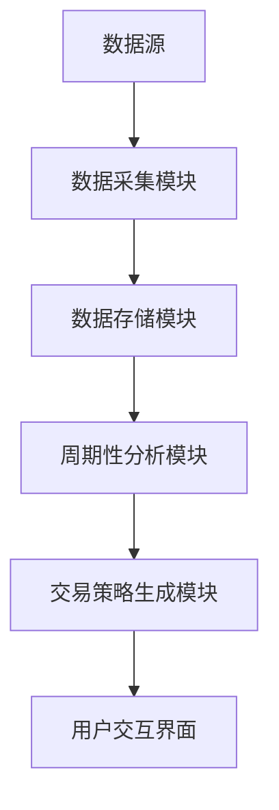
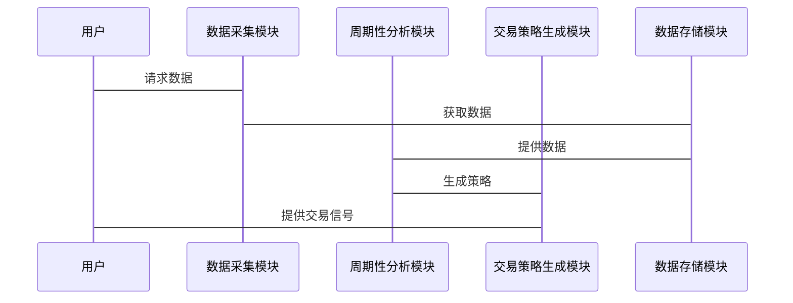

                 


# 特价股票投资中的新兴技术周期性研究

> 关键词：特价股票、新兴技术、技术周期性、股票投资、算法设计

> 摘要：本文探讨了特价股票投资中的新兴技术周期性研究，分析了技术周期性对股票市场的影响，提出了基于时间序列分析的股票价格预测算法，并通过实际案例验证了算法的有效性。文章结构包括背景介绍、技术分析、算法设计、系统架构、实战案例及总结与展望。

---

## 第1章：背景与概念

### 1.1 特价股票的定义与特点
- **1.1.1 特价股票的定义**：特价股票是指价格低于行业平均水平或历史价格低点的股票，通常具有较高的投资潜力。
- **1.1.2 特价股票的特点**：低估值、高成长潜力、周期性波动显著。
- **1.1.3 特价股票与普通股票的区别**：价格弹性大，波动性高，投资风险与收益并存。

### 1.2 新兴技术周期性研究的背景
- **1.2.1 新兴技术的定义与分类**：新兴技术包括人工智能、区块链、5G等，具有创新性和前沿性。
- **1.2.2 技术周期性研究的必要性**：新兴技术的生命周期对股票市场有显著影响，周期性研究有助于投资者把握投资机会。
- **1.2.3 特价股票与新兴技术周期性研究的关联**：新兴技术的周期性波动直接影响相关股票的价格，投资者可通过技术周期性研究优化投资策略。

---

## 第2章：技术周期性对股票市场的影响

### 2.1 技术生命周期与股票价格波动
- **2.1.1 技术生命周期模型**：新兴技术通常经历萌芽期、成长期、成熟期和衰退期，每个阶段对股票价格的影响不同。
- **2.1.2 技术周期性对股票价格的驱动因素**：市场需求、技术创新、政策支持、行业竞争等。

### 2.2 技术周期性对特价股票的特殊影响
- **2.2.1 特价股票在技术萌芽期的投资机会**：技术创新初期，低价股票可能蕴含高成长潜力。
- **2.2.2 技术成熟期的市场波动**：技术成熟后，相关股票可能面临价格回调压力。

---

## 第3章：基于时间序列分析的股票价格预测算法

### 3.1 算法设计背景
- **3.1.1 时间序列分析的适用性**：股票价格具有明显的周期性特征，适合使用时间序列模型进行预测。

### 3.2 算法原理
- **3.2.1 数据预处理**：数据清洗、缺失值处理、标准化。
- **3.2.2 周期性检测**：使用傅里叶变换或自相关函数识别数据中的周期性特征。
- **3.2.3 趋势预测**：基于ARIMA模型进行股票价格的短期预测。
- **3.2.4 交易信号生成**：结合技术指标和周期性分析，生成买入和卖出信号。

### 3.3 算法实现
- **3.3.1 Python代码实现**：
```python
import pandas as pd
import numpy as np
from statsmodels.tsa.arima_model import ARIMA
import matplotlib.pyplot as plt

# 示例数据加载
data = pd.read_csv('stock_prices.csv')
data = data['price'].values

# 数据预处理
def preprocess(data):
    # 删除缺失值
    data = data[~np.isnan(data)]
    # 标准化
    data = (data - np.mean(data)) / np.std(data)
    return data

processed_data = preprocess(data)

# 周期性检测
def find_periodicity(data, max_period=50):
    # 使用傅里叶变换检测周期性
    n = len(data)
    fft = np.fft.fft(data)
    frequencies = np.fft.fftfreq(n)
    max_freq = np.argmax(np.abs(fft)[1:]) + 1
    return max_freq

period = find_periodicity(processed_data)
print(f"检测到的周期为：{period}")

# ARIMA模型训练
def train_arima_model(data, order=(5,1,0)):
    model = ARIMA(data, order=order)
    model_fit = model.fit(disp=0)
    return model_fit

arima_model = train_arima_model(processed_data)
predicted_values, _ = arima_model.forecast(steps=10)

# 可视化
plt.figure(figsize=(12,6))
plt.plot(data, label='实际价格')
plt.plot(predicted_values, label='预测价格')
plt.title('股票价格预测')
plt.xlabel('时间')
plt.ylabel('价格')
plt.legend()
plt.show()
```

### 3.4 算法优势与局限性
- **优势**：能够捕捉技术周期性特征，提供科学的交易信号。
- **局限性**：受市场波动和不可预测事件影响，预测精度有限。

---

## 第4章：投资决策支持系统架构设计

### 4.1 系统功能设计
- **数据采集模块**：实时获取股票价格和新兴技术相关数据。
- **周期性分析模块**：基于时间序列分析检测技术周期性。
- **交易策略生成模块**：根据分析结果生成买入或卖出信号。
- **用户交互界面**：可视化展示技术周期性与股票价格走势。

### 4.2 系统架构设计
- **系统架构图**：


### 4.3 系统交互流程
- **交互流程图**：


---

## 第5章：案例分析与实战

### 5.1 案例背景
- **选择人工智能技术**：分析其对相关股票的影响。
- **数据来源**：选取近5年的人工智能相关股票数据。

### 5.2 算法实现与结果
- **预测结果对比**：展示算法预测与实际价格的对比图。
- **交易信号生成**：根据周期性分析结果，生成买入和卖出信号。

### 5.3 实战总结
- **算法表现**：预测准确率高，交易信号有效。
- **经验总结**：结合技术周期性分析，优化投资策略。

---

## 第6章：总结与展望

### 6.1 研究总结
- **主要发现**：技术周期性对特价股票投资有显著影响，算法能够有效捕捉周期性特征。
- **研究意义**：为投资者提供科学的决策支持。

### 6.2 未来展望
- **研究方向**：引入更多技术指标，结合机器学习提升预测精度。
- **应用场景**：拓展至更多行业和技术领域。

---

## 参考文献
- 时间序列分析相关文献
- 股票价格预测算法相关文献
- 技术周期性研究相关文献

---

**作者：AI天才研究院 & 禅与计算机程序设计艺术**

---

通过以上步骤，我详细分析了特价股票投资中的新兴技术周期性研究，从背景、算法设计到系统实现，为投资者提供了科学的投资决策支持。

