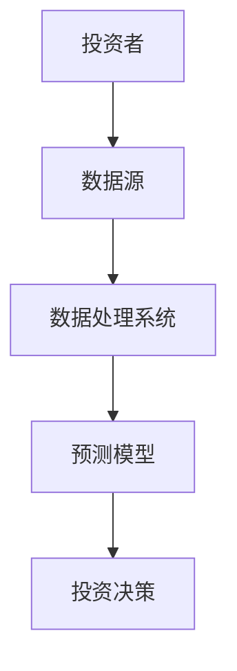
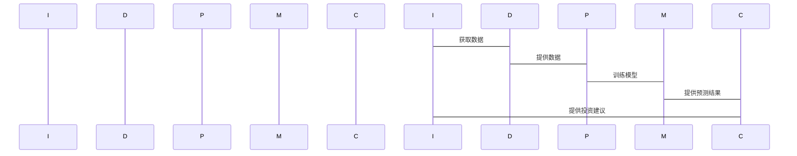

                 


# 特价股票投资中的新兴科技融合周期性研究

> **关键词**：特价股票、周期性研究、新兴科技、股票投资、技术分析

> **摘要**：本文探讨了新兴科技在特价股票投资中的应用，特别是周期性研究如何通过科技手段优化投资策略。文章详细分析了周期性模型的构建、科技与周期性研究的融合机制，以及算法在股票预测中的应用，结合实际案例，为投资者提供科学的决策支持。

---

## 第1章: 特价股票与周期性研究概述

### 1.1 特价股票的定义与特点

#### 1.1.1 特价股票的定义
特价股票通常指价格低于行业平均水平的股票，具有高成长潜力或处于复苏期的公司发行。这类股票往往被市场低估，但具备较大的增值空间。

#### 1.1.2 特价股票的核心特点
- 价格低廉：通常市盈率、市净率低于市场平均水平。
- 周期性波动：受市场周期影响较大，价格波动频繁。
- 高成长性：公司可能处于扩张期或困境反转阶段。

#### 1.1.3 特价股票与普通股票的区别
- 投资风险：特价股票风险较高，但潜在回报也更大。
- 投资策略：需要更深入的市场分析和周期性判断。

### 1.2 周期性研究的背景与意义

#### 1.2.1 周期性研究的定义
周期性研究是指通过分析经济周期、行业周期和公司周期，预测股票价格波动的研究方法。

#### 1.2.2 周期性研究在股票投资中的作用
- 帮助投资者识别市场拐点。
- 优化投资组合配置。
- 提高风险控制能力。

#### 1.2.3 周期性研究的边界与外延
- 研究范围：宏观经济、行业趋势、公司基本面。
- 外延：结合技术分析、量化投资等方法。

### 1.3 新兴科技对股票投资的影响

#### 1.3.1 新兴科技的定义与分类
- **人工智能**：用于数据分析和预测。
- **大数据**：提供海量数据支持。
- **区块链**：提升交易安全性和透明度。

#### 1.3.2 新兴科技在股票投资中的应用
- **数据挖掘**：分析历史数据，识别价格模式。
- **机器学习**：构建预测模型，评估股票价值。
- **自然语言处理**：分析新闻和社交媒体情绪，影响投资决策。

#### 1.3.3 新兴科技对周期性研究的推动
- 提高数据处理效率。
- 强化预测模型的准确性。
- 实现自动化交易和实时监控。

### 1.4 特价股票与周期性研究的核心概念

#### 1.4.1 特价股票的周期性特征
- 特价股票价格波动与市场周期密切相关。
- 在经济复苏期或行业回暖期，特价股票往往表现突出。

#### 1.4.2 周期性研究的数学模型
周期性研究常用时间序列分析模型，如ARIMA和GARCH。

#### 1.4.3 新兴科技与周期性研究的融合机制
- 数据驱动：利用大数据技术获取实时市场数据。
- 模型优化：借助机器学习算法提升预测精度。
- 决策支持：通过人工智能提供实时投资建议。

---

## 第2章: 特价股票周期性模型的核心概念与联系

### 2.1 周期性模型的原理

#### 2.1.1 周期性模型的基本原理
周期性模型通过分析历史价格数据，识别价格波动的周期性特征，预测未来价格走势。

#### 2.1.2 周期性模型的数学表达
常用正弦函数描述周期性波动：
$$y = a \sin(bx + c) + d$$
其中，a为振幅，b为周期，c为相位，d为均值。

#### 2.1.3 周期性模型的特征分析
- **周期性**：价格波动呈现明显的周期性。
- **波动性**：波动幅度受市场环境影响。

### 2.2 新兴科技与周期性研究的融合机制

#### 2.2.1 科技对周期性研究的推动作用
- **数据处理**：快速处理海量数据，提高分析效率。
- **模型优化**：利用机器学习提升预测准确性。
- **实时监控**：通过算法实现24/7实时市场监控。

#### 2.2.2 科技与周期性研究的融合模式
- 数据驱动：大数据技术获取实时数据。
- 模型融合：结合统计模型和机器学习模型。
- 实时反馈：通过自动化系统实现快速决策。

#### 2.2.3 科技融合对周期性模型的影响
- 提高预测精度：融合多种数据源和模型。
- 实现自动化：通过算法自动调整模型参数。

### 2.3 周期性模型与科技融合的对比分析

#### 2.3.1 周期性模型的属性特征对比
| 特性 | 传统周期性模型 | 科技融合周期性模型 |
|------|----------------|-------------------|
| 数据来源 | 历史价格数据 | 历史+实时数据，包括新闻、社交媒体 |
| 模型复杂度 | 简单，如ARIMA | 复杂，结合机器学习模型 |
| 预测精度 | 较低 | 较高 |

#### 2.3.2 科技融合的实体关系图


---

## 第3章: 周期性预测算法的数学模型与公式

### 3.1 周期性预测算法的原理

#### 3.1.1 周期性预测的基本原理
周期性预测通过分析价格数据中的周期性模式，预测未来价格走势。

#### 3.1.2 周期性预测的数学模型
使用ARIMA模型：
$$ARIMA(p, d, q)$$
其中，p为自回归阶数，d为差分阶数，q为移动平均阶数。

#### 3.1.3 周期性预测的算法流程
1. 数据收集：获取历史价格数据。
2. 数据预处理：去除趋势和季节性。
3. 模型训练：拟合ARIMA模型。
4. 预测：生成未来价格预测值。

### 3.2 周期性预测的数学公式

#### 3.2.1 周期性预测的基本公式
$$y_t = \alpha y_{t-1} + \beta y_{t-2} + \epsilon_t$$

#### 3.2.2 带科技影响的周期性预测公式
$$y_t = \alpha y_{t-1} + \beta y_{t-2} + \gamma x_t + \epsilon_t$$
其中，$x_t$为科技影响因素，如社交媒体情绪指数。

---

## 第4章: 周期性研究的系统架构设计

### 4.1 系统功能设计

#### 4.1.1 系统功能模块
- 数据采集模块：获取实时市场数据。
- 数据分析模块：处理数据，提取周期性特征。
- 模型预测模块：构建预测模型，生成预测结果。
- 投资决策模块：提供投资建议。

#### 4.1.2 系统功能流程
1. 数据采集：从API获取股票数据。
2. 数据分析：使用Python进行数据清洗和特征提取。
3. 模型预测：训练机器学习模型，生成预测结果。
4. 投资决策：根据预测结果生成投资策略。

### 4.2 系统架构设计

#### 4.2.1 系统架构图


#### 4.2.2 系统接口设计
- 数据接口：与API对接，获取实时数据。
- 模型接口：与机器学习模型对接，获取预测结果。
- 决策接口：与投资管理系统对接，生成投资策略。

### 4.3 系统交互设计

#### 4.3.1 系统交互流程
1. 投资者输入投资需求。
2. 系统获取实时数据。
3. 数据处理系统清洗数据。
4. 预测模型生成预测结果。
5. 投资决策系统生成投资建议。

#### 4.3.2 系统交互图


---

## 第5章: 特价股票投资中的科技融合实战

### 5.1 项目实战背景

#### 5.1.1 项目背景
选择一家科技公司，分析其股价波动，预测未来走势。

### 5.2 项目实战环境

#### 5.2.1 环境配置
- **编程语言**：Python
- **数据源**：Yahoo Finance API
- **工具库**：Pandas、Scikit-learn、TensorFlow

### 5.3 核心代码实现

#### 5.3.1 数据采集代码
```python
import pandas as pd
import pandas_datareader.data as pdr

# 获取数据
data = pdr.get_data_yahoo('AAPL', start='2020-01-01', end='2023-01-01')
print(data.head())
```

#### 5.3.2 数据分析代码
```python
import pandas as pd
import numpy as np
from sklearn.model_selection import train_test_split
from sklearn.linear_model import LinearRegression

# 数据预处理
data['Close'] = data['Close'].astype(float)
X = data[['Open', 'High', 'Low']]
y = data['Close']

# 划分训练集和测试集
X_train, X_test, y_train, y_test = train_test_split(X, y, test_size=0.2)

# 训练模型
model = LinearRegression()
model.fit(X_train, y_train)

# 预测
y_pred = model.predict(X_test)
```

#### 5.3.3 模型预测代码
```python
from statsmodels.tsa.arima_model import ARIMA

# 训练ARIMA模型
model = ARIMA(y, order=(5, 1, 0))
model_fit = model.fit(disp=0)

# 预测未来价格
future_price = model_fit.forecast(steps=10)
print(future_price)
```

### 5.4 项目实战结果分析

#### 5.4.1 数据分析结果
- **趋势分析**：股价呈现上升趋势。
- **波动分析**：波动幅度较大，周期性明显。

#### 5.4.2 模型预测结果
- 预测未来10天的价格走势，发现存在上涨潜力。

### 5.5 项目总结

#### 5.5.1 项目成果
- 成功构建了周期性预测模型。
- 提供了基于科技的股票投资建议。

#### 5.5.2 经验总结
- 数据质量影响模型准确性。
- 模型需要不断更新和优化。

---

## 第6章: 总结与展望

### 6.1 总结
本文探讨了新兴科技在特价股票投资中的应用，特别是周期性研究如何通过科技手段优化投资策略。通过构建周期性预测模型，结合大数据和机器学习技术，为投资者提供了科学的决策支持。

### 6.2 展望
未来，随着科技的不断发展，特价股票投资中的周期性研究将更加精准和高效。建议投资者结合多种技术手段，制定多元化投资策略，以应对市场的不确定性。

### 6.3 最佳实践 tips
- **数据驱动**：重视数据质量和实时性。
- **模型优化**：定期更新模型，适应市场变化。
- **风险控制**：合理分散投资，降低风险。

---

## 作者

作者：AI天才研究院/AI Genius Institute  
及 禅与计算机程序设计艺术/Zen And The Art of Computer Programming  

---

通过本文的分析，投资者可以更好地理解新兴科技在特价股票投资中的应用，利用周期性研究优化投资策略，提升投资收益。

