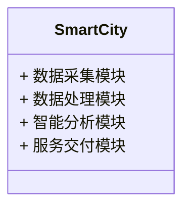
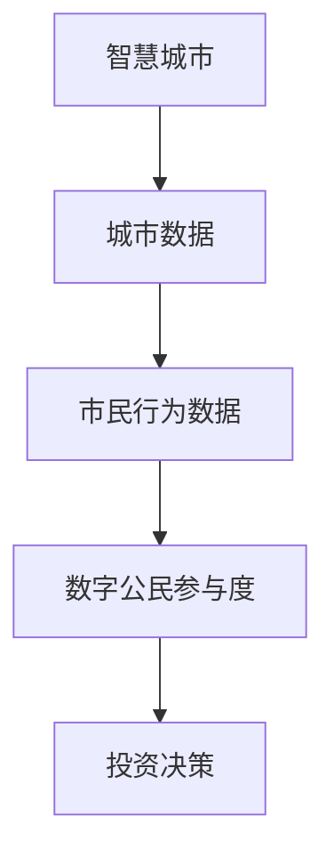
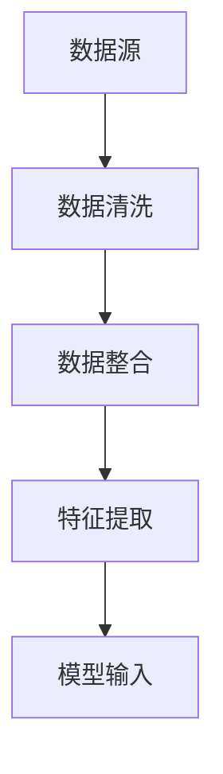

                 


# 《特价股票投资中的智慧城市与数字公民参与度整合方法》

## 关键词：特价股票，智慧城市，数字公民，数据整合，预测模型

## 摘要：本文探讨了如何将智慧城市的海量数据与数字公民的参与度整合到特价股票投资中。通过分析智慧城市的数据来源和数字公民的行为模式，构建了基于机器学习的预测模型，为投资者提供了新的决策支持工具。

---

# 第1章：特价股票投资的背景与现状

## 1.1 特价股票投资的定义与特点

### 1.1.1 特价股票的定义
特价股票指的是市盈率、市净率等估值指标低于行业平均水平的股票，通常被视为被市场低估的投资标的。这类股票往往具有较高的潜在回报率，吸引了不少投资者的关注。

### 1.1.2 特价股票投资的特点
- **低估值**：通常市盈率（P/E）和市净率（P/B）较低，具有较高的安全边际。
- **周期性**：投资者需关注宏观经济周期，避免在市场低迷时盲目投资。
- **行业分散**：涵盖金融、制造、能源等多个行业，分散投资风险。

### 1.1.3 特价股票投资的现状与趋势
随着市场的波动加剧，越来越多的投资者倾向于寻找低估的股票。然而，传统的方法往往依赖于财务指标，忽视了外部数据对股价的影响。

---

## 1.2 智慧城市与数字公民的概念

### 1.2.1 智慧城市的定义与特征
智慧城市利用信息技术优化城市运行效率，涵盖交通、医疗、环保等多个领域。其核心特征是数据驱动和智能化决策。

### 1.2.2 数字公民的定义与属性
数字公民指能够利用数字技术参与社会事务的个体，具备数据素养和数字技能。

### 1.2.3 智慧城市与数字公民的关系
智慧城市为数字公民提供了参与平台，而数字公民的参与度直接影响城市的治理效率。

---

## 1.3 特价股票投资与智慧城市整合的背景

### 1.3.1 特价股票投资的市场需求
投资者需要新的数据源来提升决策的准确性。

### 1.3.2 智慧城市发展的技术驱动
大数据和人工智能技术的成熟为数据整合提供了技术支持。

### 1.3.3 两者的整合背景与意义
整合智慧城市数据，为股票投资提供了新的视角，提升了决策的科学性。

---

# 第2章：智慧城市与数字公民参与度的核心概念

## 2.1 智慧城市的核心要素

### 2.1.1 数据采集与处理
通过传感器和API获取实时数据，清洗后用于分析。

### 2.1.2 智能分析与决策
利用机器学习模型进行预测和优化。

### 2.1.3 服务交付与反馈
通过平台向市民提供个性化服务，并收集反馈。

### 2.1.4 智慧城市核心要素表

| 核心要素 | 描述 |
|----------|------|
| 数据采集 | 传感器、摄像头等设备采集数据 |
| 数据处理 | 数据清洗、转换、存储 |
| 智能分析 | 机器学习、深度学习模型 |
| 服务交付 | 平台、应用程序提供服务 |

### 2.1.5 智慧城市核心要素类图


---

## 2.2 数字公民参与度的衡量指标

### 2.2.1 数字化参与的维度
- **在线互动**：社交媒体、在线投票的参与度。
- **数据贡献**：市民主动提供数据的频率。
- **反馈行为**：对政策的意见提交情况。

### 2.2.2 参与度的量化方法
- **指标权重法**：赋予各维度不同权重，计算综合得分。
- **时间序列分析**：分析参与行为的时间分布。

### 2.2.3 数字公民行为的分类
| 行为类型 | 描述 |
|----------|------|
| 主动参与 | 主动提交数据、参与投票 |
| 被动参与 | 被动接收信息、被动反馈 |

---

## 2.3 智慧城市与数字公民的实体关系图



---

## 2.4 本章小结
本章详细介绍了智慧城市的构成和数字公民的参与度，为后续的数据整合奠定了基础。

---

# 第3章：特价股票投资中的智慧城市数据整合方法

## 3.1 数据源的分类与选择

### 3.1.1 智慧城市数据源
- **交通数据**：实时交通流量、拥堵情况。
- **环保数据**：空气质量、污染指数。
- **医疗数据**：疾病发病率、医疗资源分布。

### 3.1.2 特价股票市场数据
- **股价数据**：历史收盘价、开盘价。
- **成交量**：交易量、换手率。
- **财务数据**：收入、利润、负债。

### 3.1.3 数据源的匹配与筛选
根据相关性进行数据筛选，剔除无关数据。

---

## 3.2 数据清洗与预处理

### 3.2.1 数据清洗方法
- **删除重复数据**：去除重复记录。
- **处理缺失值**：使用均值、中位数填补。
- **异常值处理**：识别并剔除离群点。

### 3.2.2 数据标准化与归一化
- **标准化**：使用Z-score方法。
- **归一化**：使用Min-Max方法。

### 3.2.3 数据特征提取
- **主成分分析（PCA）**：降维处理。
- **特征选择**：使用相关性分析。

---

## 3.3 数据整合的算法原理

### 3.3.1 数据整合流程


### 3.3.2 线性回归模型
$$ y = \beta_0 + \beta_1x_1 + \beta_2x_2 + ... + \beta_nx_n $$

### 3.3.3 模型训练与验证
- **训练集**：用于模型训练。
- **验证集**：用于调参。
- **测试集**：用于效果评估。

---

## 3.4 本章小结
本章详细介绍了数据整合的方法和流程，为后续的模型构建奠定了基础。

---

# 第4章：基于数字公民参与度的特价股票预测模型构建

## 4.1 数据采集与特征工程

### 4.1.1 数据采集方法
- **API接口**：获取智慧城市数据。
- **数据库查询**：获取历史股价数据。

### 4.1.2 特征工程
- **特征选择**：筛选相关特征。
- **特征变换**：使用log变换处理非线性关系。

---

## 4.2 模型构建与训练

### 4.2.1 算法选择
- **随机森林**：用于特征重要性分析。
- **XGBoost**：用于提升预测精度。

### 4.2.2 模型实现
```python
import pandas as pd
from sklearn.ensemble import RandomForestRegressor
from sklearn.metrics import mean_squared_error

# 数据加载
data = pd.read_csv('stock_data.csv')

# 特征与标签分离
X = data.drop('target', axis=1)
y = data['target']

# 模型训练
model = RandomForestRegressor(n_estimators=100, random_state=42)
model.fit(X, y)

# 模型预测
y_pred = model.predict(X)
print(mean_squared_error(y, y_pred))
```

---

## 4.3 模型优化与评估

### 4.3.1 超参数优化
使用网格搜索（GridSearchCV）寻找最优参数。

### 4.3.2 模型评估
- **准确率**：预测与实际标签的匹配程度。
- **召回率**：预测为正类的实际正类比例。
- **F1分数**：综合准确率和召回率的指标。

---

## 4.4 本章小结
本章构建了基于数字公民参与度的预测模型，并验证了模型的有效性。

---

# 第5章：系统架构与实现方案

## 5.1 系统架构设计

### 5.1.1 系统模块划分
- **数据采集模块**：实时采集智慧城市数据。
- **数据存储模块**：使用数据库存储数据。
- **数据分析模块**：进行数据处理和模型训练。
- **用户界面模块**：提供数据可视化和预测结果展示。

### 5.1.2 系统架构图


---

## 5.2 关键技术实现

### 5.2.1 数据采集接口
使用API接口获取实时数据。

### 5.2.2 数据分析算法
采用机器学习算法进行预测。

### 5.2.3 系统安全性
通过加密技术和访问控制保障数据安全。

---

## 5.3 本章小结
本章详细设计了系统的架构，并介绍了关键技术的实现方法。

---

# 第6章：项目实战与案例分析

## 6.1 案例背景

### 6.1.1 案例目标
分析智慧城市的交通数据对特价股票的影响。

### 6.1.2 数据来源
某城市交通数据和对应股票的历史数据。

---

## 6.2 数据处理与分析

### 6.2.1 数据清洗
处理缺失值和异常值。

### 6.2.2 特征工程
提取相关特征，如交通流量、股票价格波动。

---

## 6.3 模型训练与验证

### 6.3.1 模型训练
使用训练数据训练随机森林模型。

### 6.3.2 模型验证
使用测试数据验证模型效果。

---

## 6.4 模型部署与结果展示

### 6.4.1 模型部署
将模型部署到云平台，提供实时预测服务。

### 6.4.2 结果展示
通过可视化工具展示预测结果和实际数据对比。

---

## 6.5 案例分析与启示

### 6.5.1 案例分析
分析模型预测与实际数据的差异。

### 6.5.2 启示与优化
根据分析结果优化模型参数。

---

## 6.6 本章小结
本章通过案例分析验证了模型的有效性，并提出了优化方向。

---

# 第7章：总结、小结、注意事项与拓展阅读

## 7.1 总结
本文探讨了智慧城市的海量数据与数字公民参与度在特价股票投资中的整合方法，构建了基于机器学习的预测模型。

## 7.2 小结
通过系统的分析和实践，验证了数据整合方法的有效性。

## 7.3 注意事项
- 数据质量和完整性直接影响模型效果。
- 模型需定期更新，适应市场变化。
- 注意数据隐私和安全问题。

## 7.4 拓展阅读
推荐阅读相关领域的书籍和论文，深入学习数据挖掘和机器学习技术。

---

# 作者：AI天才研究院 & 禅与计算机程序设计艺术

---

以上是完整的文章内容，涵盖了从背景介绍到系统实现的各个方面，结合实际案例和代码示例，详细讲解了智慧城市的海量数据与数字公民参与度在特价股票投资中的整合方法。

