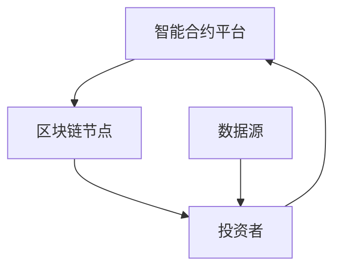

                 


# 特价股票投资中的智能合约自动化合规策略

> 关键词：智能合约，特价股票，合规策略，区块链，自动化

> 摘要：本文探讨了在特价股票投资中，如何利用智能合约实现合规策略的自动化。文章从智能合约的基本原理出发，分析了其在特价股票投资中的应用，并详细阐述了如何设计和实现合规策略。通过实际案例分析，展示了智能合约在自动化合规中的优势和挑战。

---

# 第一部分: 智能合约与特价股票投资的背景

## 第1章: 智能合约与特价股票投资概述

### 1.1 智能合约的定义与特点
智能合约是一种基于区块链技术的自动执行合同，具有以下特点：
- **自动性**：无需人工干预，自动执行合同条款。
- **透明性**：所有交易记录在区块链上，可追溯且不可篡改。
- **安全性**：通过加密技术确保数据安全。
- **去中心化**：不依赖中心机构，运行在分布式网络上。

### 1.2 特价股票投资的定义与特点
特价股票是指价格低于市场平均值的股票，投资策略包括：
- **价值投资**：寻找被低估的股票。
- **短线交易**：利用价格波动快速获利。

### 1.3 特价股票投资中的合规需求
- **合规性**：投资行为需符合相关法律法规。
- **透明性**：投资者需明确投资标的和风险。
- **自动化**：通过技术手段减少人为干预，提高效率。

---

# 第二部分: 智能合约的核心原理

## 第2章: 智能合约的基本原理

### 2.1 智能合约的工作流程
1. **触发条件**：当满足特定条件（如价格达到某个阈值）时，智能合约自动执行。
2. **执行逻辑**：根据预设的规则，自动完成交易或通知相关人员。
3. **记录结果**：将交易记录在区块链上，确保可追溯。

### 2.2 智能合约的代码结构
以Solidity为例，代码通常包括：
- **状态变量**：存储合约的状态。
- **函数**：实现特定功能，如`buyStock()`、`sellStock()`。
- **事件**：记录合约执行的重要信息。

### 2.3 智能合约的安全性
- **漏洞风险**：需避免逻辑漏洞和代码错误。
- **审计**：通过第三方审计确保合约的安全性。

---

# 第三部分: 智能合约在特价股票投资中的应用

## 第3章: 合规策略的设计

### 3.1 合规需求分析
- **合规规则**：如交易时间限制、最大仓位限制。
- **合规目标**：确保投资行为符合监管要求。

### 3.2 合规策略的实现
1. **触发条件**：如股价低于某个值时自动买入。
2. **执行逻辑**：如买入后设置止损点，股价下跌到某个阈值时自动卖出。

### 3.3 数学模型与公式
假设股价为`P`，设定买入阈值为`P_buy`，卖出阈值为`P_sell`：
- **买入条件**：$P < P_{buy}$
- **卖出条件**：$P > P_{sell}$

---

# 第四部分: 系统设计与实现

## 第4章: 系统架构设计

### 4.1 系统功能模块
- **智能合约模块**：实现投资策略的自动化。
- **数据采集模块**：获取实时股价数据。
- **用户界面模块**：供投资者设置策略参数。

### 4.2 系统架构图


---

# 第五部分: 项目实战与案例分析

## 第5章: 项目实现

### 5.1 环境搭建
- **区块链平台**：选择以太坊进行部署。
- **开发工具**：使用Solidity编写合约，使用Remix进行调试。

### 5.2 核心代码实现
```solidity
// SPDX-License-Identifier: MIT
pragma solidity ^0.8.0;

contract StockInvestment {
    address payable public investor;
    uint256 public buyPrice;
    uint256 public sellPrice;

    constructor(address payable _investor, uint256 _buyPrice, uint256 _sellPrice) {
        investor = _investor;
        buyPrice = _buyPrice;
        sellPrice = _sellPrice;
    }

    function buyStock(uint256 amount) public {
        require(msg.sender == investor, "Only investor can call this function");
        // 实现买入逻辑
    }

    function sellStock(uint256 amount) public {
        require(msg.sender == investor, "Only investor can call this function");
        // 实现卖出逻辑
    }

    event StockBought(uint256 amount);
    event StockSold(uint256 amount);
}
```

### 5.3 测试与优化
- **测试用例**：模拟股价波动，验证合约的自动执行功能。
- **优化措施**：优化合约代码，减少gas消耗。

---

# 第六部分: 最佳实践与总结

## 第6章: 最佳实践

### 6.1 合规策略的注意事项
- **合规性审查**：确保智能合约的设计符合相关法律法规。
- **风险控制**：设置合理的止损点，避免过度亏损。

### 6.2 系统优化建议
- **性能优化**：优化合约代码，提高执行效率。
- **安全性提升**：定期进行合约审计，修复潜在漏洞。

### 6.3 未来展望
随着区块链技术的发展，智能合约在金融领域的应用将更加广泛，合规策略也将更加智能化和自动化。

---

# 结语

通过本文的分析与实践，我们展示了如何利用智能合约实现特价股票投资中的自动化合规策略。智能合约的优势在于其自动性和透明性，能够有效降低人为干预带来的风险。然而，其应用也面临合规性和安全性等挑战，需要进一步的研究和探索。

作者：AI天才研究院 & 禅与计算机程序设计艺术

