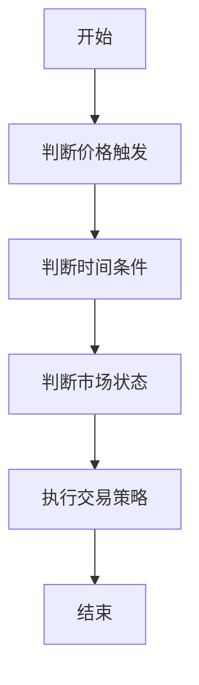

                 


# 特价股票投资中的智能合约自动化风险对冲策略

> 关键词：智能合约，特价股票，风险对冲，自动化交易，金融投资

> 摘要：本文深入探讨了智能合约在特价股票投资中的应用，特别是如何利用智能合约实现风险对冲的自动化策略。通过分析智能合约的基本概念、算法原理、系统架构设计以及实际项目实现，本文为读者提供了从理论到实践的全面指导。

---

# 第一部分: 特价股票投资中的智能合约概述

## 第1章: 特价股票投资与智能合约概述

### 1.1 特价股票投资的背景与特点

#### 1.1.1 特价股票的定义与分类

特价股票是指在特定条件下，如价格波动、市场状态或时间窗口，触发的交易机会。常见的分类包括基于价格的特价股票（如价格跌破某个阈值）和基于时间的特价股票（如特定时间段内的交易）。

#### 1.1.2 特价股票投资的特点与优势

- **特点**：短期性、高波动性、高风险。
- **优势**：捕捉市场波动中的短期收益，灵活应对市场变化。

#### 1.1.3 特价股票投资的风险与挑战

- 市场波动大，风险高。
- 需要快速决策和执行，避免错失交易机会。
- 需要实时监控市场变化，及时调整策略。

### 1.2 智能合约的基本概念与特点

#### 1.2.1 智能合约的定义与核心原理

智能合约是一种基于区块链技术的自动执行合约，能够在满足特定条件时自动执行交易或操作。核心原理是通过预设的代码逻辑，响应链上或链下触发事件，执行预定义的指令。

#### 1.2.2 智能合约的主要特点

- **自动化**：无需人工干预，自动执行交易。
- **去信任化**：通过区块链技术，确保合约执行的透明和不可篡改。
- **可编程性**：允许根据需求编写复杂的逻辑，实现多样化的交易策略。

#### 1.2.3 智能合约与传统合约的区别

| 属性 | 智能合约 | 传统合约 |
|------|---------|----------|
| 执行方式 | 自动化，基于代码 | 需要人工或第三方执行 |
| 可靠性 | 去信任化，区块链支持 | 依赖信任和法律体系 |
| 灵活性 | 可编程，支持复杂逻辑 | 较难修改和调整 |

### 1.3 智能合约在金融领域的应用前景

#### 1.3.1 智能合约在金融领域的潜在应用

- 自动化交易执行。
- 自动化风险管理。
- 自动化对冲策略。

#### 1.3.2 智能合约在金融投资中的优势

- 提高交易效率，减少人为错误。
- 实现24/7自动化监控，捕捉更多交易机会。
- 降低交易成本，优化资源配置。

#### 1.3.3 智能合约应用的挑战与机遇

- **挑战**：技术复杂性、监管不确定性、市场接受度。
- **机遇**：技术创新推动金融行业变革，提升投资效率。

## 1.4 本章小结

本章介绍了特价股票投资的基本概念和特点，分析了智能合约的核心原理和在金融领域的应用前景。通过对比智能合约与传统合约，明确了智能合约在金融投资中的优势和挑战，为后续章节的深入分析奠定了基础。

---

# 第二部分: 智能合约的算法原理与数学模型

## 第2章: 智能合约的算法原理

### 2.1 智能合约的核心算法概述

#### 2.1.1 智能合约的主要算法类型

- 基于价格的触发算法。
- 基于时间的执行算法。
- 基于市场状态的对冲算法。

#### 2.1.2 算法选择的依据与原则

- 算法的执行效率。
- 算法的准确性。
- 算法的可扩展性。

### 2.2 智能合约的数学模型与公式

#### 2.2.1 风险对冲的数学模型

$$
\text{对冲比例} = \frac{\text{对冲资产价值}}{\text{总风险敞口}}
$$

#### 2.2.2 智能合约的执行逻辑

$$
\text{执行条件} = \text{价格触发} \land \text{时间条件} \land \text{市场状态}
$$

### 2.3 智能合约的算法实现

#### 2.3.1 基于Python的智能合约算法实现

```python
def execute_strategy(price_data, time_window, market_state):
    # 判断价格是否触发条件
    if price_trigger(price_data):
        # 判断时间是否在指定窗口内
        if time_window_check(time_window):
            # 判断市场状态是否为多头或空头
            if market_state == 'bull':
                return 'buy'
            elif market_state == 'bear':
                return 'sell'
    return 'hold'
```

#### 2.3.2 算法流程图（使用 Mermaid）



### 2.4 本章小结

本章详细介绍了智能合约的核心算法，包括价格触发、时间条件和市场状态的判断逻辑，并通过Python代码和流程图展示了算法的实现过程。这些算法为智能合约的风险对冲策略提供了理论基础和实现框架。

---

# 第三部分: 特价股票投资中的智能合约系统设计

## 第3章: 智能合约的风险对冲系统架构

### 3.1 系统功能需求分析

#### 3.1.1 系统目标与功能概述

- 实时监控市场数据。
- 自动触发对冲交易。
- 实时调整风险敞口。

#### 3.1.2 系统核心功能模块

- 数据采集模块：实时采集市场数据。
- 策略执行模块：根据算法逻辑执行交易。
- 风险管理模块：监控和调整风险敞口。
- 监控与反馈模块：实时监控系统运行状态。

### 3.2 系统架构设计

#### 3.2.1 系统架构图（使用 Mermaid）


#### 3.2.2 模块之间

- 数据采集模块负责从市场获取实时数据，并传递给策略执行模块。
- 策略执行模块根据预设算法判断是否触发交易，并通知风险管理模块进行风险评估。
- 风险管理模块根据当前风险敞口调整对冲比例，并反馈给策略执行模块。
- 监控与反馈模块实时监控系统运行状态，并在出现异常时发出警报。

### 3.3 本章小结

本章通过系统功能需求分析和架构设计，展示了智能合约风险对冲系统的整体结构和模块协作关系，为后续的系统实现奠定了基础。

---

# 第四部分: 项目实战与案例分析

## 第4章: 特价股票投资中的智能合约项目实战

### 4.1 环境安装与配置

#### 4.1.1 安装必要的工具与库

- Python编程环境（如Anaconda）。
- 区块链开发框架（如Solidity、Web3.py）。
- 数据采集工具（如Yahoo Finance API）。

#### 4.1.2 配置智能合约开发环境

- 安装Solidity编译器。
- 配置以太坊测试网络。

### 4.2 系统核心功能实现

#### 4.2.1 数据采集模块实现

```python
import requests

def get_market_data(symbol):
    url = f"https://api.example.com/stock/{symbol}"
    response = requests.get(url)
    return response.json()
```

#### 4.2.2 策略执行模块实现

```python
def execute_trade(symbol, quantity):
    # 连接到区块链节点
    w3 = Web3(Web3.HTTPProvider("http://localhost:8545"))
    # 调用智能合约的交易执行方法
    contract = w3.eth.contract(address='0x...', abi=...)
    tx_hash = contract.functions.trade(symbol, quantity).transact()
    return tx_hash
```

#### 4.2.3 风险管理模块实现

```python
def manage-risk():
    # 获取当前风险敞口
    risk_exposure = get_risk_exposure()
    # 调整对冲比例
    if risk_exposure > threshold:
        execute_trade('SPY', 'sell')
    else:
        execute_trade('SPY', 'buy')
```

### 4.3 项目小结

通过本章的实战部分，读者可以了解如何从环境配置到核心功能实现，逐步构建一个基于智能合约的特价股票投资系统。通过实际案例的分析，进一步理解了系统设计和实现的细节。

---

# 第五部分: 总结与展望

## 第5章: 总结与展望

### 5.1 本章总结

本文详细探讨了智能合约在特价股票投资中的应用，特别是如何通过智能合约实现自动化风险对冲策略。从算法原理到系统架构设计，再到实际项目实现，为读者提供了全面的指导。

### 5.2 对未来发展的展望

随着区块链技术的不断进步和金融市场的日益复杂化，智能合约在金融领域的应用前景广阔。未来的研究方向可能包括更复杂的对冲策略、更高的交易效率以及更强大的风险管理能力。

---

# 作者

作者：AI天才研究院/AI Genius Institute & 禅与计算机程序设计艺术 /Zen And The Art of Computer Programming

---

通过以上结构，您可以根据需要进一步扩展每个章节的内容，添加更多的细节和示例，使文章更加完整和深入。

