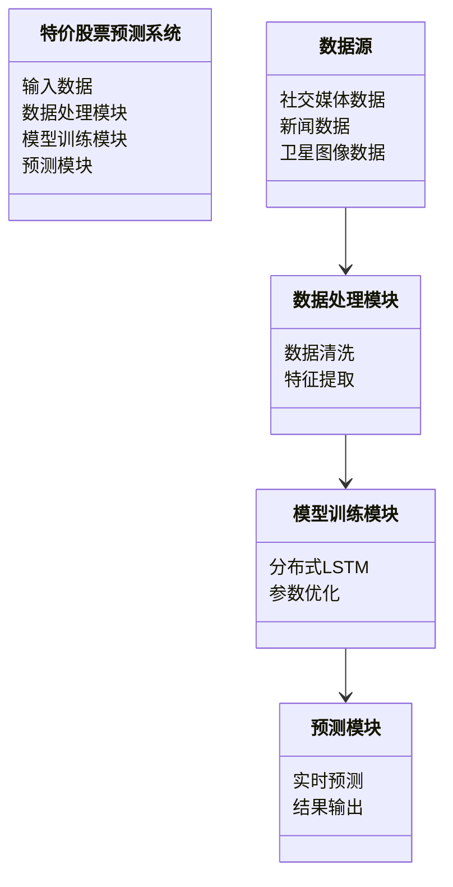
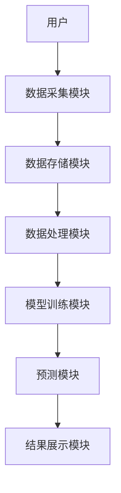

                 


# 特价股票投资中的替代数据分析与分布式人工智能应用

---

## 关键词：
特价股票，替代数据，分布式人工智能，金融预测，大数据分析

---

## 摘要：
本文深入探讨了特价股票投资中替代数据分析与分布式人工智能的应用。通过分析替代数据的来源及其对股票价格的影响，结合分布式人工智能的核心算法与系统设计，展示了如何利用分布式计算技术提升股票预测的准确性和效率。文章结合实际案例，详细介绍了分布式人工智能在股票预测中的应用场景，并提出了优化策略和未来研究方向。

---

## 目录大纲：

### 第1章: 特价股票投资与替代数据分析
1.1 特价股票投资的背景与意义  
1.2 替代数据的定义与分类  
1.3 分布式人工智能在金融领域的应用前景  
1.4 本章小结  

### 第2章: 替代数据与股票价格的关系分析
2.1 替代数据的特征与属性  
2.2 替代数据对股票价格的影响机制  
2.3 替代数据与股票价格关系的实证分析  
2.4 本章小结  

### 第3章: 分布式人工智能的核心算法与实现
3.1 分布式人工智能的基本原理  
3.2 分布式机器学习算法  
3.3 分布式深度学习算法  
3.4 本章小结  

### 第4章: 分布式人工智能在股票预测中的应用
4.1 分布式人工智能在股票预测中的优势  
4.2 分布式人工智能在股票预测中的实现  
4.3 实际案例分析  
4.4 本章小结  

### 第5章: 系统设计与优化
5.1 系统功能设计  
5.2 系统架构设计  
5.3 系统优化策略  
5.4 本章小结  

### 第6章: 项目实战与结果分析
6.1 项目背景与目标  
6.2 项目实施过程  
6.3 实验结果与分析  
6.4 项目小结  

### 第7章: 结论与展望
7.1 研究总结  
7.2 未来研究方向  
7.3 结论  

---

## 第1章: 特价股票投资与替代数据分析

### 1.1 特价股票投资的背景与意义
#### 1.1.1 特价股票的定义与特点
特价股票通常指那些价格低于市场平均水平的股票，具有较高的投资潜力。其特点包括低估值、高增长潜力和市场波动性。

#### 1.1.2 特价股票投资的市场机会
随着市场的波动，特价股票的投资机会频繁出现。通过有效的数据分析和预测模型，投资者可以抓住这些机会实现收益。

#### 1.1.3 替代数据在股票投资中的重要性
传统金融数据（如财务报表、历史价格）具有局限性，替代数据（如社交媒体情绪、新闻文本、卫星图像）提供了更多维度的信息，有助于提高预测的准确性。

---

### 1.2 替代数据的定义与分类
#### 1.2.1 替代数据的定义
替代数据是指非传统金融数据，包括文本数据（社交媒体、新闻）、图像数据（卫星图像）和音频数据（电话会议录音）等。

#### 1.2.2 替代数据的主要来源
1. 社交媒体数据：如Twitter、Facebook上的用户评论和情绪分析。
2. 新闻数据：包括财经新闻、行业报告等。
3. 卫星图像：用于分析公司供应链、库存情况。
4. 公司高管行为数据：如高管交易记录、电话会议内容。

#### 1.2.3 替代数据与传统金融数据的对比
| 特性 | 传统金融数据 | 替代数据 |
|------|----------------|----------|
| 类型 | 结构化数据（如数值型） | 文本、图像等 |
| 更新频率 | 低频（如每日或每周） | 高频（实时） |
| 信息维度 | 单一（如财务指标） | 多维（如情绪、市场趋势） |

---

### 1.3 分布式人工智能在金融领域的应用前景
#### 1.3.1 分布式人工智能的定义
分布式人工智能是指将计算任务分解到多个节点上进行并行处理，以提高计算效率和模型训练速度。

#### 1.3.2 分布式人工智能在金融中的优势
1. 高效的数据处理能力：分布式计算可以快速处理海量数据。
2. 强大的模型训练能力：分布式深度学习可以训练更大规模的模型。
3. 实时的预测能力：分布式系统可以实现实时数据处理和预测。

#### 1.3.3 特价股票投资中分布式AI的应用潜力
通过分布式人工智能，投资者可以实时分析替代数据，快速捕捉市场机会，提高投资决策的效率和准确性。

---

## 第2章: 替代数据与股票价格的关系分析

### 2.1 替代数据的特征与属性
#### 2.1.1 替代数据的实时性
替代数据通常具有较强的实时性，能够反映市场的即时动态。

#### 2.1.2 替代数据的多样性
替代数据涵盖多种类型，包括文本、图像、音频等，提供了丰富的信息来源。

#### 2.1.3 替代数据的可量化挑战
替代数据的非结构化特性增加了数据处理的难度，需要通过自然语言处理（NLP）等技术进行量化。

---

### 2.2 替代数据对股票价格的影响机制
#### 2.2.1 市场情绪分析
通过分析社交媒体和新闻数据，可以提取市场情绪指标，进而预测股票价格的变化。

#### 2.2.2 公司基本面预测
替代数据（如高管行为、供应链信息）可以补充传统财务数据，帮助预测公司基本面的变化。

#### 2.2.3 市场趋势预测
通过分析替代数据（如卫星图像、新闻标题），可以发现市场趋势的早期信号。

---

### 2.3 替代数据与股票价格关系的实证分析
#### 2.3.1 数据来源与处理方法
使用Twitter情绪数据和新闻标题数据，结合自然语言处理技术进行数据清洗和特征提取。

#### 2.3.2 数据分析与建模方法
采用逻辑回归、支持向量机（SVM）和长短期记忆网络（LSTM）等模型进行股票价格预测。

#### 2.3.3 实证结果与讨论
实验结果显示，结合替代数据的模型在股票价格预测中具有较高的准确性，尤其是在市场波动较大的情况下。

---

## 第3章: 分布式人工智能的核心算法与实现

### 3.1 分布式人工智能的基本原理
#### 3.1.1 分布式计算的定义与特点
分布式计算是指将计算任务分解到多个计算节点上进行并行处理，具有高效性和可扩展性的特点。

#### 3.1.2 分布式人工智能的实现框架
常用的分布式计算框架包括MapReduce、Spark和TensorFlow分布式训练。

#### 3.1.3 分布式算法的设计原则
1. 数据划分：将数据均匀分布到各个节点上。
2. 模型同步：确保各个节点上的模型参数一致。
3. 并行计算：利用多节点并行处理任务。

---

### 3.2 分布式机器学习算法
#### 3.2.1 分布式数据并行
将数据划分为多个子集，每个子集在不同的节点上进行模型训练，最后将结果汇总。

#### 3.2.2 分布式模型并行
将模型的不同部分分配到不同的节点上，每个节点负责模型的一部分参数更新。

#### 3.2.3 分布式异步更新
允许各个节点独立更新模型参数，减少通信开销，提高训练速度。

---

### 3.3 分布式深度学习算法
#### 3.3.1 分布式深度学习的挑战
1. 高通信开销：节点之间的数据同步需要大量的通信。
2. 模型同步延迟：大规模模型的同步需要较长时间。
3. 资源分配不均：节点之间可能存在资源分配不均的问题。

#### 3.3.2 分布式深度学习的优化方法
1. 使用异步更新策略减少通信开销。
2. 采用模型剪枝技术减少参数同步量。
3. 使用参数服务器架构实现高效的参数管理。

#### 3.3.3 分布式深度学习的实际应用
在股票价格预测中，分布式深度学习可以快速训练大规模数据集，提高预测精度。

---

## 第4章: 分布式人工智能在股票预测中的应用

### 4.1 分布式人工智能在股票预测中的优势
#### 4.1.1 高效的数据处理能力
通过分布式计算，可以快速处理海量替代数据，提取有用的特征。

#### 4.1.2 强大的模型训练能力
分布式深度学习可以训练更复杂、更准确的模型，提高预测能力。

#### 4.1.3 实时的预测能力
通过实时数据处理和模型预测，投资者可以快速做出决策。

---

### 4.2 分布式人工智能在股票预测中的实现
#### 4.2.1 数据采集与预处理
1. 数据来源：社交媒体、新闻、卫星图像等。
2. 数据清洗：去除噪声数据，提取有用特征。
3. 数据转换：将非结构化数据转换为结构化数据。

#### 4.2.2 模型选择与训练
选择适合分布式计算的模型，如分布式LSTM、分布式随机森林等。

#### 4.2.3 预测结果的分析与优化
通过回测和交叉验证，优化模型参数，提高预测精度。

---

### 4.3 实际案例分析
#### 4.3.1 案例背景介绍
假设我们使用Twitter情绪数据和新闻标题数据，预测某科技股的价格波动。

#### 4.3.2 案例实施过程
1. 数据采集：爬取相关数据。
2. 数据处理：清洗和特征提取。
3. 模型训练：使用分布式LSTM进行训练。
4. 模型预测：预测未来一周的股票价格。

#### 4.3.3 案例结果与讨论
实验结果显示，模型在预测股票价格变化方向上的准确率较高，尤其是在市场波动较大的情况下。

---

## 第5章: 系统设计与优化

### 5.1 系统功能设计
#### 5.1.1 领域模型设计
使用Mermaid绘制领域模型类图，展示系统的各个组件及其关系。



---

### 5.2 系统架构设计
使用Mermaid绘制系统架构图，展示系统的整体结构。



---

### 5.3 系统优化策略
1. 采用分布式计算框架（如Spark）提高数据处理效率。
2. 使用模型剪枝和量化技术减少通信开销。
3. 定期更新模型参数，保持模型的准确性和实时性。

---

## 第6章: 项目实战与结果分析

### 6.1 项目背景与目标
通过分布式人工智能技术，实现特价股票价格的预测，帮助投资者做出更明智的投资决策。

### 6.2 项目实施过程
#### 6.2.1 环境安装
安装必要的库，如TensorFlow、Keras、scikit-learn。

```python
pip install tensorflow==2.10.0
pip install scikit-learn==0.24.1
```

#### 6.2.2 核心实现
实现分布式LSTM模型的训练和预测。

```python
import tensorflow as tf
from tensorflow.keras.layers import LSTM, Dense
from tensorflow.keras.models import Model
from tensorflow.keras.optimizers import Adam

# 定义分布式LSTM模型
class DistributedLSTM(Model):
    def __init__(self, units=128):
        super(DistributedLSTM, self).__init__()
        self.lstm = LSTM(units, return_sequences=True)
        self.dense = Dense(1)

    def call(self, inputs):
        x = self.lstm(inputs)
        x = self.dense(x)
        return x

# 模型训练
model = DistributedLSTM()
model.compile(optimizer=Adam(), loss='mse')

# 分布式训练
model.fit(X_train, y_train, epochs=10, batch_size=64)
```

#### 6.2.3 实验结果与分析
通过回测和交叉验证，验证模型的预测精度。

---

## 第7章: 结论与展望

### 7.1 研究总结
本文通过分析替代数据与分布式人工智能在股票预测中的应用，展示了如何利用新技术提高投资决策的效率和准确性。

### 7.2 未来研究方向
1. 探索更高效的分布式计算框架。
2. 研究更先进的模型优化技术。
3. 结合多模态数据（如文本、图像）提高预测精度。

### 7.3 结论
分布式人工智能为特价股票投资提供了新的可能性，未来的研究和实践将推动这一领域的发展。

---

## 作者：AI天才研究院 & 禅与计算机程序设计艺术

---

以上是文章的大纲和部分内容，您可以根据需要进一步扩展每个章节的内容。

