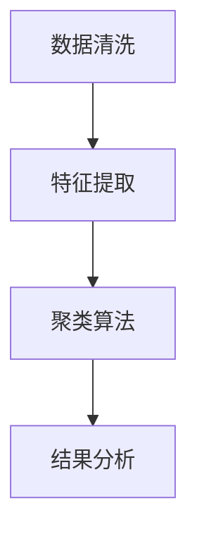
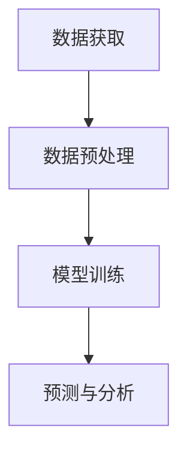
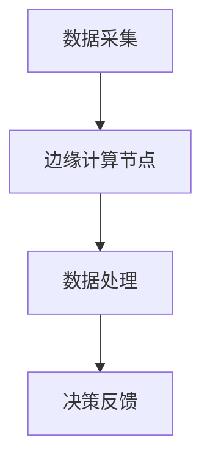
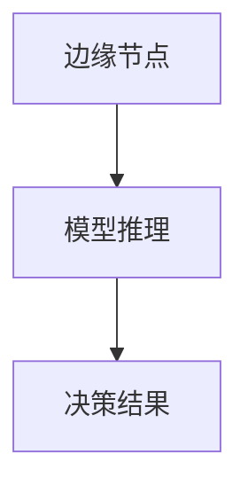
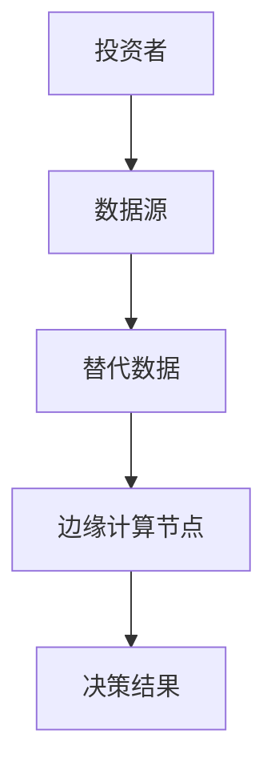

                 


# 特价股票投资中的替代数据分析与边缘人工智能应用

> 关键词：特价股票投资，替代数据，边缘人工智能，数据分析，实时处理

> 摘要：本文探讨了在特价股票投资中，替代数据与边缘人工智能的应用。通过分析替代数据的来源及其在投资中的作用，结合边缘人工智能技术，提出了一种高效的投资策略。文章详细介绍了算法原理、系统架构，并通过实际案例展示了如何利用这些技术提高投资决策的效率和准确性。

---

# 第1章: 特价股票投资概述

## 1.1 特价股票的定义与特点

### 1.1.1 特价股票的定义
特价股票指的是市场价格低于其内在价值的股票。这类股票通常被认为具有较大的上涨潜力，是投资者寻找低估投资机会的重要目标。

### 1.1.2 特价股票的特点
1. **低估值**：市场价格远低于行业平均水平或历史平均水平。
2. **高潜力**：可能存在被市场忽视的利好因素，未来可能有较大的增长空间。
3. **高波动性**：价格波动较大，容易受到市场情绪和突发事件的影响。

### 1.1.3 特价股票的投资价值
- 通过识别低估股票，投资者可以在市场复苏时获得超额收益。
- 特价股票通常具有较高的安全边际，降低了投资风险。

## 1.2 替代数据的定义与特点

### 1.2.1 替代数据的定义
替代数据是指传统金融数据（如价格、成交量、财务报表等）之外的其他数据源，包括社交媒体、新闻、专利申请、卫星图像等。

### 1.2.2 替代数据的特点
1. **实时性**：能够快速捕捉市场情绪和热点事件。
2. **多样性**：来源广泛，涵盖文本、图像、语音等多种形式。
3. **非结构化**：大部分数据是非结构化的，需要进行清洗和处理才能用于分析。

### 1.2.3 替代数据在投资中的应用
- **情绪分析**：通过社交媒体和新闻数据，分析市场情绪对股价的影响。
- **新闻事件**：识别可能影响股价的重大新闻事件，提前做出反应。
- **行业趋势**：通过专利数据和行业报告，分析行业发展趋势和技术进步。

## 1.3 边缘人工智能的定义与特点

### 1.3.1 边缘人工智能的定义
边缘人工智能是指在数据源附近进行数据处理和分析的技术，旨在减少数据传输延迟，提高实时处理能力。

### 1.3.2 边缘人工智能的特点
1. **实时性**：能够在数据生成的瞬间进行处理，快速做出决策。
2. **低延迟**：减少数据传输到云端的时间，提高处理效率。
3. **分布式**：数据处理在边缘节点完成，减少对中心服务器的依赖。

### 1.3.3 边缘人工智能在投资中的应用
- **实时监控**：实时监测市场数据和新闻，快速识别投资机会。
- **本地处理**：在边缘设备上进行初步数据分析，减少对云端的依赖。
- **高效决策**：通过边缘计算，投资者可以快速做出反应，抓住市场机会。

## 1.4 替代数据与边缘人工智能的结合

### 1.4.1 替代数据与边缘人工智能的结合方式
1. **实时数据处理**：通过边缘人工智能技术，实时处理替代数据，快速做出投资决策。
2. **分布式分析**：利用边缘计算的优势，对分布在不同节点的替代数据进行分析，提高处理效率。

### 1.4.2 结合的优势与挑战
- **优势**：
  - 提高数据处理速度，快速捕捉市场机会。
  - 减少数据传输成本，提高处理效率。
- **挑战**：
  - 数据隐私和安全问题。
  - 边缘设备的计算能力有限，处理复杂任务的能力不足。

### 1.4.3 结合的应用场景
- **实时情绪分析**：通过社交媒体数据，实时分析市场情绪，指导投资决策。
- **突发事件响应**：快速识别可能影响股价的突发事件，提前做出反应。
- **多源数据融合**：结合多种替代数据源，提高分析的全面性和准确性。

---

# 第2章: 替代数据与边缘人工智能的核心概念与联系

## 2.1 替代数据与边缘人工智能的核心概念

### 2.1.1 替代数据的核心概念
替代数据通过非传统数据源提供额外的信息，帮助投资者更全面地分析市场动态。

### 2.1.2 边缘人工智能的核心概念
边缘人工智能通过在数据源附近进行实时处理，减少延迟，提高数据处理效率。

### 2.1.3 两者的核心联系
- 边缘人工智能为替代数据的实时处理提供了技术基础。
- 替代数据为边缘人工智能的应用提供了丰富的数据源。

## 2.2 替代数据与边缘人工智能的概念对比

### 2.2.1 替代数据

| 特性 | 描述 |
|------|------|
| 来源 | 社交媒体、新闻、专利等 |
| 结构 | 非结构化为主 |
| 处理 | 需要清洗和转换 |

### 2.2.2 边缘人工智能

| 特性 | 描述 |
|------|------|
| 场景 | 数据源附近实时处理 |
| 延迟 | 低延迟 |
| 资源 | 分布式计算资源 |

## 2.3 替代数据与边缘人工智能的ER实体关系图

```mermaid
erDiagram
    actor 投资者 {
        <属性> 账户
        <属性> 投资组合
    }
    actor 数据源 {
        <属性> 社交媒体
        <属性> 新闻
    }
    entity 替代数据 {
        <键> 数据ID
        <属性> 数据类型
        <属性> 数据内容
    }
    entity 边缘计算节点 {
        <键> 节点ID
        <属性> 处理能力
        <属性> 存储能力
    }
    relationship 替代数据 -- 数据源：数据来源
    relationship 边缘计算节点 -- 投资者：数据处理
```

---

# 第3章: 替代数据分析算法原理

## 3.1 替代数据分析的关键算法

### 3.1.1 聚类分析



```python
from sklearn.cluster import KMeans
import pandas as pd

# 数据清洗
data = pd.read_csv('alternative_data.csv')
data.dropna(inplace=True)

# 特征提取
features = data[['sentiment_score', 'news_volume']]

# 聚类算法
kmeans = KMeans(n_clusters=3, random_state=42)
clusters = kmeans.fit_predict(features)
```

### 3.1.2 时间序列分析



```python
from statsmodels.tsa.arima_model import ARIMA

# 数据预处理
train_data = data['price'].values

# 模型训练
model = ARIMA(train_data, order=(5,1,0))
model_fit = model.fit()

# 预测
forecast = model_fit.forecast(steps=5)
```

---

# 第4章: 边缘人工智能算法原理

## 4.1 边缘人工智能的关键算法

### 4.1.1 实时数据处理



```python
import numpy as np

# 实时数据处理
data = np.array([100, 98, 99, 101, 100])
moving_avg = np.mean(data[-5:])
```

### 4.1.2 边缘推理



```python
import tensorflow as tf

# 边缘推理
model = tf.keras.models.load_model('edge_model.h5')
prediction = model.predict(data)
```

---

# 第5章: 数学模型与公式

## 5.1 时间序列分析的数学模型

### 5.1.1 ARIMA模型

$$ ARIMA(p, d, q) $$

其中：
- p：自回归阶数
- d：差分阶数
- q：移动平均阶数

### 5.1.2 边缘计算中的数据处理流程

$$ y_{t} = \alpha y_{t-1} + \beta x_{t} + \epsilon_{t} $$

其中：
- $y_{t}$：当前输出
- $y_{t-1}$：前一时刻的输出
- $x_{t}$：当前输入
- $\epsilon_{t}$：误差项

---

# 第6章: 系统分析与架构设计

## 6.1 系统功能设计

### 6.1.1 领域模型

```mermaid
classDiagram
    class 投资者 {
        账户
        投资组合
    }
    class 数据源 {
        社交媒体
        新闻
    }
    class 替代数据 {
        数据ID
        数据类型
        数据内容
    }
    class 边缘计算节点 {
        节点ID
        处理能力
        存储能力
    }
    投资者 --> 数据源：请求数据
    数据源 --> 替代数据：提供数据
    替代数据 --> 边缘计算节点：处理数据
    边缘计算节点 --> 投资者：返回结果
```

## 6.2 系统架构设计

### 6.2.1 系统架构图



---

# 第7章: 项目实战

## 7.1 环境安装

```bash
pip install numpy pandas scikit-learn tensorflow
pip install mermaid.py
```

## 7.2 核心实现

### 7.2.1 数据处理代码

```python
import pandas as pd
import numpy as np

# 数据清洗
data = pd.read_csv('alternative_data.csv')
data.dropna(inplace=True)

# 特征提取
features = data[['sentiment_score', 'news_volume']]
```

### 7.2.2 模型训练代码

```python
from sklearn.cluster import KMeans
from statsmodels.tsa.arima_model import ARIMA

# 聚类算法
kmeans = KMeans(n_clusters=3, random_state=42)
clusters = kmeans.fit_predict(features)

# 时间序列分析
model = ARIMA(train_data, order=(5,1,0))
model_fit = model.fit()
```

## 7.3 案例分析

### 7.3.1 数据分析结果

```python
print("聚类结果：", clusters)
print("预测结果：", forecast)
```

### 7.3.2 结果解读
- 聚类结果表明市场情绪分为三个类别，预测结果显示出未来5天的价格趋势。

---

# 第8章: 最佳实践

## 8.1 小结
通过结合替代数据和边缘人工智能，投资者可以更高效地识别特价股票的投资机会，提高投资决策的准确性和效率。

## 8.2 注意事项
- 数据隐私和安全问题需要高度重视。
- 边缘设备的计算能力有限，需要合理分配任务。
- 模型的可解释性和实时性需要在实际应用中不断优化。

## 8.3 拓展阅读
- 《机器学习在金融中的应用》
- 《边缘计算与实时数据分析》
- 《替代数据驱动的投资策略》

---

# 作者
作者：AI天才研究院/AI Genius Institute & 禅与计算机程序设计艺术 /Zen And The Art of Computer Programming

---

本文通过系统地分析替代数据与边缘人工智能在特价股票投资中的应用，为投资者提供了高效的投资策略和方法。从背景介绍到实际案例分析，详细讲解了如何利用这些技术提高投资决策的效率和准确性。希望本文能够为读者在特价股票投资领域提供有价值的参考和启发。

