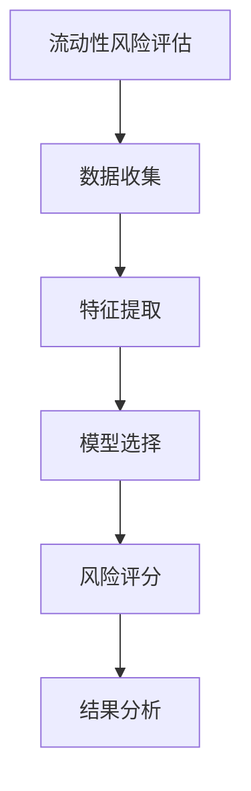
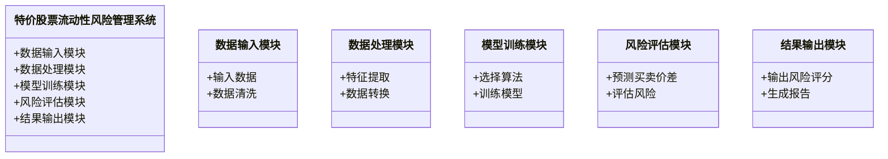
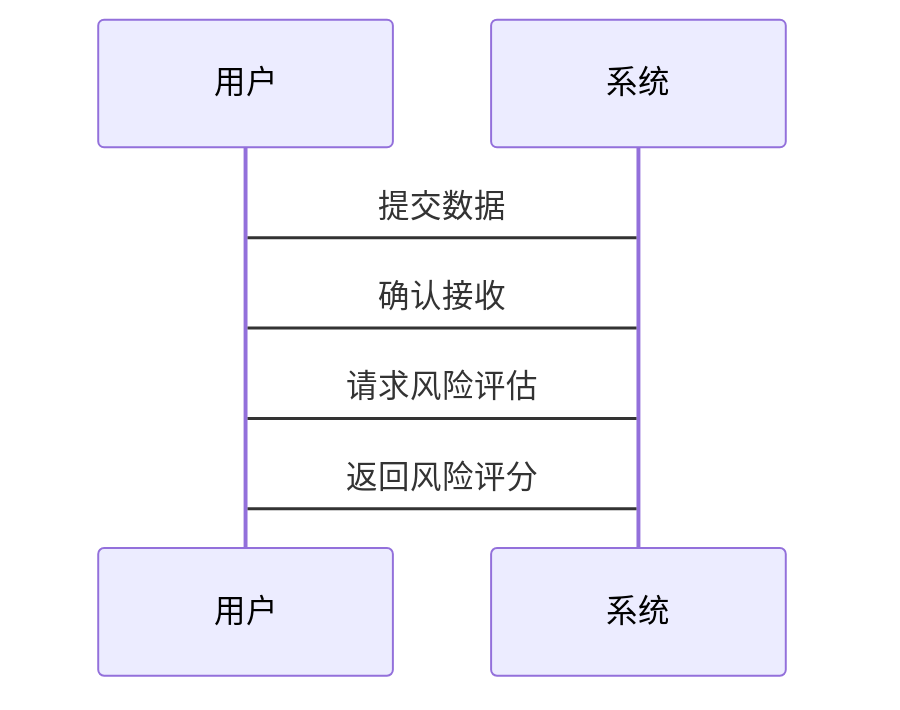

                 


# 特价股票投资中的流动性风险管理

> 关键词：流动性风险管理，特价股票，投资策略，风险评估，算法交易

> 摘要：本文详细探讨了在特价股票投资中流动性风险管理的重要性、方法和策略。通过分析流动性风险的核心概念、数学模型和算法实现，结合实际案例和系统架构设计，为投资者提供了一套完整的流动性风险管理解决方案。

---

# 第一部分: 特价股票与流动性风险管理概述

## 第1章: 特价股票与流动性风险管理概述

### 1.1 特价股票的定义与特点

#### 1.1.1 特价股票的定义
特价股票是指价格显著低于市场平均值的股票，通常出现在市场低迷或公司基本面出现问题时。这类股票具有较高的波动性和不确定性，但也可能隐藏着投资机会。

#### 1.1.2 特价股票的核心特点
| 特性 | 描述 |
|------|------|
| 低估值 | 相对于内在价值，市场价格较低 |
| 高波动性 | 价格波动剧烈，风险较高 |
| 低流动性 | 市场深度不足，买卖价差较大 |

#### 1.1.3 特价股票的分类与市场定位
- **深度特价股票**：价格远低于市场平均水平，通常基本面较差。
- **中度特价股票**：价格略低于市场平均水平，可能存在潜在投资价值。
- **短期特价股票**：短期内价格大幅下跌，但基本面良好。

### 1.2 流动性风险管理的定义与重要性

#### 1.2.1 流动性风险管理的定义
流动性风险管理是指在投资过程中，通过监控和控制流动性风险，确保在市场波动时能够及时调整投资组合，避免因流动性不足导致的损失。

#### 1.2.2 流动性风险的核心属性
- **买卖价差**：买入价和卖出价之间的差异。
- **市场深度**：市场中可交易的数量。
- **波动性**：价格的短期剧烈波动。

#### 1.2.3 流动性风险管理的重要性
- **保护投资本金**：避免因流动性不足导致的割肉亏损。
- **优化投资策略**：通过风险管理，提升投资组合的整体收益。
- **应对市场波动**：在市场下跌时，及时调整头寸，降低风险。

### 1.3 特价股票投资中的流动性风险

#### 1.3.1 特价股票投资的特点
- **高风险**：价格波动大，风险较高。
- **低流动性**：市场深度不足，买卖价差大。
- **高杠杆**：投资者可能使用杠杆放大收益，但也放大了风险。

#### 1.3.2 流动性风险在特价股票投资中的表现
- **价格滑点**：在市场流动性不足时，订单执行价格偏离预期。
- **市场冲击**：大额交易对市场价格产生显著影响。
- **流动性枯竭**：在极端情况下，市场无法承接大额交易。

#### 1.3.3 特价股票流动性风险的边界与外延
- **边界**：流动性风险仅在交易过程中存在，与投资标的无关。
- **外延**：流动性风险管理需要结合市场环境、交易策略和投资目标。

### 1.4 本章小结
本章从特价股票的定义、特点入手，分析了流动性风险管理的核心概念和重要性，明确了流动性风险在特价股票投资中的具体表现和边界。

---

# 第二部分: 流动性风险管理的理论与方法

## 第2章: 流动性风险评估模型

### 2.1 流动性风险评估的核心概念

#### 2.1.1 流动性风险评估的基本原理
流动性风险评估旨在通过量化指标，评估投资组合在不同市场条件下的流动性风险。

#### 2.1.2 流动性风险评估的关键指标
| 指标 | 描述 |
|------|------|
| 买卖价差 | 买入价与卖出价之间的差异 |
| 市场深度 | 市场中可交易的数量 |
| 波动性 | 价格的短期波动程度 |

#### 2.1.3 流动性风险评估的数学模型
- **平均价差模型**：计算一定时间段内的平均买卖价差。
  $$ \text{平均价差} = \frac{\sum (\text{买入价} - \text{卖出价})}{n} $$
- **市场深度模型**：计算市场深度与价格波动的关系。
  $$ \text{市场深度} = \frac{\text{可交易数量}}{\text{价格波动}} $$

### 2.2 流动性风险评估的数学模型

#### 2.2.1 流动性风险评估的线性模型
- **简单线性回归**：将买卖价差与市场深度回归。
  $$ \text{买卖价差} = a \times \text{市场深度} + b $$

#### 2.2.2 流动性风险评估的非线性模型
- **非线性回归**：考虑价格波动的非线性影响。
  $$ \text{买卖价差} = a \times \text{市场深度}^2 + b \times \text{价格波动} + c $$

#### 2.2.3 流动性风险评估的混合模型
- **混合模型**：结合线性回归和非线性回归的优势。
  $$ \text{买卖价差} = a \times \text{市场深度} + b \times \text{价格波动}^2 + c $$

### 2.3 流动性风险评估的mermaid流程图


### 2.4 本章小结
本章通过数学模型和mermaid图，详细介绍了流动性风险评估的核心概念和方法，为后续的算法实现奠定了基础。

## 第3章: 特价股票流动性风险管理的算法实现

### 3.1 流动性风险管理的算法原理

#### 3.1.1 基于机器学习的流动性风险管理
- **支持向量回归**：用于预测买卖价差。
  $$ \text{买卖价差} = \text{支持向量回归模型预测值} $$
- **随机森林**：用于分类买卖价差的高低。

#### 3.1.2 基于统计学的流动性风险管理
- **均值-方差优化**：优化投资组合的流动性风险。
  $$ \text{优化目标} = \min \text{流动性风险} \quad \text{subject to} \quad \text{收益目标} $$

#### 3.1.3 基于时间序列分析的流动性风险管理
- **ARIMA模型**：预测未来买卖价差。
  $$ \text{ARIMA}(p, d, q) $$

### 3.2 流动性风险管理的Python实现

#### 3.2.1 数据预处理与特征提取
```python
import pandas as pd
import numpy as np

# 数据预处理
data = pd.read_csv('流动性风险数据.csv')
data = data.dropna()
data['买卖价差'] = data['买入价'] - data['卖出价']

# 特征提取
features = data[['市场深度', '价格波动', '买卖价差']]
```

#### 3.2.2 模型训练与优化
```python
from sklearn.model_selection import train_test_split
from sklearn.linear_model import LinearRegression

X_train, X_test, y_train, y_test = train_test_split(features, data['买卖价差'], test_size=0.2)

model = LinearRegression()
model.fit(X_train, y_train)
```

#### 3.2.3 模型预测与评估
```python
y_pred = model.predict(X_test)
print('预测结果:', y_pred)
print('均方误差:', np.mean((y_pred - y_test)**2))
```

### 3.3 流动性风险管理的数学模型

#### 3.3.1 马科维茨投资组合理论
$$ E(r_p) = \sum_{i=1}^n w_i E(r_i) $$
$$ \text{风险} = \sqrt{\sum_{i=1}^n w_i^2 \sigma_i^2 + 2 \sum_{i < j} w_i w_j \sigma_{i,j}} $$

#### 3.3.2 风险价值模型
$$ VaR = \alpha \sigma $$
其中，$\alpha$ 为置信水平对应的分位数，$\sigma$ 为标准差。

### 3.4 本章小结
本章通过Python代码和数学模型，详细介绍了流动性风险管理的算法实现，为实际应用提供了参考。

## 第4章: 特价股票流动性风险管理的系统架构

### 4.1 系统功能设计（领域模型mermaid类图）


### 4.2 系统架构设计（mermaid架构图）


### 4.3 系统接口设计与交互（mermaid序列图）


### 4.4 本章小结
本章通过系统架构设计和交互图，详细介绍了流动性风险管理系统的整体结构和功能模块。

---

# 第三部分: 特价股票流动性风险管理的实战与总结

## 第5章: 特价股票流动性风险管理的实战分析

### 5.1 环境安装与配置
```bash
pip install pandas numpy scikit-learn
```

### 5.2 核心代码实现
```python
import pandas as pd
import numpy as np
from sklearn.linear_model import LinearRegression

# 数据加载与预处理
data = pd.read_csv('流动性风险数据.csv')
data = data.dropna()
data['买卖价差'] = data['买入价'] - data['卖出价']

# 特征提取与模型训练
features = data[['市场深度', '价格波动']]
target = data['买卖价差']

X_train, X_test, y_train, y_test = train_test_split(features, target, test_size=0.2)

model = LinearRegression()
model.fit(X_train, y_train)

# 模型预测与评估
y_pred = model.predict(X_test)
print('预测结果:', y_pred)
print('均方误差:', np.mean((y_pred - y_test)**2))
```

### 5.3 实际案例分析
- **案例背景**：某公司股价大幅下跌，市场深度不足。
- **数据分析**：计算买卖价差、市场深度和价格波动。
- **风险评估**：预测未来买卖价差，制定风险管理策略。

### 5.4 本章小结
本章通过实际案例分析，展示了流动性风险管理在特价股票投资中的具体应用。

## 第6章: 总结与展望

### 6.1 本章总结
本文详细探讨了流动性风险管理在特价股票投资中的重要性，通过数学模型、算法实现和系统架构设计，提供了一套完整的流动性风险管理解决方案。

### 6.2 未来研究方向
- **算法优化**：探索更高效的流动性风险管理算法。
- **数据扩展**：引入更多数据源，提升模型的准确性。
- **系统优化**：优化系统架构，提升处理效率。

### 6.3 注意事项
- **数据质量**：确保数据的准确性和完整性。
- **模型选择**：根据实际情况选择合适的算法。
- **风险控制**：在实际投资中，严格控制风险，避免过度杠杆。

### 6.4 拓展阅读
- 推荐阅读《算法交易：高效风险管理系统》和《量化投资中的流动性风险管理》。

---

# 作者
作者：AI天才研究院/AI Genius Institute  
联系邮箱：[contact@ailab.com](mailto:contact@ailab.com)  
GitHub链接：[https://github.com/ai-genius-institute](https://github.com/ai-genius-institute)

