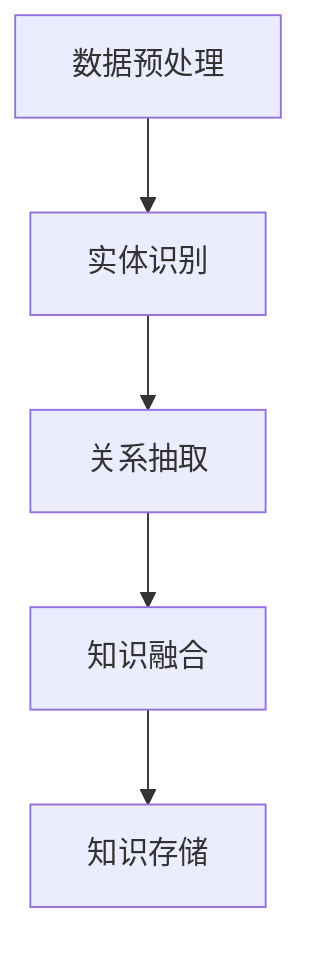

                 


# 特价股票投资中的知识图谱模型构建与优化

## 关键词：知识图谱，特价股票投资，文本挖掘，自然语言处理，深度学习

## 摘要：  
本文详细探讨了在特价股票投资中，如何利用知识图谱模型进行数据关联和信息提取。通过构建和优化知识图谱，投资者能够更有效地分析市场动态、识别投资机会和风险。文章从背景介绍、核心概念、算法原理、系统架构到项目实战，全面解析了知识图谱在股票投资中的应用，并结合实际案例，展示了如何通过知识图谱模型优化投资决策。

---

## 第1章: 特价股票投资与知识图谱概述

### 1.1 知识图谱的基本概念  
知识图谱是一种用于表示知识的数据结构，由实体（Entity）、关系（Relation）、属性（Attribute）等核心要素组成。它能够将分散在不同数据源中的信息关联起来，形成一个网络化的知识网络。与传统数据库不同，知识图谱不仅关注数据的存储，更注重数据之间的关联关系。  

### 1.2 特价股票投资的背景与挑战  
特价股票投资是指在股票市场中，通过分析市场动态、公司基本面等因素，寻找具有投资价值的股票。然而，股票市场数据复杂且分散，投资者需要从海量信息中提取有价值的数据来支持决策。知识图谱的引入为解决这一问题提供了新的思路。  

### 1.3 知识图谱在特价股票投资中的应用  
通过构建股票市场的知识图谱，投资者可以将公司、行业、市场等实体及其关系进行可视化，从而更好地理解市场动态、识别投资机会和风险。知识图谱的应用可以帮助投资者快速定位关键信息，提高决策效率。

---

## 第2章: 知识图谱的核心概念与联系

### 2.1 知识图谱的实体与关系  
#### 2.1.1 实体的定义与分类  
在股票投资中，实体可以是公司、行业、市场、股票等。例如，一家公司可能属于某个行业，而该行业可能受某些市场因素的影响。  

#### 2.1.2 关系的定义与分类  
关系描述了实体之间的关联。例如，“公司A属于行业B”是一种关系，表示公司A属于行业B。  

#### 2.1.3 实体与关系的关联方式  
通过关系将实体连接起来，形成一个网络化的知识图谱。例如，公司A可能属于行业B，行业B可能受市场C的影响。

### 2.2 知识图谱的属性特征对比  
#### 2.2.1 实体属性对比表  
| 实体 | 属性 | 描述 |
|------|-------|------|
| 公司A | 行业 | 行业B |
| 公司A | 市值 | 100亿 |

#### 2.2.2 关系属性对比表  
| 关系 | 属性 | 描述 |
|------|-------|------|
| 属于 | 实体1 | 公司A |
| 属于 | 实体2 | 行业B |

#### 2.2.3 实体关系的可视化展示  
```mermaid
er
    entity:公司
    entity:行业
    entity:市场
    relation:属于
    relation:影响
```

---

## 第3章: 知识图谱构建的算法原理

### 3.1 实体识别与提取  
#### 3.1.1 实体识别的定义  
实体识别是通过自然语言处理技术从文本中提取出具体的实体（如公司名称、行业名称等）。  

#### 3.1.2 基于规则的实体识别  
例如，可以通过预定义的关键词匹配来识别公司名称。  

#### 3.1.3 基于机器学习的实体识别  
使用深度学习模型（如BERT）进行实体识别，能够更好地处理复杂文本。

### 3.2 关系抽取与推理  
#### 3.2.1 关系抽取的定义  
关系抽取是通过分析文本中的实体关系，构建实体之间的关联。  

#### 3.2.2 基于规则的关系抽取  
例如，通过匹配“属于”、“涉及”等关键词来提取关系。  

#### 3.2.3 基于深度学习的关系抽取  
使用模型（如BERT）进行关系分类，能够更准确地提取实体关系。

### 3.3 知识图谱构建的流程  


---

## 第4章: 知识图谱的数学模型与公式

### 4.1 知识表示的向量空间模型  
知识图谱中的实体和关系可以表示为向量，通过向量空间模型进行相似性计算。  
$$\text{相似度} = \frac{\vec{u} \cdot \vec{v}}{\|\vec{u}\| \cdot \|\vec{v}\|}$$  

### 4.2 知识图谱的表示学习  
通过图嵌入技术（如TransE、TransH）将实体和关系表示为低维向量。  
$$\text{TransE: } r = u + v$$  

---

## 第5章: 系统分析与架构设计

### 5.1 项目介绍  
本项目旨在构建一个股票市场的知识图谱，帮助投资者进行特价股票投资。

### 5.2 系统功能设计  
#### 5.2.1 数据采集模块  
从股票市场数据源（如新闻、财报）中提取实体和关系。  

#### 5.2.2 知识图谱构建模块  
通过算法构建知识图谱，并存储在图数据库中。  

#### 5.2.3 数据分析模块  
对知识图谱进行分析，生成投资建议。  

### 5.3 系统架构设计  


### 5.4 系统接口设计  
系统提供API接口，供投资者查询股票信息和投资建议。

### 5.5 系统交互序列图  
```mermaid
sequence
    用户 --> API接口: 查询公司A的行业
    API接口 --> 数据分析模块: 获取公司A的行业信息
    数据分析模块 --> 用户: 返回行业B
```

---

## 第6章: 项目实战

### 6.1 环境安装  
安装Python、自然语言处理库（如spaCy）、图数据库（如Neo4j）。

### 6.2 核心代码实现  
```python
from spacy.lang.zh import Chinese

# 实体识别
nlp = Chinese()
doc = nlp("公司A属于行业B")
for ent in doc.ents:
    print(ent.text, ent.label_)
```

### 6.3 案例分析  
以公司A为例，分析其行业和市场影响，生成投资建议。

### 6.4 项目小结  
通过知识图谱模型，投资者能够更高效地分析股票市场，发现投资机会。

---

## 第7章: 最佳实践与总结

### 7.1 小结  
知识图谱在特价股票投资中的应用能够帮助投资者更好地理解和分析市场动态。

### 7.2 注意事项  
在实际应用中，需要注意数据来源的可靠性和模型的准确性。

### 7.3 拓展阅读  
推荐阅读相关领域的书籍和论文，进一步深入研究知识图谱的应用。

---

## 作者：AI天才研究院 & 禅与计算机程序设计艺术  

---

以上是《特价股票投资中的知识图谱模型构建与优化》的技术博客文章的完整内容。文章从背景介绍、核心概念、算法原理到系统设计和项目实战，全面解析了知识图谱在股票投资中的应用，并结合实际案例进行了详细说明。

