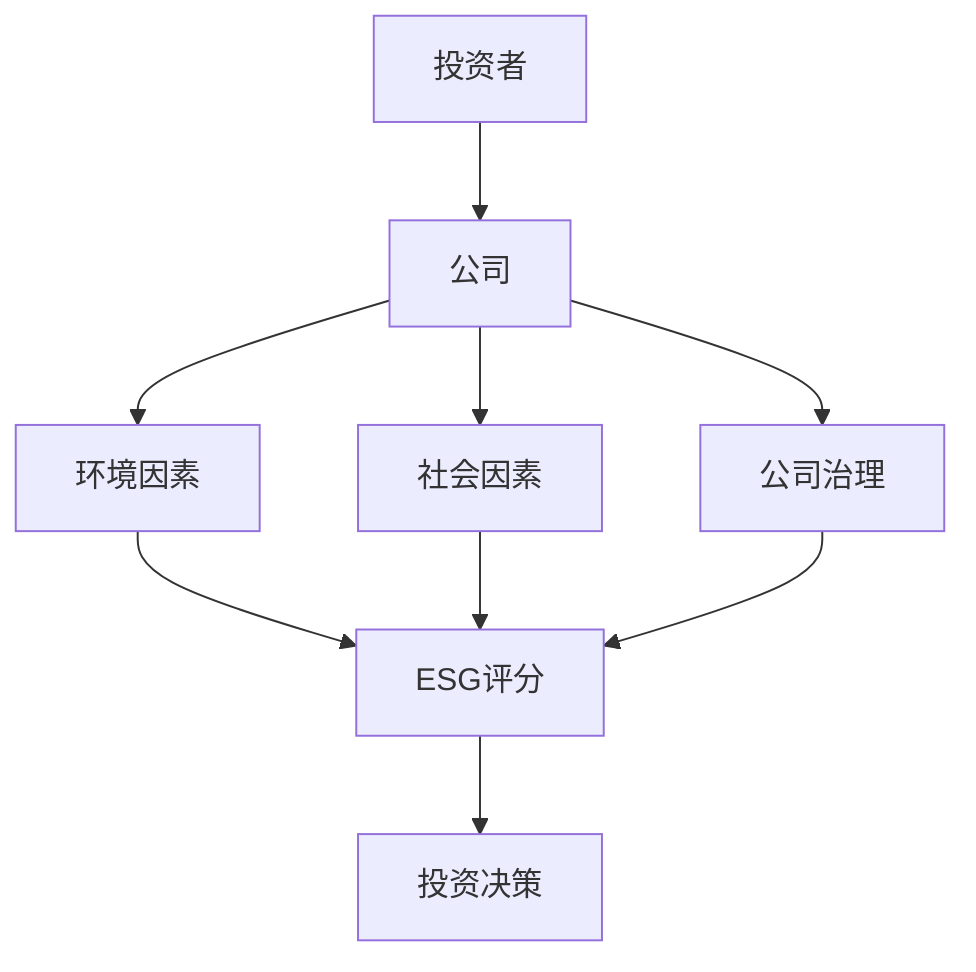

                 

# 特价股票投资中的社会责任投资因素考量

## 关键词
- 特价股票，社会责任投资（SRI），投资策略，评分模型，风险管理

## 摘要
在当前的投资环境中，社会责任投资（SRI）已成为一个重要趋势。本文探讨了如何在寻找特价股票时，将社会责任因素融入投资决策中。通过分析社会责任投资的核心概念、评估方法以及实际应用案例，本文为投资者提供了如何在追求超额收益的同时，兼顾社会责任的策略和工具。文章内容包括社会责任投资的定义、评估模型的构建、投资策略的设计，以及实际案例分析，旨在帮助投资者在特价股票投资中实现长期价值与社会价值的双重目标。

---

### 目录大纲

#### 第1章：背景介绍
1.1 特价股票的基本概念  
1.2 社会责任投资的核心理念  
1.3 特价股票与社会责任投资的结合点  
1.4 当前市场中的社会责任投资趋势  

#### 第2章：社会责任投资的核心概念
2.1 社会责任投资的原理  
2.2 社会责任投资与传统投资的对比  
2.3 社会责任投资的ER实体关系图  

#### 第3章：社会责任投资的评分模型与算法
3.1 社会责任评分的定义与指标  
3.2 社会责任评分的计算方法  
3.3 投资组合优化的数学模型  

#### 第4章：系统分析与架构设计
4.1 系统功能设计  
4.2 系统架构设计  
4.3 接口设计与交互流程  

#### 第5章：项目实战
5.1 环境安装与数据准备  
5.2 代码实现与功能解读  
5.3 案例分析与结果展示  

#### 第6章：最佳实践与风险管理
6.1 投资策略的优化建议  
6.2 风险管理的注意事项  
6.3 未来发展方向与研究热点  

---

### 详细章节内容

#### 第1章：背景介绍
1.1 特价股票的基本概念  
- 特价股票的定义：指价格低于其内在价值的股票，通常具有较高的投资潜力。  
- 特价股票的市场特征：价格波动大、估值低、可能被市场忽视。  
- 特价股票的投资价值：可能在短期内反弹或长期增值。  

1.2 社会责任投资的核心理念  
- 社会责任投资的定义：在投资过程中考虑环境、社会和公司治理（ESG）因素的投资策略。  
- 社会责任投资的特征：注重长期价值、关注企业责任、追求可持续发展。  
- 社会责任投资的伦理基础：基于道德和伦理的考量，避免投资于有害社会的企业。  

1.3 特价股票与社会责任投资的结合点  
- 特价股票中的社会责任因素：评估公司治理、环境保护、社会责任等方面的指标。  
- 社会责任投资对特价股票的影响：通过社会责任评分筛选潜在投资标的。  
- 特价股票投资中的社会责任评价体系：构建多维度的评价模型，综合考虑价格和责任因素。  

1.4 当前市场中的社会责任投资趋势  
- 全球社会责任投资的发展现状：快速增长，越来越多的投资者关注ESG因素。  
- 中国社会责任投资的现状与挑战：起步较晚，但发展迅速，面临数据和标准不统一的问题。  
- 特价股票市场中的社会责任投资机会：通过社会责任评分筛选低估且有社会责任表现的公司。  

---

#### 第2章：社会责任投资的核心概念
2.1 社会责任投资的原理  
- 社会责任投资的基本原理：通过筛选符合ESG标准的公司，降低投资风险并提升长期收益。  
- 社会责任投资的核心要素：环境因素、社会因素、公司治理因素。  
- 社会责任投资的评价标准：国际通用的ESG评级体系。  

2.2 社会责任投资与传统投资的对比  
- 投资目标的差异：传统投资注重短期收益，社会责任投资注重长期可持续收益。  
- 投资策略的差异：传统投资可能忽略企业责任，社会责任投资强调企业责任与收益并重。  
- 风险收益的差异：社会责任投资可能在短期内收益较低，但长期风险较低且收益稳定。  

2.3 社会责任投资的ER实体关系图  

---

#### 第3章：社会责任投资的评分模型与算法
3.1 社会责任评分的定义与指标  
- 社会责任评分：根据公司治理、环境保护、社会责任等因素对公司进行综合评分。  
- 评分指标：包括碳排放、员工福利、董事会结构、社会责任支出等。  

3.2 社会责任评分的计算方法  
- 数据收集：从公开资料中收集公司的ESG数据。  
- 权重分配：根据行业特点分配各指标的权重（例如，环境因素占40%，社会因素占30%，公司治理占30%）。  
- 计算公式：  
  $$ \text{ESG评分} = \sum (\text{指标得分} \times \text{权重}) $$  

3.3 投资组合优化的数学模型  
- 目标函数：最大化投资收益，同时最小化社会责任风险。  
- 约束条件：投资组合的总金额不超过预算，且每个资产的权重不超过上限。  
- 模型公式：  
  $$ \max \sum w_i \times r_i $$
  $$ \text{s.t.} \sum w_i = 1 $$
  $$ \sum w_i \times \text{ESG风险} \leq \text{风险容忍度} $$  
  其中，\( w_i \) 是资产 \( i \) 的权重，\( r_i \) 是资产 \( i \) 的预期收益。  

---

#### 第4章：系统分析与架构设计
4.1 系统功能设计  
- 功能模块：数据采集、评分计算、投资组合优化、风险评估、结果展示。  
- 功能流程：用户输入投资预算和风险偏好，系统输出符合条件的投资组合。  

4.2 系统架构设计  

4.3 接口设计与交互流程  
- 输入接口：用户输入预算和风险偏好。  
- 输出接口：系统输出优化后的投资组合和风险评估结果。  
- 交互流程：用户提交请求 → 系统处理 → 用户查看结果。  

---

#### 第5章：项目实战
5.1 环境安装与数据准备  
- 环境要求：安装Python、Pandas、Matplotlib等工具。  
- 数据来源：使用公开的ESG数据和股票价格数据。  

5.2 代码实现与功能解读  
- 数据清洗：处理缺失值和异常值。  
- 模型训练：基于历史数据训练社会责任评分模型。  
- 投资组合优化：使用遗传算法或粒子群算法优化投资组合。  

5.3 案例分析与结果展示  
- 案例分析：以某行业为例，筛选符合社会责任评分的特价股票。  
- 结果展示：投资组合的预期收益和风险评估结果。  

---

#### 第6章：最佳实践与风险管理
6.1 投资策略的优化建议  
- 定期调整投资组合，根据市场变化更新社会责任评分。  
- 结合多种因素，如宏观经济指标和行业趋势，优化投资策略。  

6.2 风险管理的注意事项  
- 设置止损点，避免过度集中于某一行业或公司。  
- 定期监控社会责任评分，及时发现潜在风险。  

6.3 未来发展方向与研究热点  
- 研究更复杂的评分模型，如深度学习算法。  
- 探索更多社会责任投资的场景，如绿色金融和可持续发展投资。  

---

### 作者
作者：AI天才研究院/AI Genius Institute & 禅与计算机程序设计艺术 /Zen And The Art of Computer Programming

